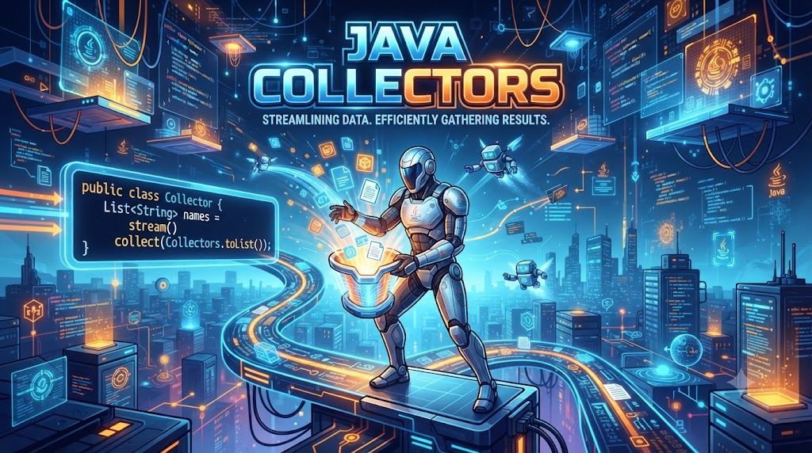

# Java Collectors



### **1\. Collectors là gì?**

*   `Collectors` là một **utility class** (trong package `java.util.stream`) cung cấp nhiều **collector** sẵn có để **thu thập kết quả** của một `Stream` sau khi xử lý.
    
*   Thường dùng cùng với phương thức `collect()` của Stream.
    
*   `Collectors` giúp **chuyển đổi dữ liệu từ Stream** sang các cấu trúc dữ liệu khác (List, Set, Map, String...) hoặc thực hiện các phép tính tổng hợp (sum, average, grouping...).
    

### **2\. Cú pháp**

```java
<R, A> R collect(Collector<? super T, A, R> collector)
```

*   `R`: Kết quả thu thập (List, Set, Map, String, Double, Long, …).
    
*   `Collector`: Được tạo sẵn bởi `Collectors`.
    

### **3\. Các phương thức phổ biến trong** `Collectors`

#MethodMô tả1`toList()`Thu thập phần tử vào `List`.2`toSet()`Thu thập phần tử vào `Set`.3`toMap(keyMapper, valueMapper)`Thu thập phần tử thành `Map`.4`joining()`Ghép các phần tử thành chuỗi.5`joining(CharSequence delimiter)`Ghép chuỗi có dấu phân cách.6`joining(delimiter, prefix, suffix)`Ghép chuỗi có phân cách + tiền tố/hậu tố.7`counting()`Đếm số phần tử.8`summingInt(ToIntFunction)`Tính tổng `int`.9`summingDouble(ToDoubleFunction)`Tính tổng `double`.10`summingLong(ToLongFunction)`Tính tổng `long`.11`averagingInt(ToIntFunction)`Tính trung bình `int`.12`averagingDouble(ToDoubleFunction)`Tính trung bình `double`.13`averagingLong(ToLongFunction)`Tính trung bình `long`.14`maxBy(Comparator)`Lấy phần tử lớn nhất.15`minBy(Comparator)`Lấy phần tử nhỏ nhất.16`groupingBy(Function)`Nhóm các phần tử theo key.17`groupingBy(Function, Collector)`Nhóm + xử lý thêm.18`partitioningBy(Predicate)`Chia tập hợp thành `true/false`.19`collectingAndThen(Collector, Function)`Thu thập rồi áp dụng thêm 1 function (hậu xử lý).20`reducing(BinaryOperator)`Giảm dần (reduce) các phần tử.

📌 Ví dụ: Thu thập vào List và Set

```java
import java.util.*;
import java.util.stream.*;

public class App {
    public static void main(String[] args) {
        List<String> names = Arrays.asList("Java", "Spring", "Java", "Docker");

        List<String> list = names.stream().collect(Collectors.toList());
        Set<String> set = names.stream().collect(Collectors.toSet());

        System.out.println("List: " + list);
        System.out.println("Set: " + set);
    }
}
```

📌 Ví dụ: Joining (ghép chuỗi)

```java
String result = Stream.of("Tay", "Java", "Pro").collect(Collectors.joining(" ", "[", "]"));
System.out.println(result);
```

– Kết quả:

```java
[Tay Java Pro]
```

📌 Ví dụ: Counting & Summing

```java
List<Integer> numbers = Arrays.asList(3, 7, 2, 10);

long count = numbers.stream().collect(Collectors.counting());
int sum = numbers.stream().collect(Collectors.summingInt(n -> n));

System.out.println("Count: " + count); // 4
System.out.println("Sum: " + sum);     // 22
```

📌 Ví dụ: Averaging

```java
double avg = numbers.stream().collect(Collectors.averagingInt(n -> n));
System.out.println("Average: " + avg); // 5.5
```

📌 Ví dụ: Min & Max

```java
Optional<Integer> max = numbers.stream().collect(Collectors.maxBy(Integer::compare));
Optional<Integer> min = numbers.stream().collect(Collectors.minBy(Integer::compare));

System.out.println("Max: " + max.get()); // 10
System.out.println("Min: " + min.get()); // 2
```

📌 Ví dụ: Grouping By

```java
List<String> words = Arrays.asList("apple", "banana", "apricot", "blueberry");
Map<Character, List<String>> grouped = words.stream().collect(Collectors.groupingBy(w -> w.charAt(0)));

System.out.println(grouped);
```

– Kết quả:

```java
{a=[apple, apricot], b=[banana, blueberry]}
```

📌 Ví dụ: Partitioning By

```java
List<Integer> nums = Arrays.asList(5, 10, 15, 20, 25);
Map<Boolean, List<Integer>> partitioned = nums.stream().collect(Collectors.partitioningBy(n -> n > 15));

System.out.println(partitioned);
```

– Kết quả:

```java
{false=[5, 10, 15], true=[20, 25]}
```

📌 Ví dụ: Collecting and Then

```java
List<String> names = Arrays.asList("java", "spring", "docker");
List<String> unmodifiableList = names.stream().collect(Collectors.collectingAndThen(Collectors.toList(), Collections::unmodifiableList));

System.out.println(unmodifiableList);
```

## **4\. Khi nào dùng** `Collectors`**?**

*   Khi cần **chuyển đổi Stream thành Collection hoặc Map**.
    
*   Khi cần **thống kê, tổng hợp dữ liệu** (count, sum, avg, min, max).
    
*   Khi cần **nhóm hoặc phân loại dữ liệu**.
    
*   Khi cần **tạo báo cáo hoặc kết quả tổng hợp**.
    

