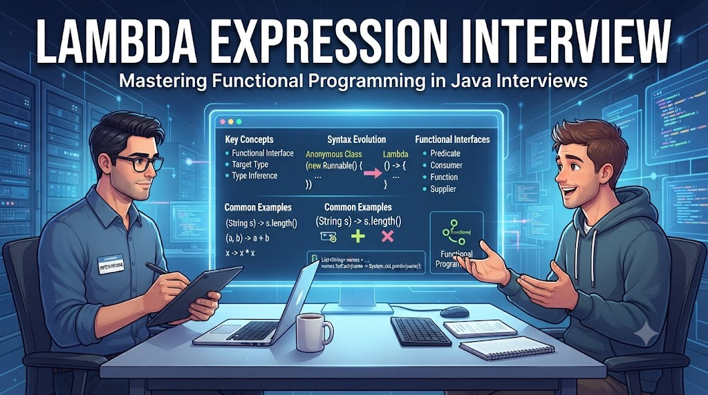

# Tuyển Tập 20 Câu Hỏi Phỏng Vấn Lambda Expression Interview



### 1\. Java 8 mang đến những cải tiến nổi bật nào?

**📌 Trả lời:**

1.  _Lambda Expression_
    
2.  _Functional Interface_
    
3.  _Stream API_
    
4.  _Default & Static Methods trong Interface_
    
5.  _Optional class_
    
6.  _Method References_
    
7.  _New Date/Time API_
    
8.  _Collectors & StringJoiner_
    

### **2\. Functional Interface là gì?**

**📌 Trả lời:**

_Là interface chỉ có_ **_một abstract method_**_. Dùng để hỗ trợ lambda. Ví dụ:_ `Runnable`_,_ `Callable`_, hoặc tự định nghĩa với_ `@FunctionalInterface`_._

### **3\. Ưu điểm của Lambda Expression là gì?**

**📌 Trả lời:**

_Giúp viết code ngắn gọn, dễ đọc, giảm boilerplate khi triển khai functional interface._

_– Ví dụ:_

```java
list.forEach(item -> System.out.println(item));
```

### **4\. Default methods trong interface giải quyết vấn đề gì?**

**📌 Trả lời:**

_Cho phép thêm method mới vào interface_ **_mà không phá vỡ_** _code cũ. Method có thân hàm mặc định trong interface._

### **5\. Method Reference khác Lambda như thế nào?**

**📌 Trả lời:**

_Là cú pháp ngắn gọn hơn khi lambda chỉ gọi lại một method._

_– Ví dụ:_

```java
list.forEach(System.out::println);
```

### **6\. Optional dùng để làm gì?**

**📌 Trả lời:**

_Tránh_ **_NullPointerException_** _bằng cách bao bọc giá trị có thể null. Cung cấp các method như_ `isPresent()`_,_ `orElse()`_,_ `ifPresent()`_._

### **_7\. Stream API có ưu điểm gì?_**

**📌 Trả lời:**

_Cho phép xử lý dữ liệu_ **_theo phong cách functional_**_, hỗ trợ pipeline với filter, map, reduce. Tách biệt xử lý logic và dữ liệu gốc._

## **8\. Collectors thường dùng để làm gì?**

**📌 Trả lời:**

_Dùng để thu thập kết quả từ Stream vào_ `List`_,_ `Set`_,_ `Map` _hoặc xử lý thống kê (summing, grouping, partitioning)._

### **9\.** `Arrays.parallelSort()` **khác gì** `Arrays.sort()`**?**

**📌 Trả lời:**

`parallelSort()` _tận dụng_ **_đa luồng (Fork/Join framework)_** _để sắp xếp nhanh hơn trên mảng lớn._

### **10\. StringJoiner trong Java 8 giúp ích thế nào?**

**📌 Trả lời:**

_Dễ dàng nối chuỗi với delimiter, prefix, suffix._

_– Ví dụ:_

```java
StringJoiner sj = new StringJoiner(", ", "[", "]");
sj.add("A").add("B").add("C"); // [A, B, C] 
```

## **11\. Type Inference cải tiến như thế nào?**

**📌 Trả lời:**

_Trình biên dịch thông minh hơn khi suy luận kiểu dữ liệu trong generics và lambda, giúp code ngắn gọn hơn._

_– Ví dụ:_

```java
List<String> list = new ArrayList<>();
```

### **12\.  Điểm khác nhau chính giữa Stream và Collection là gì?**

**📌 Trả lời:**

*   _Collection: cấu trúc dữ liệu lưu trữ phần tử._
    
*   _Stream: biểu diễn_ **_luồng dữ liệu để xử lý_** _(không lưu trữ)._
    

### **13\. Trong Stream, sự khác nhau giữa intermediate và terminal operation?**

**📌 Trả lời:**

*   _Intermediate: trả về Stream mới (lazy), ví dụ:_ `map`_,_ `filter`_._
    
*   _Terminal: kết thúc stream, trả về kết quả, ví dụ:_ `collect`_,_ `forEach`_._
    

### **14\. Khi nào nên dùng Parallel Stream thay vì Stream thông thường?**

**📌 Trả lời:** 

_Dùng khi xử lý khối lượng dữ liệu lớn và có nhiều CPU core. Tuy nhiên, tránh dùng khi dữ liệu nhỏ hoặc cần thứ tự chính xác._

### **15\. Optional khác gì so với việc kiểm tra** `null` **truyền thống?**

**📌 Trả lời:**

_Optional giúp code an toàn và rõ ràng hơn, tránh if-else lồng nhau khi check null, đồng thời hỗ trợ nhiều method tiện lợi._

### **16\. Trong Java 8,** `BiPredicate`**,** `BiFunction`**,** `BiConsumer` **là gì?**

**📌 Trả lời:**

_Đây là functional interfaces hỗ trợ 2 tham số:_

*   _BiPredicate<T,U>: boolean test(T t, U u)_
    
*   _BiFunction<T,U,R>: R apply(T t, U u)_
    
*   _BiConsumer<T,U>: void accept(T t, U u)_
    

17\. `flatMap()` khác gì `map()` trong Stream?  
**📌 Trả lời:**

*   `map()`_: mỗi phần tử ánh xạ thành một object._
    
*   `flatMap()`_: ánh xạ mỗi phần tử thành một stream, sau đó gộp tất cả stream con lại thành một stream duy nhất._
    

### **18\. Có thể dùng Method Reference với constructor không?**

**📌 Trả lời:**

_Có._

_– Ví dụ:_

```java
Supplier<List<String>> s = ArrayList::new;
```

### **19\. Sự khác nhau giữa** `orElse()` **và** `orElseGet()`**?**

**📌 Trả lời:**

*   `orElse()`_: luôn khởi tạo object dù không dùng._
    
*   `orElseGet()`_: chỉ tạo object khi cần (lazy)._
    

### **20\. Sự khác nhau giữa** `map()` **và** `flatMap()` **là gì?**

**📌 Trả lời:**

 **_1._** `map()`

*   _Dùng để_ **_biến đổi (transform)_** _từng phần tử trong Stream thành một đối tượng khác._
    
*   _Kết quả là_ **_Stream của đối tượng mới_**_, có_ **_cùng số phần tử_** _với stream ban đầu (trừ khi filter null)._
    

_– Ví dụ:_

```java
List<String> words = Arrays.asList("java", "python", "c++");

List<Integer> lengths = words.stream()
        .map(String::length)   // mỗi String → độ dài
        .toList();

System.out.println(lengths); // [4, 6, 3] 
```

👉 `map()` giữ cấu trúc 1–1: mỗi phần tử → một kết quả.

**_2\._** `flatMap()`

*   _Dùng khi mỗi phần tử trong Stream lại ánh xạ thành_ **_một Stream con_** _(Stream<Stream<T>>)._
    
*   `flatMap()` _sẽ_ **_làm phẳng (flatten)_** _các stream con thành_ **_một Stream duy nhất_**_._
    

_– Ví dụ:_

```java
List<List<String>> listOfLists = Arrays.asList(
        Arrays.asList("a", "b"),
        Arrays.asList("c", "d"),
        Arrays.asList("e", "f")
);

List<String> flatList = listOfLists.stream()
        .flatMap(List::stream)  // Stream<List<String>> -> Stream<String>
        .toList();

System.out.println(flatList); // [a, b, c, d, e, f] 
```

👉 `flatMap()` chuyển từ cấu trúc lồng nhau thành **phẳng**.

#### **👉 Đăng ký ngay khoá học** [**Java Core Nâng Cao Thực Chiến - Full Version**](https://vi.nguyentienkhoi.hashnode.dev/courses/java-core-nang-cao-thuc-chien-full-version) **để nắm vững Java Core và bứt phá sự nghiệp Lập Trình Java**

