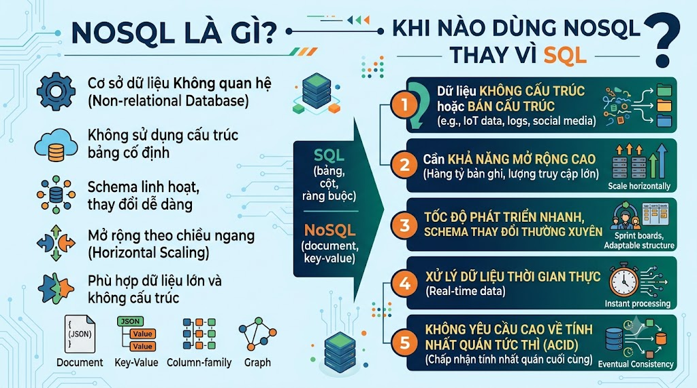

# NoSQL Là Gì? Khi Nào Dùng NoSQL Thay Vì SQL?



Bạn đang xây dựng [nguyentienkhoi.hashnode.dev](http://nguyentienkhoi.hashnode.dev) với PostgreSQL và mọi thứ đang chạy tốt. Nhưng một ngày, bạn nhận ra: bảng `products` cần lưu attributes hoàn toàn khác nhau cho từng loại sản phẩm, hệ thống cần cache để giảm tải database, và log access cần ghi 100,000 dòng mỗi giây. PostgreSQL bắt đầu tỏ ra không phải là công cụ phù hợp nhất cho tất cả những bài toán này. Đây là lúc **NoSQL** xuất hiện.

## 1\. NoSQL Là Gì?

**NoSQL** (Not Only SQL) là tập hợp các hệ quản trị cơ sở dữ liệu **không dùng mô hình quan hệ** (bảng + schema cố định) của SQL truyền thống.

Từ "Not Only SQL" nói lên bản chất: NoSQL không phải là đối lập với SQL, mà là **bổ sung** cho SQL — dùng đúng công cụ cho đúng bài toán.

Ra đời vào những năm 2000 khi các công ty lớn như Google (Bigtable), Amazon (DynamoDB), Facebook (Cassandra) gặp giới hạn của SQL truyền thống ở quy mô hàng tỷ users và petabyte dữ liệu.

## 2\. Bốn Loại NoSQL Chính

### 2.1 Document Database

Lưu dữ liệu dạng **JSON document** — mỗi document tự mô tả cấu trúc của mình.

```json
// Ví dụ: Course document trong MongoDB
{
  "_id": "course_1",
  "title": "Spring Boot từ Zero đến Hero",
  "price": 799000,
  "instructor": {
    "name": "FoxDev",
    "email": "contact@nguyentienkhoi.hashnode.dev"
  },
  "tags": ["java", "spring", "backend"],
  "sections": [
    { "title": "Giới thiệu", "lectures": 5 },
    { "title": "REST API", "lectures": 12 }
  ]
}
```

**Đại diện:** MongoDB, Firestore, CouchDB, Amazon DocumentDB

**Strengths:**

*   Schema flexible — không cần define trước, thay đổi tự do
    
*   Document = một entity hoàn chỉnh — ít JOIN hơn
    
*   Developer friendly — JSON quen thuộc với mọi developer
    

### 2.2 Key-Value Database

Lưu dữ liệu dạng **key → value** đơn giản nhất. Cực kỳ nhanh vì lookup O(1).

```java
"session:user_123"    → { "user_id": 1, "email": "...", "expires": "..." }
"cache:course_list"   → "[{...}, {...}, {...}]"
"rate_limit:ip_1.2.3" → "47"
"lock:payment_456"    → "processing"
```

**Đại diện:** Redis, Memcached, DynamoDB, Riak

**Strengths:**

*   Nhanh nhất trong tất cả các loại DB — microsecond latency
    
*   Scale dễ dàng
    
*   Perfect cho cache, session, rate limiting, distributed locks
    

### 2.3 Column-Family Database

Lưu dữ liệu theo **cột** thay vì theo hàng — tối ưu cho write-heavy và time-series.

```java
Row Key: "user_1"
  ┌─────────────┬────────┬──────────┬─────────────┐
  │ login_time  │ action │ device   │ ip_address  │
  ├─────────────┼────────┼──────────┼─────────────┤
  │ 09:00:01    │ login  │ mobile   │ 1.2.3.4     │
  │ 09:05:33    │ view   │ mobile   │ 1.2.3.4     │
  │ 09:10:21    │ buy    │ mobile   │ 1.2.3.4     │
  └─────────────┴────────┴──────────┴─────────────┘
```

**Đại diện:** Apache Cassandra, HBase, ScyllaDB

**Strengths:**

*   Write throughput cực cao — hàng triệu writes/giây
    
*   Tối ưu cho time-series, IoT, event logging
    
*   Scale horizontal tự nhiên
    

### 2.4 Graph Database

Lưu dữ liệu dạng **nodes và relationships** — tối ưu cho dữ liệu có quan hệ phức tạp.

```java
(User:Nam) -[ENROLLED]-> (Course:SpringBoot)
(Course:SpringBoot) -[REQUIRES]-> (Skill:Java)
(User:Nam) -[KNOWS]-> (Skill:Java)
(Course:SpringBoot) -[SIMILAR_TO]-> (Course:Microservices)
```

**Đại diện:** Neo4j, Amazon Neptune, ArangoDB

**Strengths:**

*   Query quan hệ nhiều chiều nhanh và tự nhiên
    
*   Social graph, recommendation, fraud detection
    
*   "Bạn bè của bạn bè" — khó làm với SQL JOIN
    

## 3\. SQL vs NoSQL — Bảng So Sánh Tổng Quan


| Tiêu chí | SQL (PostgreSQL) | Document (MongoDB) | Key-Value (Redis) | Column (Cassandra) |
|---|---|---|---|---|
| Schema | Cố định, strict | Flexible | Không có | Flexible một phần |
| Query | SQL mạnh, JOIN dễ | MongoDB Query Language | Chỉ get/set theo key | CQL (giống SQL nhẹ) |
| ACID | ✅ Đầy đủ | ✅ Document-level | ❌ Không (mặc định) | ❌ Eventual consistency |
| Scale | Vertical (chủ yếu) | Horizontal | Horizontal | Horizontal cực tốt |
| Write speed | Tốt | Tốt | Cực nhanh | Cực nhanh |
| Relationship | ✅ Native JOIN | ❌ Phải tự xử lý | ❌ Không | ❌ Không |
| Use case | Mọi thứ structured | Flexible content | Cache, session | Time-series, logs |


## 4\. ACID vs BASE — Hai Triết Lý Khác Nhau

SQL theo **ACID**, nhiều NoSQL theo **BASE**:

### ACID (SQL)

*   **A**tomicity — All or nothing
    
*   **C**onsistency — Luôn ở trạng thái hợp lệ
    
*   **I**solation — Transactions không can thiệp nhau
    
*   **D**urability — Sau COMMIT, data tồn tại mãi mãi
    

### BASE (NoSQL)

*   **B**asically **A**vailable — Hệ thống luôn phản hồi, dù có node fail
    
*   **S**oft state — State có thể thay đổi theo thời gian (do replication)
    
*   **E**ventual consistency — Dữ liệu sẽ nhất quán **sau một khoảng thời gian**
    

**Ví dụ thực tế Eventual Consistency:**

```java
User A post status "Vừa hoàn thành khóa Spring Boot!" lúc 10:00:00
  → Server US thấy ngay lúc 10:00:00
  → Server VN thấy lúc 10:00:02 (2 giây lag replication)

→ Đây là "Eventual Consistency" — cuối cùng tất cả nodes đều thấy post
→ Chấp nhận được với social feed
→ KHÔNG chấp nhận được với số dư tài khoản ngân hàng
```

## 5\. CAP Theorem — Không Thể Có Cả Ba

**CAP Theorem** nói rằng một distributed system chỉ có thể đảm bảo được **2 trong 3** tính chất:

```java
         Consistency
              △
             / \
            /   \
           /     \
          /  Phải \
         /  chọn 2 \
        /___________\
  Availability   Partition
                 Tolerance
```

*   **C**onsistency: Mọi node đọc được dữ liệu mới nhất
    
*   **A**vailability: Hệ thống luôn phản hồi request
    
*   **P**artition Tolerance: Hệ thống vẫn hoạt động khi có network partition (node mất kết nối)
    

**Trong thực tế:** P (Partition Tolerance) là bắt buộc với distributed system → phải chọn C hoặc A:


| Hệ thống | Chọn | Nghĩa là |
|---|---|---|
| PostgreSQL | CP | Consistent nhưng có thể unavailable khi partition |
| MongoDB | CP (mặc định) | Strong consistency, có thể timeout khi partition |
| Cassandra | AP | Luôn available, chấp nhận stale data |
| Redis | CP | Consistent, có thể unavailable khi primary down |
| DynamoDB | AP (eventually) | Luôn available, eventual consistency |


## 6\. Khi Nào Dùng NoSQL Thay Vì SQL?

### Dùng Document DB (MongoDB) khi:

```java
✅ Schema hay thay đổi — product catalog với attributes khác nhau theo category
✅ Data là "document" tự nhiên — blog post, user profile, config
✅ Prototype nhanh — chưa biết schema cuối cùng
✅ Cần nested data — comments lồng nhau, sections trong course
✅ Write throughput cao hơn PostgreSQL cần

❌ Không nên khi: cần complex JOIN nhiều bảng, cần strict ACID, reporting phức tạp
```

**Ví dụ** [**nguyentienkhoi.hashnode.dev**](http://nguyentienkhoi.hashnode.dev)**:**

```javascript
// Blog posts với flexible SEO metadata
{
  "title": "SQL cho Developer",
  "content": "...",
  "seo": {
    "keywords": ["sql", "database", "developer"],
    "og_image": "https://...",
    "canonical": "https://nguyentienkhoi.hashnode.dev/sql-developer"
  },
  "stats": { "views": 15420, "shares": 234 }
}
```

### Dùng Key-Value DB (Redis) khi:

```java
✅ Cache — giảm tải database, tăng response time
✅ Session storage — lưu user session
✅ Rate limiting — giới hạn số request per IP/user
✅ Distributed lock — chỉ 1 process xử lý tại một thời điểm
✅ Real-time leaderboard — ranking, scoreboard
✅ Pub/Sub messaging — notification, real-time features

❌ Không nên khi: cần query phức tạp, cần persistence lâu dài (Redis có thể mất data khi restart nếu không config)
```

**Ví dụ** [**nguyentienkhoi.hashnode.dev**](http://nguyentienkhoi.hashnode.dev)**:**

```java
cache:courses:published         → Danh sách khóa học (TTL 5 phút)
session:user_123                → Session data (TTL 24h)
rate_limit:checkout:user_123    → "47" (reset mỗi giờ)
lock:enrollment:course_1:user_1 → "processing" (TTL 30s)
leaderboard:points:2025-03      → Sorted Set điểm thưởng tháng 3
```

### Dùng Column-Family DB (Cassandra) khi:

```java
✅ Write-heavy workload — hàng triệu events/giây
✅ Time-series data — logs, metrics, IoT sensor data
✅ Cần scale ngang không giới hạn
✅ Không thể có single point of failure
✅ Data lớn (petabyte scale)

❌ Không nên khi: cần flexible query (Cassandra cần biết trước query pattern), cần complex aggregation, dataset nhỏ
```

**Ví dụ** [**nguyentienkhoi.hashnode.dev**](http://nguyentienkhoi.hashnode.dev)**:**

```sql
-- Video tracking logs: 10 triệu events/ngày
CREATE TABLE video_tracking (
    course_id   UUID,
    user_id     UUID,
    watched_at  TIMESTAMP,
    duration    INT,
    PRIMARY KEY ((course_id), watched_at, user_id)
) WITH CLUSTERING ORDER BY (watched_at DESC);
```

### Dùng Graph DB (Neo4j) khi:

```java
✅ Quan hệ phức tạp nhiều chiều — social network, knowledge graph
✅ Recommendation: "người học giống bạn cũng học..."
✅ Fraud detection: phát hiện pattern gian lận qua quan hệ
✅ Learning path: "để học X cần biết Y và Z trước"

❌ Không nên khi: data không có nhiều quan hệ, team nhỏ chưa quen Graph
```

## 7\. Polyglot Persistence — Dùng Nhiều DB Cùng Lúc

Hệ thống production hiện đại thường dùng **nhiều loại database cùng lúc**, mỗi loại làm tốt nhất việc của mình:

```java
                    nguyentienkhoi.hashnode.dev

  ┌─────────────────────────────────────────────┐
  │              Application Layer              │
  └──────┬──────────┬──────────┬───────────────┘
         │          │          │
         ▼          ▼          ▼
  ┌──────────┐ ┌─────────┐ ┌──────────────────┐
  │PostgreSQL│ │  Redis  │ │     MongoDB      │
  │          │ │         │ │                  │
  │ Users    │ │ Cache   │ │ Blog posts       │
  │ Orders   │ │ Session │ │ Course catalog   │
  │ Payments │ │ Rate    │ │ User preferences │
  │ Courses  │ │ limiting│ │                  │
  └──────────┘ └─────────┘ └──────────────────┘

  Mỗi DB làm đúng việc mình giỏi nhất
```

**Đây không phải "NoSQL thay thế SQL"** — đây là **"đúng công cụ cho đúng bài toán"**.

## 8\. Quyết Định Nhanh — Chọn DB Nào?

```java
Bắt đầu project mới, không biết chọn gì?
  → PostgreSQL — safe choice, đủ tốt cho 90% use case

Cần cache để tăng tốc?
  → Redis

Data có structure không cố định, hay thay đổi?
  → MongoDB

Write hàng triệu events/giây, time-series?
  → Cassandra

Quan hệ phức tạp, social graph, recommendation?
  → Neo4j

Cần managed, serverless, AWS ecosystem?
  → DynamoDB
```

## 9\. Cạm Bẫy Hay Gặp Khi Chọn NoSQL

**Cạm bẫy 1: "NoSQL scale tốt hơn SQL nên dùng NoSQL"** → Sai. PostgreSQL scale rất tốt đến hàng chục triệu rows với index và read replica. Chỉ cần NoSQL khi vượt quá giới hạn đó.

**Cạm bẫy 2: "MongoDB flexible nên dùng cho tất cả"** → Sai. Flexible schema không có nghĩa là không cần thiết kế schema. MongoDB thiếu JOIN và referential integrity → khó maintain với data có nhiều quan hệ.

**Cạm bẫy 3: "Redis nhanh nên thay thế database chính"** → Sai. Redis là in-memory, data mất khi restart (nếu không config persistence). Chỉ dùng làm cache/session, không phải source of truth.

**Cạm bẫy 4: "Dùng nhiều DB cùng lúc thì phức tạp quá"** → Đúng một phần. Nhưng complexity có lý do. PostgreSQL + Redis là combo cực kỳ phổ biến, không quá phức tạp để setup và maintain.

## Tổng Kết


| Loại | Đại diện | Dùng khi |
|---|---|---|
| Document DB | MongoDB | Schema flexible, nested data, rapid development |
| Key-Value DB | Redis | Cache, session, rate limiting, real-time |
| Column-Family | Cassandra | Write-heavy, time-series, petabyte scale |
| Graph DB | Neo4j | Quan hệ phức tạp, social, recommendation |


**Nguyên tắc:**

*   SQL (PostgreSQL) vẫn là **default choice** — đủ tốt cho hầu hết bài toán
    
*   NoSQL là **công cụ chuyên biệt** — dùng khi SQL thực sự không phù hợp
    
*   **Polyglot persistence** — dùng nhiều DB cho đúng mục đích là mature approach
    

Series này sẽ đi sâu vào từng loại NoSQL, bắt đầu với **MongoDB** — Document DB phổ biến nhất và dễ tiếp cận nhất cho developer.

> **Khác biệt giữa các NoSQL:**
> 
> *   **MongoDB vs Cassandra:** MongoDB linh hoạt hơn về query, Cassandra scale write tốt hơn
>     
> *   **Redis vs Memcached:** Redis có nhiều data structures hơn, persistence, Pub/Sub
>     
> *   **MongoDB vs DynamoDB:** MongoDB tự host được, DynamoDB là managed AWS service
>     
> *   **Neo4j vs PostgreSQL với recursive CTE:** Neo4j nhanh hơn nhiều cho deep graph traversal (>3 levels)
>     

