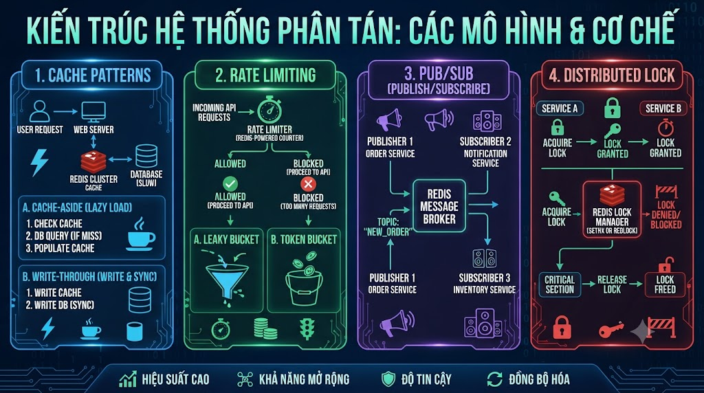

# Cache Patterns, Rate Limiting, Pub/Sub & Distributed Lock



Bài 8 đã dùng Redis theo kiểu dữ liệu. Bài này tập trung vào **4 use cases nâng cao** mà mọi backend production đều cần: cache patterns chuyên sâu, rate limiting để bảo vệ API, Pub/Sub cho real-time features, và distributed lock để tránh race condition. Đây là những tính năng phân biệt developer biết dùng Redis với developer thực sự hiểu Redis.

## 1\. Cache Patterns Chuyên Sâu

### 1.1 Read-through Cache

Application không biết có cache — chỉ gọi một interface, hệ thống tự xử lý cache phía sau.

```python
from abc import ABC, abstractmethod
from functools import wraps
import hashlib

class CacheableRepository(ABC):
    """
    Read-through cache pattern.
    Application chỉ gọi get() — không biết có Redis hay không.
    """

    def __init__(self, redis_client, ttl: int = 300):
        self.r   = redis_client
        self.ttl = ttl

    @abstractmethod
    def _fetch_from_db(self, key: str) -> Optional[dict]:
        """Subclass implement — query thực từ DB"""
        pass

    @abstractmethod
    def _cache_key(self, identifier: str) -> str:
        """Tạo cache key"""
        pass

    def get(self, identifier: str) -> Optional[dict]:
        cache_key = self._cache_key(identifier)

        # 1. Đọc cache
        cached = self.r.get(cache_key)
        if cached:
            return json.loads(cached)

        # 2. Cache miss → đọc từ DB
        data = self._fetch_from_db(identifier)
        if data:
            self.r.setex(cache_key, self.ttl, json.dumps(data))

        return data

    def invalidate(self, identifier: str):
        self.r.delete(self._cache_key(identifier))


class CourseRepository(CacheableRepository):

    def __init__(self, redis_client, db_conn):
        super().__init__(redis_client, ttl=600)
        self.db = db_conn

    def _cache_key(self, course_id: str) -> str:
        return f"cache:course:{course_id}"

    def _fetch_from_db(self, course_id: str) -> Optional[dict]:
        # Query thực từ PostgreSQL
        return self.db.fetchone(
            "SELECT * FROM courses WHERE id = %s AND course_status = 'PUBLISHED'",
            (course_id,)
        )


# Application chỉ cần gọi:
repo   = CourseRepository(redis_client=r, db_conn=db)
course = repo.get("1")          # tự cache
repo.invalidate("1")            # xóa cache khi update
```

### 1.2 Write-behind Cache (Write-back)

Ghi vào cache trước, flush xuống DB sau — tối đa write performance.

```python
import threading
from collections import defaultdict

class WriteBehindCache:
    """
    Ghi vào Redis trước, batch flush xuống DB sau.
    Phù hợp cho: view counters, activity logs, stats updates.

    ⚠️ Risk: Nếu Redis crash trước khi flush → mất data
    → Chỉ dùng cho data không critical (view counts, logs)
    """

    def __init__(self, redis_client, db_conn, flush_interval: int = 60):
        self.r              = redis_client
        self.db             = db_conn
        self.flush_interval = flush_interval
        self.dirty_keys     = set()  # keys cần flush
        self._start_flush_worker()

    def _start_flush_worker(self):
        """Background thread flush định kỳ"""
        def worker():
            while True:
                time.sleep(self.flush_interval)
                self._flush()

        thread = threading.Thread(target=worker, daemon=True)
        thread.start()

    def increment_view(self, course_id: int) -> int:
        """Increment view count — ghi vào Redis, flush xuống DB sau"""
        key   = f"wb:course:{course_id}:views"
        count = self.r.incr(key)
        self.dirty_keys.add(course_id)
        return count

    def _flush(self):
        """Flush tất cả dirty counters xuống DB"""
        if not self.dirty_keys:
            return

        flushed = set(self.dirty_keys)
        self.dirty_keys.clear()

        pipe = self.r.pipeline()
        for course_id in flushed:
            pipe.getdel(f"wb:course:{course_id}:views")  # get và xóa atomic
        counts = pipe.execute()

        # Batch update DB
        updates = [
            (int(count or 0), course_id)
            for course_id, count in zip(flushed, counts)
            if count and int(count) > 0
        ]

        if updates:
            self.db.executemany(
                "UPDATE courses SET view_count = view_count + %s WHERE id = %s",
                updates
            )
            print(f"Flushed {len(updates)} course stats to DB")
```

### 1.3 Cache Warming — Pre-load Cache Khi Khởi Động

```python
class CacheWarmer:
    """
    Pre-load data vào cache khi server start.
    Tránh cold start — tất cả requests đầu tiên đều hit DB.
    """

    def __init__(self, redis_client, db_conn):
        self.r  = redis_client
        self.db = db_conn

    def warm_popular_courses(self, limit: int = 50):
        """Load top N courses phổ biến nhất vào cache"""
        print(f"Warming top {limit} courses...")

        courses = self.db.fetchall("""
            SELECT id, title, price, rating, enrolled_count, category
            FROM courses
            WHERE course_status = 'PUBLISHED'
            ORDER BY enrolled_count DESC
            LIMIT %s
        """, (limit,))

        pipe = self.r.pipeline()
        for course in courses:
            key = f"cache:course:{course['id']}"
            pipe.setex(key, 600, json.dumps(course))
        pipe.execute()

        print(f"✅ Warmed {len(courses)} courses")

    def warm_homepage(self):
        """Cache homepage data"""
        categories = self.db.fetchall("SELECT * FROM categories")
        self.r.setex("cache:categories", 3600, json.dumps(categories))

        featured = self.db.fetchall("""
            SELECT id, title, price, rating FROM courses
            WHERE course_status = 'PUBLISHED' AND home_marketing_pinned = true
            ORDER BY home_marketing_sort_order
            LIMIT 6
        """)
        self.r.setex("cache:homepage:featured", 300, json.dumps(featured))
        print("✅ Homepage cache warmed")

    def run_all(self):
        self.warm_popular_courses()
        self.warm_homepage()
```

### 1.4 Cache Stampede — Probabilistic Early Expiration

Thay vì expire đột ngột → expire sớm theo xác suất khi gần hết TTL:

```python
import math
import random

def get_with_early_expiration(
    r: redis.Redis,
    key: str,
    ttl: int,
    fetch_fn,
    beta: float = 1.0
) -> Any:
    """
    XFetch algorithm — tự động rebuild cache trước khi expire.
    Giảm stampede vì chỉ 1 request rebuild, không phải tất cả cùng lúc.
    """
    cached = r.get(key)
    remaining_ttl = r.ttl(key)

    if cached:
        # Tính xác suất cần rebuild sớm
        # Xác suất tăng khi remaining TTL giảm
        delta = -beta * math.log(random.random())
        if delta * (1 + 0.1) >= remaining_ttl:
            # Rebuild sớm (probabilistic)
            pass
        else:
            return json.loads(cached)

    # Fetch và cache
    data = fetch_fn()
    r.setex(key, ttl, json.dumps(data))
    return data
```

## 2\. Rate Limiting

Giới hạn số requests của user/IP trong một khoảng thời gian — bảo vệ API khỏi abuse và DDoS.

### 2.1 Fixed Window Counter

Đơn giản nhất — đếm requests trong window cố định (ví dụ: mỗi phút).

```python
class FixedWindowRateLimiter:
    """
    Fixed Window: giới hạn N requests trong window T giây.
    Vấn đề: burst attack tại boundary (cuối window này + đầu window sau).
    """

    def __init__(self, redis_client):
        self.r = redis_client

    def is_allowed(self, identifier: str,
                   limit: int, window: int) -> tuple[bool, dict]:
        """
        identifier: user_id hoặc ip_address
        limit:      số requests tối đa
        window:     độ dài window (giây)
        """
        import time
        window_start = int(time.time() // window) * window
        key          = f"rate_limit:{identifier}:{window_start}"

        pipe = self.r.pipeline()
        pipe.incr(key)
        pipe.expire(key, window)
        count, _ = pipe.execute()

        allowed = count <= limit

        return allowed, {
            "allowed":     allowed,
            "count":       count,
            "limit":       limit,
            "remaining":   max(0, limit - count),
            "reset_after": window - (int(time.time()) % window)
        }
```

### 2.2 Sliding Window Log

Chính xác hơn — track timestamp của mỗi request.

```python
class SlidingWindowLogLimiter:
    """
    Sliding Window Log: lưu timestamp của mỗi request.
    Chính xác nhưng tốn memory với limit lớn.
    """

    def __init__(self, redis_client):
        self.r = redis_client

    def is_allowed(self, identifier: str,
                   limit: int, window: int) -> tuple[bool, dict]:
        import time
        now     = time.time()
        key     = f"rate_log:{identifier}"
        cutoff  = now - window

        pipe = self.r.pipeline()
        # Xóa requests cũ hơn window
        pipe.zremrangebyscore(key, 0, cutoff)
        # Đếm requests trong window
        pipe.zcard(key)
        # Thêm request hiện tại
        pipe.zadd(key, {str(now): now})
        # Expire key sau window
        pipe.expire(key, int(window) + 1)
        _, count, _, _ = pipe.execute()

        count   += 1  # bao gồm request vừa thêm
        allowed  = count <= limit

        if not allowed:
            # Xóa request vừa thêm nếu không được phép
            self.r.zrem(key, str(now))

        return allowed, {
            "allowed":   allowed,
            "count":     count - 1 if not allowed else count,
            "limit":     limit,
            "remaining": max(0, limit - count)
        }
```

### 2.3 Token Bucket — Production Standard

Phổ biến nhất trong production — cho phép burst nhỏ, smooth rate overall.

```python
class TokenBucketRateLimiter:
    """
    Token Bucket:
    - Bucket chứa tối đa `capacity` tokens
    - Tokens được refill với rate `refill_rate` tokens/giây
    - Mỗi request tiêu 1 token
    - Cho phép burst (dùng nhiều tokens cùng lúc khi bucket đầy)
    """

    def __init__(self, redis_client):
        self.r = redis_client
        # Lua script để đảm bảo atomic
        self.lua_script = self.r.register_script("""
            local key         = KEYS[1]
            local capacity    = tonumber(ARGV[1])
            local refill_rate = tonumber(ARGV[2])
            local now         = tonumber(ARGV[3])
            local requested   = tonumber(ARGV[4])

            local bucket = redis.call('HMGET', key, 'tokens', 'last_refill')
            local tokens     = tonumber(bucket[1]) or capacity
            local last_refill = tonumber(bucket[2]) or now

            -- Tính tokens được refill từ lần cuối
            local elapsed = math.max(0, now - last_refill)
            local refilled = elapsed * refill_rate
            tokens = math.min(capacity, tokens + refilled)

            local allowed = 0
            if tokens >= requested then
                tokens  = tokens - requested
                allowed = 1
            end

            redis.call('HMSET', key, 'tokens', tokens, 'last_refill', now)
            redis.call('EXPIRE', key, math.ceil(capacity / refill_rate) + 1)

            return {allowed, math.floor(tokens)}
        """)

    def is_allowed(self, identifier: str,
                   capacity: int = 100,
                   refill_rate: float = 10,
                   requested: int = 1) -> tuple[bool, dict]:
        """
        capacity:    max tokens (burst size)
        refill_rate: tokens per second
        requested:   tokens cần cho request này
        """
        import time
        key    = f"token_bucket:{identifier}"
        result = self.lua_script(
            keys=[key],
            args=[capacity, refill_rate, time.time(), requested]
        )
        allowed, remaining = result[0] == 1, int(result[1])
        return allowed, {"allowed": allowed, "remaining_tokens": remaining}
```

### 2.4 Rate Limiter Middleware (FastAPI)

```python
from fastapi import Request, HTTPException
from fastapi.responses import JSONResponse

class RateLimitMiddleware:

    def __init__(self, redis_client):
        self.limiter = TokenBucketRateLimiter(redis_client)

        # Config cho từng endpoint
        self.configs = {
            "/api/auth/login":    {"capacity": 5,   "refill_rate": 0.1},  # 5 burst, 6/min
            "/api/orders":        {"capacity": 10,  "refill_rate": 1.0},  # 10 burst, 60/min
            "/api/search":        {"capacity": 30,  "refill_rate": 5.0},  # 30 burst, 300/min
            "default":            {"capacity": 100, "refill_rate": 10.0}, # 100 burst, 600/min
        }

    async def __call__(self, request: Request, call_next):
        # Lấy identifier (user_id nếu authed, else IP)
        user_id = getattr(request.state, "user_id", None)
        identifier = f"user:{user_id}" if user_id else f"ip:{request.client.host}"

        # Lấy config cho endpoint
        path   = request.url.path
        config = self.configs.get(path, self.configs["default"])

        allowed, info = self.limiter.is_allowed(
            identifier  = f"{path}:{identifier}",
            capacity    = config["capacity"],
            refill_rate = config["refill_rate"]
        )

        if not allowed:
            return JSONResponse(
                status_code = 429,
                content     = {
                    "error":   "Too Many Requests",
                    "message": "Rate limit exceeded. Please try again later."
                },
                headers = {
                    "X-RateLimit-Remaining": str(info["remaining_tokens"]),
                    "Retry-After":           "60"
                }
            )

        response = await call_next(request)
        response.headers["X-RateLimit-Remaining"] = str(info["remaining_tokens"])
        return response
```

## 3\. Pub/Sub — Real-time Messaging

Redis Pub/Sub cho phép gửi message đến nhiều subscribers đồng thời — không cần polling.

```python
import threading

class NotificationPublisher:
    """Publish notifications đến users"""

    def __init__(self, redis_client):
        self.r = redis_client

    def notify_user(self, user_id: int, event: dict):
        """Gửi notification đến channel của user"""
        channel = f"notifications:user:{user_id}"
        self.r.publish(channel, json.dumps(event))

    def broadcast_announcement(self, message: str):
        """Gửi thông báo đến tất cả users"""
        self.r.publish("announcements:all", json.dumps({
            "type":    "ANNOUNCEMENT",
            "message": message,
            "time":    datetime.now().isoformat()
        }))

    def notify_course_update(self, course_id: int, update: dict):
        """Notify users đang xem course khi có update"""
        self.r.publish(f"course:{course_id}:updates", json.dumps(update))


class NotificationSubscriber:
    """Subscribe và xử lý notifications"""

    def __init__(self, redis_client):
        self.r      = redis_client
        self.pubsub = self.r.pubsub()

    def subscribe_user(self, user_id: int,
                        callback):
        """Subscribe channel của một user"""
        channel = f"notifications:user:{user_id}"
        self.pubsub.subscribe(**{channel: callback})

    def subscribe_pattern(self, pattern: str,
                           callback):
        """Subscribe theo pattern — ví dụ: notifications:user:*"""
        self.pubsub.psubscribe(**{pattern: callback})

    def listen(self):
        """Blocking listen — chạy trong background thread"""
        print("Listening for messages...")
        for message in self.pubsub.listen():
            if message["type"] == "message":
                data = json.loads(message["data"])
                print(f"Received: {data}")


# Publisher — khi có event
publisher = NotificationPublisher(r)

# Order thanh toán thành công → notify user
publisher.notify_user(user_id=1, event={
    "type":       "ORDER_PAID",
    "order_id":   123,
    "amount":     799000,
    "message":    "Đơn hàng #123 đã thanh toán thành công!",
    "time":       datetime.now().isoformat()
})

# Subscriber — WebSocket server lắng nghe và push đến browser
def handle_notification(message):
    if message["type"] == "message":
        data = json.loads(message["data"])
        # Push to WebSocket client
        websocket.send(json.dumps(data))

subscriber = NotificationSubscriber(r)
subscriber.subscribe_user(user_id=1, callback=handle_notification)

# Chạy listener trong background thread
thread = threading.Thread(
    target=subscriber.listen, daemon=True
)
thread.start()
```

**⚠️ Lưu ý Pub/Sub:**

*   Message **không được lưu** — subscriber offline sẽ mất message
    
*   Dùng **Redis Streams** nếu cần durability (lưu lại message)
    
*   Pub/Sub phù hợp cho: real-time notifications, live updates — không cần reliable delivery
    

## 4\. Distributed Lock

Khi nhiều instances của application cùng chạy, cần đảm bảo chỉ **1 instance** xử lý một tác vụ tại một thời điểm.

### 4.1 Simple Lock

```python
class SimpleDistributedLock:
    """
    Lock đơn giản dùng SET NX EX.
    Phù hợp cho hầu hết use cases.
    """

    def __init__(self, redis_client):
        self.r = redis_client

    def acquire(self, resource: str, ttl: int = 30) -> Optional[str]:
        """
        Thử acquire lock.
        Trả về lock_value nếu thành công, None nếu đã bị lock.
        """
        lock_key   = f"lock:{resource}"
        lock_value = secrets.token_hex(16)  # unique value để verify ownership

        acquired = self.r.set(
            lock_key, lock_value,
            nx  = True,   # chỉ set nếu chưa tồn tại
            ex  = ttl     # tự động expire để tránh deadlock
        )
        return lock_value if acquired else None

    def release(self, resource: str, lock_value: str) -> bool:
        """
        Release lock — CHỈ release nếu đúng owner.
        Dùng Lua để đảm bảo atomic check + delete.
        """
        lua_script = """
            if redis.call("get", KEYS[1]) == ARGV[1] then
                return redis.call("del", KEYS[1])
            else
                return 0
            end
        """
        lock_key = f"lock:{resource}"
        result   = self.r.eval(lua_script, 1, lock_key, lock_value)
        return result == 1

    def extend(self, resource: str, lock_value: str,
               ttl: int = 30) -> bool:
        """Gia hạn lock nếu vẫn là owner"""
        lua_script = """
            if redis.call("get", KEYS[1]) == ARGV[1] then
                return redis.call("expire", KEYS[1], ARGV[2])
            else
                return 0
            end
        """
        lock_key = f"lock:{resource}"
        result   = self.r.eval(lua_script, 1, lock_key, lock_value, ttl)
        return result == 1
```

### 4.2 Context Manager — Pythonic Interface

```python
from contextlib import contextmanager

@contextmanager
def distributed_lock(r: redis.Redis, resource: str,
                     ttl: int = 30, retry: int = 3,
                     retry_delay: float = 0.1):
    """
    Context manager cho distributed lock.

    Usage:
        with distributed_lock(r, "payment:order_1") as locked:
            if locked:
                process_payment()
            else:
                raise Exception("Could not acquire lock")
    """
    lock    = SimpleDistributedLock(r)
    value   = None

    for attempt in range(retry):
        value = lock.acquire(resource, ttl)
        if value:
            break
        if attempt < retry - 1:
            time.sleep(retry_delay * (attempt + 1))  # exponential backoff

    try:
        yield value is not None  # True nếu lock thành công
    finally:
        if value:
            lock.release(resource, value)


# Sử dụng
def process_payment(order_id: int):
    """Đảm bảo chỉ 1 instance xử lý payment tại một thời điểm"""
    with distributed_lock(r, f"payment:order:{order_id}", ttl=60) as locked:
        if not locked:
            raise Exception(f"Order {order_id} đang được xử lý")

        # Xử lý payment
        order    = db.get_order(order_id)
        if order["status"] != "PENDING":
            return  # đã xử lý rồi

        charge_payment(order)
        db.update_order_status(order_id, "PAID")
        create_enrollments(order)
        print(f"✅ Order {order_id} processed successfully")
```

### 4.3 Use Cases Thực Tế

```python
# ─── Use Case 1: Tránh double payment ───
def checkout(user_id: int, cart_id: int):
    lock_resource = f"checkout:user:{user_id}:cart:{cart_id}"
    with distributed_lock(r, lock_resource, ttl=30) as locked:
        if not locked:
            return {"error": "Đơn hàng đang được xử lý, vui lòng chờ"}

        # Kiểm tra idempotency
        if r.exists(f"processed:cart:{cart_id}"):
            return {"error": "Đơn hàng đã được xử lý"}

        # Xử lý
        order = create_order(user_id, cart_id)
        r.setex(f"processed:cart:{cart_id}", 86400, "1")
        return {"order_id": order["id"]}


# ─── Use Case 2: Tránh duplicate cron job ───
def daily_email_digest():
    """Cron job chạy mỗi ngày — chỉ chạy 1 lần dù có nhiều workers"""
    today     = datetime.now().strftime("%Y-%m-%d")
    lock_key  = f"cron:daily_digest:{today}"

    with distributed_lock(r, lock_key, ttl=3600) as locked:
        if not locked:
            print("Daily digest already running on another instance")
            return

        print("Running daily digest...")
        users  = db.get_active_users()
        for user in users:
            send_digest_email(user)
        print(f"✅ Sent digest to {len(users)} users")


# ─── Use Case 3: Rate limit per user với lock ───
def enroll_course(user_id: int, course_id: int):
    """Tránh double enrollment khi user click nhanh"""
    lock_key = f"enroll:{user_id}:{course_id}"

    with distributed_lock(r, lock_key, ttl=10) as locked:
        if not locked:
            return {"error": "Đang xử lý đăng ký"}

        # Kiểm tra đã enroll chưa
        existing = db.get_enrollment(user_id, course_id)
        if existing:
            return {"error": "Bạn đã đăng ký khóa học này"}

        # Tạo enrollment
        db.create_enrollment(user_id, course_id)
        return {"success": True}
```

## 5\. Redis Streams — Reliable Message Queue

Pub/Sub mất message khi subscriber offline. **Redis Streams** lưu message vĩnh viễn — như Kafka nhưng nhẹ hơn.

```python
class EventStream:
    """
    Redis Streams: reliable event streaming.
    Khác Pub/Sub: messages được lưu, consumer groups đảm bảo exactly-once.
    """

    STREAM_KEY    = "events:foxdev"
    GROUP_NAME    = "email-workers"
    CONSUMER_NAME = "worker-1"

    def __init__(self, redis_client):
        self.r = redis_client
        self._setup_group()

    def _setup_group(self):
        """Tạo consumer group nếu chưa có"""
        try:
            self.r.xgroup_create(
                self.STREAM_KEY,
                self.GROUP_NAME,
                id     = "0",    # đọc từ đầu
                mkstream = True  # tạo stream nếu chưa có
            )
        except Exception:
            pass  # group đã tồn tại

    def publish(self, event_type: str, data: dict) -> str:
        """Publish event, trả về message ID"""
        return self.r.xadd(self.STREAM_KEY, {
            "type":    event_type,
            "data":    json.dumps(data),
            "time":    datetime.now().isoformat()
        })

    def consume(self, batch_size: int = 10,
                block_ms: int = 2000) -> list:
        """
        Consume messages từ group.
        block_ms: chờ tối đa N ms nếu không có message.
        """
        messages = self.r.xreadgroup(
            groupname   = self.GROUP_NAME,
            consumername = self.CONSUMER_NAME,
            streams     = {self.STREAM_KEY: ">"},  # ">" = chỉ lấy undelivered
            count       = batch_size,
            block       = block_ms
        )

        if not messages:
            return []

        result = []
        for _, msgs in messages:
            for msg_id, fields in msgs:
                result.append({
                    "id":   msg_id,
                    "type": fields.get("type"),
                    "data": json.loads(fields.get("data", "{}")),
                    "time": fields.get("time")
                })
        return result

    def acknowledge(self, message_id: str):
        """Xác nhận đã xử lý message — xóa khỏi pending"""
        self.r.xack(self.STREAM_KEY, self.GROUP_NAME, message_id)


# Publisher
stream = EventStream(r)
stream.publish("ORDER_PAID", {
    "order_id": 123,
    "user_id":  1,
    "amount":   799000
})

# Worker
def worker_loop():
    stream = EventStream(r)
    while True:
        messages = stream.consume(batch_size=10)
        for msg in messages:
            try:
                handle_event(msg["type"], msg["data"])
                stream.acknowledge(msg["id"])  # ACK sau khi xử lý xong
            except Exception as e:
                print(f"Failed: {e}")
                # Không ACK → message vào pending list → retry sau
```

## Tổng Kết


| Pattern | Use Case | Key Redis Feature |
|---|---|---|
| Cache-aside | Lazy cache loading | GET + SETEX |
| Write-through | Strong consistency | SET ngay sau DB write |
| Write-behind | High write throughput | INCR + background flush |
| Cache warming | Avoid cold start | Pipeline SETEX khi startup |
| Fixed Window | Simple rate limit | INCR + EXPIRE |
| Token Bucket | Smooth rate limit với burst | Lua script atomic |
| Pub/Sub | Real-time notifications | PUBLISH / SUBSCRIBE |
| Streams | Reliable message queue | XADD / XREADGROUP |
| Distributed Lock | Race condition prevention | SET NX EX + Lua release |


**Khi nào dùng gì:**

```java
Cache:         Read-heavy, tolerate stale data → Cache-aside
Consistency:   Must be fresh → Write-through
Write-heavy:   View counts, logs → Write-behind
Rate limit:    API protection → Token Bucket
Notifications: Real-time, fire-and-forget → Pub/Sub
Events:        Must not lose → Streams
Concurrency:   One worker at a time → Distributed Lock
```

Bài tiếp theo chúng ta sẽ học **Redis Persistence, Replication & Production Tips** — cách đảm bảo Redis không mất dữ liệu, setup master-replica và các best practices khi đưa Redis lên production.

