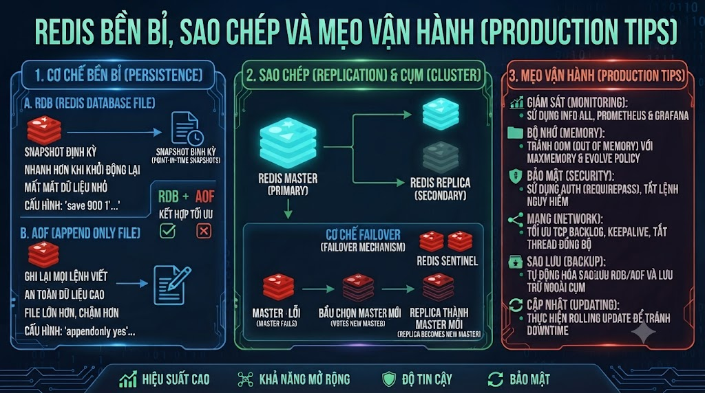

# Redis Persistence, Replication & Production Tips



Các bài trước tập trung vào **cách dùng** Redis. Bài này tập trung vào **vận hành** Redis trong production — một side thường bị bỏ qua cho đến khi có sự cố. Redis là in-memory store, mặc định khi restart tất cả data mất. Persistence giải quyết điều đó. Replication giải quyết high availability. Và production tips giúp Redis chạy ổn định, không trở thành bottleneck.

## 1\. Redis Persistence — Đảm Bảo Không Mất Data

Redis có 2 cơ chế persistence:

```java
RDB (Redis Database Backup):
  → Snapshot toàn bộ data xuống disk theo định kỳ
  → File: dump.rdb
  → Ưu: file nhỏ, restore nhanh, ít ảnh hưởng performance
  → Nhược: mất data từ lần snapshot cuối đến lúc crash

AOF (Append Only File):
  → Ghi log từng write command
  → File: appendonly.aof
  → Ưu: mất ít data nhất (tối đa 1 giây với fsync=everysec)
  → Nhược: file lớn hơn, restore chậm hơn
```

## 2\. RDB — Snapshot

### Cấu hình RDB

```bash
# redis.conf
# Tự động snapshot khi:
save 900 1      # 900 giây (15 phút) nếu có ít nhất 1 key thay đổi
save 300 10     # 300 giây (5 phút) nếu có ít nhất 10 keys thay đổi
save 60 10000   # 60 giây nếu có ít nhất 10,000 keys thay đổi

# Tên file và thư mục lưu
dbfilename dump.rdb
dir /var/lib/redis

# Nén file RDB (dùng LZF compression)
rdbcompression yes

# Checksum để verify tính toàn vẹn
rdbchecksum yes
```

### Manual Snapshot

```bash
# BGSAVE — background save, không block Redis
redis-cli BGSAVE
# → Background saving started

# Kiểm tra tiến trình
redis-cli LASTSAVE
# → 1710500000 (unix timestamp của lần save gần nhất)

# SAVE — foreground save, BLOCK toàn bộ trong lúc save
# Không dùng ở production!
redis-cli SAVE
```

## 3\. AOF — Append Only File

### Cấu hình AOF

```bash
# redis.conf

# Bật AOF
appendonly yes
appendfilename "appendonly.aof"

# fsync policy — quan trọng nhất:
# always:   fsync sau mỗi write → an toàn nhất, chậm nhất
# everysec: fsync mỗi giây     → cân bằng (khuyến nghị production)
# no:       để OS tự quyết định → nhanh nhất, rủi ro nhất
appendfsync everysec

# AOF Rewrite — nén file AOF khi quá lớn
auto-aof-rewrite-percentage 100  # rewrite khi file tăng gấp đôi
auto-aof-rewrite-min-size 64mb   # rewrite khi file > 64MB
```

### AOF Rewrite

```bash
# Trigger rewrite thủ công — tạo file AOF mới nhỏ hơn
redis-cli BGREWRITEAOF
# → Background append only file rewriting started

# Kiểm tra
redis-cli INFO persistence
# aof_enabled:1
# aof_rewrite_in_progress:0
# aof_current_size:10485760
# aof_base_size:5242880
```

## 4\. Hybrid — RDB + AOF (Khuyến Nghị Production)

```bash
# redis.conf — cấu hình production tối ưu

# Bật cả hai
save 3600 1      # RDB snapshot hàng giờ nếu có ít nhất 1 thay đổi
appendonly yes
appendfsync everysec

# AOF-use-RDB-preamble: dùng RDB format trong AOF để restart nhanh hơn
aof-use-rdb-preamble yes
```

```java
Hybrid persistence hoạt động:
  1. AOF file bắt đầu bằng RDB snapshot (điểm bắt đầu nhanh)
  2. Tiếp theo là AOF log của các writes sau snapshot
  3. Khi restart: load RDB portion nhanh + apply AOF log
  → Tốt nhất: vừa nhanh khi load, vừa ít mất data
```

## 5\. Replication — Master-Replica

### 5.1 Cấu Hình Cơ Bản

```bash
# ─── Master: redis.conf ───
bind 0.0.0.0
requirepass masterpassword
masterauth masterpassword   # để replica auth với master

# ─── Replica: redis.conf ───
replicaof master-host 6379  # kết nối đến master
masterauth masterpassword   # password của master
requirepass replicapassword # password để client kết nối replica
replica-read-only yes       # replica chỉ nhận reads (mặc định)
```

### 5.2 Docker Compose — Master-Replica

```yaml
version: '3.8'

services:
  redis-master:
    image: redis:7.2-alpine
    container_name: redis-master
    ports:
      - "6379:6379"
    volumes:
      - redis_master_data:/data
      - ./redis-master.conf:/usr/local/etc/redis/redis.conf
    command: redis-server /usr/local/etc/redis/redis.conf
    networks:
      - redis-net

  redis-replica-1:
    image: redis:7.2-alpine
    container_name: redis-replica-1
    ports:
      - "6380:6379"
    volumes:
      - redis_replica1_data:/data
    command: >
      redis-server
      --replicaof redis-master 6379
      --masterauth masterpassword
      --requirepass replicapassword
      --replica-read-only yes
    depends_on:
      - redis-master
    networks:
      - redis-net

  redis-replica-2:
    image: redis:7.2-alpine
    container_name: redis-replica-2
    ports:
      - "6381:6379"
    volumes:
      - redis_replica2_data:/data
    command: >
      redis-server
      --replicaof redis-master 6379
      --masterauth masterpassword
      --requirepass replicapassword
      --replica-read-only yes
    depends_on:
      - redis-master
    networks:
      - redis-net

volumes:
  redis_master_data:
  redis_replica1_data:
  redis_replica2_data:

networks:
  redis-net:
    driver: bridge
```

### 5.3 Kiểm Tra Replication

```bash
# Trên Master — xem thông tin replicas
redis-cli -a masterpassword INFO replication

# Output:
# role:master
# connected_slaves:2
# slave0:ip=172.18.0.3,port=6379,state=online,offset=1234,lag=0
# slave1:ip=172.18.0.4,port=6379,state=online,offset=1234,lag=0
# master_replid:abc123...
# master_repl_offset:1234

# Test: Write trên master, read trên replica
redis-cli -p 6379 -a masterpassword SET test_key "hello"
redis-cli -p 6380 -a replicapassword GET test_key
# → "hello" (đã sync!)

# Kiểm tra replication lag
redis-cli -p 6380 -a replicapassword INFO replication
# master_last_io_seconds_ago:0  ← lag tính bằng giây
```

## 6\. Redis Sentinel — Auto Failover

Sentinel monitor master và tự động promote replica khi master down.

```bash
# sentinel.conf
port 26379

# Monitor master (cần 2/3 sentinels đồng ý để failover)
sentinel monitor mymaster 127.0.0.1 6379 2
sentinel auth-pass mymaster masterpassword

# Sau bao lâu không phản hồi → coi là down (ms)
sentinel down-after-milliseconds mymaster 5000

# Timeout cho failover
sentinel failover-timeout mymaster 60000

# Số replicas parallel resync sau failover
sentinel parallel-syncs mymaster 1
```

```yaml
# Docker Compose với 3 Sentinels
  redis-sentinel-1:
    image: redis:7.2-alpine
    container_name: redis-sentinel-1
    ports:
      - "26379:26379"
    volumes:
      - ./sentinel.conf:/usr/local/etc/redis/sentinel.conf
    command: redis-sentinel /usr/local/etc/redis/sentinel.conf
    networks:
      - redis-net

  redis-sentinel-2:
    image: redis:7.2-alpine
    container_name: redis-sentinel-2
    ports:
      - "26380:26379"
    volumes:
      - ./sentinel.conf:/usr/local/etc/redis/sentinel.conf
    command: redis-sentinel /usr/local/etc/redis/sentinel.conf
    networks:
      - redis-net

  redis-sentinel-3:
    image: redis:7.2-alpine
    container_name: redis-sentinel-3
    ports:
      - "26381:26379"
    volumes:
      - ./sentinel.conf:/usr/local/etc/redis/sentinel.conf
    command: redis-sentinel /usr/local/etc/redis/sentinel.conf
    networks:
      - redis-net
```

### Kết Nối Với Sentinel Từ Application

```python
from redis.sentinel import Sentinel

# Kết nối qua Sentinel — tự động discover master
sentinel = Sentinel(
    [
        ("localhost", 26379),
        ("localhost", 26380),
        ("localhost", 26381),
    ],
    socket_timeout = 0.5
)

# Lấy master client (writes)
master = sentinel.master_for(
    "mymaster",
    password      = "masterpassword",
    socket_timeout = 0.5,
    decode_responses = True
)

# Lấy replica client (reads) — tự động load balance
replica = sentinel.slave_for(
    "mymaster",
    password      = "replicapassword",
    socket_timeout = 0.5,
    decode_responses = True
)

# Sử dụng
master.set("key", "value")   # ghi vào master
replica.get("key")            # đọc từ replica
```

## 7\. Memory Management

### 7.1 Maxmemory Policy

```bash
# redis.conf

# Giới hạn memory tối đa
maxmemory 512mb

# Eviction policy — xử lý khi hết memory:
# noeviction:     trả về error khi hết memory (default)
# allkeys-lru:    xóa key ít dùng nhất (LRU) trong tất cả keys
# volatile-lru:   xóa key ít dùng nhất có TTL
# allkeys-lfu:    xóa key ít dùng nhất (LFU — frequency based)
# volatile-lfu:   xóa key có TTL ít dùng nhất (LFU)
# allkeys-random: xóa random
# volatile-random: xóa random trong keys có TTL
# volatile-ttl:   xóa key có TTL nhỏ nhất trước

# Khuyến nghị cho cache:
maxmemory-policy allkeys-lru

# Khuyến nghị cho session (không muốn mất data active):
maxmemory-policy volatile-lru
```

### 7.2 Monitor Memory

```bash
# Xem tổng quan memory
redis-cli INFO memory

# Output quan trọng:
# used_memory:           10485760    ← memory đang dùng (bytes)
# used_memory_human:     10.00M
# used_memory_peak:      15728640    ← peak memory
# used_memory_peak_human: 15.00M
# mem_fragmentation_ratio: 1.2       ← 1.0-1.5 là tốt, > 1.5 = fragmented

# Xem memory của từng key
redis-cli MEMORY USAGE mykey
# → 256 (bytes)

# Top 10 keys chiếm nhiều memory nhất
redis-cli --memkeys
# hoặc
redis-cli MEMORY DOCTOR   # gợi ý tối ưu memory
```

### 7.3 Key Expiration Best Practices

```python
# ❌ Không bao giờ set key không có TTL (nếu là cache)
r.set("cache:courses", json.dumps(courses))

# ✅ Luôn set TTL
r.setex("cache:courses", 300, json.dumps(courses))

# ✅ Stagger TTL để tránh nhiều keys expire cùng lúc (thundering herd)
import random
base_ttl = 300
jitter   = random.randint(-30, 30)  # ±10% jitter
r.setex("cache:courses", base_ttl + jitter, json.dumps(courses))
```

## 8\. Production Configuration

### redis.conf đầy đủ cho production

```bash
# ─── Network ───
bind 127.0.0.1          # chỉ cho phép local (hoặc internal IP)
port 6379
protected-mode yes
requirepass StrongP@ssw0rd2025!

# ─── Limits ───
maxmemory 2gb
maxmemory-policy allkeys-lru
maxclients 10000         # max concurrent connections

# ─── Persistence ───
save 3600 1
save 300 100
appendonly yes
appendfsync everysec
aof-use-rdb-preamble yes

# ─── Replication ───
replica-read-only yes
replica-lazy-flush no

# ─── Performance ───
hz 15                    # background task frequency (default 10)
dynamic-hz yes
lazyfree-lazy-eviction yes    # async eviction
lazyfree-lazy-expire yes      # async expire
lazyfree-lazy-server-del yes  # async delete

# ─── Slow Log ───
slowlog-log-slower-than 10000   # log queries > 10ms (microseconds)
slowlog-max-len 128

# ─── Dangerous Commands (disable trong production) ───
rename-command FLUSHDB  ""
rename-command FLUSHALL ""
rename-command DEBUG    ""
rename-command CONFIG   "CONFIG_FOXDEV_SECRET"  # rename thay vì disable
```

## 9\. Monitoring

### 9.1 Redis INFO Commands

```bash
# Tổng quan toàn bộ
redis-cli INFO all

# Từng section
redis-cli INFO server       # version, uptime, OS
redis-cli INFO clients      # connected clients, blocked clients
redis-cli INFO memory       # memory usage
redis-cli INFO stats        # commands processed, keyspace hits/misses
redis-cli INFO replication  # master/replica status
redis-cli INFO persistence  # RDB/AOF status
redis-cli INFO keyspace     # keys per database
```

### 9.2 Metrics Quan Trọng

```python
class RedisMonitor:
    """Monitor Redis health và performance"""

    def __init__(self, redis_client):
        self.r = redis_client

    def get_health_metrics(self) -> dict:
        info = self.r.info()

        # Cache hit rate
        hits   = info.get("keyspace_hits", 0)
        misses = info.get("keyspace_misses", 0)
        total  = hits + misses
        hit_rate = (hits / total * 100) if total > 0 else 0

        # Memory fragmentation
        frag_ratio = info.get("mem_fragmentation_ratio", 1.0)

        # Connected clients
        connected_clients = info.get("connected_clients", 0)

        # Replication lag (nếu là replica)
        repl_lag = info.get("master_last_io_seconds_ago", 0)

        metrics = {
            "cache_hit_rate_pct":   round(hit_rate, 2),
            "memory_used_mb":       round(info["used_memory"] / 1024 / 1024, 2),
            "memory_peak_mb":       round(info["used_memory_peak"] / 1024 / 1024, 2),
            "fragmentation_ratio":  frag_ratio,
            "connected_clients":    connected_clients,
            "total_commands_processed": info.get("total_commands_processed", 0),
            "keyspace_hits":        hits,
            "keyspace_misses":      misses,
            "replication_lag_sec":  repl_lag,
            "uptime_days":          info.get("uptime_in_days", 0),
        }

        # Health alerts
        alerts = []
        if hit_rate < 80:
            alerts.append(f"⚠️  Cache hit rate thấp: {hit_rate:.1f}% (target >80%)")
        if frag_ratio > 1.5:
            alerts.append(f"⚠️  Memory fragmentation cao: {frag_ratio:.2f} (target <1.5)")
        if connected_clients > 8000:
            alerts.append(f"⚠️  Quá nhiều connections: {connected_clients}")
        if repl_lag > 10:
            alerts.append(f"⚠️  Replication lag cao: {repl_lag}s")

        metrics["alerts"] = alerts
        return metrics

    def get_slow_queries(self, count: int = 10) -> list:
        """Lấy slow queries gần nhất"""
        return self.r.slowlog_get(count)

    def get_top_keys_by_memory(self, pattern: str = "*",
                                 limit: int = 10) -> list:
        """
        Tìm keys chiếm nhiều memory nhất.
        ⚠️ Chỉ dùng để debug — SCAN chậm trên production.
        """
        results = []
        cursor   = 0

        while True:
            cursor, keys = self.r.scan(cursor, match=pattern, count=100)
            for key in keys:
                try:
                    mem = self.r.memory_usage(key)
                    if mem:
                        results.append({"key": key, "memory_bytes": mem})
                except Exception:
                    pass

            if cursor == 0:
                break

        return sorted(results, key=lambda x: x["memory_bytes"], reverse=True)[:limit]


# Sử dụng
monitor = RedisMonitor(r)
metrics = monitor.get_health_metrics()
print(f"Cache Hit Rate: {metrics['cache_hit_rate_pct']}%")
print(f"Memory: {metrics['memory_used_mb']}MB")
for alert in metrics["alerts"]:
    print(alert)
```

### 9.3 Slow Log

```bash
# Xem slow queries
redis-cli SLOWLOG GET 10

# Output mỗi entry:
# 1) (integer) 14           ← ID
# 2) (integer) 1710500000   ← timestamp
# 3) (integer) 15234        ← execution time (microseconds)
# 4) 1) "KEYS"              ← command
#    2) "*"

# Reset slow log
redis-cli SLOWLOG RESET
```

## 10\. Common Issues & Troubleshooting

### Issue 1: Redis OOM (Out of Memory)

```bash
# Triệu chứng:
# MISCONF Redis is configured to save RDB snapshots, but it is currently not able to persist on disk

# Fix:
redis-cli CONFIG SET maxmemory-policy allkeys-lru
redis-cli CONFIG SET save ""  # tạm thời tắt RDB nếu disk full

# Tìm keys chiếm nhiều memory
redis-cli --bigkeys
```

### Issue 2: High Memory Fragmentation

```bash
# Khi mem_fragmentation_ratio > 2.0
redis-cli INFO memory
# → mem_fragmentation_ratio: 2.5

# Fix: Active Defragmentation (Redis 4.0+)
redis-cli CONFIG SET activedefrag yes
redis-cli CONFIG SET active-defrag-ignore-bytes 100mb
redis-cli CONFIG SET active-defrag-threshold-lower 10
```

### Issue 3: Too Many Connections

```bash
# Kiểm tra
redis-cli CLIENT LIST | wc -l
redis-cli INFO clients

# Fix: Connection Pool trong application
# Đảm bảo dùng pool, không tạo new connection mỗi request

# Tạm thời close idle connections
redis-cli CONFIG SET timeout 300  # close sau 300s idle
```

### Issue 4: KEYS \* Làm Chậm Redis

```bash
# ❌ Không dùng ở production
redis-cli KEYS "cache:*"
# → Block Redis hoàn toàn khi có millions of keys!

# ✅ Dùng SCAN thay thế
redis-cli SCAN 0 MATCH "cache:*" COUNT 100
# → Non-blocking, trả về cursor để tiếp tục
```

## 11\. Production Checklist

```java
✅ PERSISTENCE:
□ AOF bật với appendfsync everysec
□ RDB backup định kỳ
□ aof-use-rdb-preamble yes
□ Backup files được copy ra ngoài server định kỳ

✅ REPLICATION:
□ Ít nhất 1 replica
□ Sentinel hoặc Cluster cho auto-failover
□ Kiểm tra replication lag thường xuyên

✅ SECURITY:
□ requirepass đặt password mạnh
□ bind 127.0.0.1 hoặc internal IP
□ FLUSHDB, FLUSHALL, DEBUG bị rename/disable
□ TLS nếu Redis expose ra internet

✅ MEMORY:
□ maxmemory đặt phù hợp (60-70% RAM server)
□ maxmemory-policy đặt đúng (allkeys-lru cho cache)
□ Tất cả cache keys có TTL
□ TTL có jitter để tránh thundering herd

✅ MONITORING:
□ Cache hit rate > 80%
□ Memory fragmentation < 1.5
□ Slow log được review thường xuyên
□ Alerts khi memory > 80%

✅ APPLICATION:
□ Connection pool thay vì new connection mỗi request
□ SCAN thay vì KEYS *
□ Pipeline cho batch operations
□ Retry logic khi kết nối bị ngắt
```

## Tổng Kết


| Tính năng | Config | Mục đích |
|---|---|---|
| RDB | save 3600 1 | Snapshot định kỳ, restore nhanh |
| AOF | appendonly yes | Log mọi write, ít mất data |
| Hybrid | Cả hai | Tốt nhất của 2 thế giới |
| Replication | replicaof | Read scale-out, redundancy |
| Sentinel | Sentinel config | Auto-failover |
| Maxmemory | maxmemory 512mb | Giới hạn memory |
| LRU Policy | allkeys-lru | Evict ít dùng nhất |
| Slow Log | slowlog-log-slower-than | Debug slow queries |


Bài tiếp theo chúng ta chuyển sang **Cassandra** — Column-family database cho write-heavy workload và time-series data với hàng triệu writes mỗi giây.

