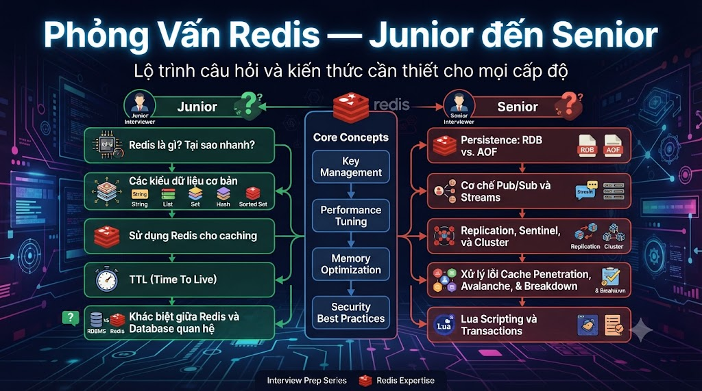

# Bộ Câu Hỏi Phỏng Vấn Redis — Junior đến Senior



* * *

## 🟢 JUNIOR (0–2 năm)

Mục tiêu: Kiểm tra hiểu biết cơ bản về Redis, các kiểu dữ liệu và use cases đơn giản.

* * *

### Khái Niệm Cơ Bản

**Q1. Redis là gì? Tại sao cần Redis khi đã có PostgreSQL?**

Đáp án mong đợi:

*   Redis = Remote Dictionary Server — **in-memory data store**, lưu dữ liệu trong RAM
    
*   PostgreSQL lưu trên disk → ~1-50ms per query
    
*   Redis lưu trong RAM → ~0.1-1ms (100-1000x nhanh hơn)
    
*   Redis không thay thế PostgreSQL — bổ sung cho nhau:
    
    *   PostgreSQL: source of truth, structured data, ACID
        
    *   Redis: speed layer, cache, sessions, ephemeral data
        
*   Ứng dụng phổ biến: cache, session store, rate limiting, pub/sub, leaderboard
    

🚩 Red flag: Nói "Redis thay thế được database" — sai hoàn toàn

  
**Q2. Kể tên 5 kiểu dữ liệu chính trong Redis và cho biết mỗi loại dùng khi nào.**

Đáp án mong đợi:


| Kiểu | Dùng khi |
|---|---|
| String | Cache, counter (INCR), session, lock |
| Hash | Object/document, user profile |
| List | Queue, activity feed, recent history |
| Set | Unique tracking, tags, block list |
| Sorted Set | Leaderboard, ranking, delayed queue |


✅ Điểm cộng: Đề cập thêm HyperLogLog, Geo, Streams

  
**Q3. TTL trong Redis là gì? Làm sao đặt và kiểm tra TTL của một key?**

Đáp án mong đợi:

```bash
# Đặt TTL khi set
SET session:user_1 "data" EX 3600      # expire sau 3600 giây
SETEX session:user_1 3600 "data"       # tương đương

# Đặt TTL cho key đã có
EXPIRE session:user_1 3600
EXPIREAT session:user_1 1710000000    # unix timestamp

# Kiểm tra TTL còn lại
TTL session:user_1    # giây còn lại, -1 = không có TTL, -2 = không tồn tại
PTTL session:user_1   # milliseconds

# Xóa TTL
PERSIST session:user_1
```

Tại sao quan trọng: Redis là in-memory → RAM có giới hạn → PHẢI set TTL cho mọi cache key tránh memory leak

  
**Q4. Sự khác biệt giữa SET và SETEX và SET ... EX là gì?**

Đáp án mong đợi:

```bash
SET key value           # không có TTL
SETEX key 3600 value    # set + expire trong 1 command (atomic) — cú pháp cũ
SET key value EX 3600   # cú pháp mới (Redis 2.6.12+), tương đương SETEX
SET key value EX 3600 NX  # set chỉ khi chưa tồn tại + có TTL — atomic
SET key value EX 3600 XX  # set chỉ khi đã tồn tại + có TTL
```

✅ Điểm cộng: Biết `NX` (Not eXist) dùng cho distributed lock

  
**Q5. INCR và INCRBY khác nhau thế nào? Tại sao INCR là atomic?**

Đáp án mong đợi:

```bash
INCR counter        # tăng 1, trả về giá trị mới
INCRBY counter 5    # tăng 5
DECR counter        # giảm 1
DECRBY counter 3    # giảm 3
INCRBYFLOAT f 1.5   # tăng float
```

**Atomic:** Redis single-threaded — mỗi command hoàn thành trước khi command tiếp theo bắt đầu. Không có race condition khi nhiều clients cùng INCR một key.

Use case: page views, API rate limit counter, ticket counter

  
**Q6. Giải thích sự khác biệt giữa KEYS và SCAN. Tại sao không dùng KEYS trong production?**

Đáp án mong đợi:

*   **KEYS pattern**: trả về tất cả keys khớp pattern — **block toàn bộ Redis** cho đến khi xong
    
    *   1M keys → block ~1 giây → tất cả requests khác bị chờ
        
    *   Chỉ dùng ở development, KHÔNG bao giờ ở production
        
*   **SCAN cursor**: iterate dần dần, không block
    
    ```bash
    SCAN 0 MATCH "cache:*" COUNT 100
    # → cursor tiếp theo + list keys
    # Gọi tiếp với cursor mới cho đến khi cursor = 0
    ```
    

🚩 Red flag: Không biết SCAN, không biết KEYS blocking

  
**Q7. Hash trong Redis dùng khi nào? Tại sao tốt hơn lưu JSON string?**

Đáp án mong đợi:

```bash
# String JSON — phải GET toàn bộ, parse, update, SET lại
SET user:1 '{"email":"nam@gmail.com","score":100,"level":"A"}'
# Muốn cộng 10 điểm → GET → parse → update → SET

# Hash — update field riêng lẻ, atomic
HSET user:1 email "nam@gmail.com" score 100 level "A"
HINCRBY user:1 score 10    # atomic, không cần GET trước
HGET user:1 email          # lấy 1 field, không cần parse toàn bộ
```

Dùng Hash khi: object có nhiều fields, thường update riêng lẻ Dùng String JSON khi: object nhỏ, luôn đọc/ghi toàn bộ, cần nested structure  
  
**Q8. Giải thích cách dùng Sorted Set cho leaderboard. Viết commands cơ bản.**

Đáp án mong đợi:

```bash
# Thêm/update score
ZADD leaderboard 250 "user:1"
ZADD leaderboard 300 "user:2"
ZADD leaderboard 180 "user:3"

# Top 3 (score cao nhất)
ZREVRANGE leaderboard 0 2 WITHSCORES
# → [user:2, 300, user:1, 250, user:3, 180]

# Rank của user:1 (0-based, từ cao xuống thấp)
ZREVRANK leaderboard "user:1"    # → 1 (hạng 2)

# Cộng thêm điểm
ZINCRBY leaderboard 50 "user:1"  # user:1 từ 250 → 300

# Xem số lượng members
ZCARD leaderboard
```

### Coding Question Junior

  
**Q9. Viết đoạn code Python implement cache-aside pattern với Redis.**

Đáp án mong đợi:

```python
import redis
import json

r = redis.Redis(host="localhost", port=6379, decode_responses=True)

def get_course(course_id: int, db) -> dict:
    cache_key = f"cache:course:{course_id}"

    # 1. Check cache
    cached = r.get(cache_key)
    if cached:
        return json.loads(cached)   # Cache HIT

    # 2. Cache MISS → query DB
    course = db.query_one("SELECT * FROM courses WHERE id = %s", (course_id,))
    if course:
        r.setex(cache_key, 300, json.dumps(course))  # cache 5 phút

    return course
```

Điểm đánh giá: biết TTL, biết json serialization, biết handle cache miss

* * *

## 🟡 INTERMEDIATE (2–4 năm)

Mục tiêu: Cache patterns, Rate Limiting, Pub/Sub, Persistence, hiểu sâu về Redis internals.

* * *

  
**Q10. Giải thích 3 cache patterns: Cache-aside, Write-through, Write-behind. Khi nào dùng cái nào?**

Đáp án mong đợi:

**Cache-aside (Lazy Loading):**

*   Application check cache → miss → query DB → store in cache
    
*   Dùng khi: read-heavy, can tolerate stale data
    
*   Vấn đề: cache stampede khi nhiều requests cùng miss
    

**Write-through:**

*   Ghi vào cache VÀ DB đồng thời
    
*   Dùng khi: cần strong consistency giữa cache và DB
    
*   Vấn đề: mọi write đều phải qua cache → overhead cho data ít được đọc
    

**Write-behind (Write-back):**

*   Ghi vào cache trước, flush xuống DB sau (async)
    
*   Dùng khi: write-heavy, DB write là bottleneck
    
*   Vấn đề: data loss nếu Redis crash trước khi flush
    
*   Chỉ dùng cho non-critical data (view counts, logs)
    

  
**Q11. Cache Stampede là gì? Giải thích 3 cách giải quyết.**

Đáp án mong đợi:

*   Cache Stampede: cache key expire → nhiều requests đồng thời miss → tất cả cùng query DB → DB overload
    

**Giải pháp 1: Mutex/Lock**

```python
# Chỉ 1 request rebuild cache, các request khác chờ
lock_acquired = r.set(f"lock:{key}", "1", nx=True, ex=10)
if lock_acquired:
    data = db.query(...)
    r.setex(key, ttl, json.dumps(data))
    r.delete(f"lock:{key}")
else:
    time.sleep(0.1)
    data = r.get(key)  # try again
```

**Giải pháp 2: TTL Jitter**

```python
import random
base_ttl = 300
jitter   = random.randint(-30, 30)
r.setex(key, base_ttl + jitter, data)
# Keys không expire cùng lúc → giảm stampede
```

**Giải pháp 3: XFetch (Probabilistic Early Expiration)**

*   Refresh cache trước khi expire theo xác suất tăng dần khi gần hết TTL
    
*   Chỉ 1 request refresh, không cần lock
    

  
**Q12. Implement Token Bucket Rate Limiter với Redis. Tại sao cần Lua script?**

Đáp án mong đợi:

```python
# Lua script để đảm bảo atomic — KHÔNG thể split thành nhiều commands
lua_script = r.register_script("""
    local key         = KEYS[1]
    local capacity    = tonumber(ARGV[1])
    local refill_rate = tonumber(ARGV[2])
    local now         = tonumber(ARGV[3])

    local bucket = redis.call('HMGET', key, 'tokens', 'last_refill')
    local tokens     = tonumber(bucket[1]) or capacity
    local last_refill = tonumber(bucket[2]) or now

    -- Refill tokens
    local elapsed = math.max(0, now - last_refill)
    tokens = math.min(capacity, tokens + elapsed * refill_rate)

    local allowed = 0
    if tokens >= 1 then
        tokens  = tokens - 1
        allowed = 1
    end

    redis.call('HMSET', key, 'tokens', tokens, 'last_refill', now)
    redis.call('EXPIRE', key, math.ceil(capacity / refill_rate) + 1)

    return allowed
""")
```

**Tại sao Lua:** Lua script chạy atomic trên Redis server — không có race condition giữa check và update tokens. Nếu dùng nhiều commands riêng lẻ, 2 clients có thể cùng thấy tokens > 0 và cùng được phép.

  
**Q13. Giải thích RDB và AOF persistence. Khi nào dùng mỗi loại? Trade-offs là gì?**

Đáp án mong đợi:

**RDB (Redis Database Backup):**

*   Snapshot toàn bộ data xuống disk định kỳ
    
*   File nhỏ, restore nhanh
    
*   Mất data từ lần snapshot cuối đến khi crash (tối đa vài phút)
    
*   Tốt cho: backup, không quan trọng mất vài phút data
    

**AOF (Append Only File):**

*   Ghi log từng write command
    
*   File lớn hơn, restore chậm hơn
    
*   Với `appendfsync everysec`: mất tối đa 1 giây data
    
*   Tốt cho: không muốn mất nhiều data
    

**Hybrid (khuyến nghị production):**

```bash
# redis.conf
save 3600 1          # RDB
appendonly yes       # AOF
appendfsync everysec # flush mỗi giây
aof-use-rdb-preamble yes  # hybrid format
```

🚩 Red flag: Không biết Redis có thể mất data khi restart nếu không config persistence

  
**Q14. Giải thích eviction policies trong Redis. Khi nào dùng** `allkeys-lru` **vs** `volatile-lru`**?**

Đáp án mong đợi:

*   Khi Redis đầy memory → cần evict keys theo policy
    

```bash
# allkeys-lru:    xóa key ít dùng nhất trong TẤT CẢ keys
# volatile-lru:   xóa key ít dùng nhất có TTL
# allkeys-lfu:    xóa key ít dùng nhất theo frequency
# volatile-ttl:   xóa key có TTL nhỏ nhất trước
# noeviction:     trả về error (default) — không xóa gì
```

`allkeys-lru`: Dùng cho **pure cache** — tất cả keys đều có thể bị xóa `volatile-lru`: Dùng khi có cả **persistent data** và **cache data** — chỉ xóa cache keys có TTL, giữ nguyên session/lock không có TTL

  
**Q15. Pub/Sub trong Redis là gì? Khác gì Redis Streams?**

Đáp án mong đợi:

**Pub/Sub:**

```bash
SUBSCRIBE notifications:user:1    # subscriber
PUBLISH notifications:user:1 "message"  # publisher
```

*   Fire and forget — message không được lưu
    
*   Subscriber offline → mất message
    
*   Dùng cho: real-time notifications, live updates, không cần reliable delivery
    

**Redis Streams:**

```bash
XADD events * type "ORDER_PAID" orderId "001"  # publish
XREADGROUP GROUP workers consumer1 STREAMS events >  # consume
XACK events workers message_id  # acknowledge
```

*   Messages được lưu vĩnh viễn (có thể trim)
    
*   Consumer groups đảm bảo exactly-once processing
    
*   Subscriber offline → messages vẫn chờ trong stream
    
*   Dùng cho: event sourcing, job queue, audit log, cần reliable delivery
    

### Coding Question Intermediate

  
**Q16. Implement distributed lock với Redis. Xử lý edge cases như process crash khi đang giữ lock.**

Đáp án mong đợi:

```python
import secrets
import time

class RedisDistributedLock:
    def __init__(self, redis_client):
        self.r = redis_client

    def acquire(self, resource: str, ttl: int = 30) -> str | None:
        lock_key   = f"lock:{resource}"
        lock_value = secrets.token_hex(16)  # unique per acquire

        # SET NX EX: atomic, chỉ set nếu chưa tồn tại
        acquired = self.r.set(lock_key, lock_value, nx=True, ex=ttl)
        return lock_value if acquired else None

    def release(self, resource: str, lock_value: str) -> bool:
        # Lua: check owner + delete ATOMIC
        lua = """
            if redis.call("get", KEYS[1]) == ARGV[1] then
                return redis.call("del", KEYS[1])
            else
                return 0
            end
        """
        result = self.r.eval(lua, 1, f"lock:{resource}", lock_value)
        return result == 1
        # Nếu process crash → TTL tự hết → lock tự release (không deadlock)
        # Không dùng DEL trực tiếp → có thể xóa lock của người khác!
```

Điểm quan trọng:

*   Dùng unique `lock_value` để verify ownership
    
*   TTL tránh deadlock khi process crash
    
*   Lua script để release atomic (không check rồi delete riêng lẻ)
    

* * *

## 🟠 ADVANCED (4–7 năm)

Mục tiêu: Redis internals, Cluster, high availability, performance tuning, complex patterns.

* * *

  
**Q17. Giải thích Redis Memory Model. Tại sao OBJECT ENCODING quan trọng?**

Đáp án mong đợi:

*   Redis tự chọn encoding tối ưu cho mỗi data type dựa trên size
    

```bash
HSET small_hash f1 v1 f2 v2
OBJECT ENCODING small_hash
# → ziplist (compact, ít memory)

# Khi hash lớn hơn threshold:
OBJECT ENCODING large_hash
# → hashtable (nhanh hơn, tốn memory hơn)
```

**Thresholds quan trọng (có thể config):**

*   Hash: ziplist nếu ≤ 128 fields và mỗi value ≤ 64 bytes
    
*   List: listpack/quicklist thay vì linkedlist
    
*   Set: intset nếu toàn số nguyên ≤ 512 members
    

**Tại sao quan trọng:**

*   ziplist tiết kiệm memory nhưng O(n) lookup
    
*   hashtable nhanh O(1) nhưng tốn memory hơn
    
*   Thiết kế key structure ảnh hưởng trực tiếp đến memory usage
    

  
**Q18. Redis Cluster hoạt động như thế nào? Giải thích hash slots, resharding và handling node failure.**

Đáp án mong đợi:

**Hash Slots:**

*   Redis Cluster chia keyspace thành 16,384 hash slots
    
*   `hash_slot = CRC16(key) % 16384`
    
*   Mỗi node quản lý một range của slots
    
*   3-node cluster: Node1 (0-5460), Node2 (5461-10922), Node3 (10923-16383)
    

**Resharding:**

*   Thêm node → di chuyển slots từ existing nodes sang new node
    
*   Di chuyển trong background, không downtime
    
*   `redis-cli --cluster reshard host:port`
    

**Node Failure:**

*   Mỗi master có ít nhất 1 replica
    
*   Replica monitor master qua heartbeat
    
*   Master down → replicas vote → promote replica thành master
    
*   Cần quorum: majority of masters phải agree
    

**Limitations:**

*   Multi-key operations phải trên cùng slot → dùng hash tags: `{user:1}:profile`, `{user:1}:cart`
    
*   Transactions (MULTI/EXEC) chỉ trong 1 slot
    

  
**Q19. Giải thích Redis Sentinel vs Redis Cluster. Khi nào dùng cái nào?**

Đáp án mong đợi:

**Redis Sentinel:**

*   High Availability cho single Redis instance
    
*   Monitor master, auto-failover khi master down
    
*   Không scale data — chỉ 1 master nhận writes
    
*   Phù hợp: cần HA nhưng dataset vừa phải fit trong 1 node
    

**Redis Cluster:**

*   Horizontal scaling — data sharded across nodes
    
*   Mỗi node giữ subset của data
    
*   Built-in replication và failover
    
*   Phù hợp: dataset lớn hơn RAM của 1 node, cần horizontal write scaling
    

```java
Dataset < RAM of 1 server:  Sentinel (đơn giản hơn)
Dataset > RAM of 1 server:  Cluster (complex hơn)
Need horizontal write scale: Cluster
```

  
**Q20. \[System Design\] Thiết kế hệ thống Rate Limiting cho API Gateway của** [**nguyentienkhoi.hashnode.dev**](http://nguyentienkhoi.hashnode.dev)**. Yêu cầu: 1000 users, mỗi user giới hạn 100 requests/phút cho checkout API.**

Đáp án mong đợi đầy đủ:

*   Chọn algorithm: Token Bucket — cho phép burst ngắn, smooth rate overall
    
*   Key design:
    

```java
rate_limit:checkout:{user_id}:{minute_window}
```

**Implementation:**

```python
def check_rate_limit(user_id: str, limit: int = 100,
                     window: int = 60) -> dict:
    import time
    window_key = int(time.time() // window)
    key        = f"rate_limit:checkout:{user_id}:{window_key}"

    pipe = r.pipeline()
    pipe.incr(key)
    pipe.expire(key, window)
    count, _ = pipe.execute()

    return {
        "allowed":    count <= limit,
        "count":      count,
        "remaining":  max(0, limit - count),
        "reset_in":   window - (int(time.time()) % window)
    }
```

**Scale considerations:**

*   Redis single-threaded → INCR là atomic → no race condition
    
*   Pipeline INCR + EXPIRE atomic (hoặc dùng Lua)
    
*   1000 users × 100 req/min = 100K keys → nhỏ, Redis xử lý dễ
    
*   Response headers: `X-RateLimit-Remaining`, `X-RateLimit-Reset`
    
*   Return 429 Too Many Requests khi vượt limit
    

✅ Senior indicator: Đề cập sliding window log cho precision cao hơn, shared nothing architecture

  
**Q21. Giải thích Redis single-threaded model. Tại sao performance vẫn cao? Redis 6.0 thay đổi gì?**

Đáp án mong đợi:

*   Redis **command processing** là single-threaded → không có lock contention, tất cả commands atomic
    
*   Performance cao vì:
    
    *   In-memory → không I/O wait
        
    *   Efficient data structures
        
    *   Non-blocking I/O (epoll/kqueue) cho network
        
    *   Pipelining: gom nhiều commands → 1 network round trip
        

**Redis 6.0+ I/O multithreading:**

*   Network I/O được multi-threaded (đọc/ghi socket)
    
*   Command processing vẫn single-threaded
    
*   Tăng throughput khi bottleneck là network, không phải compute
    

  
**Q22. Bạn phát hiện Redis memory tăng liên tục và không giảm dù data không tăng. Debug và fix như thế nào?**

Đáp án mong đợi — quy trình đầy đủ:

**Bước 1: Kiểm tra memory**

```bash
redis-cli INFO memory
# used_memory:           100MB
# mem_fragmentation_ratio: 2.5  ← > 1.5 = fragmentation vấn đề
```

**Bước 2: Tìm nguyên nhân**

```bash
# Tìm keys lớn nhất
redis-cli --bigkeys

# Kiểm tra expired keys chưa được cleanup
redis-cli INFO keyspace
# keys=10000, expires=5000, avg_ttl=300000
# Nếu expires << keys → nhiều keys không có TTL!

# Memory breakdown
redis-cli MEMORY DOCTOR
```

**Bước 3: Fix**

```bash
# High fragmentation → bật defragmentation
redis-cli CONFIG SET activedefrag yes
redis-cli CONFIG SET active-defrag-threshold-lower 10

# Keys không có TTL → review code, thêm TTL
SCAN 0 COUNT 100  # tìm keys không có TTL

# Memory leak patterns:
# - LPUSH vào list nhưng không LTRIM → list tăng vô hạn
# - SADD vào set nhưng không cleanup stale members
# - Cache keys không có TTL
```

* * *

## 🔴 SENIOR / PRINCIPAL (7+ năm)

* * *

  
**Q23. \[Trade-off\] Team đề xuất dùng Redis như primary database thay vì cache, vì "Redis nhanh hơn PostgreSQL". Bạn review thế nào?**

Câu hỏi open-ended — đánh giá tư duy:

*   Điểm cần cover:
    
*   Tình huống Redis làm primary DB chấp nhận được:
    

*   Data thực sự ephemeral (sessions, rate limit counters, leaderboard)
    
*   Cần sub-millisecond latency và không thể tolerate bất kỳ delay nào
    
*   Dataset hoàn toàn fit trong RAM mãi mãi
    

**Tại sao KHÔNG nên làm primary DB cho business-critical data:**

*   **Durability:** AOF mất tối đa 1 giây data khi crash. RDB mất nhiều hơn. PostgreSQL với WAL mất gần 0.
    
*   **RAM cost:** RAM đắt hơn disk ~10-50x. 1TB data trong Redis = rất đắt.
    
*   **Query complexity:** Redis không có JOIN, GROUP BY, complex filtering
    
*   **Schema enforcement:** Không có type safety, foreign key constraints
    
*   **Tooling ecosystem:** Ít tools cho reporting, analytics, migration
    

**Kết luận:** Dùng Redis + PostgreSQL — mỗi cái làm đúng việc của mình. Đây không phải "Redis vs PostgreSQL" mà là "Redis AND PostgreSQL".

  
**Q24. Thiết kế một hệ thống notification real-time cho** [**nguyentienkhoi.hashnode.dev**](http://nguyentienkhoi.hashnode.dev)**: 100k users, mỗi user nhận thông báo khi order được thanh toán. Không được mất notification khi user offline.**

Đáp án mong đợi:

**Architecture:**

```java
Order Service
    ↓ XADD events
Redis Streams (events:foxdev)
    ↓ XREADGROUP
Notification Worker (consumer group)
    ↓ PUBLISH (nếu user online)
WebSocket Server → Client
    ↓ Nếu user offline
Notification Store (Redis List per user)
    ↓ Sync khi user reconnect
```

**Chi tiết:**

```python
# Publisher (Order Service)
r.xadd("events:foxdev", {
    "type":    "ORDER_PAID",
    "userId":  "1",
    "orderId": "001",
    "amount":  "799000"
})

# Consumer Worker
while True:
    msgs = r.xreadgroup("GROUP", "notification-workers",
                         "worker-1", streams={"events:foxdev": ">"})
    for msg_id, fields in msgs:
        user_id  = fields["userId"]
        is_online = r.sismember("online:users", user_id)

        if is_online:
            # Real-time via Pub/Sub
            r.publish(f"notifications:user:{user_id}", json.dumps(fields))
        else:
            # Store for later delivery (capped at 100)
            r.lpush(f"pending:notifications:{user_id}", json.dumps(fields))
            r.ltrim(f"pending:notifications:{user_id}", 0, 99)
            r.expire(f"pending:notifications:{user_id}", 30 * 86400)

        r.xack("events:foxdev", "notification-workers", msg_id)

# WebSocket handler (khi user connect)
def on_user_connect(user_id: str):
    r.sadd("online:users", user_id)
    # Flush pending notifications
    pending = r.lrange(f"pending:notifications:{user_id}", 0, -1)
    for notif in pending:
        websocket.send(notif)
    r.delete(f"pending:notifications:{user_id}")
```

✅ Senior indicator: Streams cho reliable delivery, Pub/Sub cho real-time, tách biệt 2 cases (online/offline), handle backpressure

  
**Q25. Redis Cluster với 3 masters bị "split-brain" khi network partition. Điều gì xảy ra? Làm thế nào Redis xử lý?**

Đáp án mong đợi:

*   **Split-brain**: Network partition chia cluster thành 2 halves — cả 2 nửa đều nghĩ mình là "chính"
    
*   Redis Cluster dùng **majority quorum**: mỗi master cần đồng ý từ majority of masters để nhận writes
    
*   Với 3 masters: cần ít nhất 2 masters agree
    

**Scenario:**

```java
3 nodes: A, B, C
Network partition: {A} vs {B, C}

Side A (minority):
  → Chỉ còn 1/3 masters → không có quorum
  → Từ chối writes → return CLUSTERDOWN error
  → Tránh split-brain!

Side B+C (majority):
  → Còn 2/3 masters → có quorum
  → Tiếp tục nhận writes
```

**Configuration quan trọng:**

```bash
cluster-require-full-coverage no
# no: cluster tiếp tục serve queries dù có slots không available
# yes: cluster từ chối tất cả queries nếu bất kỳ slot nào không available
```

##   
Bảng Điểm Đánh Giá


| Level | Câu hỏi | Pass khi |
|---|---|---|
| Junior | Q1–Q9 | Pass 7/9, bắt buộc Q2 (data types) và Q6 (SCAN vs KEYS) |
| Intermediate | Q10–Q16 | Pass 5/7, bắt buộc Q11 (stampede) và Q13 (persistence) |
| Advanced | Q17–Q22 | Pass 4/6, bắt buộc Q18 hoặc Q19 (Cluster/Sentinel) và Q20 (system design) |
| Senior | Q23–Q25 | Pass 2/3, đặc biệt Q23 (trade-off thinking) |


##   
Câu Hỏi Bẫy Hay Dùng

**Bẫy 1:** "Redis là in-memory nên restart là mất hết data?" → Không hoàn toàn. Với AOF + RDB persistence, Redis có thể khôi phục data sau restart. Mất ít data (< 1 giây với `appendfsync everysec`) — không phải mất tất cả.

**Bẫy 2:** "MULTI/EXEC trong Redis là ACID transaction?" → Không. Redis transaction không có isolation (không rollback khi 1 command fail giữa chừng). Chỉ đảm bảo atomicity theo nghĩa "các commands chạy liên tiếp không bị chen ngang". Dùng Lua script nếu cần real atomicity.

**Bẫy 3:** "Redis Cluster tự động handle mọi thứ khi add node?" → Không hoàn toàn. Slots vẫn phải được rebalanced thủ công (redis-cli --cluster rebalance) hoặc qua script.

**Bẫy 4:** "SET key value NX là distributed lock an toàn?" → Chỉ với single Redis node. Với Redis Cluster hoặc multi-node, cần Redlock algorithm (dùng Redisson trong Java, hoặc `redlock-py`).

**Bẫy 5:** "Pipeline và Transaction giống nhau?" → Khác hoàn toàn. Pipeline = batch commands để giảm round trips, không atomic. Transaction (MULTI/EXEC) = atomic execution, nhưng không rollback khi có lỗi.

**Bẫy 6:** "Pub/Sub đảm bảo message delivery?" → Không. Subscriber offline → message mất. Cần Redis Streams để đảm bảo delivery.

