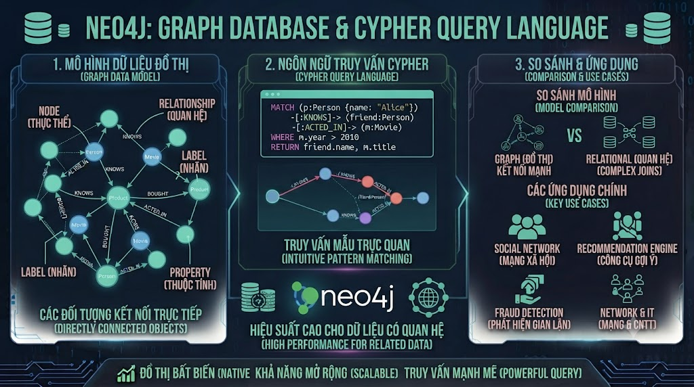

# Neo4j: Graph Database & Cypher Query Language



Bạn đã học Document DB (MongoDB), Key-Value (Redis), Column-family (Cassandra). Loại cuối cùng — **Graph Database** — giải quyết bài toán mà cả 3 loại trên đều làm kém: **quan hệ phức tạp nhiều chiều**. Khi cần trả lời "Học viên nào có profile tương tự tôi?", "Để học Microservices tôi cần biết gì trước?", "Khóa học nào được recommend bởi người học giỏi nhất?" — Graph Database với Neo4j là công cụ phù hợp nhất.

## 1\. Tại Sao Cần Graph Database?

```java
Bài toán: "Tìm học viên có cùng learning path với user X"

PostgreSQL (3-level JOIN):
SELECT DISTINCT u2.name
FROM users u1
JOIN enrollments e1 ON e1.user_id = u1.id
JOIN enrollments e2 ON e2.course_id = e1.course_id AND e2.user_id != u1.id
JOIN users u2 ON u2.id = e2.user_id
WHERE u1.id = 1;
-- Chậm dần khi data lớn, khó mở rộng thêm level

Graph Database (1 query tự nhiên):
MATCH (u1:User {id: 1})-[:ENROLLED]->(c:Course)<-[:ENROLLED]-(u2:User)
WHERE u2 <> u1
RETURN DISTINCT u2.name;
-- Tự nhiên, nhanh, dễ mở rộng thêm conditions
```

**Khi Graph Database tỏa sáng:**

*   **Recommendation**: "Học viên giống bạn cũng học..."
    
*   **Learning Path**: "Để học X, bạn cần biết A → B → C"
    
*   **Knowledge Graph**: map quan hệ giữa skills, courses, topics
    
*   **Fraud Detection**: phát hiện pattern bất thường qua relationships
    
*   **Social Network**: bạn bè, followers, kết nối
    

## 2\. Graph Concepts — Nodes, Relationships, Properties

```java
Graph = Nodes + Relationships + Properties

Nodes (vertices):
  (:User)     ← Label
  (:Course)
  (:Skill)
  (:Topic)

Relationships (edges):
  -[:ENROLLED]->    ← Type + Direction
  -[:KNOWS]->
  -[:REQUIRES]->
  -[:TEACHES]->

Properties (attributes):
  (:User {id: 1, name: "Nam", email: "nam@gmail.com"})
  -[:ENROLLED {enrolled_at: "2025-01-15", progress: 0.75}]->
```

## 3\. Cài Đặt Neo4j

### Docker (Khuyến Nghị)

```bash
docker run -d \
  --name neo4j \
  -p 7474:7474 \
  -p 7687:7687 \
  -e NEO4J_AUTH=neo4j/password123 \
  -e NEO4J_PLUGINS='["apoc"]' \
  -v neo4j_data:/data \
  -v neo4j_logs:/logs \
  neo4j:5.15-community

# Neo4j Browser: http://localhost:7474
# Bolt (driver): bolt://localhost:7687
# Login: neo4j / password123
```

### Docker Compose

```yaml
version: '3.8'

services:
  neo4j:
    image: neo4j:5.15-community
    container_name: neo4j
    ports:
      - "7474:7474"   # HTTP (Browser)
      - "7687:7687"   # Bolt (driver)
    environment:
      NEO4J_AUTH:                    neo4j/password123
      NEO4J_PLUGINS:                 '["apoc"]'
      NEO4J_dbms_memory_heap_max__size: 1G
      NEO4J_dbms_memory_pagecache_size: 512M
    volumes:
      - neo4j_data:/data
      - neo4j_logs:/logs
    restart: unless-stopped

volumes:
  neo4j_data:
  neo4j_logs:
```

```bash
docker-compose up -d neo4j
# Mở Browser: http://localhost:7474
```

## 4\. Cypher — Ngôn Ngữ Truy Vấn Graph

Cypher dùng **ASCII art** để mô tả graph patterns:

```java
Nodes:    (n)            (n:Label)       (n:Label {prop: value})
Rels:     -[r]->         -[r:TYPE]->     -[r:TYPE {prop: value}]-
Paths:    (a)-[r]->(b)   (a)-->(b)-->(c)
```

## 5\. Tạo Dữ Liệu — CREATE & MERGE

```cypher
// ─── Tạo Nodes ───

// CREATE: tạo mới (có thể tạo duplicate)
CREATE (u:User {
    id:         1,
    name:       "Nam Nguyen",
    email:      "nam@gmail.com",
    level:      "intermediate",
    joined_at:  date("2024-01-15")
})

// MERGE: tạo nếu chưa tồn tại (upsert)
MERGE (u:User {id: 1})
ON CREATE SET u.name = "Nam Nguyen", u.email = "nam@gmail.com"
ON MATCH  SET u.last_seen = datetime()

// Tạo nhiều nodes
CREATE
  (:User {id: 2, name: "Linh Tran",  email: "linh@gmail.com",  level: "beginner"}),
  (:User {id: 3, name: "Minh Le",    email: "minh@gmail.com",  level: "advanced"}),
  (:Course {id: 1, title: "Java Core nền tảng",         category: "java",     price: 0,       level: "beginner"}),
  (:Course {id: 2, title: "Spring Boot từ Zero đến Hero", category: "java",   price: 799000,  level: "intermediate"}),
  (:Course {id: 3, title: "Microservices với Spring Boot", category: "java",  price: 999000,  level: "advanced"}),
  (:Course {id: 4, title: "Docker & Kubernetes",          category: "devops", price: 899000,  level: "intermediate"}),
  (:Course {id: 5, title: "SQL cho Developer",            category: "database", price: 599000, level: "beginner"}),
  (:Skill {name: "Java",          category: "language"}),
  (:Skill {name: "Spring Boot",   category: "framework"}),
  (:Skill {name: "Microservices", category: "architecture"}),
  (:Skill {name: "Docker",        category: "devops"}),
  (:Skill {name: "Kubernetes",    category: "devops"}),
  (:Skill {name: "SQL",           category: "database"})

// ─── Tạo Relationships ───

// ENROLLED: user đã đăng ký khóa học
MATCH (u:User {id: 1}), (c:Course {id: 1})
MERGE (u)-[:ENROLLED {enrolled_at: date("2024-01-20"), progress: 1.0, completed: true}]->(c)

MATCH (u:User {id: 1}), (c:Course {id: 2})
MERGE (u)-[:ENROLLED {enrolled_at: date("2024-02-01"), progress: 0.75, completed: false}]->(c)

MATCH (u:User {id: 2}), (c:Course {id: 1})
MERGE (u)-[:ENROLLED {enrolled_at: date("2024-03-10"), progress: 0.5, completed: false}]->(c)

MATCH (u:User {id: 3}), (c:Course {id: 2})
MERGE (u)-[:ENROLLED {enrolled_at: date("2024-01-05"), progress: 1.0, completed: true}]->(c)

MATCH (u:User {id: 3}), (c:Course {id: 3})
MERGE (u)-[:ENROLLED {enrolled_at: date("2024-03-01"), progress: 0.3, completed: false}]->(c)

// KNOWS: user biết skill gì
MATCH (u:User {id: 1}), (s:Skill {name: "Java"})
MERGE (u)-[:KNOWS {level: "intermediate", since: date("2023-06-01")}]->(s)

MATCH (u:User {id: 3}), (s:Skill {name: "Java"})
MERGE (u)-[:KNOWS {level: "advanced"}]->(s)

MATCH (u:User {id: 3}), (s:Skill {name: "Spring Boot"})
MERGE (u)-[:KNOWS {level: "intermediate"}]->(s)

// TEACHES: course dạy skill gì
MATCH (c:Course {id: 1}), (s:Skill {name: "Java"})
MERGE (c)-[:TEACHES {proficiency: "beginner"}]->(s)

MATCH (c:Course {id: 2}), (s:Skill {name: "Spring Boot"})
MERGE (c)-[:TEACHES {proficiency: "intermediate"}]->(s)

MATCH (c:Course {id: 3}), (s:Skill {name: "Microservices"})
MERGE (c)-[:TEACHES {proficiency: "intermediate"}]->(s)

MATCH (c:Course {id: 4}), (s:Skill {name: "Docker"})
MERGE (c)-[:TEACHES {proficiency: "intermediate"}]->(s)

MATCH (c:Course {id: 4}), (s:Skill {name: "Kubernetes"})
MERGE (c)-[:TEACHES {proficiency: "beginner"}]->(s)

// REQUIRES: course cần biết skill gì trước
MATCH (c:Course {id: 2}), (s:Skill {name: "Java"})
MERGE (c)-[:REQUIRES]->(s)

MATCH (c:Course {id: 3}), (s:Skill {name: "Spring Boot"})
MERGE (c)-[:REQUIRES]->(s)

MATCH (c:Course {id: 3}), (s:Skill {name: "Docker"})
MERGE (c)-[:REQUIRES]->(s)

// SIMILAR_TO: courses tương tự (dựa trên tags/content)
MATCH (c1:Course {id: 2}), (c2:Course {id: 3})
MERGE (c1)-[:SIMILAR_TO {score: 0.85}]->(c2)

MATCH (c1:Course {id: 1}), (c2:Course {id: 2})
MERGE (c1)-[:PREREQUISITE_OF]->(c2)

MATCH (c1:Course {id: 2}), (c2:Course {id: 3})
MERGE (c1)-[:PREREQUISITE_OF]->(c2)
```

## 6\. Cypher Queries — Tìm Kiếm Trong Graph

### MATCH — Pattern Matching

```cypher
// Lấy tất cả users
MATCH (u:User)
RETURN u.name, u.email, u.level

// Lấy user theo id
MATCH (u:User {id: 1})
RETURN u

// Tìm courses user đã enroll
MATCH (u:User {id: 1})-[:ENROLLED]->(c:Course)
RETURN c.title, c.category, c.price

// Tìm courses user đã COMPLETE
MATCH (u:User {id: 1})-[e:ENROLLED]->(c:Course)
WHERE e.completed = true
RETURN c.title, e.enrolled_at

// Tìm skills user biết
MATCH (u:User {id: 1})-[k:KNOWS]->(s:Skill)
RETURN s.name, k.level
ORDER BY k.level DESC
```

### WHERE Clause

```cypher
// Filter properties
MATCH (c:Course)
WHERE c.price > 500000 AND c.price < 900000
RETURN c.title, c.price
ORDER BY c.price

// Filter trên relationships
MATCH (u:User)-[e:ENROLLED]->(c:Course)
WHERE e.progress >= 0.8
RETURN u.name, c.title, e.progress

// String operations
MATCH (c:Course)
WHERE c.title CONTAINS "Spring" OR c.title STARTS WITH "Docker"
RETURN c.title

// List operations
MATCH (u:User)
WHERE u.level IN ["beginner", "intermediate"]
RETURN u.name, u.level
```

### WITH — Pipeline Stages

```cypher
// Tương tự intermediate step
MATCH (u:User)-[:ENROLLED]->(c:Course)
WITH u, COUNT(c) AS course_count
WHERE course_count >= 2
RETURN u.name, course_count
ORDER BY course_count DESC
```

* * *

## 7\. Recommendation Queries

### 7.1 Collaborative Filtering — "Users Giống Bạn Cũng Học"

```cypher
// Tìm courses được recommend dựa trên similar users
MATCH (me:User {id: 1})-[:ENROLLED]->(c:Course)<-[:ENROLLED]-(similar:User)
WHERE similar <> me
WITH similar, COUNT(c) AS common_courses
ORDER BY common_courses DESC
LIMIT 5

// Tìm courses similar users đã học nhưng mình chưa học
MATCH (similar)-[:ENROLLED]->(recommended:Course)
WHERE NOT (me)-[:ENROLLED]->(recommended)

WITH recommended, COUNT(similar) AS recommender_count
RETURN recommended.title, recommended.category,
       recommended.price, recommender_count
ORDER BY recommender_count DESC
LIMIT 5
```

### 7.2 Content-based — "Tương Tự Khóa Đang Xem"

```cypher
// Tìm courses tương tự dựa trên skills dạy và required skills
MATCH (c:Course {id: 2})-[:TEACHES|REQUIRES]->(s:Skill)
      <-[:TEACHES|REQUIRES]-(similar:Course)
WHERE similar <> c
  AND similar.id <> c.id

WITH similar, COUNT(DISTINCT s) AS shared_skills
RETURN similar.title, similar.category,
       similar.price, shared_skills
ORDER BY shared_skills DESC
LIMIT 5
```

### 7.3 Learning Path — "Cần Học Gì Tiếp Theo?"

```cypher
// Lấy skills user hiện có
MATCH (me:User {id: 1})-[:KNOWS]->(known_skill:Skill)
WITH COLLECT(known_skill.name) AS my_skills

// Tìm courses requirements mà user chưa đủ điều kiện
MATCH (c:Course)-[:REQUIRES]->(req:Skill)
WHERE NOT req.name IN my_skills
  AND NOT (me)-[:ENROLLED]->(c)

RETURN c.title, COLLECT(req.name) AS missing_skills,
       c.price
ORDER BY SIZE(COLLECT(req.name)) ASC  // ít thiếu nhất lên đầu
LIMIT 5
```

### 7.4 Prerequisite Chain — "Lộ Trình Học"

```cypher
// Tìm tất cả prerequisites của Microservices course
// Variable-length path: *1..5 = 1 đến 5 hops
MATCH path = (start:Course)-[:PREREQUISITE_OF*1..5]->(target:Course {id: 3})
RETURN [node IN NODES(path) | node.title] AS learning_path,
       LENGTH(path) AS steps
ORDER BY steps ASC
```

## 8\. Aggregation & Analysis

```cypher
// Số enrollments theo category
MATCH (:User)-[:ENROLLED]->(c:Course)
RETURN c.category, COUNT(*) AS total_enrollments
ORDER BY total_enrollments DESC

// User học nhiều nhất (enrolled count)
MATCH (u:User)-[:ENROLLED]->(c:Course)
WITH u, COUNT(c) AS courses_count,
     SUM(CASE WHEN c.price > 0 THEN c.price ELSE 0 END) AS total_spent
WHERE courses_count >= 1
RETURN u.name, courses_count, total_spent
ORDER BY total_spent DESC
LIMIT 5

// Skills phổ biến nhất (được nhiều users biết)
MATCH (u:User)-[:KNOWS]->(s:Skill)
WITH s, COUNT(u) AS user_count
RETURN s.name, s.category, user_count
ORDER BY user_count DESC

// Courses chưa ai enroll
MATCH (c:Course)
WHERE NOT (:User)-[:ENROLLED]->(c)
RETURN c.title, c.price

// Average completion rate theo category
MATCH (u:User)-[e:ENROLLED]->(c:Course)
WITH c.category AS category, AVG(e.progress) AS avg_progress
RETURN category, ROUND(avg_progress * 100, 1) AS completion_pct
ORDER BY completion_pct DESC
```

## 9\. Update & Delete

```cypher
// ─── UPDATE ───

// Update node property
MATCH (u:User {id: 1})
SET u.level    = "advanced",
    u.updated_at = datetime()
RETURN u

// Update relationship property
MATCH (u:User {id: 1})-[e:ENROLLED]->(c:Course {id: 2})
SET e.progress  = 0.9,
    e.last_watched = datetime()
RETURN u.name, c.title, e.progress

// Add property
MATCH (c:Course {id: 1})
SET c.rating = 4.8
RETURN c

// Remove property
MATCH (c:Course {id: 1})
REMOVE c.old_field
RETURN c

// ─── DELETE ───

// Xóa relationship
MATCH (u:User {id: 2})-[e:ENROLLED]->(c:Course {id: 1})
DELETE e

// Xóa node (chỉ khi không có relationship)
MATCH (u:User {id: 99})
DELETE u

// DETACH DELETE — xóa node kèm tất cả relationships
MATCH (u:User {id: 99})
DETACH DELETE u

// Xóa nodes theo điều kiện
MATCH (u:User)
WHERE u.level = "test"
DETACH DELETE u
```

## 10\. Indexes Trong Neo4j

```cypher
// Range Index (default) — cho equality và range queries
CREATE INDEX user_id_index FOR (u:User) ON (u.id)
CREATE INDEX course_category FOR (c:Course) ON (c.category)

// Composite Index
CREATE INDEX user_name_email FOR (u:User) ON (u.name, u.email)

// Unique Constraint (đồng thời tạo index)
CREATE CONSTRAINT user_email_unique
FOR (u:User) REQUIRE u.email IS UNIQUE

CREATE CONSTRAINT course_id_unique
FOR (c:Course) REQUIRE c.id IS UNIQUE

// Full-text Index (cho CONTAINS, STARTS WITH)
CREATE FULLTEXT INDEX course_search
FOR (c:Course) ON EACH [c.title, c.description]

// Dùng full-text index
CALL db.index.fulltext.queryNodes("course_search", "spring boot")
YIELD node, score
RETURN node.title, score
ORDER BY score DESC

// Xem indexes
SHOW INDEXES

// Xóa index
DROP INDEX user_id_index
```

## 11\. Python Integration

```python
from neo4j import GraphDatabase
from typing import List, Dict, Optional, Any
import logging

logger = logging.getLogger(__name__)

class Neo4jRepository:

    def __init__(self, uri: str = "bolt://localhost:7687",
                 user: str = "neo4j",
                 password: str = "password123"):
        self.driver = GraphDatabase.driver(
            uri, auth=(user, password)
        )
        self._setup_constraints()

    def _setup_constraints(self):
        with self.driver.session() as session:
            session.run("""
                CREATE CONSTRAINT IF NOT EXISTS
                FOR (u:User) REQUIRE u.id IS UNIQUE
            """)
            session.run("""
                CREATE CONSTRAINT IF NOT EXISTS
                FOR (c:Course) REQUIRE c.id IS UNIQUE
            """)
            session.run("""
                CREATE CONSTRAINT IF NOT EXISTS
                FOR (s:Skill) REQUIRE s.name IS UNIQUE
            """)

    def upsert_user(self, user_id: int, name: str, email: str,
                     level: str = "beginner"):
        with self.driver.session() as session:
            session.run("""
                MERGE (u:User {id: $id})
                ON CREATE SET u.name  = $name,
                              u.email = $email,
                              u.level = $level,
                              u.created_at = datetime()
                ON MATCH  SET u.name  = $name,
                              u.level = $level
            """, id=user_id, name=name, email=email, level=level)

    def record_enrollment(self, user_id: int, course_id: int,
                           progress: float = 0.0):
        with self.driver.session() as session:
            session.run("""
                MATCH (u:User {id: $user_id})
                MATCH (c:Course {id: $course_id})
                MERGE (u)-[e:ENROLLED]->(c)
                ON CREATE SET e.enrolled_at = date(),
                              e.progress    = $progress,
                              e.completed   = false
                ON MATCH  SET e.progress    = $progress,
                              e.completed   = ($progress >= 1.0)
            """, user_id=user_id, course_id=course_id, progress=progress)

    def get_recommendations(self, user_id: int,
                             limit: int = 5) -> List[Dict]:
        """Collaborative filtering recommendations"""
        with self.driver.session() as session:
            result = session.run("""
                MATCH (me:User {id: $user_id})-[:ENROLLED]->
                      (c:Course)<-[:ENROLLED]-(similar:User)
                WHERE similar <> me

                WITH me, similar, COUNT(c) AS common
                ORDER BY common DESC
                LIMIT 10

                MATCH (similar)-[:ENROLLED]->(rec:Course)
                WHERE NOT (me)-[:ENROLLED]->(rec)

                WITH rec, COUNT(similar) AS recommenders
                RETURN rec.id        AS course_id,
                       rec.title     AS title,
                       rec.category  AS category,
                       rec.price     AS price,
                       recommenders
                ORDER BY recommenders DESC
                LIMIT $limit
            """, user_id=user_id, limit=limit)

            return [dict(record) for record in result]

    def get_learning_path(self, user_id: int,
                           target_course_id: int) -> Dict:
        """Tìm lộ trình học đến target course"""
        with self.driver.session() as session:
            # Skills user đã biết
            known = session.run("""
                MATCH (u:User {id: $uid})-[:KNOWS]->(s:Skill)
                RETURN COLLECT(s.name) AS skills
            """, uid=user_id).single()
            my_skills = known["skills"] if known else []

            # Courses cần học theo thứ tự
            result = session.run("""
                MATCH (target:Course {id: $cid})
                MATCH path = (prereq:Course)-[:PREREQUISITE_OF*0..5]->(target)
                WITH [n IN NODES(path) | n] AS courses, LENGTH(path) AS depth
                UNWIND courses AS c
                WITH DISTINCT c, depth
                WHERE c.id <> $cid  // exclude target itself

                MATCH (c)-[:REQUIRES]->(req:Skill)
                WHERE NOT req.name IN $my_skills

                RETURN DISTINCT c.id    AS course_id,
                       c.title          AS title,
                       c.price          AS price,
                       COLLECT(req.name) AS missing_skills
                ORDER BY depth ASC
            """, cid=target_course_id, my_skills=my_skills)

            return {
                "my_skills":      my_skills,
                "path_to_target": [dict(r) for r in result]
            }

    def get_similar_courses(self, course_id: int,
                             limit: int = 5) -> List[Dict]:
        """Content-based similar courses"""
        with self.driver.session() as session:
            result = session.run("""
                MATCH (c:Course {id: $cid})-[:TEACHES|REQUIRES]->(s:Skill)
                      <-[:TEACHES|REQUIRES]-(similar:Course)
                WHERE similar.id <> $cid

                WITH similar, COUNT(DISTINCT s) AS shared
                RETURN similar.id       AS course_id,
                       similar.title    AS title,
                       similar.category AS category,
                       similar.price    AS price,
                       shared
                ORDER BY shared DESC
                LIMIT $limit
            """, cid=course_id, limit=limit)

            return [dict(r) for r in result]

    def close(self):
        self.driver.close()


# ─── Sử dụng ───
repo = Neo4jRepository()

repo.upsert_user(1, "Nam Nguyen", "nam@gmail.com", "intermediate")
repo.record_enrollment(1, 1, progress=1.0)
repo.record_enrollment(1, 2, progress=0.75)

recs  = repo.get_recommendations(1)
for r in recs:
    print(f"Recommend: {r['title']} (by {r['recommenders']} similar users)")

path = repo.get_learning_path(user_id=1, target_course_id=3)
print(f"My skills: {path['my_skills']}")
for step in path["path_to_target"]:
    print(f"  → {step['title']} (missing: {step['missing_skills']})")

similar = repo.get_similar_courses(2)
for s in similar:
    print(f"Similar to Spring Boot: {s['title']} (shared skills: {s['shared']})")

repo.close()
```

## 12\. Khi Nào Dùng Neo4j?

```java
✅ Dùng Neo4j khi:
   Relationship IS the data — bản thân quan hệ có ý nghĩa
   Deep traversal — 3+ levels của relationships
   Pattern matching phức tạp — fraud detection
   Recommendation engine — collaborative filtering tự nhiên
   Knowledge graph — skill graph, ontology

❌ Không dùng Neo4j khi:
   Query chủ yếu là read/write 1 entity
   Cần high write throughput (Cassandra tốt hơn)
   Cần ACID transaction phức tạp (PostgreSQL tốt hơn)
   Team nhỏ chưa quen — learning curve cao
   Dataset nhỏ, ít relationships — PostgreSQL đủ
```

## Tổng Kết


| Khái niệm | Ý nghĩa |
|---|---|
| Node | Entity — (:User), (:Course), (:Skill) |
| Relationship | Kết nối — -[:ENROLLED]-> |
| Property | Attributes trên node/relationship |
| MATCH | Tìm patterns trong graph |
| CREATE / MERGE | Tạo / upsert nodes và relationships |
| WITH | Pipeline — lọc giữa các bước |
| DETACH DELETE | Xóa node kèm tất cả relationships |
| Variable-length path | -[:TYPE*1..5]-> |


```java
Graph thinking:
  SQL:  "Tôi có data gì và join như thế nào?"
  Neo4j: "Entities nào kết nối với nhau theo cách nào?"
```

Bài tiếp theo — bài cuối của series — **Decision Framework**: khi nào chọn NoSQL nào, polyglot persistence và tổng kết toàn bộ series.

