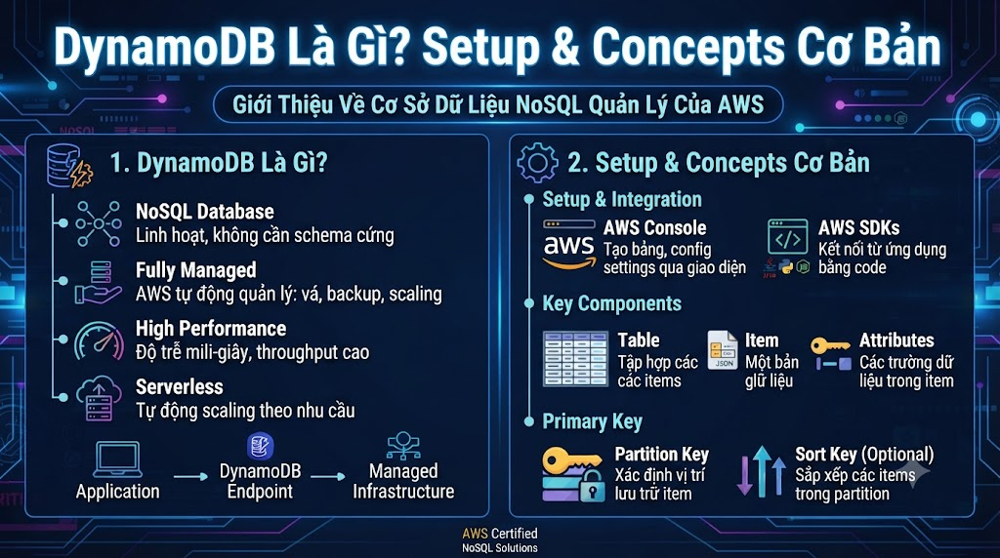

# DynamoDB Là Gì? Setup & Concepts Cơ Bản



Bạn đã học MongoDB, Redis, Cassandra, Neo4j — tất cả đều self-hosted. **Amazon DynamoDB** là bước tiếp theo: **fully managed NoSQL database** trên AWS — không cần cài đặt, không cần vận hành, scale tự động từ 1 request đến hàng triệu request/giây. Nếu bạn đang build trên AWS stack, DynamoDB gần như là mặc định cho mọi NoSQL use case.

## 1\. DynamoDB Là Gì?

**Amazon DynamoDB** là fully managed **Key-Value + Document database** trên AWS:

```java
Fully managed:
  → AWS lo toàn bộ: hardware, patching, replication, backup
  → Bạn chỉ cần design schema và viết code

Serverless:
  → Không có server để quản lý
  → On-demand mode: trả tiền theo request
  → Scale tự động: 0 → 1M requests/giây không cần cấu hình

Multi-region:
  → Global Tables: replicate tự động qua nhiều regions
  → Single-digit millisecond latency toàn cầu
```

**DynamoDB là cả Key-Value và Document:**

```java
Key-Value mode:   item = {PK: "user#1", SK: "profile"} → value blob
Document mode:    item = {id: 1, name: "Nam", address: {city: "HCM"}}
→ Thực ra là Key-Value nhưng value có thể là JSON document
```

## 2\. DynamoDB vs MongoDB vs Cassandra


| Tiêu chí | DynamoDB | MongoDB | Cassandra |
|---|---|---|---|
| Managed | ✅ Fully managed | ❌ Self-hosted (hoặc Atlas) | ❌ Self-hosted |
| Setup | 0 phút | 30 phút | 60+ phút |
| Scale | Tự động | Manual sharding | Manual node add |
| Pricing | Pay per request | Server cost | Server cost |
| Query flexibility | Hạn chế (key-based) | Cao | Trung bình |
| ACID Transaction | ✅ Cross-item (2021) | ✅ | ❌ |
| Max item size | 400KB | 16MB | Không giới hạn |
| Vendor lock-in | ❌ AWS only | ✅ Portable | ✅ Portable |
| Best for | AWS-native apps | Flexible content | Write-heavy |


**Chọn DynamoDB khi:**

*   Đang dùng AWS ecosystem (Lambda, ECS, API Gateway)
    
*   Không muốn quản lý infrastructure
    
*   Need auto-scaling không lo ops
    
*   Global multi-region cần thiết
    

## 3\. Core Concepts

### 3.1 Table, Item, Attribute

```java
Table   ← Tương tự Collection (MongoDB) hoặc Table (SQL)
Item    ← Tương tự Document (MongoDB) hoặc Row (SQL)
Attribute ← Tương tự Field (MongoDB) hoặc Column (SQL)

Mỗi Item tối đa 400KB
Không cần define schema trước (trừ Primary Key)
```

### 3.2 Primary Key — Quan Trọng Nhất

**Simple Primary Key (chỉ Partition Key):**

```java
PK: user_id = "user#1"
→ Mỗi item unique theo partition key
→ Như hashtable: get item bằng exact match
```

**Composite Primary Key (Partition Key + Sort Key):**

```java
PK: user_id = "user#1",  SK: "enrollment#course#1"
PK: user_id = "user#1",  SK: "enrollment#course#2"
PK: user_id = "user#1",  SK: "profile"
PK: user_id = "user#1",  SK: "order#2025-03-15#001"

→ Nhiều items cùng PK, khác SK → cùng "partition"
→ Có thể query range trên SK: begins_with, between, ><=
```

### 3.3 Attribute Types

```java
S    String        "Nam Nguyen", "course#1"
N    Number        42, 4.8, 799000
B    Binary        base64 encoded
BOOL Boolean       true, false
NULL Null          null
L    List          ["java", "spring", "backend"]
M    Map           {"city": "HCM", "district": "Q1"}
SS   String Set    {"java", "python", "go"}
NS   Number Set    {1, 2, 3}
BS   Binary Set
```

### 3.4 Capacity Units

```java
RCU (Read Capacity Unit):
  1 RCU = 1 strongly consistent read of 4KB/s
  1 RCU = 2 eventually consistent reads of 4KB/s

WCU (Write Capacity Unit):
  1 WCU = 1 write of 1KB/s

On-Demand Mode:
  → Trả tiền theo request, không cần estimate
  → $1.25 per million write request units
  → $0.25 per million read request units
  
Provisioned Mode:
  → Đặt trước RCU/WCU, rẻ hơn nếu traffic predictable
  → Auto Scaling có thể điều chỉnh tự động
```

## 4\. Cài Đặt DynamoDB Local

DynamoDB Local = phiên bản chạy trên máy để dev/test, không cần AWS account, không tốn tiền.

### Docker (Khuyến Nghị)

```bash
# Chạy DynamoDB Local
docker run -d \
  --name dynamodb-local \
  -p 8000:8000 \
  amazon/dynamodb-local:latest \
  -jar DynamoDBLocal.jar -sharedDb -inMemory

# -sharedDb: tất cả credentials dùng chung DB
# -inMemory: không lưu xuống disk (mất khi restart)
# Bỏ -inMemory để lưu data: thêm -v dynamodb_data:/home/dynamodblocal/data
```

### Docker Compose

```yaml
version: '3.8'

services:
  dynamodb-local:
    image: amazon/dynamodb-local:latest
    container_name: dynamodb-local
    ports:
      - "8000:8000"
    command: "-jar DynamoDBLocal.jar -sharedDb"
    volumes:
      - dynamodb_data:/home/dynamodblocal/data
    working_dir: /home/dynamodblocal

  # DynamoDB Admin UI (optional)
  dynamodb-admin:
    image: aaronshaf/dynamodb-admin:latest
    container_name: dynamodb-admin
    ports:
      - "8001:8001"
    environment:
      DYNAMO_ENDPOINT: http://dynamodb-local:8000
    depends_on:
      - dynamodb-local

volumes:
  dynamodb_data:
```

```bash
docker-compose up -d
# DynamoDB Local: http://localhost:8000
# Admin UI: http://localhost:8001
```

### AWS CLI Setup (cho Local)

```bash
# Cài AWS CLI
pip install awscli

# Config credentials (dùng fake values cho local)
aws configure
# AWS Access Key ID: fake
# AWS Secret Access Key: fake
# Default region: us-east-1
# Default output format: json

# Test kết nối với local
aws dynamodb list-tables --endpoint-url http://localhost:8000
# → { "TableNames": [] }
```

## 5\. Tạo Table Đầu Tiên

### Qua AWS CLI

```bash
# Tạo table đơn giản với Simple Primary Key
aws dynamodb create-table \
  --table-name Users \
  --attribute-definitions \
    AttributeName=userId,AttributeType=S \
  --key-schema \
    AttributeName=userId,KeyType=HASH \
  --billing-mode PAY_PER_REQUEST \
  --endpoint-url http://localhost:8000

# Tạo table với Composite Primary Key
aws dynamodb create-table \
  --table-name FoxDev \
  --attribute-definitions \
    AttributeName=PK,AttributeType=S \
    AttributeName=SK,AttributeType=S \
  --key-schema \
    AttributeName=PK,KeyType=HASH \
    AttributeName=SK,KeyType=RANGE \
  --billing-mode PAY_PER_REQUEST \
  --endpoint-url http://localhost:8000

# Xem table info
aws dynamodb describe-table \
  --table-name FoxDev \
  --endpoint-url http://localhost:8000

# Xem danh sách tables
aws dynamodb list-tables --endpoint-url http://localhost:8000
```

### Qua Python (boto3)

```python
import boto3
from botocore.exceptions import ClientError

# Kết nối DynamoDB Local
dynamodb = boto3.resource(
    "dynamodb",
    endpoint_url       = "http://localhost:8000",
    region_name        = "us-east-1",
    aws_access_key_id  = "fake",
    aws_secret_access_key = "fake"
)

# Tạo table Single Table Design cho nguyentienkhoi.hashnode.dev
def create_foxdev_table():
    try:
        table = dynamodb.create_table(
            TableName = "FoxDev",
            KeySchema = [
                {"AttributeName": "PK", "KeyType": "HASH"},   # Partition Key
                {"AttributeName": "SK", "KeyType": "RANGE"},  # Sort Key
            ],
            AttributeDefinitions = [
                {"AttributeName": "PK", "AttributeType": "S"},
                {"AttributeName": "SK", "AttributeType": "S"},
                # GSI attributes
                {"AttributeName": "GSI1PK", "AttributeType": "S"},
                {"AttributeName": "GSI1SK", "AttributeType": "S"},
            ],
            GlobalSecondaryIndexes = [
                {
                    "IndexName":  "GSI1",
                    "KeySchema": [
                        {"AttributeName": "GSI1PK", "KeyType": "HASH"},
                        {"AttributeName": "GSI1SK", "KeyType": "RANGE"},
                    ],
                    "Projection": {"ProjectionType": "ALL"},
                }
            ],
            BillingMode = "PAY_PER_REQUEST",
        )
        table.wait_until_exists()
        print(f"✅ Table created: {table.table_name}")
        return table

    except ClientError as e:
        if e.response["Error"]["Code"] == "ResourceInUseException":
            print("Table already exists")
            return dynamodb.Table("FoxDev")
        raise


table = create_foxdev_table()
print(f"Table status: {table.table_status}")
```

## 6\. CRUD Cơ Bản

### Put Item

```python
from datetime import datetime
from decimal import Decimal

table = dynamodb.Table("FoxDev")

# Tạo User item
table.put_item(Item={
    "PK":         "USER#1",
    "SK":         "PROFILE",
    "userId":     "1",
    "email":      "nam@gmail.com",
    "firstName":  "Nam",
    "lastName":   "Nguyen",
    "status":     "ACTIVE",
    "createdAt":  datetime.now().isoformat(),
    # GSI để query user theo email
    "GSI1PK":    "USER_EMAIL",
    "GSI1SK":    "nam@gmail.com",
})

# Tạo Course item
table.put_item(Item={
    "PK":           "COURSE#1",
    "SK":           "METADATA",
    "courseId":     "1",
    "title":        "Spring Boot từ Zero đến Hero",
    "category":     "java",
    "price":        Decimal("799000"),
    "rating":       Decimal("4.8"),
    "status":       "PUBLISHED",
    "tags":         {"java", "spring", "backend"},  # Set type
    "createdAt":    datetime.now().isoformat(),
    # GSI để query courses theo category
    "GSI1PK":      "COURSE_CAT#java",
    "GSI1SK":      f"RATING#{Decimal('4.8')}",
})

# Tạo Enrollment item
table.put_item(Item={
    "PK":          "USER#1",
    "SK":          "ENROLLMENT#COURSE#1",
    "userId":      "1",
    "courseId":    "1",
    "progress":    Decimal("0.75"),
    "completed":   False,
    "enrolledAt":  datetime.now().isoformat(),
    # GSI để query enrollments theo course
    "GSI1PK":     "COURSE#1",
    "GSI1SK":     "ENROLLMENT#USER#1",
})
```

### Get Item

```python
# Get exact item (partition key + sort key)
response = table.get_item(Key={
    "PK": "USER#1",
    "SK": "PROFILE"
})

item = response.get("Item")
if item:
    print(f"User: {item['firstName']} {item['lastName']}")
    print(f"Email: {item['email']}")

# Projection — chỉ lấy fields cần thiết
response = table.get_item(
    Key={"PK": "COURSE#1", "SK": "METADATA"},
    ProjectionExpression="courseId, title, price, rating"
)
course = response.get("Item")
```

### Query

```python
from boto3.dynamodb.conditions import Key, Attr

# Query tất cả items của user (cùng PK)
response = table.query(
    KeyConditionExpression=Key("PK").eq("USER#1")
)
items = response["Items"]

# Query enrollments của user (SK begins_with)
response = table.query(
    KeyConditionExpression=(
        Key("PK").eq("USER#1") &
        Key("SK").begins_with("ENROLLMENT#")
    )
)
enrollments = response["Items"]

# Query với filter (filter sau khi đọc — không tối ưu)
response = table.query(
    KeyConditionExpression=Key("PK").eq("USER#1"),
    FilterExpression=Attr("completed").eq(True)
)
completed = response["Items"]
```

### Update Item

```python
# Update một field
table.update_item(
    Key={"PK": "USER#1", "SK": "ENROLLMENT#COURSE#1"},
    UpdateExpression="SET progress = :p, updatedAt = :t",
    ExpressionAttributeValues={
        ":p": Decimal("0.9"),
        ":t": datetime.now().isoformat()
    }
)

# Conditional update — chỉ update nếu thỏa điều kiện
table.update_item(
    Key={"PK": "USER#1", "SK": "ENROLLMENT#COURSE#1"},
    UpdateExpression="SET progress = :new_p",
    ConditionExpression=Attr("progress").lt(Decimal("0.9")),
    ExpressionAttributeValues={":new_p": Decimal("0.9")}
)
```

### Delete Item

```python
# Delete item
table.delete_item(Key={
    "PK": "USER#1",
    "SK": "ENROLLMENT#COURSE#99"
})

# Conditional delete
table.delete_item(
    Key={"PK": "ORDER#1", "SK": "METADATA"},
    ConditionExpression=Attr("status").eq("CANCELLED")
)
```

## 7\. Scan — Đọc Toàn Bộ Table

```python
# Scan — đọc tất cả items (dùng cẩn thận)
response = table.scan()
items = response["Items"]

# Scan với filter
response = table.scan(
    FilterExpression=Attr("status").eq("PUBLISHED") &
                     Attr("category").eq("java")
)

# Paginate scan (với LastEvaluatedKey)
items = []
response = table.scan()
items.extend(response["Items"])

while "LastEvaluatedKey" in response:
    response = table.scan(
        ExclusiveStartKey=response["LastEvaluatedKey"]
    )
    items.extend(response["Items"])

print(f"Total items: {len(items)}")
```

⚠️ **Scan đọc toàn bộ table** — tốn RCU, chậm với table lớn. Chỉ dùng cho admin tasks, migration hoặc analytics batch jobs.

## 8\. Dữ Liệu Mẫu [nguyentienkhoi.hashnode.dev](http://nguyentienkhoi.hashnode.dev)

```python
def seed_data(table):
    """Tạo dữ liệu mẫu cho nguyentienkhoi.hashnode.dev"""
    from decimal import Decimal
    from datetime import datetime

    now = datetime.now().isoformat()

    items = [
        # Users
        {"PK": "USER#1", "SK": "PROFILE", "userId": "1", "email": "nam@gmail.com",
         "firstName": "Nam", "lastName": "Nguyen", "status": "ACTIVE",
         "createdAt": now, "GSI1PK": "USER_EMAIL", "GSI1SK": "nam@gmail.com"},

        {"PK": "USER#2", "SK": "PROFILE", "userId": "2", "email": "linh@gmail.com",
         "firstName": "Linh", "lastName": "Tran", "status": "ACTIVE",
         "createdAt": now, "GSI1PK": "USER_EMAIL", "GSI1SK": "linh@gmail.com"},

        # Courses
        {"PK": "COURSE#1", "SK": "METADATA", "courseId": "1",
         "title": "Spring Boot từ Zero đến Hero", "category": "java",
         "price": Decimal("799000"), "rating": Decimal("4.8"),
         "status": "PUBLISHED", "tags": {"java", "spring"},
         "GSI1PK": "COURSE_CAT#java", "GSI1SK": "RATING#4.8"},

        {"PK": "COURSE#2", "SK": "METADATA", "courseId": "2",
         "title": "SQL cho Developer", "category": "database",
         "price": Decimal("599000"), "rating": Decimal("4.9"),
         "status": "PUBLISHED", "tags": {"sql", "postgresql"},
         "GSI1PK": "COURSE_CAT#database", "GSI1SK": "RATING#4.9"},

        {"PK": "COURSE#3", "SK": "METADATA", "courseId": "3",
         "title": "Docker & Kubernetes", "category": "devops",
         "price": Decimal("899000"), "rating": Decimal("4.7"),
         "status": "PUBLISHED", "tags": {"docker", "kubernetes"},
         "GSI1PK": "COURSE_CAT#devops", "GSI1SK": "RATING#4.7"},

        # Enrollments
        {"PK": "USER#1", "SK": "ENROLLMENT#COURSE#1", "userId": "1",
         "courseId": "1", "progress": Decimal("0.75"), "completed": False,
         "enrolledAt": now,
         "GSI1PK": "COURSE#1", "GSI1SK": "ENROLLMENT#USER#1"},

        {"PK": "USER#1", "SK": "ENROLLMENT#COURSE#2", "userId": "1",
         "courseId": "2", "progress": Decimal("1.0"), "completed": True,
         "enrolledAt": now,
         "GSI1PK": "COURSE#2", "GSI1SK": "ENROLLMENT#USER#1"},

        {"PK": "USER#2", "SK": "ENROLLMENT#COURSE#1", "userId": "2",
         "courseId": "1", "progress": Decimal("0.3"), "completed": False,
         "enrolledAt": now,
         "GSI1PK": "COURSE#1", "GSI1SK": "ENROLLMENT#USER#2"},

        # Orders
        {"PK": "USER#1", "SK": "ORDER#2025-03-15#001", "orderId": "001",
         "userId": "1", "amount": Decimal("799000"), "status": "PAID",
         "createdAt": "2025-03-15T10:00:00",
         "GSI1PK": "ORDER_STATUS#PAID", "GSI1SK": "2025-03-15T10:00:00"},
    ]

    with table.batch_writer() as batch:
        for item in items:
            batch.put_item(Item=item)

    print(f"✅ Seeded {len(items)} items")


seed_data(table)
```

## 9\. Troubleshooting

### ResourceNotFoundException

```python
try:
    table.get_item(Key={"PK": "USER#1", "SK": "PROFILE"})
except ClientError as e:
    if e.response["Error"]["Code"] == "ResourceNotFoundException":
        print("Table không tồn tại")
```

### ValidationException — Attribute Type Mismatch

```python
# ❌ Gửi int thay vì Decimal cho Number type
table.put_item(Item={"PK": "X", "SK": "Y", "price": 799000})
# → float/int không được dùng trực tiếp

# ✅ Dùng Decimal cho số
from decimal import Decimal
table.put_item(Item={"PK": "X", "SK": "Y", "price": Decimal("799000")})
```

### ConditionalCheckFailedException

```python
try:
    table.update_item(
        Key={"PK": "USER#1", "SK": "PROFILE"},
        UpdateExpression="SET email = :e",
        ConditionExpression=Attr("status").eq("ACTIVE"),
        ExpressionAttributeValues={":e": "new@gmail.com"}
    )
except ClientError as e:
    if e.response["Error"]["Code"] == "ConditionalCheckFailedException":
        print("Condition không thỏa — không update")
```

## Tổng Kết


| Khái niệm | Ý nghĩa |
|---|---|
| Table | Tương tự Collection/Table, chứa items |
| Item | Tương tự Document/Row, tối đa 400KB |
| PK (Partition Key) | Hash key — xác định partition |
| SK (Sort Key) | Range key — sort trong partition |
| GSI | Global Secondary Index — query pattern khác |
| RCU/WCU | Read/Write Capacity Units |
| On-demand | Trả theo request, không cần estimate |
| put_item | Insert hoặc overwrite |
| get_item | Exact key lookup |
| query | Tìm trong 1 partition (nhanh) |
| scan | Đọc toàn bộ table (chậm, tốn tiền) |


Bài tiếp theo chúng ta sẽ học **Single Table Design** — concept quan trọng nhất và khó nhất của DynamoDB: lưu nhiều entity types trong 1 table để tận dụng tối đa tốc độ và giảm chi phí.

