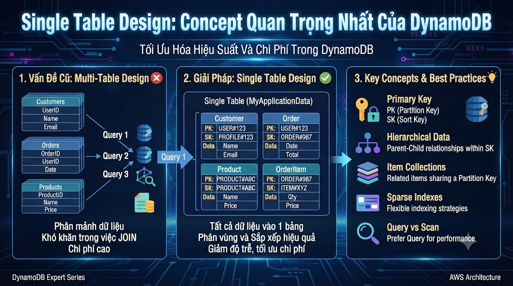

# Single Table Design: Concept Quan Trọng Nhất Của DynamoDB



Đây là bài khó nhất và quan trọng nhất trong DynamoDB series. Hầu hết developer mới dùng DynamoDB đều thiết kế **nhiều tables** giống SQL — một table cho Users, một table cho Courses, một table cho Orders. Cách đó hoạt động được nhưng không tận dụng được sức mạnh của DynamoDB. **Single Table Design** lưu toàn bộ entities trong **1 table duy nhất** — cho phép lấy nhiều loại data liên quan trong 1 request thay vì nhiều requests.

## 1\. Tại Sao Single Table Design?

```java
Multi-table approach (giống SQL):
  Table: Users     → get user
  Table: Courses   → get course
  Table: Enrollments → get enrollments
  Table: Orders    → get orders

  Để render dashboard của user:
  → 4 separate requests tới 4 tables
  → Mỗi request ~1-5ms → tổng ~4-20ms

Single Table Design:
  Table: FoxDev   → 1 request lấy TẤT CẢ
  PK=USER#1 → returns: profile + enrollments + orders cùng lúc
  → 1 request ~1-5ms
```

**Lý do kỹ thuật:**

*   DynamoDB charge theo **request** — 1 request lấy nhiều items trong partition = cùng chi phí với lấy 1 item
    
*   **Query** trong 1 partition cực nhanh (single node lookup)
    
*   Tránh N+1 problem hoàn toàn
    

## 2\. Access Patterns Trước, Schema Sau

Trước khi thiết kế bất kỳ thứ gì, liệt kê **tất cả access patterns** của ứng dụng:

```java
nguyentienkhoi.hashnode.dev Access Patterns:

USERS:
  AP1.  Get user by userId
  AP2.  Get user by email (login)

COURSES:
  AP3.  Get course by courseId
  AP4.  List courses by category
  AP5.  List published courses sorted by rating

ENROLLMENTS:
  AP6.  Get all enrollments of a user
  AP7.  Get all users enrolled in a course
  AP8.  Get specific enrollment (user + course)

ORDERS:
  AP9.  Get all orders of a user
  AP10. Get order by orderId
  AP11. List orders by status (admin)

→ Mỗi access pattern = cần 1 cách query
→ Primary Key + GSI phải cover tất cả access patterns
```

## 3\. Key Design Patterns

### 3.1 Generic PK/SK Naming

```java
Thay vì dùng tên cụ thể (userId, courseId):
→ Dùng tên generic: PK, SK
→ Cho phép lưu nhiều entity types trong 1 table
```

### 3.2 Composite Key Encoding

```java
Encode entity type + id vào key:
  PK = "USER#1"           SK = "PROFILE"
  PK = "USER#1"           SK = "ENROLLMENT#COURSE#1"
  PK = "USER#1"           SK = "ORDER#2025-03-15#001"
  PK = "COURSE#1"         SK = "METADATA"
  PK = "COURSE#1"         SK = "ENROLLMENT#USER#1"

Lợi ích:
  → Query PK=USER#1 → lấy ALL items của user 1 (profile + enrollments + orders)
  → Query PK=USER#1, SK begins_with "ENROLLMENT#" → chỉ enrollments
  → Query PK=COURSE#1 → all items của course 1
```

## 4\. Thiết Kế Schema Đầy Đủ

### Bảng Access Pattern → Key Mapping


| Access Pattern | Index | PK | SK / Condition |
|---|---|---|---|
| Get user by userId | Main | USER#{userId} | PROFILE |
| Get user by email | GSI1 | USER_EMAIL | {email} |
| Get course by courseId | Main | COURSE#{courseId} | METADATA |
| List courses by category | GSI1 | COURSE_CAT#{category} | begins_with RATING# |
| Get all enrollments of user | Main | USER#{userId} | begins_with ENROLLMENT# |
| Get all users in course | GSI1 | COURSE#{courseId} | begins_with ENROLLMENT# |
| Get specific enrollment | Main | USER#{userId} | ENROLLMENT#COURSE#{courseId} |
| Get all orders of user | Main | USER#{userId} | begins_with ORDER# |
| Get order by orderId | GSI1 | ORDER#{orderId} | METADATA |
| List orders by status | GSI1 | ORDER_STATUS#{status} | begins_with {date} |


## 5\. Tạo Table Single Table Design

```python
import boto3
from decimal import Decimal
from datetime import datetime
from botocore.exceptions import ClientError

# Kết nối DynamoDB Local
dynamodb = boto3.resource(
    "dynamodb",
    endpoint_url          = "http://localhost:8000",
    region_name           = "us-east-1",
    aws_access_key_id     = "fake",
    aws_secret_access_key = "fake"
)

def create_foxdev_table():
    """
    Tạo table Single Table Design cho nguyentienkhoi.hashnode.dev.
    1 table lưu: Users, Courses, Enrollments, Orders.
    """
    try:
        table = dynamodb.create_table(
            TableName = "FoxDev",

            # Chỉ define key attributes
            AttributeDefinitions = [
                {"AttributeName": "PK",     "AttributeType": "S"},
                {"AttributeName": "SK",     "AttributeType": "S"},
                {"AttributeName": "GSI1PK", "AttributeType": "S"},
                {"AttributeName": "GSI1SK", "AttributeType": "S"},
                {"AttributeName": "GSI2PK", "AttributeType": "S"},
                {"AttributeName": "GSI2SK", "AttributeType": "S"},
            ],

            # Primary Key: PK (Hash) + SK (Range)
            KeySchema = [
                {"AttributeName": "PK", "KeyType": "HASH"},
                {"AttributeName": "SK", "KeyType": "RANGE"},
            ],

            # Global Secondary Indexes
            GlobalSecondaryIndexes = [
                {
                    "IndexName":  "GSI1",
                    "KeySchema": [
                        {"AttributeName": "GSI1PK", "KeyType": "HASH"},
                        {"AttributeName": "GSI1SK", "KeyType": "RANGE"},
                    ],
                    "Projection": {"ProjectionType": "ALL"},
                },
                {
                    "IndexName":  "GSI2",
                    "KeySchema": [
                        {"AttributeName": "GSI2PK", "KeyType": "HASH"},
                        {"AttributeName": "GSI2SK", "KeyType": "RANGE"},
                    ],
                    "Projection": {"ProjectionType": "ALL"},
                },
            ],

            BillingMode = "PAY_PER_REQUEST",
        )

        table.wait_until_exists()
        print(f"✅ Table '{table.table_name}' created")
        return table

    except ClientError as e:
        if e.response["Error"]["Code"] == "ResourceInUseException":
            print("Table already exists, using existing")
            return dynamodb.Table("FoxDev")
        raise
```

## 6\. Entity Items — Cách Lưu Từng Loại

### User

```python
# AP1: PK=USER#{userId}, SK=PROFILE
# AP2: GSI1PK=USER_EMAIL, GSI1SK={email}
def put_user(table, user: dict):
    table.put_item(Item={
        # Primary Key
        "PK":        f"USER#{user['userId']}",
        "SK":        "PROFILE",

        # GSI1: lookup by email (login)
        "GSI1PK":   "USER_EMAIL",
        "GSI1SK":   user["email"],

        # Attributes
        "entityType": "USER",
        "userId":    user["userId"],
        "email":     user["email"],
        "firstName": user["firstName"],
        "lastName":  user["lastName"],
        "status":    user.get("status", "ACTIVE"),
        "createdAt": datetime.now().isoformat(),
        "updatedAt": datetime.now().isoformat(),
    })


# Insert users
table = dynamodb.Table("FoxDev")

put_user(table, {
    "userId": "1", "email": "nam@gmail.com",
    "firstName": "Nam", "lastName": "Nguyen"
})
put_user(table, {
    "userId": "2", "email": "linh@gmail.com",
    "firstName": "Linh", "lastName": "Tran"
})
put_user(table, {
    "userId": "3", "email": "minh@gmail.com",
    "firstName": "Minh", "lastName": "Le"
})
```

### Course

```python
# AP3: PK=COURSE#{courseId}, SK=METADATA
# AP4: GSI1PK=COURSE_CAT#{category}, GSI1SK=RATING#{rating}
def put_course(table, course: dict):
    rating_padded = f"{Decimal(str(course['rating'])):06.2f}"  # "04.80" để sort đúng

    table.put_item(Item={
        # Primary Key
        "PK":        f"COURSE#{course['courseId']}",
        "SK":        "METADATA",

        # GSI1: list courses by category sorted by rating
        "GSI1PK":   f"COURSE_CAT#{course['category']}",
        "GSI1SK":   f"RATING#{rating_padded}",

        # Attributes
        "entityType":    "COURSE",
        "courseId":      course["courseId"],
        "title":         course["title"],
        "category":      course["category"],
        "price":         Decimal(str(course["price"])),
        "rating":        Decimal(str(course["rating"])),
        "enrolledCount": course.get("enrolledCount", 0),
        "status":        course.get("status", "PUBLISHED"),
        "tags":          set(course.get("tags", [])),
        "createdAt":     datetime.now().isoformat(),
    })


put_course(table, {
    "courseId": "1", "title": "Spring Boot từ Zero đến Hero",
    "category": "java", "price": 799000, "rating": 4.8,
    "tags": ["java", "spring", "backend"]
})
put_course(table, {
    "courseId": "2", "title": "SQL cho Developer",
    "category": "database", "price": 599000, "rating": 4.9,
    "tags": ["sql", "postgresql"]
})
put_course(table, {
    "courseId": "3", "title": "Docker & Kubernetes",
    "category": "devops", "price": 899000, "rating": 4.7,
    "tags": ["docker", "kubernetes"]
})
put_course(table, {
    "courseId": "4", "title": "Java Core nền tảng",
    "category": "java", "price": 0, "rating": 4.6,
    "tags": ["java", "oop"]
})
```

### Enrollment

```python
# AP6: PK=USER#{userId}, SK=ENROLLMENT#COURSE#{courseId}
# AP7: GSI1PK=COURSE#{courseId}, GSI1SK=ENROLLMENT#USER#{userId}
def put_enrollment(table, enrollment: dict):
    table.put_item(Item={
        # Primary Key
        "PK":       f"USER#{enrollment['userId']}",
        "SK":       f"ENROLLMENT#COURSE#{enrollment['courseId']}",

        # GSI1: get all users enrolled in a course
        "GSI1PK":  f"COURSE#{enrollment['courseId']}",
        "GSI1SK":  f"ENROLLMENT#USER#{enrollment['userId']}",

        # Attributes
        "entityType": "ENROLLMENT",
        "userId":     enrollment["userId"],
        "courseId":   enrollment["courseId"],
        "progress":   Decimal(str(enrollment.get("progress", 0))),
        "completed":  enrollment.get("completed", False),
        "enrolledAt": datetime.now().isoformat(),
        "updatedAt":  datetime.now().isoformat(),
    })


put_enrollment(table, {"userId": "1", "courseId": "1", "progress": 0.75})
put_enrollment(table, {"userId": "1", "courseId": "2", "progress": 1.0, "completed": True})
put_enrollment(table, {"userId": "2", "courseId": "1", "progress": 0.3})
put_enrollment(table, {"userId": "3", "courseId": "1", "progress": 1.0, "completed": True})
put_enrollment(table, {"userId": "3", "courseId": "3", "progress": 0.5})
```

### Order

```python
# AP9:  PK=USER#{userId}, SK=ORDER#{date}#{orderId}
# AP10: GSI1PK=ORDER#{orderId}, GSI1SK=METADATA
# AP11: GSI2PK=ORDER_STATUS#{status}, GSI2SK={createdAt}
def put_order(table, order: dict):
    created_at = order.get("createdAt", datetime.now().isoformat())

    table.put_item(Item={
        # Primary Key
        "PK":       f"USER#{order['userId']}",
        "SK":       f"ORDER#{created_at}#{order['orderId']}",

        # GSI1: get order by orderId
        "GSI1PK":  f"ORDER#{order['orderId']}",
        "GSI1SK":  "METADATA",

        # GSI2: list orders by status (admin)
        "GSI2PK":  f"ORDER_STATUS#{order['status']}",
        "GSI2SK":  created_at,

        # Attributes
        "entityType": "ORDER",
        "orderId":    order["orderId"],
        "userId":     order["userId"],
        "status":     order["status"],
        "amount":     Decimal(str(order["amount"])),
        "items":      order.get("items", []),
        "createdAt":  created_at,
    })


put_order(table, {
    "orderId": "ORD001", "userId": "1",
    "status": "PAID", "amount": 799000,
    "createdAt": "2025-03-10T09:00:00",
    "items": [{"courseId": "1", "price": 799000}]
})
put_order(table, {
    "orderId": "ORD002", "userId": "1",
    "status": "PAID", "amount": 599000,
    "createdAt": "2025-03-12T14:00:00",
    "items": [{"courseId": "2", "price": 599000}]
})
put_order(table, {
    "orderId": "ORD003", "userId": "2",
    "status": "PENDING", "amount": 899000,
    "createdAt": "2025-03-15T10:00:00",
    "items": [{"courseId": "3", "price": 899000}]
})
```

## 7\. Queries Thực Hiện Từng Access Pattern

```python
from boto3.dynamodb.conditions import Key, Attr

# ─── AP1: Get user by userId ───
def get_user(table, user_id: str):
    resp = table.get_item(Key={
        "PK": f"USER#{user_id}",
        "SK": "PROFILE"
    })
    return resp.get("Item")

print(get_user(table, "1"))


# ─── AP2: Get user by email (GSI1) ───
def get_user_by_email(table, email: str):
    gsi1 = table.meta.client.query(
        TableName              = "FoxDev",
        IndexName              = "GSI1",
        KeyConditionExpression = "GSI1PK = :pk AND GSI1SK = :sk",
        ExpressionAttributeValues = {
            ":pk": {"S": "USER_EMAIL"},
            ":sk": {"S": email}
        }
    )
    items = gsi1.get("Items", [])
    return items[0] if items else None

print(get_user_by_email(table, "nam@gmail.com"))


# ─── AP3: Get course by courseId ───
def get_course(table, course_id: str):
    resp = table.get_item(Key={
        "PK": f"COURSE#{course_id}",
        "SK": "METADATA"
    })
    return resp.get("Item")

print(get_course(table, "1"))


# ─── AP4: List courses by category (GSI1) ───
def list_courses_by_category(table, category: str):
    resp = table.query(
        IndexName = "GSI1",
        KeyConditionExpression = (
            Key("GSI1PK").eq(f"COURSE_CAT#{category}") &
            Key("GSI1SK").begins_with("RATING#")
        ),
        ScanIndexForward = False  # DESC — rating cao nhất lên đầu
    )
    return resp["Items"]

print("Java courses:", [c["title"] for c in list_courses_by_category(table, "java")])


# ─── AP6: Get all enrollments of user ───
def get_user_enrollments(table, user_id: str):
    resp = table.query(
        KeyConditionExpression = (
            Key("PK").eq(f"USER#{user_id}") &
            Key("SK").begins_with("ENROLLMENT#")
        )
    )
    return resp["Items"]

enrollments = get_user_enrollments(table, "1")
print(f"User 1 enrollments: {len(enrollments)}")


# ─── AP7: Get all users enrolled in a course (GSI1) ───
def get_course_students(table, course_id: str):
    resp = table.query(
        IndexName = "GSI1",
        KeyConditionExpression = (
            Key("GSI1PK").eq(f"COURSE#{course_id}") &
            Key("GSI1SK").begins_with("ENROLLMENT#")
        )
    )
    return resp["Items"]

students = get_course_students(table, "1")
print(f"Course 1 students: {len(students)}")


# ─── AP9: Get all orders of user ───
def get_user_orders(table, user_id: str,
                    from_date: str = None):
    condition = Key("PK").eq(f"USER#{user_id}") & Key("SK").begins_with("ORDER#")

    if from_date:
        condition = (
            Key("PK").eq(f"USER#{user_id}") &
            Key("SK").begins_with(f"ORDER#{from_date}")
        )

    resp = table.query(
        KeyConditionExpression = condition,
        ScanIndexForward       = False  # newest first
    )
    return resp["Items"]

orders = get_user_orders(table, "1")
print(f"User 1 orders: {len(orders)}")


# ─── AP11: List orders by status (GSI2) ───
def list_orders_by_status(table, status: str, limit: int = 20):
    resp = table.query(
        IndexName = "GSI2",
        KeyConditionExpression = Key("GSI2PK").eq(f"ORDER_STATUS#{status}"),
        ScanIndexForward       = False,  # newest first
        Limit                  = limit
    )
    return resp["Items"]

paid_orders = list_orders_by_status(table, "PAID")
print(f"PAID orders: {len(paid_orders)}")
```

## 8\. "1 Request, Nhiều Entity Types"

Đây là lợi thế lớn nhất của Single Table Design:

```python
def get_user_dashboard(table, user_id: str) -> dict:
    """
    Lấy toàn bộ data cho user dashboard trong 1 request.
    Profile + enrollments + recent orders cùng lúc.
    """
    resp = table.query(
        KeyConditionExpression = Key("PK").eq(f"USER#{user_id}"),
        ScanIndexForward       = False  # newest items first
    )

    items    = resp["Items"]
    profile  = None
    enrollments = []
    orders   = []

    for item in items:
        sk = item["SK"]
        if sk == "PROFILE":
            profile = item
        elif sk.startswith("ENROLLMENT#"):
            enrollments.append(item)
        elif sk.startswith("ORDER#"):
            orders.append(item)

    return {
        "profile":     profile,
        "enrollments": enrollments,
        "orders":      orders[:5],  # last 5 orders
        "stats": {
            "total_courses":    len(enrollments),
            "completed_courses": sum(1 for e in enrollments if e.get("completed")),
            "total_orders":     len(orders),
        }
    }


dashboard = get_user_dashboard(table, "1")
print(f"User: {dashboard['profile']['firstName']}")
print(f"Courses: {dashboard['stats']['total_courses']}")
print(f"Completed: {dashboard['stats']['completed_courses']}")
print(f"Orders: {dashboard['stats']['total_orders']}")
# Tất cả trong 1 network round trip!
```

## 9\. GSI Overloading

Dùng ít GSI nhưng phục vụ nhiều access patterns bằng cách encode thông minh:

```python
# Cùng GSI1, nhưng phục vụ nhiều access patterns:
#
# Access Pattern           | GSI1PK              | GSI1SK
# ─────────────────────────┼─────────────────────┼──────────────────────
# Get user by email        | USER_EMAIL          | {email}
# List courses by category | COURSE_CAT#{cat}    | RATING#{rating}
# Get users in course      | COURSE#{courseId}   | ENROLLMENT#USER#{uid}
# Get order by orderId     | ORDER#{orderId}     | METADATA
# List orders by status    | ORDER_STATUS#{stat} | {createdAt}
#
# → 1 GSI phục vụ 5 access patterns khác nhau!
# GSI index cost $ → ít GSI = tiết kiệm hơn
```

## Tổng Kết


| Concept | Mô tả |
|---|---|
| Single Table | 1 table cho tất cả entities |
| Generic PK/SK | PK, SK thay vì userId, courseId |
| Key Encoding | USER#1, COURSE#1, ENROLLMENT#COURSE#1 |
| Access Pattern First | List queries trước, schema sau |
| GSI Overloading | 1 GSI phục vụ nhiều patterns |
| 1 Request | Query PK=USER#1 → profile + enrollments + orders |


```java
Single Table Design Rules:
  1. List tất cả access patterns TRƯỚC
  2. 1 table, generic PK + SK
  3. Encode entity type vào key: "USER#1", "COURSE#1"
  4. GSI cho query patterns không theo main PK
  5. Overload GSI: 1 GSI nhiều patterns
  6. Query 1 partition = 1 request = nhanh + rẻ
```

Bài tiếp theo chúng ta sẽ học **CRUD & Query nâng cao** — FilterExpression, ProjectionExpression, BatchWrite, TransactWrite và Pagination trong DynamoDB.

