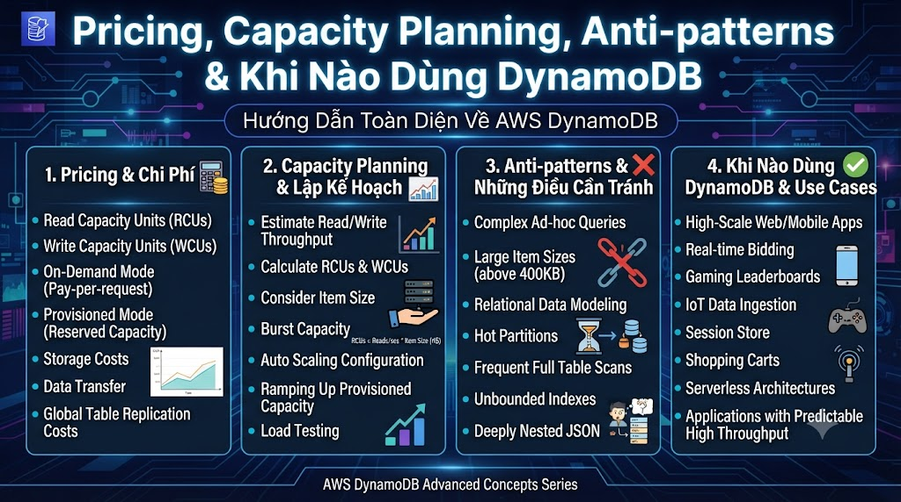

# Pricing, Capacity Planning, Anti-patterns & Khi Nào Dùng DynamoDB



Bài cuối của DynamoDB series. Đây là bài thực tế nhất — nhiều team dùng DynamoDB mà không hiểu pricing, đến cuối tháng nhận bill bất ngờ. Hoặc thiết kế Anti-patterns rồi phải refactor toàn bộ. Bài này giúp bạn tránh những sai lầm đó và biết **khi nào DynamoDB là lựa chọn đúng**.

## 1\. Pricing Model — Hiểu Để Không Bị Shock Bill

### 1.1 Hai Chế Độ Billing

```java
On-Demand Mode:
  → Trả theo số requests thực tế
  → $1.25 per million WRU (Write Request Units)
  → $0.25 per million RRU (Read Request Units)
  → Không cần estimate traffic
  → Tốt cho: unpredictable traffic, new apps, low traffic

Provisioned Mode:
  → Đặt trước RCU/WCU
  → ~$0.00065 per RCU/hour  (~$0.47/month per RCU)
  → ~$0.00013 per WCU/hour  (~$0.09/month per WCU)
  → Rẻ hơn On-Demand nếu traffic predictable (30-70% savings)
  → Tốt cho: stable traffic, mature apps, cost optimization

Storage:
  → $0.25 per GB/month (standard)
  → $0.10 per GB/month (infrequent access tier)
```

### 1.2 RCU/WCU Calculation

```python
# ─── WCU Calculator ───
def calculate_wcu(item_size_kb: float,
                   writes_per_second: float) -> float:
    """
    1 WCU = 1 write of up to 1KB/second
    Nếu item > 1KB → ceil(item_size / 1KB) WCU per write
    """
    import math
    wcu_per_write = math.ceil(item_size_kb)
    return wcu_per_write * writes_per_second


# ─── RCU Calculator ───
def calculate_rcu(item_size_kb: float,
                   reads_per_second: float,
                   consistent: bool = False) -> float:
    """
    1 RCU = 1 strongly consistent read of up to 4KB/second
    1 RCU = 2 eventually consistent reads of up to 4KB/second
    """
    import math
    reads_per_4kb  = math.ceil(item_size_kb / 4)
    if consistent:
        return reads_per_4kb * reads_per_second
    else:
        return (reads_per_4kb / 2) * reads_per_second


# nguyentienkhoi.hashnode.dev estimate:
# User item: ~0.5KB, 100 reads/sec
# Course item: ~1KB, 500 reads/sec
# Enrollment item: ~0.3KB, 200 writes/sec

user_rcu       = calculate_rcu(0.5, 100, consistent=True)
course_rcu     = calculate_rcu(1.0, 500, consistent=False)
enrollment_wcu = calculate_wcu(0.3, 200)

total_rcu = user_rcu + course_rcu
total_wcu = enrollment_wcu

print(f"Required RCU: {total_rcu:.0f}")
print(f"Required WCU: {total_wcu:.0f}")

# Monthly cost Provisioned
rcu_monthly = total_rcu * 0.00013 * 24 * 30
wcu_monthly = total_wcu * 0.00065 * 24 * 30
print(f"Monthly cost: ${rcu_monthly + wcu_monthly:.2f}")
```

### 1.3 Auto Scaling — Provisioned + Dynamic

```python
import boto3

def setup_autoscaling(table_name: str,
                       min_rcu: int = 5, max_rcu: int = 100,
                       min_wcu: int = 5, max_wcu: int = 50,
                       target_utilization: int = 70):
    """
    Cấu hình Auto Scaling cho Provisioned table.
    Scale up khi utilization > 70%, scale down khi < 70%.
    """
    aas = boto3.client("application-autoscaling",
                        region_name="us-east-1")

    # Register scalable targets
    for dimension, min_cap, max_cap in [
        ("dynamodb:table:ReadCapacityUnits",  min_rcu, max_rcu),
        ("dynamodb:table:WriteCapacityUnits", min_wcu, max_wcu),
    ]:
        aas.register_scalable_target(
            ServiceNamespace  = "dynamodb",
            ResourceId        = f"table/{table_name}",
            ScalableDimension = dimension,
            MinCapacity       = min_cap,
            MaxCapacity       = max_cap,
        )

        aas.put_scaling_policy(
            PolicyName        = f"{table_name}-{dimension}-policy",
            ServiceNamespace  = "dynamodb",
            ResourceId        = f"table/{table_name}",
            ScalableDimension = dimension,
            PolicyType        = "TargetTrackingScaling",
            TargetTrackingScalingPolicyConfiguration = {
                "TargetValue": target_utilization,
                "PredefinedMetricSpecification": {
                    "PredefinedMetricType": (
                        "DynamoDBReadCapacityUtilization"
                        if "Read" in dimension
                        else "DynamoDBWriteCapacityUtilization"
                    )
                },
                "ScaleInCooldown":  60,
                "ScaleOutCooldown": 60,
            }
        )
    print(f"✅ Auto Scaling configured for {table_name}")
```

## 2\. Capacity Planning — Ước Tính Trước Khi Deploy

```python
def capacity_planner(
    daily_active_users: int,
    avg_sessions_per_user: float,
    avg_reads_per_session: int,
    avg_writes_per_session: int,
    avg_item_size_kb: float,
    peak_multiplier: float = 3.0  # peak = 3x average
) -> dict:
    """
    Ước tính capacity cần thiết cho DynamoDB.
    """
    import math

    # Tổng requests per day
    daily_reads  = daily_active_users * avg_sessions_per_user * avg_reads_per_session
    daily_writes = daily_active_users * avg_sessions_per_user * avg_writes_per_session

    # Average requests per second
    avg_rps_read  = daily_reads  / 86400
    avg_rps_write = daily_writes / 86400

    # Peak requests per second
    peak_rps_read  = avg_rps_read  * peak_multiplier
    peak_rps_write = avg_rps_write * peak_multiplier

    # RCU/WCU needed at peak
    rcu_needed = math.ceil(peak_rps_read  * math.ceil(avg_item_size_kb / 4))
    wcu_needed = math.ceil(peak_rps_write * math.ceil(avg_item_size_kb))

    # Cost estimate (Provisioned)
    monthly_rcu_cost = rcu_needed * 0.00013 * 24 * 30
    monthly_wcu_cost = wcu_needed * 0.00065 * 24 * 30

    # Storage estimate (giả sử 1 year retention)
    total_items = daily_active_users * 50  # ~50 items per user
    storage_gb  = (total_items * avg_item_size_kb) / (1024 * 1024)
    storage_cost = storage_gb * 0.25

    return {
        "daily_reads":       f"{daily_reads:,.0f}",
        "daily_writes":      f"{daily_writes:,.0f}",
        "peak_rps_read":     f"{peak_rps_read:.1f}",
        "peak_rps_write":    f"{peak_rps_write:.1f}",
        "recommended_rcu":   rcu_needed,
        "recommended_wcu":   wcu_needed,
        "monthly_cost_usd":  round(monthly_rcu_cost + monthly_wcu_cost + storage_cost, 2),
        "storage_gb":        round(storage_gb, 2),
    }


# nguyentienkhoi.hashnode.dev tháng 3/2025
plan = capacity_planner(
    daily_active_users   = 1000,
    avg_sessions_per_user = 2,
    avg_reads_per_session = 20,
    avg_writes_per_session = 5,
    avg_item_size_kb      = 1.0,
    peak_multiplier       = 5.0
)

print("\n📊 Capacity Plan:")
for k, v in plan.items():
    print(f"  {k:<25} {v}")
```

## 3\. Anti-patterns — Những Sai Lầm Phổ Biến

### Anti-pattern 1: Scan Thay Vì Query

```python
# ❌ Scan toàn bộ table để tìm 1 user → tốn tiền, chậm
response = table.scan(
    FilterExpression=Attr("email").eq("nam@gmail.com")
)
# → Đọc TẤT CẢ items, filter sau → tốn toàn bộ RCU của table!

# ✅ Dùng GSI để query theo email
response = table.query(
    IndexName = "GSI1",
    KeyConditionExpression = (
        Key("GSI1PK").eq("USER_EMAIL") &
        Key("GSI1SK").eq("nam@gmail.com")
    )
)
# → Chỉ đọc 1 item → tiết kiệm 99%+ RCU
```

### Anti-pattern 2: Hot Partition Key

```python
# ❌ Tất cả requests đều dùng cùng 1 PK
# Ví dụ: PK = "COURSES" cho mọi course query
table.query(KeyConditionExpression=Key("PK").eq("COURSES"))
# → 1 partition nhận tất cả traffic → throttled!

# ✅ Distribute đều qua nhiều partitions
# PK = "COURSE#1", "COURSE#2", "COURSE#3"...
# Mỗi course là 1 partition riêng

# ❌ Timestamp làm PK → sequential writes vào 1 partition
# PK = "2025-03-15"
# → Tất cả writes ngày 15/3 vào 1 partition!

# ✅ Thêm shard key
# PK = "2025-03-15#0", "2025-03-15#1"...
import random
shard    = random.randint(0, 9)
pk       = f"EVENT#{date_str}#{shard}"
```

### Anti-pattern 3: Item Size > 400KB

```python
# ❌ Lưu files/images trong DynamoDB item
table.put_item(Item={
    "PK": "COURSE#1",
    "SK": "THUMBNAIL",
    "imageData": base64_encoded_image  # có thể > 400KB!
})
# → ValidationException: Item size exceeded

# ✅ Lưu S3 URL, không lưu binary trong DynamoDB
table.put_item(Item={
    "PK": "COURSE#1",
    "SK": "METADATA",
    "thumbnailUrl": "https://s3.amazonaws.com/tayjava/courses/1/thumbnail.jpg"
})
```

### Anti-pattern 4: Lạm Dụng Scan Để Paginate

```python
# ❌ Scan toàn table để paginate (admin list)
def list_all_orders_bad(page: int, page_size: int):
    all_items = table.scan(
        FilterExpression=Attr("entityType").eq("ORDER")
    )["Items"]
    start = page * page_size
    return all_items[start:start + page_size]
# → Đọc toàn bộ table mỗi page request!

# ✅ GSI với LastEvaluatedKey
def list_orders_by_status_good(status: str,
                                 page_size: int = 20,
                                 cursor: str = None):
    params = {
        "IndexName": "GSI2",
        "KeyConditionExpression": Key("GSI2PK").eq(f"ORDER_STATUS#{status}"),
        "ScanIndexForward": False,
        "Limit": page_size
    }
    if cursor:
        import json, base64
        params["ExclusiveStartKey"] = json.loads(
            base64.b64decode(cursor).decode()
        )
    return table.query(**params)
```

### Anti-pattern 5: Nhiều Tables Thay Vì Single Table

```python
# ❌ Multi-table: cần nhiều requests
users_table       = dynamodb.Table("Users")
courses_table     = dynamodb.Table("Courses")
enrollments_table = dynamodb.Table("Enrollments")

# Để render dashboard: 3 requests riêng biệt
user       = users_table.get_item(Key={"userId": "1"})["Item"]
courses    = courses_table.query(...)["Items"]
enrollments = enrollments_table.query(...)["Items"]
# → 3 network round trips, 3x latency

# ✅ Single Table: 1 request
dashboard = table.query(
    KeyConditionExpression=Key("PK").eq("USER#1")
)["Items"]
# Profile + enrollments + orders trong 1 request
```

### Anti-pattern 6: Không Handle Throttling

```python
from botocore.exceptions import ClientError
import time

# ❌ Không retry khi bị throttled
def bad_write(item):
    table.put_item(Item=item)
    # → ProvisionedThroughputExceededException → crash!

# ✅ Retry với exponential backoff
def resilient_write(item: dict, max_retries: int = 5):
    for attempt in range(max_retries):
        try:
            table.put_item(Item=item)
            return True
        except ClientError as e:
            code = e.response["Error"]["Code"]
            if code == "ProvisionedThroughputExceededException":
                wait = (2 ** attempt) * 0.1  # 0.1s, 0.2s, 0.4s...
                print(f"Throttled, retry {attempt+1} in {wait:.1f}s")
                time.sleep(wait)
            else:
                raise
    return False

# Tip: boto3 có built-in retry với standard retry mode
import botocore
config = botocore.config.Config(
    retries = {"max_attempts": 10, "mode": "standard"}
)
dynamodb = boto3.resource("dynamodb", config=config)
```

## 4\. Khi Nào Dùng DynamoDB?

### Dùng DynamoDB Khi:

```java
✅ AWS-native application
   → Serverless (Lambda + API Gateway)
   → Không muốn manage servers
   → Cần integrate với AWS services khác

✅ Unpredictable or spiky traffic
   → On-demand mode scale tự động
   → Flash sale, viral content, seasonal spikes

✅ Single-digit millisecond latency
   → Real-time features, gaming leaderboard
   → Session store, cart management

✅ Simple access patterns
   → Lookup by ID
   → Range queries trên SK
   → Queries cover được bằng GSI

✅ Global multi-region
   → DynamoDB Global Tables → replicate tự động
   → Multi-region active-active
```

### Không Dùng DynamoDB Khi:

```java
❌ Complex query requirements
   → Ad-hoc queries, không biết trước access patterns
   → Complex joins, aggregations
   → → Dùng PostgreSQL + RDS

❌ Relational data với nhiều relationships
   → Products, categories, variants (multi-level)
   → → PostgreSQL hoặc Aurora

❌ Analytics và reporting
   → GROUP BY, SUM, AVG phức tạp
   → → Athena (S3 + SQL), Redshift, BigQuery

❌ Team chưa quen DynamoDB
   → Learning curve: Single Table Design khó
   → → Bắt đầu với RDS PostgreSQL

❌ Data model chưa ổn định
   → Access patterns thay đổi → phải redesign table
   → → PostgreSQL hoặc MongoDB linh hoạt hơn

❌ Cần full-text search
   → DynamoDB không có search built-in
   → → Dùng Elasticsearch/OpenSearch + DynamoDB Streams để sync
```

### Decision Matrix cho [nguyentienkhoi.hashnode.dev](http://nguyentienkhoi.hashnode.dev)

```java
Feature                        | DynamoDB | PostgreSQL
─────────────────────────────┼──────────┼──────────────
User sessions                  | ✅ TTL   | ❌ cần cleanup
Course catalog (stable schema) | ✅ OK    | ✅ tốt hơn nếu complex query
Enrollments (simple CRUD)      | ✅ OK    | ✅ cũng được
Orders / Payments (ACID)       | ✅ với Tx | ✅ tốt hơn
Video tracking (high write)    | ✅ OK    | ❌ Cassandra tốt hơn
Analytics dashboard            | ❌ kém   | ✅ tốt hơn
Search by keyword              | ❌ kém   | ✅ (full-text index)
Multi-region (global app)      | ✅ tốt   | ❌ khó

→ DynamoDB phù hợp nếu:
  1. Đang build serverless trên AWS
  2. Traffic không đoán được
  3. Access patterns đơn giản và ổn định
  4. Cần global distribution
```

## 5\. DynamoDB vs Cassandra — Chọn Cái Nào?

```java
Cả hai đều: Key-Value based, horizontal scale, high write throughput

DynamoDB tốt hơn khi:
  → AWS ecosystem
  → Không muốn ops/infrastructure
  → Need managed service
  → Transaction support (built-in)
  → Global Tables (multi-region)

Cassandra tốt hơn khi:
  → Muốn self-hosted (không vendor lock-in)
  → Extreme write throughput (millions/sec)
  → Time-series với TWCS compaction
  → On-premise deployment
  → Budget sensitive (no per-request charge)
```

## 6\. Production Checklist

```java
✅ DESIGN:
□ Liệt kê tất cả access patterns trước
□ Single Table Design nếu phù hợp
□ GSI overloading để giảm số GSI
□ Avoid hot partitions
□ Item size < 400KB

✅ CAPACITY:
□ Chọn On-demand cho mới, Provisioned khi stable
□ Auto Scaling cho Provisioned
□ Monitor consumed capacity metrics
□ Alert khi throttled > threshold

✅ COST OPTIMIZATION:
□ Sử dụng Eventually Consistent reads khi có thể (1/2 RCU)
□ ProjectionExpression để giảm data transfer
□ TTL để tự xóa data hết hạn
□ S3 cho large objects, DynamoDB chỉ lưu metadata
□ Infrequent Access tier cho old data

✅ RELIABILITY:
□ Retry với exponential backoff
□ Dead Letter Queue cho failed operations
□ Point-in-time recovery bật
□ Streams + Lambda cho event processing

✅ MONITORING:
□ CloudWatch metrics: ConsumedCapacity, ThrottledRequests
□ Alert on SuccessfulRequestLatency > 50ms
□ SystemErrors alarm
□ UserErrors alarm (client-side errors)
```

## Tổng Kết DynamoDB Series


| Bài | Chủ đề | Điểm cốt lõi |
|---|---|---|
| Bài 16 | DynamoDB là gì | Managed, PK/SK, On-demand vs Provisioned |
| Bài 17 | Single Table Design | 1 table, encode entity type, 1 request nhiều data |
| Bài 18 | CRUD nâng cao | FilterExpression, BatchWrite, TransactWrite, Pagination |
| Bài 19 | GSI & Streams | GSI overloading, Sparse GSI, Lambda trigger |
| Bài 20 | Production | Pricing, capacity plan, anti-patterns, khi nào dùng |


```java
DynamoDB Golden Rules:
  1. Access patterns first, schema sau
  2. Single Table Design khi access patterns rõ ràng
  3. GSI cho alternate query patterns
  4. On-demand mode trước, Provisioned khi cần optimize cost
  5. Tuyệt đối tránh Scan trong production queries
  6. Always handle throttling với retry backoff
```

