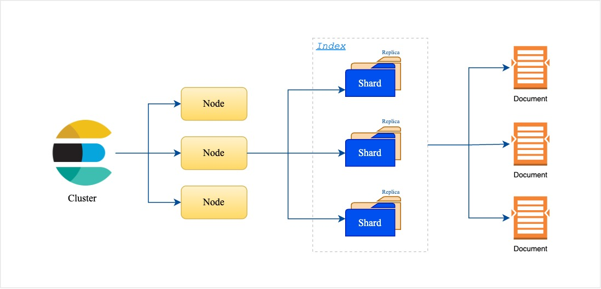
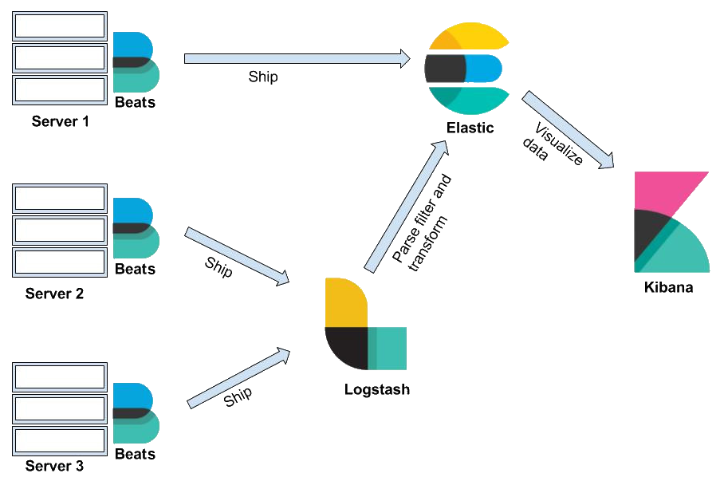

# Tổng Quan Về ElasticSearch

## **1\. ElasticSearch là gì ?**

**ElasticSearch** là một công cụ tìm kiếm và phân tích phân tán mã nguồn mở dựa trên thư viện Apache Lucene. Nó được phát triển để cung cấp khả năng tìm kiếm nhanh chóng, mở rộng và phân tích dữ liệu phi cấu trúc.

Hiện nay, **ElasticSearch** là một trong những công cụ mạnh mẽ và phổ biến nhất cho việc tìm kiếm và phân tích dữ liệu phi cấu trúc, được sử dụng trong nhiều ngành công nghiệp và lĩnh vực khác nhau.

### **2\. Cấu trúc dữ liệu cơ bản**

*   **Document**: Đơn vị dữ liệu cơ bản trong ElasticSearch, là một đối tượng JSON đại diện cho một bản ghi.
    
*   **Index**: Một tập hợp các document có cùng loại, tương tự như một cơ sở dữ liệu trong RDBMS (Relational Database Management System).
    
*   **Shard**: ElasticSearch chia _index_ thành nhiều shard để lưu trữ và truy vấn song song. Mỗi shard là một phần của dữ liệu và có thể nằm trên các nút khác nhau trong một cụm (cluster).
    
*   **Replica**: Là bản sao của các shard chính (primary shards), giúp tăng độ tin cậy và khả năng chịu lỗi.
    



### **3\. Tính năng chính**

*   **Tìm kiếm và phân tích:** ElasticSearch có khả năng tìm kiếm toàn văn bản (full-text search) mạnh mẽ với tốc độ cao, có thể hỗ trợ truy vấn phức tạp như lọc, sắp xếp và phân tích dữ liệu.
    
*   **Phân tán (Distributed):** ElasticSearch có thể dễ dàng mở rộng quy mô theo chiều ngang, phân tán dữ liệu và xử lý song song qua nhiều máy chủ khác nhau trong cụm.
    
*   **Thời gian thực gần (Near real-time):** Cập nhật dữ liệu nhanh chóng và phản hồi các thay đổi ngay lập tức với độ trễ nhỏ.
    
*   **RESTful API:** ElasticSearch tương tác chủ yếu qua giao diện RESTful API cho phép các ứng dụng có thể truy vấn và thao tác dữ liệu dễ dàng bằng cách gửi yêu cầu HTTP.
    

### **4\. Các trường hợp sử dụng (Use cases)**

*   **Tìm kiếm trong ứng dụng**: ElasticSearch có thể được sử dụng để xây dựng các chức năng tìm kiếm trong website hoặc ứng dụng với hiệu suất cao.
    
*   **Log và phân tích dữ liệu:** Phối hợp với các công cụ như Logstash và Kibana (trong Elastic Stack), Elasticsearch được sử dụng rộng rãi trong việc thu thập và phân tích log từ các hệ thống khác nhau.
    
*   **Phân tích dữ liệu thời gian thực:** Khả năng xử lý dữ liệu thời gian thực của Elasticsearch giúp nó phù hợp trong việc giám sát hệ thống, phân tích hành vi người dùng hoặc xử lý dữ liệu IoT.
    

### **5\. Cách hoạt động**

*   **Indexing**: Khi dữ liệu được thêm vào Elasticsearch nó sẽ được lập chỉ mục (index) giúp cho các truy vấn tìm kiếm nhanh chóng và hiệu quả.
    
*   **Search**: **ElasticSearch** sử dụng các chỉ số đảo ngược (inverted index) để tìm kiếm nhanh chóng trong văn bản. Inverted index giúp xác định vị trí các từ khóa trong các document một cách nhanh chóng.
    
*   **Aggregations**: Ngoài việc tìm kiếm ElasticSearch còn hỗ trợ các phép tính toán, phân nhóm và phân tích trên dữ liệu lớn, giúp người dùng hiểu rõ hơn về dữ liệu của mình.
    

### **6\. Elastic Stack (ELK Stack)**

ElasticSearch là trung tâm của bộ Elastic Stack (ELK), gồm:

*   **Logstash**: Dùng để thu thập, xử lý và truyền tải dữ liệu đến ElasticSearch.
    
*   **Kibana**: Giao diện trực quan để hiển thị và phân tích dữ liệu trong Elasticsearch.
    
*   **Beats**: Các agent nhẹ được sử dụng để gửi dữ liệu từ các máy chủ, hệ thống đến Elasticsearch.
    



### **7\. Cài đặt ElasticSearch**

*   `docker-compose.yml`
    

```java
services:
    elastic-search:
      image: elasticsearch:7.14.1
      container_name: elasticsearch
      restart: always
      ports:
        - "9200:9200"
      environment:
        - discovery.type=single-node
```

