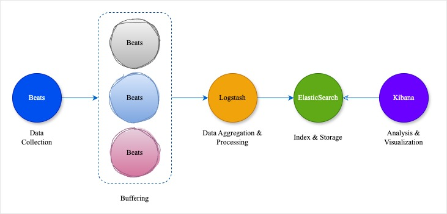

# Elasticsearch, Logstash, Kibana - ELK

### **1\. ELK là gì?**

**E**lasticsearch, **L**ogstash, **K**ibana (viết tắt là ELK) là một bộ công cụ mã nguồn mở phổ biến để thu thập, lưu trữ, tìm kiếm và phân tích dữ liệu log từ các hệ thống và ứng dụng.

### **2\. Kiến Trúc của ELK**

Kiến trúc chi tiết của ELK bao gồm ba thành phần chính, mỗi thành phần đảm nhận một vai trò riêng biệt trong việc thu thập, lưu trữ và hiển thị dữ liệu log. Bên cạnh đó, để hoàn thiện kiến trúc người ta thường sử dụng thêm các công cụ như **Beats** (đặc biệt là **Filebeat**) để hỗ trợ thu thập log từ các hệ thống.

#### 2.1 Elasticsearch

*   **Vai trò**:  
    **Elasticsearch** là trung tâm lưu trữ dữ liệu log và cung cấp khả năng tìm kiếm rất mạnh mẽ. Dữ liệu được lưu dưới dạng tài liệu JSON, giúp dễ dàng truy vấn, phân tích và phân loại.
    
*   **Chức năng chính**:
    
    *   **Phân tán và mở rộng**: Elasticsearch được thiết kế để chạy trên nhiều máy chủ (cluster). Nó có khả năng tự động phân chia dữ liệu thành các mảnh nhỏ (shards) và lưu trữ trên các node khác nhau. Điều này giúp tăng cường khả năng mở rộng và chống mất dữ liệu.
        
    *   **Chỉ mục (Indexing)**: Dữ liệu khi được gửi đến Elasticsearch sẽ được lập chỉ mục theo cấu trúc JSON. Các chỉ mục (index) này cho phép truy xuất dữ liệu nhanh chóng và hỗ trợ tìm kiếm toàn văn (full-text search).
        
    *   **Phân tích và thống kê**: Elasticsearch cung cấp các công cụ phân tích dữ liệu log thông qua các truy vấn (query) phức tạp và tính toán các thông số thống kê như số lượng, tỷ lệ, tổng hợp…
        
*   **Kiến trúc nội bộ**:
    
    *   **Cluster**: Tập hợp các node hoạt động cùng nhau để lưu trữ dữ liệu.
        
    *   **Shards**: Mỗi index được chia thành nhiều shard và mỗi shard được lưu trữ trên các node khác nhau trong cluster.
        
    *   **Replicas**: Mỗi shard có thể có nhiều bản sao (replica) đảm bảo tính sẵn sàng và độ tin cậy của dữ liệu.
        

#### 2.2 Logstash

*   **Vai trò**:  
    **Logstash** là một công cụ pipeline mạnh mẽ để thu thập, xử lý và chuyển đổi dữ liệu log trước khi đẩy vào Elasticsearch. Nó có khả năng thu thập log từ nhiều nguồn khác nhau (file, hệ thống mạng, cơ sở dữ liệu, ứng dụng, API…).
    
*   **Chức năng chính**:
    
    *   **Input**: Nhận dữ liệu từ nhiều nguồn khác nhau như file hệ thống, TCP/UDP, HTTP, Kafka hoặc các dịch vụ khác.
        
    *   **Filter**: Xử lý và chuyển đổi dữ liệu log thông qua các bộ lọc (filter). Ví dụ, có thể dùng filter để chuyển đổi định dạng, thêm thông tin hoặc bỏ qua những phần không cần thiết.
        
    *   **Output**: Sau khi xử lý, **Logstash** sẽ đẩy dữ liệu đến một hoặc nhiều mục tiêu như Elasticsearch, cơ sở dữ liệu, hệ thống file hoặc các dịch vụ khác.
        
*   **Kiến trúc nội bộ**:
    
    *   **Pipeline**: Là dòng chảy của dữ liệu qua ba giai đoạn chính:
        
        *   Input: Thu thập dữ liệu từ nguồn.
            
        *   Filter: Xử lý và chuyển đổi dữ liệu.
            
        *   Output: Gửi dữ liệu đến đích (thường là Elasticsearch).
            
    *   **Plugins**: **Logstash** hỗ trợ hàng trăm plugin cho các input, filter và output khác nhau, giúp nó dễ dàng tích hợp với nhiều hệ thống.
        

#### 2.3 Kibana

*   Vai trò:  
    **Kibana** là công cụ trực quan hóa dữ liệu dựa trên trình duyệt được kết nối với Elasticsearch để hiển thị và phân tích dữ liệu log.
    
*   Chức năng chính:
    
    *   **Dashboard**: **Kibana** cho phép tạo và tùy chỉnh các bảng điều khiển (dashboard) để hiển thị thông tin dữ liệu log trong thời gian thực. Các biểu đồ, bảng, bản đồ có thể được thêm vào dashboard để dễ dàng theo dõi các thông số quan trọng.
        
    *   **Discover**: Khả năng khám phá dữ liệu cho phép người dùng dễ dàng tìm kiếm log và lọc các sự kiện theo các tiêu chí khác nhau.
        
    *   **Visualization**: **Kibana** hỗ trợ nhiều kiểu biểu đồ như biểu đồ cột, đường, hình tròn, bản đồ nhiệt… cho phép người dùng phân tích dữ liệu một cách trực quan.
        
    *   **Alerting**: **Kibana** có tính năng cảnh báo giúp người dùng tạo các điều kiện cảnh báo khi có sự cố bất thường xảy ra trong dữ liệu.
        

#### 2.4 Beats (Filebeat)

*   **Vai trò**:  
    **Beats** là bộ công cụ thu thập dữ liệu log gọn nhẹ được cài đặt trực tiếp trên các máy chủ hoặc hệ thống ứng dụng. Trong đó, **Filebeat** là công cụ phổ biến nhất dùng để đọc log từ file hệ thống và gửi chúng đến Logstash hoặc Elasticsearch.
    
*   **Chức năng chính**:
    
    *   **Lightweight Data Shippers**: Beats rất nhẹ và ít tốn tài nguyên lý tưởng cho việc thu thập log tại nguồn và gửi chúng đi để xử lý mà không làm giảm hiệu suất của hệ thống.
        
    *   **Đa dạng về loại log**: Beats hỗ trợ nhiều loại log khác nhau thông qua các loại chuyên biệt như Filebeat (log file), Metricbeat (số liệu hệ thống), Packetbeat (dữ liệu mạng) và Winlogbeat (log sự kiện Windows).
        
*   **Cách thức hoạt động**:  
    **Filebeat** đọc log từ các file (như file log ứng dụng, hệ thống) và gửi trực tiếp đến Logstash hoặc Elasticsearch.  
    Khi dùng cùng với Logstash, Beats có thể giảm tải xử lý cho Logstash, chỉ gửi những log cần thiết và chuẩn bị chúng trước khi đến **Logstash**.
    

### **3\. Tương tác giữa các thành phần trong ELK**

*   **Beats/Filebeat**: Thu thập log từ các máy chủ, ứng dụng hoặc các nguồn khác và gửi tới Logstash hoặc trực tiếp tới Elasticsearch.
    
*   **Logstash**: Nhận dữ liệu từ Beats hoặc các nguồn khác, xử lý (lọc, chuyển đổi) dữ liệu và gửi nó tới Elasticsearch.  
    **Elasticsearch**: Nhận và lưu trữ dữ liệu log từ Logstash hoặc Beats. Dữ liệu được lập chỉ mục để có thể tìm kiếm và phân tích.
    
*   **Kibana**: Kết nối với Elasticsearch để hiển thị dữ liệu thông qua các bảng điều khiển, biểu đồ và công cụ phân tích trực quan.  
     
    

