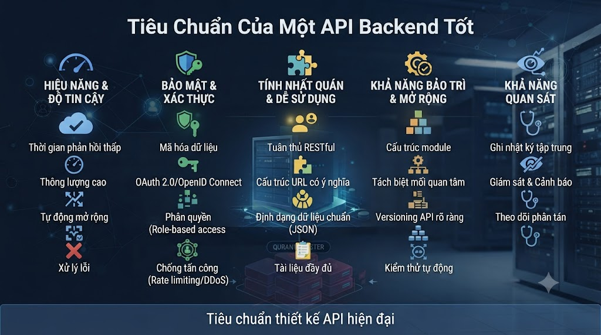
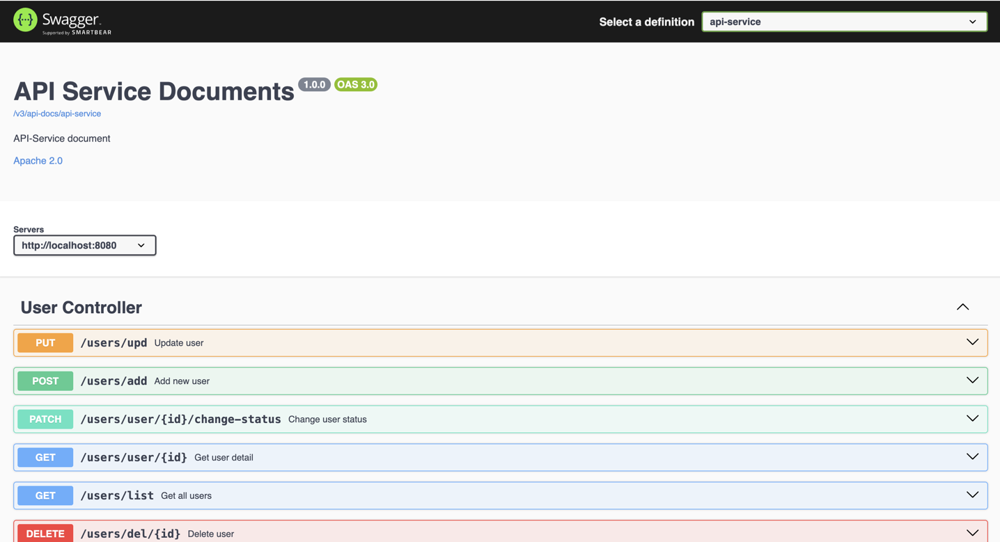

# Tiêu Chuẩn Của Một API Backend Tốt



  
Có một lần, FoxDev gõ lên Google: _"Thế nào là một backend tốt?"_, _"API backend standard là gì?"_... và nhận lại một loạt kết quả chung chung, sơ sài, không ai trả lời trọn vẹn. Đó cũng là lúc mình nhận ra: có quá nhiều developer đang xây API theo bản năng, mỗi người một kiểu, mỗi dự án một chuẩn — để rồi vài tháng sau, chính họ cũng không dám đụng vào code của mình.

15 năm lăn lộn với hệ thống trong Tài chính, Ngân hàng, Bất động sản, Platform, CRM, Digital Wallet... đã dạy mình một điều: **một API tốt không phải là API chạy được, mà là API mà một năm sau, một người lạ vẫn có thể đọc hiểu, tin tưởng và mở rộng nó mà không cần hỏi lại bạn.**

Dưới đây là những tiêu chuẩn mà FoxDev đã đúc kết — không phải lý thuyết suông, mà là những bài học từ thực chiến.

## 1\. Bảo Mật API — Đừng Để "Cửa Sau" Nào Bị Bỏ Ngỏ

Nếu có một thứ không bao giờ được phép thỏa hiệp, đó là bảo mật. Một API xử lý nhanh, response đẹp mà lộ dữ liệu người dùng thì mọi nỗ lực khác đều vô nghĩa. Một vài nguyên tắc sống còn:

*   **Chỉ dùng HTTPS** — không có ngoại lệ, dù là môi trường nội bộ.
    
*   **Một cổng, một cửa vào duy nhất** cho toàn bộ API (API Gateway) để dễ kiểm soát, giám sát và chặn tấn công.
    
*   **Mã hóa dữ liệu nhạy cảm** trước khi lưu trữ hoặc truyền đi.
    
*   **Phân quyền rõ ràng cho từng user** — ai được làm gì, không có vùng xám.
    
*   **Không bao giờ lưu mật khẩu dạng plain text.** Luôn băm (hash) mật khẩu — vì chỉ cần một lần rò rỉ database, toàn bộ niềm tin của người dùng sẽ sụp đổ.
    

## 2\. Tiêu Chuẩn RESTful API

### 2.1 Quy Ước Đặt Tên — Sự Nhất Quán Là Tôn Trọng Người Đọc Code

Một hệ thống có hàng trăm endpoint, hàng chục người cùng code, mà mỗi người đặt tên một kiểu thì sớm muộn cũng thành mê cung. Hãy thống nhất ngay từ đầu: tên endpoint, tên field, tên biến — dựa trên chuẩn HTTP và quy ước chung của hệ thống. Quy tắc không cần hoàn hảo, chỉ cần _nhất quán_.

### 2.2 Payload — Ngôn Ngữ Chung Giữa Các Đội

Mobile, Web, MiniApp — mỗi team một hệ công nghệ, nhưng tất cả phải "nói chung một thứ tiếng" khi giao tiếp qua API. Quy ước camelCase cho toàn bộ tham số là lựa chọn phổ biến và dễ đồng bộ nhất:

```json
{
    "firstName": "John",
    "lastName": "Doe",
    "phone": "0123-456-789",
    "email": "johndoe@email.com",
    "address": {
        "street": "Pham Van Dong",
        "district": "North Tu Liem",
        "city": "Hanoi",
        "country": "Vietnam",
        "postalCode": "100000",
        "text": ""
    }
}
```

### 2.3 Cấu Trúc Response — Đừng Bắt Frontend Phải Đoán

Một response tốt phải luôn có hình dạng có thể đoán trước: `status`, `message`, `data`. Frontend không cần đọc tài liệu mỗi lần gọi API mới — chỉ cần nhìn cấu trúc là biết ngay chuyện gì đang xảy ra.

**POST /users**

```json
{
    "status": 201,
    "message": "Add user successful",
    "data": { "id": "1" }
}
```

**PUT /users/{id}**

```json
{
    "status": 200,
    "message": "Update user successful",
    "data": null
}
```

**PATCH /users/{id}?enable=false**

```json
{
    "status": 200,
    "message": "Deactivate user successful",
    "data": null
}
```

**DELETE /users/{id}**

```json
{
    "status": 200,
    "message": "Delete user successful",
    "data": null
}
```

**GET /users/{id}**

```json
{
    "status": 200,
    "message": "User retrieved successfully",
    "data": {
        "id": "1",
        "firstName": "John",
        "lastName": "Doe",
        "phone": "0123-456-789",
        "email": "johndoe@email.com",
        "address": {
            "street": "Pham Van Dong",
            "district": "North Tu Liem",
            "city": "Hanoi",
            "country": "Vietnam",
            "postalCode": "100000",
            "text": ""
        }
    }
}
```

**GET /users**

```json
{
    "status": 200,
    "message": "Users retrieved successfully",
    "data": [
        {
            "id": "1",
            "firstName": "John",
            "lastName": "Doe",
            "phone": "0123-456-789",
            "email": "johndoe@email.com",
            "address": {
                "street": "Pham Van Dong",
                "district": "North Tu Liem",
                "city": "Hanoi",
                "country": "Vietnam",
                "postalCode": "100000",
                "text": ""
            }
        },
        {
            "id": "2",
            "firstName": "Leo",
            "lastName": "Messi",
            "phone": "0123-456-456",
            "email": "leomessi@email.com",
            "address": {
                "street": "Dummy text",
                "district": "Unknown",
                "city": "Miami",
                "country": "USA",
                "postalCode": "Dummy text",
                "text": ""
            }
        }
    ]
}
```

> **Mẹo nhỏ:** giá trị `status` trong body nên khớp với HTTP status code thật của response. Riêng mã 204 (No Content) thì theo chuẩn HTTP sẽ không có body — nếu bạn vẫn muốn trả `message`/`data`, hãy dùng 200 thay vì 204.

### 2.4 Xử Lý Lỗi — Đừng Để Client Phải "Đoán Mò"

Một API trưởng thành là API mà khi có lỗi, người gọi biết ngay _lỗi ở đâu, tại sao, và nên làm gì tiếp theo_ — chỉ bằng cách nhìn vào status code:

*   **400 – BAD\_REQUEST**: Request sai cú pháp hoặc dữ liệu không hợp lệ từ phía client.
    
*   **401 – UNAUTHORIZED**: Thiếu hoặc sai thông tin xác thực.
    
*   **403 – FORBIDDEN**: Server hiểu yêu cầu nhưng từ chối — không đủ quyền truy cập.
    
*   **404 – NOT\_FOUND**: Không tìm thấy tài nguyên được yêu cầu.
    
*   **406 – NOT\_ACCEPTABLE**: Server không thể trả về định dạng phù hợp với header `Accept`.
    
*   **409 – CONFLICT**: Yêu cầu xung đột với trạng thái hiện tại của tài nguyên.
    
*   **500 – INTERNAL\_SERVER\_ERROR**: Lỗi không mong muốn từ phía server.
    
*   **502 – BAD\_GATEWAY**: Gateway/proxy nhận phản hồi không hợp lệ từ upstream.
    
*   **503 – SERVICE\_UNAVAILABLE**: Server tạm thời quá tải hoặc đang bảo trì.
    
*   **504 – GATEWAY\_TIMEOUT**: Gateway/proxy không nhận được phản hồi kịp thời từ upstream.
    

### 2.5 Versioning — Đường Lui Cho Tương Lai

Hệ thống nào rồi cũng phải thay đổi. Vấn đề là: khi bạn nâng cấp API, những client cũ có bị "gãy" không? Đánh version ngay từ đầu — qua URL (`/api/v1/...`) hoặc qua header — chính là cách bạn mua bảo hiểm cho chính mình:

```java
@GetMapping(path = "/welcome", headers = "apiVersion=v1.0")
public String welcome() {
    return "Welcome to nguyentienkhoi.hashnode.dev";
}
```

### 2.6 HTTP Status Codes — Ngôn Ngữ Chung Của Web

**Nhóm thành công (2xx):**

*   **200 OK** — thành công, có thể cache.
    
*   **201 CREATED** — đã tạo tài nguyên mới thành công.
    
*   **202 ACCEPTED** — đã nhận yêu cầu, đang xử lý bất đồng bộ.
    
*   **204 NO\_CONTENT** — thành công nhưng không trả về nội dung.
    

**Nhóm lỗi client (4xx):** 400, 401, 403, 404, 406, 409 — như đã liệt kê ở mục 2.4.

**Nhóm lỗi server (5xx):** 500, 502, 503, 504 — như đã liệt kê ở mục 2.4.

### 2.7 Tài Liệu Hóa API — Đừng Bắt Đồng Đội Đọc Code Để Hiểu API

Tài liệu API không phải "làm cho có" — nó là cầu nối giữa Backend, Frontend, và cả khách hàng. FoxDev khuyên dùng **OpenAPI**: dễ tích hợp, dễ cấu hình, và quan trọng nhất — tự động đồng bộ mỗi khi API thay đổi, giúp tài liệu không bao giờ "lỗi thời" so với code thực tế.



### 2.8 Path/Routes — Bản Đồ Của Cả Hệ Thống

Một đường dẫn API rõ ràng giống như một tấm bản đồ tốt: ai nhìn vào cũng biết mình đang ở đâu, cần đi đâu. Ngược lại, path lộn xộn sẽ khiến cả team lạc lối ngay trên chính hệ thống của mình:

```java
GET    /api/v1/users
GET    /api/v1/users/{userId}
GET    /api/v1/users/{userId}/orders
GET    /api/v1/users/{userId}/orders?orderId=1
POST   /api/v1/users
PUT    /api/v1/users/{userId}
PATCH  /api/v1/users/{userId}
DELETE /api/v1/users/{userId}
```

Xây một API "chạy được" thì không khó. Nhưng xây một API mà đồng đội tin tưởng, khách hàng yên tâm, và chính bạn của một năm sau vẫn có thể tự tin bảo trì — đó mới là chuẩn mực thực sự của một Backend tốt.

