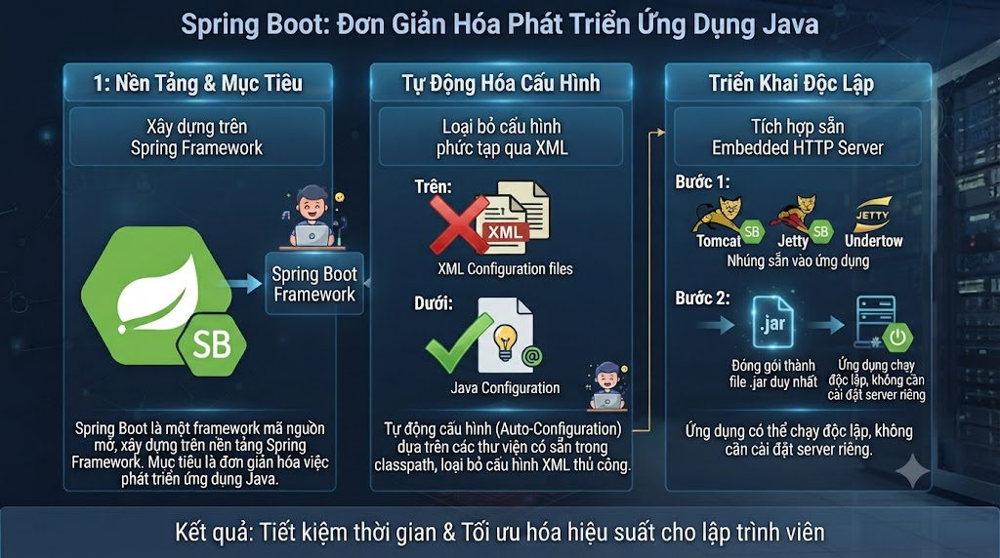
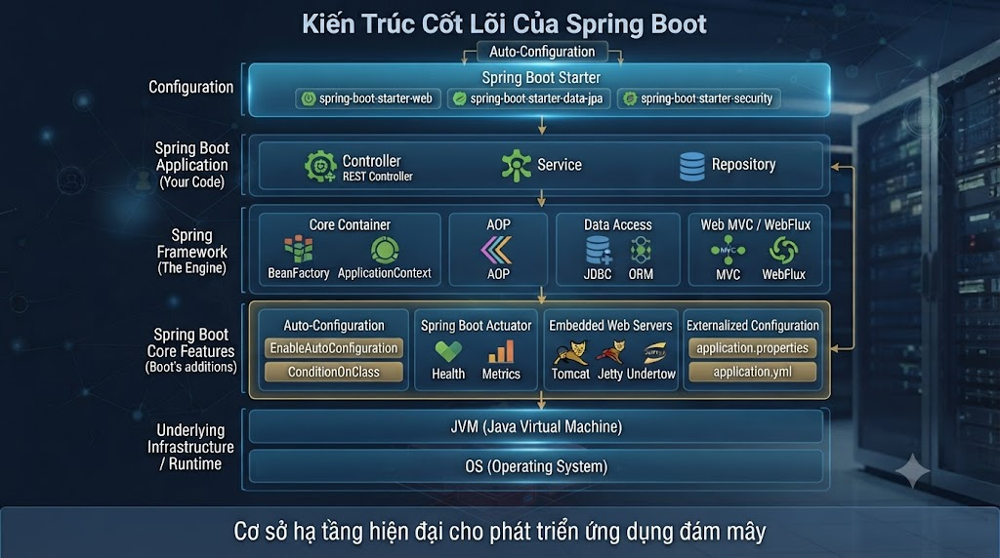
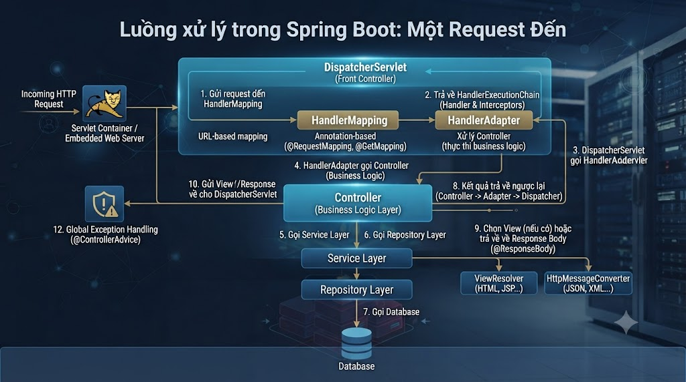

# Kiến Trúc Spring Boot

## 1\. Spring Boot Là Gì?

Spring Boot là một framework mã nguồn mở được xây dựng trên nền tảng Spring Framework. Mục tiêu của Spring Boot là đơn giản hóa việc phát triển ứng dụng Java bằng cách:

*   Loại bỏ cấu hình phức tạp qua XML.
    
*   Tự động cấu hình (Auto-Configuration) dựa trên các thư viện có sẵn trong classpath.
    
*   Tích hợp sẵn Embedded HTTP Server (Tomcat, Jetty, Undertow) → ứng dụng có thể chạy độc lập chỉ với một file `.jar`, không cần cài đặt server riêng.
    

👉 Hiểu đơn giản: Spring Boot giúp lập trình viên Java viết ứng dụng nhanh hơn, ít cấu hình hơn, dễ triển khai hơn — mà vẫn giữ được toàn bộ sức mạnh của Spring Framework.

## 2\. Tại Sao Nên Chọn Spring Boot?

Khi phát triển ứng dụng Java, Spring Boot mang lại nhiều lợi ích:

*   **Dependency Injection & Inversion of Control (IoC)**: Spring quản lý vòng đời và mối quan hệ giữa các object (bean) thay cho lập trình viên, giúp code lỏng lẻo (loosely coupled), dễ test và dễ bảo trì.
    
*   **Thiết kế module hóa** → dễ dàng mở rộng hoặc thay thế từng phần.
    
*   **Quản lý transaction khai báo** (`@Transactional`) → chỉ cần một annotation, Spring tự động lo việc commit/rollback, đảm bảo dữ liệu đồng nhất.
    
*   **Tích hợp dễ dàng với hệ sinh thái Spring và bên thứ ba**: Spring Data JPA, Hibernate, Spring Security, Kafka, Redis, RabbitMQ, Elasticsearch,...
    
*   **Spring Boot Starter** → chỉ cần khai báo một dependency duy nhất (ví dụ `spring-boot-starter-web`), Spring Boot tự động kéo về toàn bộ thư viện liên quan với phiên bản tương thích.
    
*   **Spring Boot Actuator** → cung cấp sẵn các endpoint giám sát (health check, metrics, info) mà không cần code thêm.
    
*   **Tiết kiệm thời gian và chi phí phát triển** → giảm boilerplate code, tập trung vào logic nghiệp vụ.
    

## 3\. Kiến Trúc Cốt Lõi Của Spring Boot

Điều làm nên sự khác biệt của Spring Boot so với Spring Framework truyền thống nằm ở 4 thành phần sau:

### 3.1 Spring Boot Starters

Là các bộ dependency đóng gói sẵn theo từng mục đích sử dụng (`spring-boot-starter-web`, `spring-boot-starter-data-jpa`, `spring-boot-starter-security`,...). Thay vì khai báo và quản lý phiên bản của hàng chục thư viện riêng lẻ, bạn chỉ cần thêm một starter duy nhất.

### 3.2 Auto-Configuration

Spring Boot tự động phát hiện các thư viện có trong classpath và cấu hình bean tương ứng. Ví dụ: chỉ cần có `spring-boot-starter-data-jpa` và một DataSource, Spring Boot sẽ tự cấu hình `EntityManagerFactory`, `TransactionManager` mà không cần khai báo thủ công.

### 3.3 Embedded Server

Tomcat, Jetty hoặc Undertow được nhúng thẳng vào ứng dụng. Kết quả là một file `.jar` duy nhất có thể chạy bằng `java -jar app.jar`, không cần cài đặt hay cấu hình server riêng.

### 3.4 Spring Boot Actuator & CLI

Actuator cung cấp các endpoint sẵn có để theo dõi sức khỏe ứng dụng (`/actuator/health`, `/actuator/metrics`,...). Spring Boot CLI cho phép chạy nhanh các đoạn script Groovy để thử nghiệm ý tưởng mà không cần build project đầy đủ.

## 4\. Kiến Trúc Phân Lớp Trong Ứng Dụng Spring Boot

Ngoài kiến trúc nội tại ở trên, khi xây dựng ứng dụng bằng Spring Boot, lập trình viên thường tổ chức code theo mô hình phân lớp (layered architecture) gồm 4 tầng:

### 1️⃣ Presentation Layer

*   Là tầng giao tiếp với client.
    
*   Gồm các `Controller`, tiếp nhận HTTP Request và trả về HTTP Response.
    
*   Chuyển đổi dữ liệu JSON ↔ Java Object thông qua `DispatcherServlet` và các `HttpMessageConverter`.
    
*   Xử lý xác thực (authentication) — xác minh danh tính người dùng — trước khi chuyển yêu cầu xuống Business Layer.
    

### 2️⃣ Business Layer

*   Chứa toàn bộ business logic (xử lý nghiệp vụ).
    
*   Gồm các lớp `Service`, chịu trách nhiệm validate dữ liệu đầu vào, xử lý phân quyền (authorization) theo nghiệp vụ, và điều phối gọi xuống Persistence Layer.
    
*   Là nơi áp dụng transaction management (`@Transactional`) để đảm bảo tính toàn vẹn dữ liệu.
    

### 3️⃣ Persistence Layer

*   Xử lý các thao tác với cơ sở dữ liệu thông qua `Repository`.
    
*   Chuyển đổi giữa Java Object và Database Object bằng ORM (Hibernate, JPA).
    

### 4️⃣ Database Layer

*   Bao gồm các hệ quản trị cơ sở dữ liệu: RDBMS (MySQL, PostgreSQL, Oracle) hoặc NoSQL (MongoDB, Cassandra,...).
    
*   Thực hiện các thao tác CRUD (Create, Read, Update, Delete).
    

## 5\. Luồng Xử Lý Một Request Trong Spring Boot

Một request trong Spring Boot thường đi theo luồng sau:

1.  Client gửi HTTP request (GET, POST, PUT, DELETE...).
    
2.  `DispatcherServlet` tiếp nhận request, dựa trên URL mapping để định tuyến đến `Controller` tương ứng (có thể đi qua các `Filter`/`Interceptor` để xác thực hoặc logging trước đó).
    
3.  Controller gọi xuống `Service` tương ứng trong Business Layer.
    
4.  Service Layer thực hiện business logic, validate dữ liệu, gọi đến `Repository` trong Persistence Layer để thao tác dữ liệu.
    
5.  Repository giao tiếp với Database, trả kết quả ngược lên Service.
    
6.  Kết quả được trả về Controller, sau đó phản hồi lại cho Client dưới dạng JSON hoặc View.
    

## 6\. Kết Luận

Spring Boot là lựa chọn hàng đầu để phát triển ứng dụng Java hiện nay nhờ:

*   Cơ chế Auto-Configuration và Starter giúp giảm mạnh cấu hình thủ công.
    
*   Dependency Injection/IoC giúp code lỏng lẻo, dễ test, dễ mở rộng.
    
*   Kiến trúc phân lớp rõ ràng, dễ bảo trì khi ứng dụng phát triển lớn.
    
*   Tích hợp dễ dàng với hệ sinh thái Spring và các công nghệ bên thứ ba.
    

👉 Nếu bạn là sinh viên hoặc lập trình viên mới học Java, việc làm quen với Spring Boot — bắt đầu từ Dependency Injection, Auto-Configuration, đến kiến trúc phân lớp — sẽ giúp bạn nhanh chóng xây dựng được các ứng dụng web, RESTful API, và microservices một cách hiệu quả.

