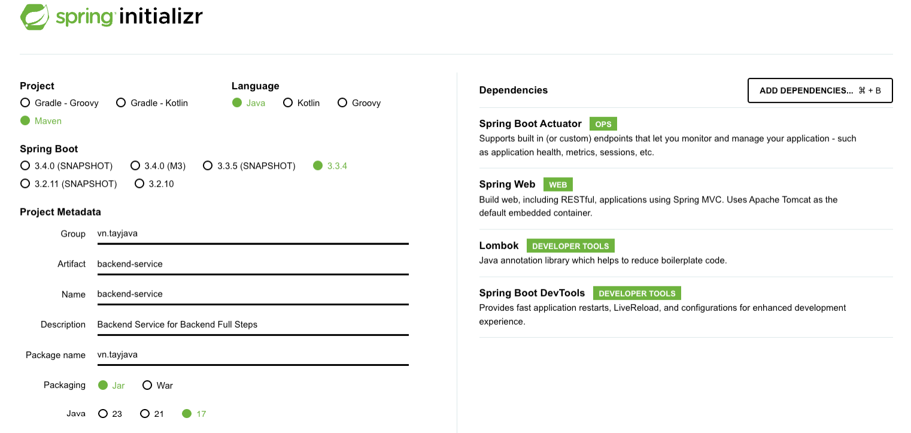
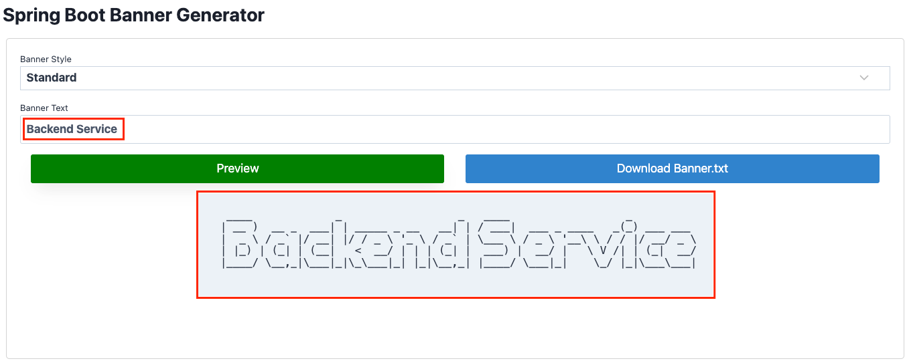
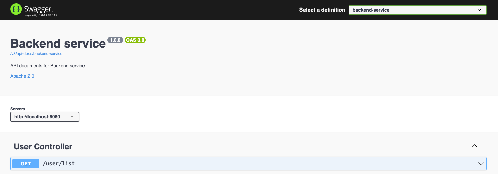

# Tạo Project Base Chuẩn Với Spring Boot

### **1\. Kiến trúc project base chuẩn**

```plaintext
.
├── Dockerfile
├── README.md
├── docker-compose.yml
├── initdb.sql
├── pom.xml
└── src
    ├── main
    │ ├── java
    │ │ └── vn
    │ │     └── foxdev
    │ │         ├── BackendServiceApplication.java
    │ │         ├── common
    │ │         ├── config
    │ │         │ └── OpenApiConfig.java
    │ │         ├── controller
    │ │         ├── exception
    │ │         ├── model
    │ │         ├── repository
    │ │         └── service
    │ └── resources
    │     ├── application-dev.yaml
    │     ├── application-prod.yaml
    │     ├── application-test.yaml
    │     ├── application.yaml
    │     ├── banner.txt
    │     ├── static
    │     └── templates
    └── test
        └── java
            └── vn
                └── foxdev
                    └── BackendServiceApplicationTests.java
```

### **2\. Lựa chọn công nghệ**

*   Java 17 hoặc 21 hoặc 25
    
*   Spring Boot 3 (mới nhất)
    
*   Postgres / Mysql
    
*   Maven 3.5 ++
    
*   Docker
    
*   Tools: IntelliJ, DBeaver
    

### **3\. Các bước tạo project**

#### **– Bước 1: Tạo project**

Tạo mới project trên [https://start.spring.io](https://start.spring.io/)



#### **– Bước 2: Tạo banner cho** `backend-service`

– Tạo banner và download banner.txt tại [Spring Boot banner Generator | Create banner.txt online](https://springhow.com/spring-boot-banner-generator/)



– Thêm `banner.txt` vào folder `resources`

```plaintext
    │ └── resources
    │     ├── banner.txt
    │     ├── ...
```

#### **– Bước 3: Thiết lập maven profile để build application**

– `pom.xml`

```xml
<profiles>
    <profile>
       <id>dev</id>
       <activation>
          <activeByDefault>true</activeByDefault>
       </activation>
       <properties>
          <spring.profiles.active>dev</spring.profiles.active>
       </properties>
    </profile>
    <profile>
       <id>test</id>
       <properties>
          <spring.profiles.active>test</spring.profiles.active>
       </properties>
    </profile>
    <profile>
       <id>prod</id>
       <properties>
          <spring.profiles.active>prod</spring.profiles.active>
       </properties>
    </profile>
</profiles>
```

– `application.yaml`

```plaintext
server:
  port: 8080

spring:
  application:
    name: backend-service
  profiles:
    active: @spring.profiles.active@

management:
  endpoints:
    web:
      exposure:
        include: '*'

logging:
  level:
    root: INFO
    web: INFO
```

– `application-dev.yaml`

```plaintext
spring:
  config:
    activate:
      on-profile: dev
  devtools:
    add-properties: true
  datasource:
    url: jdbc:postgresql://${DATABASE_URL:localhost:5432/postgres}
    username: ${DATABASE_USERNAME:dev}
    password: ${DATABASE_PASSWORD:password}
    hikari: # Connection poll
      max-lifetime: 300000      # 5 phút
      idle-timeout: 60000       # 1 phút
      validation-timeout: 5000  # 5 giây
      minimum-idle: 5
      maximum-pool-size: 20
  jpa:
    show-sql: false
    hibernate:
      ddl-auto: none
```

– `application-test.yaml`

```plaintext
spring:
  config:
    activate:
      on-profile: dev
  devtools:
    add-properties: true
  datasource:
    url: jdbc:postgresql://${DATABASE_URL:localhost:5432/postgres}
    username: ${DATABASE_USERNAME:dev}
    password: ${DATABASE_PASSWORD:password}
    hikari: # Connection poll
      max-lifetime: 300000      # 5 phút
      idle-timeout: 60000       # 1 phút
      validation-timeout: 5000  # 5 giây
      minimum-idle: 5
      maximum-pool-size: 20
  jpa:
    show-sql: false
    hibernate:
      ddl-auto: none
```

– `application-prod.yaml`

```plaintext
spring:
  config:
    activate:
      on-profile: prod
  devtools:
    add-properties: true
  datasource:
    url: jdbc:postgresql://${DATABASE_URL:localhost:5432/postgres}
    username: ${DATABASE_USERNAME:dev}
    password: ${DATABASE_PASSWORD:password}
    hikari: # Connection poll
      max-lifetime: 300000      # 5 phút
      idle-timeout: 60000       # 1 phút
      validation-timeout: 5000  # 5 giây
      minimum-idle: 5
      maximum-pool-size: 20
  jpa:
    show-sql: false
    hibernate:
      ddl-auto: none
```

**–** `Dockerfile`

```plaintext
FROM openjdk:17
ARG JAR_FILE=target/*.jar
COPY ${JAR_FILE} backend-service.jar
ENTRYPOINT ["java", "-jar", "backend-service.jar"]
EXPOSE 8080
```

– `docker-compose.yaml`

```java
services:

  postgres:
    image: postgres
    container_name: postgres
    restart: unless-stopped
    environment:
      POSTGRES_USER: postgres
      POSTGRES_PASSWORD: password
      PGDATA: /data/postgres
    volumes:
      - postgres:/data/postgres
      - ./initdb.sql:/docker-entrypoint-initdb.d/init.sql
    ports:
      - '5432:5432'
    networks:
      - default

  backend-service:
    container_name: backend-service
    build:
      context: ./
      dockerfile: Dockerfile
    ports:
      - "8080:8080"
    env_file:
      - .env
    environment:
      DATABASE_HOST: host.docker.internal
      DATABASE_PORT: 5432
      DATABASE_USERNAME: postgres
      DATABASE_PASSWORD: password
    networks:
      - default

networks:
  default:
    name: backend-network

volumes:
  postgres:
```

– `.env` Được sử dụng tại file `docker-compose.yaml`. Các bạn có thể thay đổi giá trị trong file nhé!

```plaintext
DATABASE_URL=localhost:5432/postgres
DATABASE_USERNAME=dev
DATABASE_PASSWORD=password
```

#### **– Bước 4. Thiết lập API document để test API**

– Thêm dependency vào `pom.xml`

```xml
<dependency>
    <groupId>org.springdoc</groupId>
    <artifactId>springdoc-openapi-starter-webmvc-ui</artifactId>
    <version>2.2.0</version>
</dependency>
```

– Tạo class OpenApiConfig tại `package vn.foxdev.config` Cấu hình OpenAPI

```java
import io.swagger.v3.oas.models.Components;
import io.swagger.v3.oas.models.OpenAPI;
import io.swagger.v3.oas.models.info.Info;
import io.swagger.v3.oas.models.info.License;
import io.swagger.v3.oas.models.security.SecurityRequirement;
import io.swagger.v3.oas.models.security.SecurityScheme;
import io.swagger.v3.oas.models.servers.Server;
import org.springdoc.core.models.GroupedOpenApi;
import org.springframework.beans.factory.annotation.Value;
import org.springframework.context.annotation.Bean;
import org.springframework.context.annotation.Configuration;
import org.springframework.context.annotation.Profile;

import java.util.List;


@Configuration
@Profile({"dev", "test"})
public class OpenApiConfig {

    @Bean
    public GroupedOpenApi publicApi(@Value("${openapi.service.api-docs}") String apiDocs) {
        return GroupedOpenApi.builder()
                .group(apiDocs) // /v3/api-docs/backend-service
                .packagesToScan("vn.foxdev.controller")
                .build();
    }

    @Bean
    public OpenAPI openAPI(
            @Value("${openapi.service.title}") String title,
            @Value("${openapi.service.version}") String version,
            @Value("${openapi.service.server}") String serverUrl) {
        final String securitySchemeName = "bearerAuth";
        return new OpenAPI()
                .servers(List.of(new Server().url(serverUrl)))
                                .components(
                        new Components()
                                .addSecuritySchemes(
                                        securitySchemeName,
                                        new SecurityScheme()
                                                .type(SecurityScheme.Type.HTTP)
                                                .scheme("bearer")
                                                .bearerFormat("JWT")))
                .security(List.of(new SecurityRequirement().addList(securitySchemeName)))
                .info(new Info().title(title)
                        .description("API documents for Backend service")
                        .version(version)
                        .license(new License().name("Apache 2.0").url("https://springdoc.org")));
    }

}
```

– Thiết lập cấu hình OpenAPI tại các file `*.yaml`

```java
# application-dev.yml
springdoc:
  api-docs:
    enabled: true
  swagger-ui:
    enabled: true
openapi:
  service:
    api-docs: backend-service
    server: http://localhost:${server.port}
    title: Backend service
    version: 1.0.0
```

```plaintext
# application-test.yml
springdoc:
  api-docs:
    enabled: true
  swagger-ui:
    enabled: true
openapi:
  service:
    api-docs: backend-service
    server: ${BACKEND_SERVICE:http://localhost:${server.port}}
    title: Backend service
    version: 1.0.0
```

```plaintext
# application-prod.yml
springdoc:
  api-docs:
    enabled: false
  swagger-ui:
    enabled: false
```

### **4\. Viết hướng dẫn thiết lập môi trường làm việc tại** `README.md`

– Cần viết hướng dẫn chi tiết để bất kỳ ai khi tham gia vào dự án đều có thể cài đặt và thiết lập môi trường dev một cách dễ dàng. 

Dưới dây là mẫu **README.md** cho các dự án:

````plaintext
 ____             _                  _   ____                  _
 | __ )  __ _  ___| | _____ _ __   __| | / ___|  ___ _ ____   _(_) ___ ___
 |  _ \ / _` |/ __| |/ / _ \ '_ \ / _` | \___ \ / _ \ '__\ \ / / |/ __/ _ \
 | |_) | (_| | (__|   <  __/ | | | (_| |  ___) |  __/ |   \ V /| | (_|  __/
 |____/ \__,_|\___|_|\_\___|_| |_|\__,_| |____/ \___|_|    \_/ |_|\___\___|

## 1. Prerequisite
- Cài đặt JDK 17+ nếu chưa thì cài đặt JDK
- Install Maven 3.5+ nếu chưa thì cài đặt Maven
- Install IntelliJ nếu chưa thì cài đặt IntelliJ
- Install Docker nếu chưa thì cài đặt Docker

## 2. Technical Stacks
- Java 17
- Maven 3.5+
- Spring Boot 3.x.x
- Spring Data Validation
- Spring Data JPA
- Postgres/MySQL (optional)
- Lombok
- DevTools
- Docker
- Docker compose


## 3. Build & Run Application
– Run application bởi mvnw tại folder backend-service
```
$ ./mvnw spring-boot:run
```

– Run application bởi docker
```
$ mvn clean install -P dev
$ docker build -t backend-service:latest .
$ docker run -it -p 8080:8080 --name backend-service backend-service:latest
```

## 4. Test
– Check health với cURL
```
curl --location 'http://localhost:8080/actuator/health'
```
-- Response --
```
{
    "status": "UP"
}
```
````

### **5\. Testing**

– Truy cập [Backend service](http://localhost:8080/swagger-ui.html) để test các API



