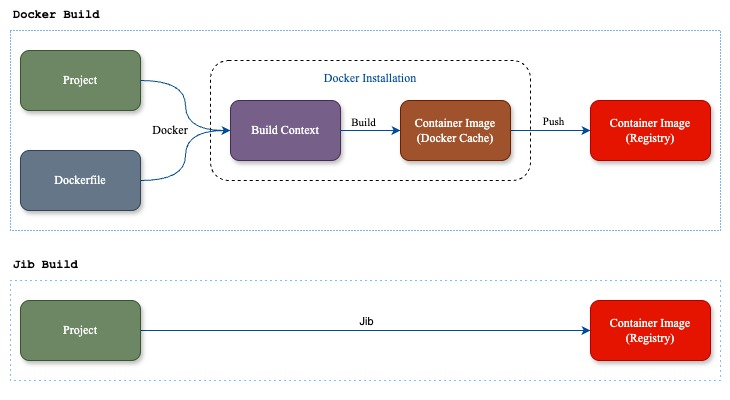

# Build và Đóng gói ứng dụng Spring Boot với Google Jib

### **1\. Jib là gì?**

**Jib** là một công cụ mã nguồn mở do **Google** phát triển, dùng để **xây dựng và đóng gói ứng dụng Java thành container Docker hoặc OCI** nhanh chóng, tối ưu.

Điểm đặc biệt:

*   **Không cần Dockerfile**
    
*   **Không cần Docker Daemon**
    
*   Tích hợp trực tiếp với **Maven** và **Gradle**
    

👉 Nhờ đó, lập trình viên có thể build và push image thẳng lên **Docker Hub**, **Google Container Registry**, **AWS ECR**… ngay từ project Java.

### **2\. Quy trình đóng gói**

📌 **Với Docker truyền thống**

1.  Viết **Dockerfile**.
    
2.  Dùng **Docker CLI** để build image (`docker build`).
    
3.  Push image lên registry (`docker push`).
    

👉 **Với Jib**

1.  Cài plugin Jib trong **Maven/Gradle**.
    
2.  Chạy lệnh build (`mvn compile jib:build` hoặc `gradle jib`).
    
3.  Jib tự động build và push image mà **không cần Dockerfile, Docker CLI, hay Docker Daemon**.
    



### **3\. Đặc điểm nổi bật của Jib**

🚫 **Không cần Docker Daemon**: Không cần cài Docker engine.

🔌 **Tích hợp sẵn với Maven & Gradle**: Chỉ cần thêm plugin, build ngay.

📝 **Không cần Dockerfile**: Jib tự phân tích và tạo image phù hợp cho ứng dụng Java.

⚡ **Hiệu năng cao**: Hỗ trợ **layered builds** (chỉ rebuild phần thay đổi).

⚙️ **Cấu hình linh hoạt**: Dễ dàng chỉnh base image, environment variables, entrypoint…

### **4\. Lợi ích khi dùng Jib**

🚀 **Nhanh chóng & tự động**: Không cần viết Dockerfile thủ công.

☕ **Tối ưu cho Java/Spring Boot**: Được thiết kế đặc biệt cho ứng dụng Java.

🔒 **Bảo mật hơn**: Không yêu cầu quyền root để chạy Docker Daemon.

📦 **Tái sử dụng layer**: Dependencies, resources, classes được tách riêng → image nhỏ gọn, deploy nhanh.

### **5\. Cách hoạt động của Jib**

Jib chia ứng dụng Java thành **các layer** để build hiệu quả:

1.  **Base Image**: Thường là JRE hoặc JDK (ví dụ: `eclipse-temurin:17-jre`).
    
2.  **Dependencies**: Các thư viện từ `pom.xml` hoặc `build.gradle`.
    
3.  **Resources**: Các file cấu hình như `application.properties`.
    
4.  **Classes**: Mã Java đã biên dịch (`.class`).
    

👉 Khi code thay đổi, chỉ layer **classes** được rebuild → tiết kiệm thời gian.

### **6\. Khi nào nên dùng Jib?**

*   Khi phát triển ứng dụng **Java/Spring Boot** và muốn đóng gói nhanh thành container.
    
*   Khi **không muốn quản lý Dockerfile thủ công**.
    
*   Khi cần tích hợp vào **CI/CD pipeline** (Jenkins, GitHub Actions, GitLab CI…).
    

### **7\. Đóng gói ứng dụng Spring Boot với Jib**

**📌 Tích hợp Jib với Maven** `pom.xml`

```xml
<properties>
    <java.version>17</java.version>
    <image.path>registry.hub.docker.com/luongquoctay87</image.path>
</properties>
...
<build>
    <plugins>
        <plugin>
            <groupId>org.springframework.boot</groupId>
            <artifactId>spring-boot-maven-plugin</artifactId>
            <configuration>
                <excludes>
                    <exclude>
                        <groupId>org.projectlombok</groupId>
                        <artifactId>lombok</artifactId>
                    </exclude>
                </excludes>
            </configuration>
        </plugin>
        <plugin>
            <groupId>com.google.cloud.tools</groupId>
            <artifactId>jib-maven-plugin</artifactId>
            <version>2.8.0</version>
            <configuration>
                <from>
                    <image>openjdk:17-alpine</image>
                </from>
                <to>
                    <image>${image.path}/${project.artifactId}:20241213</image>
                    <!-- Setting dockerhub account --> 
                    <auth>
                        <!--suppress UnresolvedMavenProperty -->
                        <username>${env.DOCKER_USERNAME}</username>
                        <!--suppress UnresolvedMavenProperty -->
                        <password>${env.DOCKER_PASSWORD}</password>
                    </auth>
                </to>
                <container>
                    <ports>
                        <port>8080</port>
                    </ports>
                    <environment>
                        <SPRING_PROFILES_ACTIVE>prod</SPRING_PROFILES_ACTIVE>
                    </environment>
                </container>
            </configuration>
        </plugin>
    </plugins>
    <finalName>backend-service</finalName>
</build>
```

*   Base image: `openjdk:17-alpine`
    
*   Tên image: ${image.path}/${project.artifactId}:20241213
    
    *   image.path: `registry.hub.docker.com/luongquoctay87`
        
    *   project.artifactId: `backend-service`
        
    *   tag: `20241213` (or latest)
        
    *   auth: Tài khoản để login `hub.docker.com`. `env.DOCKER_USERNAME` và `env.DOCKER_PASSWORD` được lấy từ biến môi trường.
        
*   Mở port `8080`
    
*   Thêm Environment variable `SPRING_PROFILES_ACTIVE=prod`
    

**📌 Build Image với Jib**

*   Build và đưa image vào Docker daemon (local Docker): Lệnh này sẽ tạo image và lưu vào Docker daemon trên máy của chúng ta.
    

```java
mvn package jib:dockerBuild
```

*   Build và push image trực tiếp lên container registry: Nếu bạn muốn đẩy image lên một container registry (ví dụ: Docker Hub, Google Container Registry, AWS ECR), sử dụng lệnh sau:
    

```java
mvn package jib:build
```

