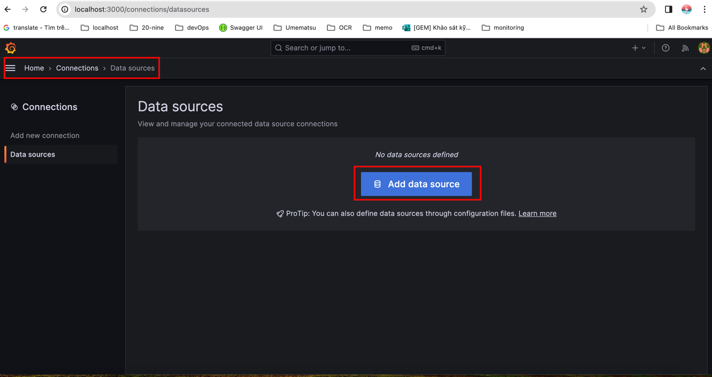
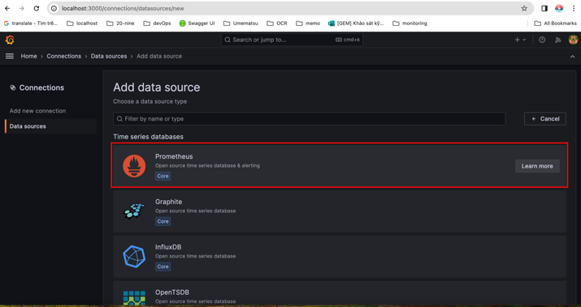
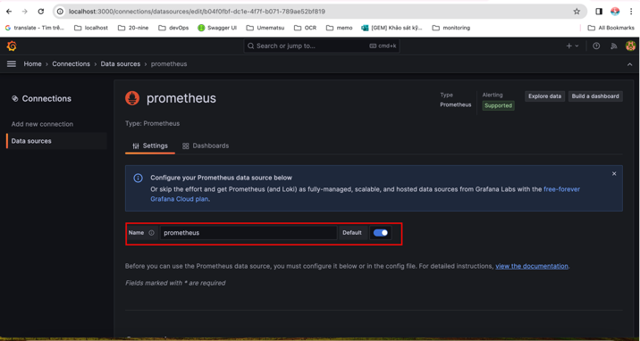
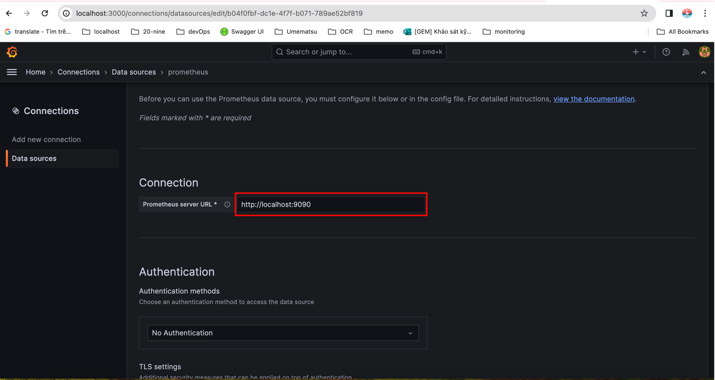
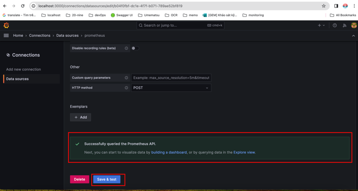
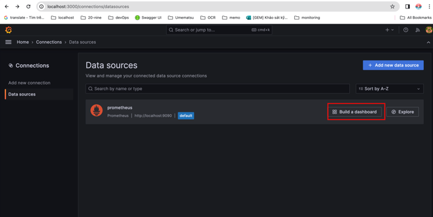
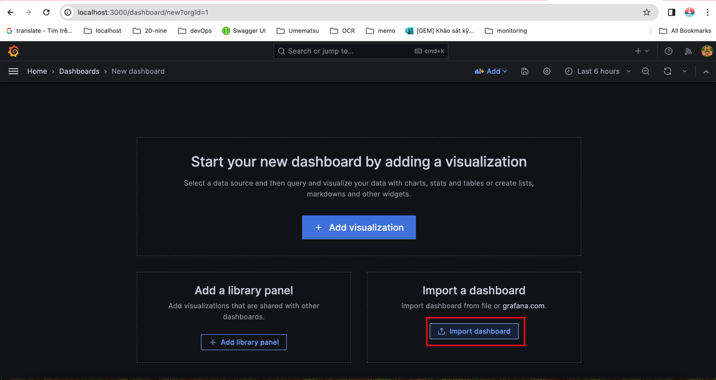
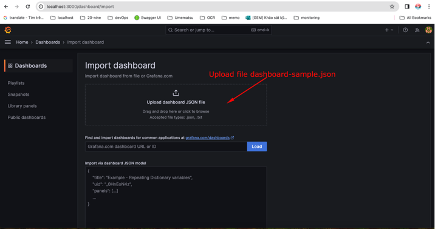
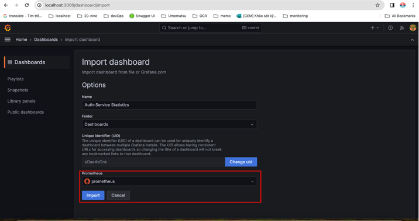
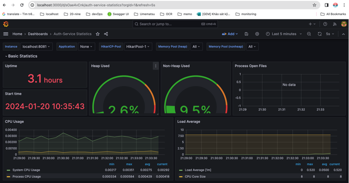

# Prometheus và Grafana trong Giám sát Hệ thống

**Grafana** và **Prometheus** là hai công cụ phổ biến trong hệ sinh thái giám sát và quản lý hệ thống, thường được sử dụng cùng nhau để giám sát hiệu năng, thu thập và phân tích dữ liệu trong các ứng dụng và hệ thống phân tán.

### **1\. Prometheus là gì?**

**Prometheus** là một hệ thống **giám sát và cảnh báo mã nguồn mở**, chuyên dùng để thu thập, lưu trữ và xử lý các số liệu (**metrics**) từ ứng dụng và hạ tầng.

1.  **Đặc điểm chính**
    
    *   **Pull-based**: Prometheus chủ động gọi HTTP (thường là `/metrics`) để lấy dữ liệu từ ứng dụng.
        
    *   **Thời gian thực**: Dữ liệu được lưu dưới dạng **time-series database (TSDB)**, hỗ trợ phân tích theo thời gian.
        
    *   **Ngôn ngữ PromQL**: Cho phép viết truy vấn phức tạp để phân tích số liệu.
        
    *   **Cảnh báo**: Kết hợp với **Alertmanager** để gửi cảnh báo qua Email, Slack, PagerDuty…
        
    *   **Exporter**: Chuyển đổi số liệu từ các dịch vụ (MySQL, Kafka, JVM, Docker…) sang định dạng Prometheus.
        
2.  **Ứng dụng**
    
    *   Giám sát **CPU, RAM, Disk I/O** của máy chủ.
        
    *   Theo dõi **hệ thống phân tán** (Kubernetes, Docker Swarm).
        
    *   Thu thập metrics từ các ứng dụng **microservices**.
        

### **2\. Grafana là gì?**

**Grafana** là một nền tảng **trực quan hóa và phân tích dữ liệu mã nguồn mở**, thường dùng để xây dựng dashboard giám sát.

1.  **Đặc điểm chính:**
    
    *   **Đa dạng nguồn dữ liệu**: Kết nối không chỉ Prometheus mà còn nhiều hệ khác như **Elasticsearch, InfluxDB, MySQL, Graphite**…
        
    *   **Dashboard mạnh mẽ**: Biểu đồ, bảng, đồ thị thời gian, gauge… để trực quan hóa số liệu.
        
    *   **Cảnh báo (Alerting)**: Cấu hình cảnh báo trực tiếp từ dashboard
        
    *   **Tùy chỉnh cao**: Hỗ trợ plugin, theme và thiết kế giao diện dashboard theo nhu cầu.
        
    *   **User management**: Quản lý người dùng (viewer, editor, admin) và phân quyền.
        
2.  **Ứng dụng:**
    
    *   Hiển thị metrics được thu thập bởi Prometheus.
        
    *   Xây dựng dashboard để giám sát hệ thống.
        
    *   Phân tích lịch sử dữ liệu để đánh giá hiệu năng.
        

### **3\. Sự kết hợp Prometheus + Grafana**

Prometheus và Grafana thường được triển khai cùng nhau:

*   **Ứng dụng (ví dụ: Spring Boot)** → Xuất metrics tại `/actuator/prometheus`.
    
*   **Prometheus** → Thu thập và lưu trữ metrics từ ứng dụng.
    
*   **Grafana** → Kết nối đến Prometheus, hiển thị dữ liệu trên dashboard dưới dạng biểu đồ.
    

📌 Nhờ sự kết hợp này:

*   Prometheus = **bộ não thu thập dữ liệu**.
    
*   Grafana = **mắt quan sát hệ thống**.
    

### **4\. Lợi ích khi sử dụng Prometheus + Grafana**

*   **Theo dõi real-time**: Giúp phát hiện nhanh các sự cố về hiệu năng.
    
*   **Cảnh báo chủ động**: Nhận thông báo ngay khi hệ thống gặp vấn đề.
    
*   **Tối ưu hóa hiệu suất**: Phân tích dữ liệu lịch sử để cải thiện hệ thống.
    
*   **Quan sát toàn diện**: Kết hợp giám sát hạ tầng, ứng dụng và microservices trong cùng dashboard.
    

✅ **Kết luận**:  
Prometheus cung cấp dữ liệu giám sát, Grafana trực quan hóa dữ liệu. Khi dùng cùng nhau, chúng tạo thành một **bộ công cụ giám sát mạnh mẽ** cho ứng dụng và hạ tầng hiện đại, đặc biệt trong môi trường **microservices và Kubernetes**.

## **5\. Tích hợp Grafana + Prometheus vào Spring Boot**

#### **1\. Cấu hình Spring Boot**

*   `pom.xml`
    

```xml
<!-- Health check -->
<dependency>
    <groupId>org.springframework.boot</groupId>
    <artifactId>spring-boot-starter-actuator</artifactId>
</dependency>
<!-- Monitoring -->
<dependency>
    <groupId>io.micrometer</groupId>
    <artifactId>micrometer-registry-prometheus</artifactId>
    <scope>runtime</scope>
</dependency>
```

*   `application.yaml`
    

```xml
management:
  endpoints:
    web:
      exposure:
        include: '*'
        # include: health,prometheus,metrics
```

#### **2\. Cài đặt và Cấu hình Prometheus**

*   Tạo file `prometheus.yaml` đặt trong folder của project với nội dung như sau:
    

```diff
# prometheus.yaml
global:
  scrape_interval: 15s

scrape_configs:
  - job_name: "prometheus"
    static_configs:
      - targets: ["localhost:9090"]
  - job_name: 'backend-service'
    metrics_path: '/actuator/prometheus'
    static_configs:
      - targets: [ 'backend-service:8080' ]
        labels:
          application: 'Backend Service'
```

*   Khởi tạo `prometheus` từ docker
    

```diff
# docker-compose.yaml
services:

  prometheus:
    image: prom/prometheus
    container_name: prometheus
    restart: unless-stopped
    command:
      - --config.file=/etc/prometheus/prometheus.yaml
    volumes:
      - ./prometheus.yaml:/etc/prometheus/prometheus.yaml
    ports:
      - '9090:9090'
```

👉 Truy cập **prometheus**: `http://localhost:9090/targets`

#### **3\. Cài đặt và Cấu hình Grafana**

**1\. Khởi tạo** `prometheus` **từ docker**

```xml
# docker-compose.yaml
services:

  grafana:
    image: grafana/grafana
    container_name: grafana
    restart: unless-stopped
    environment: # account: grafana/password
      - GF_SECURITY_ADMIN_USER=grafana
      - GF_SECURITY_ADMIN_PASSWORD=password
    ports:
      - '3000:3000'
    links:
      - prometheus
    volumes:
      - grafana:/var/lib/grafana

volumes:
  grafana:
```

**2\. Cấu hình Grafana**

👉 Truy cập **Grafana**: `http://localhost:3000/`

*   Username: `grafana`
    
*   Password: `password`
    

**📌** Tạo datasources:



**📌** Tạo dashboard:



→ [grafana-dashboard.json](https://cdn.nguyentienkhoi.hashnode.dev/production/document/grafana-dashboard.json)



