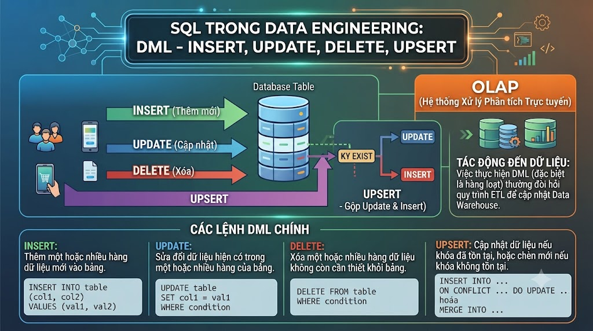

# DML: INSERT, UPDATE, DELETE và UPSERT



Từ đầu series đến giờ chúng ta chỉ **đọc** dữ liệu bằng `SELECT`. Bài này sẽ học cách **ghi** dữ liệu — thêm mới, cập nhật và xóa. Đây là nhóm lệnh DML (Data Manipulation Language) mà bất kỳ developer nào làm việc với database cũng phải thành thạo, đồng thời cũng là nhóm lệnh nguy hiểm nhất nếu dùng sai — một câu `DELETE` thiếu `WHERE` có thể xóa toàn bộ dữ liệu production trong vài giây.

## 1\. INSERT — Thêm dữ liệu mới

### INSERT một dòng

```sql
INSERT INTO table_name (col1, col2, col3)
VALUES (val1, val2, val3);
```

Thêm một học viên mới vào [nguyentienkhoi.hashnode.dev](http://nguyentienkhoi.hashnode.dev):

```sql
INSERT INTO users (
    email,
    first_name,
    last_name,
    account_status,
    email_verified
)
VALUES (
    'hieu@gmail.com',
    'Hieu',
    'Nguyen',
    'ACTIVE',
    TRUE
);
```

> **Không cần khai báo cột có DEFAULT:** Các cột như `id` (BIGSERIAL), `created_at` (DEFAULT CURRENT\_TIMESTAMP), `public_id` (DEFAULT gen\_random\_uuid()) sẽ tự động có giá trị — không cần INSERT.

### INSERT nhiều dòng cùng lúc

Thay vì chạy nhiều câu INSERT riêng lẻ, gộp chung vào một câu để nhanh hơn:

```sql
INSERT INTO courses (title, course_type, price, enrolled_count, rating)
VALUES
    ('Golang từ cơ bản đến nâng cao', 'PAID', 799000, 0, 0),
    ('Python cho Data Engineer',       'PAID', 899000, 0, 0),
    ('System Design Interview',        'PAID', 699000, 0, 0);
```

### INSERT từ kết quả SELECT

Sao chép dữ liệu từ bảng này sang bảng khác:

```sql
-- Sao chép các khóa học PUBLISHED vào bảng archive
INSERT INTO courses_archive (course_id, title, price, archived_at)
SELECT id, title, price, NOW()
FROM courses
WHERE course_status = 'PUBLISHED'
  AND end_date < NOW();
```

### RETURNING — Lấy giá trị sau khi INSERT

PostgreSQL cho phép lấy lại giá trị của dòng vừa INSERT — rất hữu ích khi cần `id` tự sinh:

```sql
INSERT INTO users (email, first_name, last_name, account_status)
VALUES ('an@gmail.com', 'An', 'Le', 'ACTIVE')
RETURNING id, public_id, created_at;
```


| id | public_id | created_at |
|---|---|---|
| 6 | 550e8400-... | 2025-03-15 14:30:00 |


## 2\. UPDATE — Cập nhật dữ liệu

```sql
UPDATE table_name
SET col1 = val1,
    col2 = val2
WHERE condition;
```

> **⚠️ LUÔN LUÔN có WHERE khi UPDATE.** `UPDATE users SET account_status = 'BANNED'` không có WHERE sẽ ban toàn bộ user trong database.

### UPDATE cơ bản

```sql
-- Xác thực email cho user sau khi click link
UPDATE users
SET email_verified = TRUE,
    updated_at     = NOW()
WHERE id = 6;
```

```sql
-- Cập nhật trạng thái đơn hàng sang PAID
UPDATE orders
SET order_status = 'PAID',
    updated_at   = NOW()
WHERE id = 7
  AND order_status = 'PENDING';  -- double-check trạng thái hiện tại
```

### UPDATE nhiều dòng cùng lúc

```sql
-- Đánh dấu tất cả token hết hạn là đã revoke
UPDATE tokens
SET revoked    = TRUE
WHERE revoked  = FALSE
  AND expires_at < NOW();
```

```sql
-- Cập nhật rating cho tất cả khóa học dựa trên bảng ratings
UPDATE courses c
SET rating     = sub.avg_rating,
    updated_at = NOW()
FROM (
    SELECT course_id, ROUND(AVG(rate), 2) AS avg_rating
    FROM ratings
    GROUP BY course_id
) AS sub
WHERE c.id = sub.course_id;
```

### UPDATE với RETURNING

```sql
-- Cập nhật và lấy về dữ liệu sau khi thay đổi
UPDATE orders
SET order_status = 'CANCELLED',
    updated_at   = NOW()
WHERE order_status = 'PENDING'
  AND created_at  < NOW() - INTERVAL '24 hours'
RETURNING id, user_id, final_amount, order_status;
```

### UPDATE dùng CTE

```sql
-- Cập nhật enrolled_count cho courses dựa trên bảng enrollments thực tế
WITH enrollment_counts AS (
    SELECT course_id, COUNT(*) AS actual_count
    FROM enrollments
    GROUP BY course_id
)
UPDATE courses c
SET enrolled_count = ec.actual_count,
    updated_at     = NOW()
FROM enrollment_counts ec
WHERE ec.course_id = c.id
  AND c.enrolled_count != ec.actual_count;  -- chỉ update khi có sự khác biệt
```

## 3\. DELETE — Xóa dữ liệu

```sql
DELETE FROM table_name
WHERE condition;
```

> **⚠️ LUÔN LUÔN có WHERE khi DELETE.** `DELETE FROM orders` không có WHERE sẽ xóa toàn bộ đơn hàng. Không có Ctrl+Z trong production.

### DELETE cơ bản

```sql
-- Xóa một user cụ thể
DELETE FROM users
WHERE id = 6;
```

```sql
-- Xóa các token đã hết hạn quá 30 ngày
DELETE FROM tokens
WHERE revoked    = TRUE
   OR expires_at < NOW() - INTERVAL '30 days';
```

### DELETE với subquery

```sql
-- Xóa các bài viết DRAFT không được cập nhật trong 90 ngày
DELETE FROM posts
WHERE id IN (
    SELECT id
    FROM posts
    WHERE post_status = 'DRAFT'
      AND updated_at < NOW() - INTERVAL '90 days'
);
```

```sql
-- Xóa các đơn hàng CANCELLED không có order_items
DELETE FROM orders
WHERE order_status = 'CANCELLED'
  AND NOT EXISTS (
      SELECT 1
      FROM order_items oi
      WHERE oi.order_id = orders.id
  );
```

### DELETE với RETURNING

```sql
-- Xóa và log lại những gì đã xóa
DELETE FROM login_histories
WHERE login_time < NOW() - INTERVAL '1 year'
RETURNING id, user_id, ip_address, login_time;
```

## 4\. TRUNCATE — Xóa toàn bộ dữ liệu nhanh

`TRUNCATE` xóa **toàn bộ** dữ liệu trong bảng, nhanh hơn `DELETE` rất nhiều vì không ghi log từng dòng:

```sql
-- Xóa toàn bộ dữ liệu trong bảng (không thể rollback mặc định)
TRUNCATE TABLE ten_bang;

-- TRUNCATE nhiều bảng cùng lúc
TRUNCATE TABLE bang_1, bang_2, bang_3;

-- TRUNCATE và reset sequence (auto-increment về 1)
TRUNCATE TABLE users RESTART IDENTITY;

-- TRUNCATE kèm CASCADE — xóa cả bảng có foreign key
TRUNCATE TABLE users CASCADE;
```

> **DELETE vs TRUNCATE vs DROP:**


|  | DELETE | TRUNCATE | DROP |
|---|---|---|---|
| Xóa gì | Dòng dữ liệu (có thể WHERE) | Toàn bộ dữ liệu | Cả bảng (cấu trúc + dữ liệu) |
| Có thể ROLLBACK | ✅ Có | ✅ Có (trong transaction) | ❌ Không |
| Trigger | ✅ Kích hoạt | ❌ Không kích hoạt | ❌ Không kích hoạt |
| Tốc độ | Chậm (ghi log) | Nhanh | Nhanh |
| Reset sequence | ❌ Không | ✅ Với RESTART IDENTITY | ✅ |


## 5\. UPSERT — INSERT hoặc UPDATE

**UPSERT** là thao tác "thêm nếu chưa có, cập nhật nếu đã có" — giải quyết bài toán phổ biến khi không biết trước record đã tồn tại hay chưa.

### INSERT ON CONFLICT DO NOTHING

```sql
-- Thêm enrollment, bỏ qua nếu đã tồn tại (không báo lỗi)
INSERT INTO enrollments (user_id, course_id)
VALUES (1, 3)
ON CONFLICT (user_id, course_id) DO NOTHING;
```

### INSERT ON CONFLICT DO UPDATE

```sql
-- Thêm hoặc cập nhật read history khi user đọc bài
INSERT INTO article_read_histories (user_id, post_id, read_count, progress)
VALUES (1, 5, 1, 45)
ON CONFLICT (user_id, post_id)
DO UPDATE SET
    read_count = article_read_histories.read_count + 1,
    progress   = EXCLUDED.progress,   -- EXCLUDED = giá trị mới muốn insert
    updated_at = NOW();
```

> `EXCLUDED` là từ khóa đặc biệt trong PostgreSQL — đại diện cho các giá trị mà câu INSERT ban đầu muốn thêm vào nhưng bị conflict.

```sql
-- Upsert user_points khi user kiếm điểm
INSERT INTO user_points (user_id, point_balance)
VALUES (1, 100)
ON CONFLICT (user_id)
DO UPDATE SET
    point_balance = user_points.point_balance + EXCLUDED.point_balance,
    updated_at    = NOW();
```

```sql
-- Upsert tracking_progress khi học viên xem video
INSERT INTO tracking_progress (student_id, lecture_id, progress, completed, completed_at)
VALUES (1, 10, 75.5, FALSE, NULL)
ON CONFLICT (student_id, lecture_id)
DO UPDATE SET
    progress     = GREATEST(tracking_progress.progress, EXCLUDED.progress),
    completed    = CASE
                       WHEN EXCLUDED.progress >= 90 THEN TRUE
                       ELSE tracking_progress.completed
                   END,
    completed_at = CASE
                       WHEN EXCLUDED.progress >= 90
                            AND tracking_progress.completed = FALSE
                       THEN NOW()
                       ELSE tracking_progress.completed_at
                   END,
    updated_at   = NOW();
```

## 6\. Thực hành an toàn — Checklist trước khi chạy DML

Đây là quy trình **bắt buộc** trước khi chạy bất kỳ lệnh UPDATE hay DELETE nào trên dữ liệu thực:

### Bước 1: SELECT trước, DML sau

```sql
-- Trước khi DELETE, luôn SELECT để xem sẽ xóa bao nhiêu dòng
SELECT id, user_id, order_status, created_at
FROM orders
WHERE order_status = 'PENDING'
  AND created_at < NOW() - INTERVAL '24 hours';
-- Xem kết quả: có đúng là những dòng cần xóa không?

-- Sau khi confirm → chạy DELETE
DELETE FROM orders
WHERE order_status = 'PENDING'
  AND created_at < NOW() - INTERVAL '24 hours';
```

### Bước 2: Dùng Transaction để có thể rollback

```sql
BEGIN;

UPDATE users
SET account_status = 'BANNED'
WHERE id IN (1, 2, 3);

-- Kiểm tra kết quả trước khi commit
SELECT id, email, account_status FROM users WHERE id IN (1, 2, 3);

-- Nếu đúng → COMMIT, nếu sai → ROLLBACK
COMMIT;
-- hoặc ROLLBACK;
```

### Bước 3: Backup trước khi làm thay đổi lớn

```sql
-- Tạo bảng backup trước khi xóa/sửa hàng loạt
CREATE TABLE orders_backup_20250315 AS
SELECT * FROM orders
WHERE order_status = 'CANCELLED';

-- Sau khi đã backup → tiến hành xóa
DELETE FROM orders
WHERE order_status = 'CANCELLED'
  AND created_at < NOW() - INTERVAL '6 months';
```

## 7\. Thực hành tổng hợp

**Bài 1:** Thêm một khóa học mới vào hệ thống, lấy về id vừa được tạo.

```sql
INSERT INTO courses (
    maker_id,
    category_id,
    title,
    slug,
    description,
    thumbnail_url,
    course_type,
    course_status,
    price
)
VALUES (
    1,
    6,
    'Kafka cho Java Developer',
    'kafka-cho-java-developer',
    'Học Apache Kafka từ cơ bản đến thực chiến với Java',
    'https://cdn.nguyentienkhoi.hashnode.dev/courses/kafka.jpg',
    'PAID',
    'DRAFT',
    799000
)
RETURNING id, slug, created_at;
```

**Bài 2:** Cập nhật trạng thái tất cả các promotions đã hết hạn (end\_at < NOW()) sang EXPIRED.

```sql
UPDATE promotions
SET status     = 'EXPIRED',
    updated_at = NOW()
WHERE status   = 'ACTIVE'
  AND end_at   < NOW()
RETURNING id, name, end_at;
```

**Bài 3:** Upsert điểm thưởng cho user — nếu chưa có bản ghi thì tạo mới, nếu có rồi thì cộng thêm điểm.

```sql
INSERT INTO user_points (user_id, point_balance)
VALUES (1, 50)
ON CONFLICT (user_id)
DO UPDATE SET
    point_balance = user_points.point_balance + EXCLUDED.point_balance,
    updated_at    = NOW()
RETURNING user_id, point_balance;
```

**Bài 4:** Xóa an toàn các bài viết DRAFT cũ — dùng transaction để có thể rollback nếu cần.

```sql
BEGIN;

-- Xem trước sẽ xóa bao nhiêu bài
SELECT id, title, updated_at
FROM posts
WHERE post_status = 'DRAFT'
  AND updated_at < NOW() - INTERVAL '90 days';

-- Backup trước
CREATE TEMP TABLE posts_to_delete AS
SELECT * FROM posts
WHERE post_status = 'DRAFT'
  AND updated_at < NOW() - INTERVAL '90 days';

-- Thực hiện xóa
DELETE FROM posts
WHERE post_status = 'DRAFT'
  AND updated_at < NOW() - INTERVAL '90 days';

-- Kiểm tra kết quả
SELECT COUNT(*) FROM posts_to_delete;  -- số dòng đã xóa

COMMIT;  -- hoặc ROLLBACK nếu có gì sai
```

## Tổng kết


| Lệnh | Chức năng | Lưu ý |
|---|---|---|
| INSERT INTO ... VALUES | Thêm một hoặc nhiều dòng | RETURNING để lấy giá trị vừa thêm |
| INSERT INTO ... SELECT | Thêm từ kết quả query | Dùng để copy/migrate dữ liệu |
| UPDATE ... SET ... WHERE | Cập nhật dòng thỏa điều kiện | Luôn có WHERE, dùng Transaction |
| DELETE FROM ... WHERE | Xóa dòng thỏa điều kiện | Luôn có WHERE, SELECT trước |
| TRUNCATE | Xóa toàn bộ bảng nhanh | Không kích hoạt trigger |
| INSERT ON CONFLICT DO NOTHING | Bỏ qua nếu đã tồn tại |  |
| INSERT ON CONFLICT DO UPDATE | Thêm hoặc cập nhật (UPSERT) | EXCLUDED = giá trị mới |


Bài tiếp theo chúng ta bước sang **Advanced** với **Database Design & Normalization** — học cách thiết kế schema đúng từ đầu để tránh những vấn đề khó sửa về sau.

> **Khác biệt với các RDBMS khác:**
> 
> *   **MySQL:** Dùng `INSERT IGNORE` thay `ON CONFLICT DO NOTHING`, `INSERT ... ON DUPLICATE KEY UPDATE` thay `ON CONFLICT DO UPDATE` — cú pháp khác nhưng tương tự về chức năng
>     
> *   **SQL Server:** Dùng `MERGE` statement để UPSERT — mạnh hơn nhưng cú pháp phức tạp hơn nhiều
>     
> *   **Oracle:** Tương tự SQL Server — dùng `MERGE INTO`
>     
> *   **RETURNING:** Chỉ có PostgreSQL hỗ trợ `RETURNING` trong INSERT/UPDATE/DELETE — MySQL và SQL Server dùng `LAST_INSERT_ID()` hoặc `OUTPUT` clause
>     

