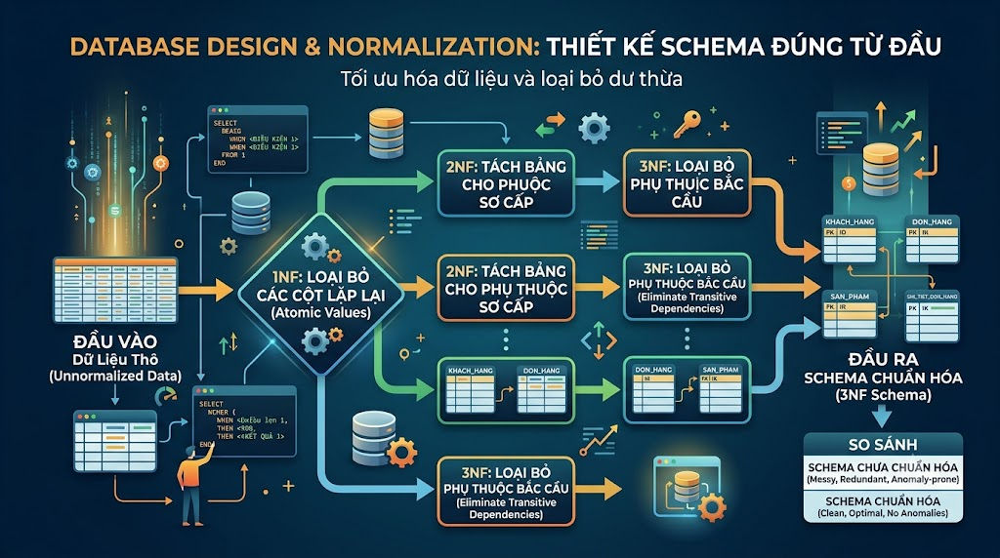

# Database Design & Normalization: Thiết Kế Schema Đúng Từ Đầu



Bước vào nhóm Advanced, chúng ta sẽ học những kỹ năng mà developer senior cần có — không chỉ viết query, mà còn thiết kế database đúng cách. Một schema được thiết kế tốt giúp code sạch hơn, query nhanh hơn, ít bug hơn và dễ mở rộng hơn. Một schema tệ sẽ là nợ kỹ thuật âm thầm ám ảnh cả team trong nhiều năm.

## 1\. Tại sao Database Design quan trọng?

Hãy xem ví dụ thực tế — một schema thiết kế tệ:

```sql
-- ❌ Bảng courses thiết kế tệ
CREATE TABLE courses_bad (
    id              INT,
    title           VARCHAR(255),
    instructor_name VARCHAR(255),   -- lặp lại mỗi khi thêm khóa học
    instructor_email VARCHAR(255),  -- nếu email thay đổi phải update N dòng
    instructor_phone VARCHAR(20),   -- dữ liệu instructor phân tán
    category        VARCHAR(255),   -- 'Database, SQL, PostgreSQL' — nhiều giá trị trong 1 cột
    tags            VARCHAR(500),   -- 'beginner,sql,database' — khó tìm kiếm
    price_vnd       INT,
    price_usd       FLOAT,          -- dùng FLOAT cho tiền — sai!
    price_eur       FLOAT
);
```

Vấn đề của schema trên:

*   **Dữ liệu lặp lại:** Mỗi khóa học lưu lại toàn bộ thông tin instructor — 100 khóa học = 100 bản sao email instructor
    
*   **Khó cập nhật:** Instructor đổi email phải UPDATE 100 dòng — dễ không nhất quán
    
*   **Khó truy vấn:** Tìm tất cả khóa học của một instructor rất phức tạp
    
*   **Nhiều giá trị trong một cột:** `category = 'Database, SQL'` — không thể filter hiệu quả
    
*   **Kiểu dữ liệu sai:** FLOAT cho tiền tệ gây sai số
    

**Normalization** (chuẩn hóa) là quá trình tổ chức lại database để loại bỏ các vấn đề trên.

## 2\. Các khái niệm nền tảng

Trước khi học Normalization, cần hiểu một số khái niệm:

### Primary Key (Khóa chính)

Cột hoặc tập hợp cột **định danh duy nhất** mỗi dòng trong bảng:

```sql
-- Surrogate key — ID tự sinh, phổ biến nhất
id BIGSERIAL PRIMARY KEY

-- Natural key — dùng giá trị thực có ý nghĩa
email VARCHAR(255) PRIMARY KEY  -- email là duy nhất

-- Composite key — kết hợp nhiều cột
CONSTRAINT enrollments_pkey PRIMARY KEY (user_id, course_id)
```

### Foreign Key (Khóa ngoại)

Cột tham chiếu đến Primary Key của bảng khác — đảm bảo tính toàn vẹn dữ liệu:

```sql
-- orders.user_id phải tồn tại trong users.id
CONSTRAINT orders_user_id_fkey
    FOREIGN KEY (user_id) REFERENCES users(id)
    ON DELETE RESTRICT   -- không cho xóa user nếu còn orders
```

### Functional Dependency (Phụ thuộc hàm)

Cột B **phụ thuộc hàm** vào cột A nếu mỗi giá trị của A xác định duy nhất một giá trị của B.

Ví dụ: `course_id → course_title` (mỗi course\_id chỉ có một title)

## 3\. First Normal Form (1NF) — Mỗi ô chỉ chứa một giá trị

**Quy tắc 1NF:**

*   Mỗi cột chỉ chứa **giá trị nguyên tử** (không phân chia được thêm)
    
*   Không có nhóm lặp lại
    
*   Mỗi dòng là duy nhất (có primary key)
    

**Vi phạm 1NF:**

```sql
-- ❌ Vi phạm 1NF — nhiều giá trị trong một cột
id | title                | tags
1  | SQL cho Developer    | 'sql,database,beginner'
2  | Spring Boot          | 'java,spring,backend'
```

Vấn đề: Tìm tất cả khóa học có tag `sql` phải dùng `LIKE '%sql%'` — không thể index, chậm với bảng lớn.

**Đưa về 1NF:**

```sql
-- ✅ Tách thành bảng riêng
-- Bảng courses
id | title
1  | SQL cho Developer
2  | Spring Boot

-- Bảng tags
id | name
1  | sql
2  | database
3  | beginner
4  | java

-- Bảng post_tags (junction table)
course_id | tag_id
1         | 1
1         | 2
1         | 3
2         | 4
```

Đây chính xác là cách [nguyentienkhoi.hashnode.dev](http://nguyentienkhoi.hashnode.dev) thiết kế — `tags`, `post_tags`, `course_skills` đều là junction table để đạt 1NF.

## 4\. Second Normal Form (2NF) — Loại bỏ phụ thuộc một phần

**Điều kiện:** Đã đạt 1NF + **Mọi cột non-key phải phụ thuộc vào toàn bộ primary key** (không phụ thuộc một phần).

2NF chỉ áp dụng khi bảng có **composite primary key**.

**Vi phạm 2NF:**

```sql
-- ❌ Vi phạm 2NF — composite key (order_id, course_id)
-- nhưng course_title chỉ phụ thuộc vào course_id, không cần order_id
order_id | course_id | course_title              | price
1        | 1         | Spring Boot từ Zero       | 799000
1        | 2         | SQL cho Developer         | 599000
2        | 1         | Spring Boot từ Zero       | 799000  ← lặp title
```

`course_title` chỉ phụ thuộc vào `course_id` — không cần `order_id` để xác định. Đây là **partial dependency** (phụ thuộc một phần).

**Đưa về 2NF:**

```sql
-- ✅ Tách course_title ra bảng courses riêng
-- Bảng courses
course_id | course_title
1         | Spring Boot từ Zero
2         | SQL cho Developer

-- Bảng order_items
order_id | course_id | price
1        | 1         | 799000
1        | 2         | 599000
2        | 1         | 799000
```

Đây đúng là cách [nguyentienkhoi.hashnode.dev](http://nguyentienkhoi.hashnode.dev) thiết kế `order_items` — chỉ lưu `course_id` và `price`, không lưu `course_title` lại.

## 5\. Third Normal Form (3NF) — Loại bỏ phụ thuộc bắc cầu

**Điều kiện:** Đã đạt 2NF + **Không có phụ thuộc bắc cầu** (transitive dependency).

Phụ thuộc bắc cầu: `A → B → C` (C phụ thuộc B, B phụ thuộc A, mà A là primary key).

**Vi phạm 3NF:**

```sql
-- ❌ Vi phạm 3NF
user_id | email           | city  | country_code | country_name
1       | nam@gmail.com   | HCM   | VN           | Vietnam
2       | linh@gmail.com  | HN    | VN           | Vietnam   ← lặp
3       | john@gmail.com  | NY    | US           | United States
```

`country_name` phụ thuộc vào `country_code`, không phụ thuộc trực tiếp vào `user_id`: `user_id → country_code → country_name`

**Đưa về 3NF:**

```sql
-- ✅ Tách countries ra bảng riêng
-- Bảng countries
code | name
VN   | Vietnam
US   | United States

-- Bảng users
user_id | email           | city | country_code
1       | nam@gmail.com   | HCM  | VN
2       | linh@gmail.com  | HN   | VN
3       | john@gmail.com  | NY   | US
```

Đây chính xác là cách [nguyentienkhoi.hashnode.dev](http://nguyentienkhoi.hashnode.dev) làm — có bảng `countries` riêng, `users` chỉ lưu `country_code`.

## 6\. Tóm tắt 3 dạng chuẩn


| Dạng chuẩn | Loại bỏ | Kiểm tra |
|---|---|---|
| 1NF | Giá trị nhiều trong một ô, nhóm lặp | Mỗi cột chỉ chứa 1 giá trị nguyên tử? |
| 2NF | Phụ thuộc một phần vào composite key | Mọi non-key column phụ thuộc toàn bộ PK? |
| 3NF | Phụ thuộc bắc cầu giữa các non-key | Non-key column có phụ thuộc non-key khác không? |


> **Quy tắc nhớ nhanh:** _"The key, the whole key, and nothing but the key"_ — Mọi cột phải phụ thuộc vào **toàn bộ** (2NF) khóa chính và **chỉ** (3NF) khóa chính.

## 7\. Khi nào nên Denormalize?

Normalization giúp tránh dư thừa dữ liệu — nhưng đôi khi **denormalize có chủ đích** lại là quyết định đúng đắn.

**Denormalize khi:**

### Tránh JOIN quá nhiều bảng ảnh hưởng hiệu năng

```sql
-- nguyentienkhoi.hashnode.dev lưu item_title trong order_items
-- dù đã có bảng courses
item_title varchar(255) NULL  -- denormalized field
```

Lý do: Khi hiển thị lịch sử mua hàng, không cần JOIN sang `courses` chỉ để lấy title. Hơn nữa, nếu sau này khóa học đổi tên, lịch sử mua hàng vẫn hiển thị đúng tên lúc mua.

### Lưu snapshot dữ liệu tại thời điểm giao dịch

```sql
-- invoices lưu lại course_title tại thời điểm mua
course_title varchar(255) NOT NULL  -- snapshot, không join sang courses
```

### Lưu giá trị tổng hợp để tránh tính toán lại

```sql
-- courses.enrolled_count được cache lại
-- thay vì COUNT(*) FROM enrollments mỗi lần query
enrolled_count int4 DEFAULT 0 NULL
```

> **Nguyên tắc:** Normalize trước, denormalize sau khi có **bằng chứng về hiệu năng**. Đừng denormalize dựa trên phỏng đoán.

## 8\. Các Pattern thiết kế phổ biến

### One-to-Many (1:N)

```sql
-- Một user có nhiều orders
users (id) ←── orders (user_id)

-- Một course có nhiều lectures
courses (id) ←── lectures (course_id)
```

### Many-to-Many (M:N) — Dùng Junction Table

```sql
-- Một user có thể enroll nhiều courses
-- Một course có thể có nhiều users
users (id) ←── enrollments (user_id, course_id) ──→ courses (id)

-- Một post có thể có nhiều tags
-- Một tag có thể gắn vào nhiều posts
posts (id) ←── post_tags (post_id, tag_id) ──→ tags (id)
```

### Self-referencing (Tự tham chiếu)

```sql
-- Category tree — category có thể là con của category khác
categories (id, parent_id) ──→ categories (id)

-- Comment thread — comment có thể reply comment khác
comments (id, parent_comment_id) ──→ comments (id)
```

### Polymorphic Association

```sql
-- Một bảng comments dùng chung cho nhiều loại đối tượng
comments (
    object_id   bigint,
    object_type varchar(20)  -- 'POST', 'COURSE', 'LECTURE'
)
```

[nguyentienkhoi.hashnode.dev](http://nguyentienkhoi.hashnode.dev) dùng pattern này cho `comments`, `likes`, `ratings` — thay vì tạo `post_comments`, `course_comments`, `lecture_comments` riêng lẻ.

## 9\. Thiết kế thực tế — Phân tích schema [nguyentienkhoi.hashnode.dev](http://nguyentienkhoi.hashnode.dev)

Hãy xem [nguyentienkhoi.hashnode.dev](http://nguyentienkhoi.hashnode.dev) áp dụng các nguyên tắc trên như thế nào:

**1NF — Không có giá trị phức hợp trong một cột:**

```sql
-- Thay vì lưu tags dạng 'sql,database,beginner'
-- Dùng junction table post_tags
post_tags (post_id, tag_id)
course_skills (course_id, skill_id)
```

**2NF — Không có partial dependency:**

```sql
-- order_items chỉ lưu price tại thời điểm mua
-- không lưu course_title (vì title thuộc về courses, không phụ thuộc order_id)
order_items (order_id, course_id, price, final_price)
```

**3NF — Không có transitive dependency:**

```sql
-- Tách countries, currencies, languages thành bảng riêng
-- users chỉ lưu country_code, không lưu country_name
users (country_code) ──→ countries (code, name)
```

**Denormalize có chủ đích:**

```sql
-- Cache enrolled_count để tránh COUNT(*) mỗi lần
courses.enrolled_count

-- Snapshot course_title trong order_items để lịch sử chính xác
order_items.item_title

-- Lưu promotion_snapshot trong promotion_usage để audit
promotion_usage.promotion_snapshot (jsonb)
```

## 10\. Checklist thiết kế schema

Trước khi tạo bảng mới, hãy tự hỏi:

```java
□ Primary key có phù hợp không? (BIGSERIAL cho bảng lớn, INT cho bảng nhỏ)
□ Mỗi cột có đúng kiểu dữ liệu không? (NUMERIC cho tiền, TIMESTAMPTZ cho giờ)
□ NOT NULL hay NULL? Mặc định đặt NOT NULL, chỉ NULL khi có lý do
□ Có cột nào chứa nhiều giá trị không? → Tách ra junction table (1NF)
□ Có cột nào phụ thuộc vào một phần PK không? → Tách ra bảng riêng (2NF)
□ Có cột nào phụ thuộc vào non-key khác không? → Tách ra bảng riêng (3NF)
□ Foreign key có đúng ON DELETE action không?
   - RESTRICT: không cho xóa parent nếu còn child (orders → users)
   - CASCADE: xóa parent thì xóa luôn child (topics → courses)
   - SET NULL: xóa parent thì child.fk = NULL (posts.reviewer_id → users)
□ Có cần index không? Cột nào hay dùng trong WHERE, JOIN, ORDER BY?
□ Cần constraint nào? CHECK, UNIQUE để đảm bảo tính đúng đắn
```

## 11\. Thực hành — Thiết kế schema cho tính năng mới

**Bài toán:** [nguyentienkhoi.hashnode.dev](http://nguyentienkhoi.hashnode.dev) muốn thêm tính năng **Flash Sale** — mỗi khóa học có thể được giảm giá trong một khoảng thời gian nhất định, số lượng slot giới hạn.

Hãy tự thiết kế trước rồi xem gợi ý bên dưới.

```sql
CREATE TABLE flash_sales (
    id            BIGSERIAL PRIMARY KEY,
    course_id     BIGINT        NOT NULL REFERENCES courses(id) ON DELETE CASCADE,
    original_price NUMERIC       NOT NULL CHECK (original_price > 0),
    sale_price     NUMERIC       NOT NULL CHECK (sale_price > 0),
    discount_pct   NUMERIC(5,2)  GENERATED ALWAYS AS
                   (ROUND((original_price - sale_price) * 100 / original_price, 2)) STORED,
    total_slots    INT           NOT NULL CHECK (total_slots > 0),
    sold_slots     INT           NOT NULL DEFAULT 0 CHECK (sold_slots >= 0),
    start_at       TIMESTAMPTZ   NOT NULL,
    end_at         TIMESTAMPTZ   NOT NULL,
    sale_status    VARCHAR(20)   NOT NULL DEFAULT 'DRAFT'
                   CHECK (sale_status IN ('DRAFT','ACTIVE','ENDED','CANCELLED')),
    created_at     TIMESTAMPTZ   NOT NULL DEFAULT CURRENT_TIMESTAMP,
    updated_at     TIMESTAMPTZ   NOT NULL DEFAULT CURRENT_TIMESTAMP,

    -- Đảm bảo end_at > start_at
    CONSTRAINT chk_flash_sale_time CHECK (end_at > start_at),
    -- Đảm bảo sold_slots không vượt total_slots
    CONSTRAINT chk_slots CHECK (sold_slots <= total_slots),
    -- Đảm bảo giá sale thấp hơn giá gốc
    CONSTRAINT chk_price CHECK (sale_price < original_price)
);

-- Index để query nhanh các flash sale đang active
CREATE INDEX idx_flash_sales_active
    ON flash_sales (sale_status, start_at, end_at)
    WHERE sale_status = 'ACTIVE';

-- Index để tìm flash sale theo khóa học
CREATE INDEX idx_flash_sales_course
    ON flash_sales (course_id, sale_status);
```

## Tổng kết


| Khái niệm | Ý nghĩa |
|---|---|
| 1NF | Mỗi ô một giá trị, không nhóm lặp |
| 2NF | Mọi non-key phụ thuộc toàn bộ PK |
| 3NF | Mọi non-key phụ thuộc trực tiếp PK, không qua non-key khác |
| Denormalize | Chủ đích lưu dư thừa để tối ưu performance |
| Junction Table | Giải quyết quan hệ M:N |
| Foreign Key | Đảm bảo tính toàn vẹn tham chiếu |


Bài tiếp theo chúng ta sẽ học **Index** — cơ chế tăng tốc query mạnh nhất trong database, hiểu đúng về index sẽ giúp bạn tối ưu được những query chậm nhất trong hệ thống.

> **Khác biệt với các RDBMS khác:**
> 
> *   **Các nguyên tắc Normalization hoàn toàn giống nhau** trên mọi RDBMS — đây là lý thuyết database, không phụ thuộc vào phần mềm
>     
> *   **PostgreSQL:** Hỗ trợ `GENERATED ALWAYS AS ... STORED` (computed column) từ version 12
>     
> *   **MySQL:** Hỗ trợ `GENERATED ALWAYS AS` tương tự
>     
> *   **SQL Server:** Dùng `COMPUTED COLUMN` với cú pháp khác nhẹ
>     
> *   **ON DELETE action:** Tất cả RDBMS đều hỗ trợ RESTRICT, CASCADE, SET NULL, SET DEFAULT
>     

