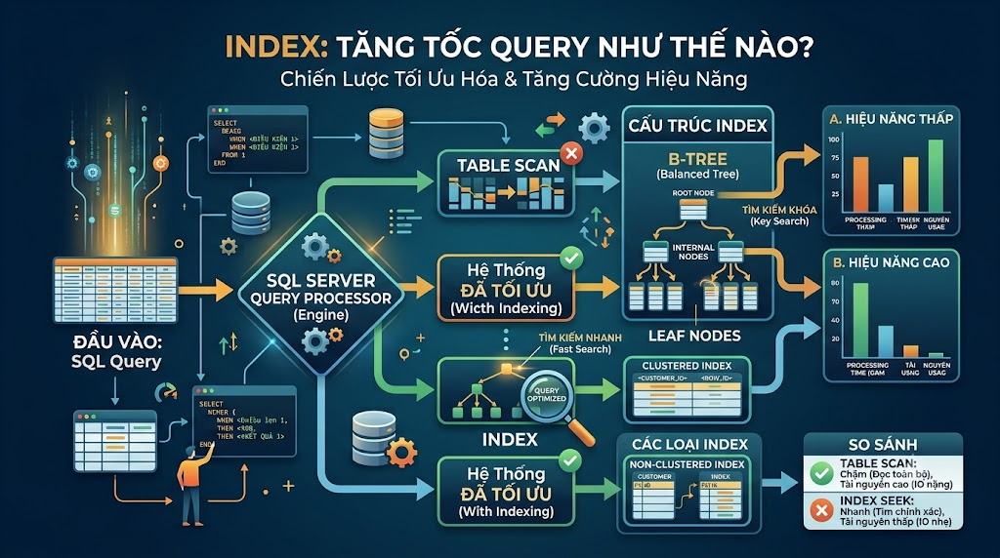

# Index: Tăng Tốc Query Như Thế Nào?



Nếu database là một cuốn sách dày 10.000 trang, thì **Index** chính là mục lục ở cuối sách. Không có mục lục, bạn phải lật từng trang để tìm — đó là **Full Table Scan**. Có mục lục, bạn tra tên chương, biết ngay trang bao nhiêu, lật thẳng đến — đó là **Index Scan**. Hiểu đúng về index là kỹ năng phân biệt developer junior và senior rõ nhất khi làm việc với database.

## 1\. Index hoạt động như thế nào?

PostgreSQL dùng cấu trúc dữ liệu **B-tree** (Balanced Tree) cho index mặc định:

```java
                    [500]
                   /     \
            [200]           [800]
           /     \         /     \
       [100]   [300]   [600]   [900]
```

Mỗi node lưu giá trị của cột được index và con trỏ đến vị trí dòng dữ liệu thực trên disk. Khi query `WHERE id = 600`, database không scan toàn bộ bảng mà duyệt cây từ root xuống — chỉ cần `log(n)` bước thay vì `n` bước.

**Không có index:**

```java
WHERE user_id = 5 → Scan toàn bộ 1 triệu dòng → 1,000 ms
```

**Có index trên user\_id:**

```java
WHERE user_id = 5 → Duyệt B-tree → tìm thẳng → 1 ms
```

## 2\. Tạo và xóa Index

```sql
-- Tạo index cơ bản
CREATE INDEX idx_orders_user_id ON orders (user_id);

-- Tạo index với tên tùy chỉnh (convention: idx_tablename_column)
CREATE INDEX idx_posts_status ON posts (post_status);

-- Xóa index
DROP INDEX idx_orders_user_id;

-- Xem toàn bộ index của một bảng
SELECT indexname, indexdef
FROM pg_indexes
WHERE tablename = 'orders';
```

## 3\. Các loại Index trong PostgreSQL

### Single Column Index — Index một cột

```sql
-- Hay dùng trong WHERE, JOIN, ORDER BY
CREATE INDEX idx_orders_user_id     ON orders (user_id);
CREATE INDEX idx_orders_status      ON orders (order_status);
CREATE INDEX idx_posts_published_at ON posts  (published_at);
```

[nguyentienkhoi.hashnode.dev](http://nguyentienkhoi.hashnode.dev) đã có sẵn các index này:

```sql
CREATE INDEX idx_orders_user   ON orders USING btree (user_id);
CREATE INDEX idx_orders_status ON orders USING btree (order_status);
CREATE INDEX idx_orders_created ON orders USING btree (created_at);
```

### Composite Index — Index nhiều cột

Index nhiều cột cùng lúc — **thứ tự cột cực kỳ quan trọng**:

```sql
-- Index (col_a, col_b, col_c)
-- Có thể dùng cho: WHERE col_a = ?
--                  WHERE col_a = ? AND col_b = ?
--                  WHERE col_a = ? AND col_b = ? AND col_c = ?
-- KHÔNG dùng được cho: WHERE col_b = ?  (bỏ qua col_a)
--                       WHERE col_c = ?  (bỏ qua col_a, col_b)

CREATE INDEX idx_order_items_catalog
    ON order_items (item_type, item_id);
```

**Nguyên tắc đặt thứ tự cột trong Composite Index:**

1.  Cột có **selectivity cao** (nhiều giá trị phân biệt) lên trước
    
2.  Cột thường dùng trong `WHERE` với điều kiện `=` lên trước
    
3.  Cột dùng trong `ORDER BY` đặt cuối
    

```sql
-- Query: Lấy các order PAID của user cụ thể, sắp xếp theo ngày
SELECT * FROM orders
WHERE user_id = 1               -- equality → đặt đầu
  AND order_status = 'PAID'     -- equality → đặt thứ 2
ORDER BY created_at DESC;       -- range/sort → đặt cuối

-- Index tối ưu cho query trên
CREATE INDEX idx_orders_user_status_date
    ON orders (user_id, order_status, created_at DESC);
```

### Unique Index — Đảm bảo giá trị duy nhất

```sql
-- Unique index vừa tăng tốc query vừa đảm bảo không trùng lặp
CREATE UNIQUE INDEX uq_users_email ON users (email);
CREATE UNIQUE INDEX uq_enrollments ON enrollments (user_id, course_id);
```

Khi tạo `UNIQUE CONSTRAINT`, PostgreSQL tự động tạo Unique Index phía sau.

### Partial Index — Index có điều kiện

Index chỉ một **subset** của dữ liệu — nhỏ hơn, nhanh hơn:

```sql
-- Chỉ index các orders chưa xử lý — bảng orders có triệu dòng
-- nhưng PENDING chỉ có vài nghìn → index rất nhỏ
CREATE INDEX idx_orders_pending
    ON orders (created_at)
    WHERE order_status = 'PENDING';

-- Chỉ index posts đã publish
CREATE INDEX idx_posts_published_only
    ON posts (published_at DESC)
    WHERE post_status = 'PUBLISHED';

-- Chỉ index promotions đang active
CREATE INDEX idx_promotion_active_window
    ON promotions (status, start_at, end_at)
    WHERE status = 'ACTIVE';
```

[nguyentienkhoi.hashnode.dev](http://nguyentienkhoi.hashnode.dev) dùng rất nhiều Partial Index — đây là dấu hiệu của schema được thiết kế tốt.

### Expression Index — Index trên biểu thức

```sql
-- Index trên LOWER(email) để tìm kiếm không phân biệt hoa thường
CREATE INDEX idx_users_email_lower ON users (LOWER(email));

-- Query tận dụng được index này
SELECT * FROM users WHERE LOWER(email) = 'nam@gmail.com';

-- Index trên tháng để query theo tháng nhanh
CREATE INDEX idx_orders_month
    ON orders (DATE_TRUNC('month', created_at));
```

### GIN Index — Cho JSON, Array, Full-text Search

```sql
-- Index cho cột JSONB
CREATE INDEX idx_promo_rule_data ON promotion_rule USING gin (rule_data);

-- Query tận dụng GIN index
SELECT * FROM promotion_rule WHERE rule_data @> '{"min_amount": 500000}';
```

## 4\. Khi nào NÊN đánh Index?

```java
✅ Cột thường xuất hiện trong WHERE với điều kiện lọc có selectivity cao
✅ Cột dùng trong JOIN (foreign key)
✅ Cột dùng trong ORDER BY khi kết hợp với WHERE
✅ Cột có UNIQUE constraint
✅ Cột thường dùng để COUNT, GROUP BY trên bảng lớn
```

Ví dụ thực tế từ [nguyentienkhoi.hashnode.dev](http://nguyentienkhoi.hashnode.dev):

```sql
-- orders.user_id — thường JOIN với users, WHERE user_id = ?
CREATE INDEX idx_orders_user ON orders (user_id);

-- posts.post_status + published_at — thường query WHERE status = 'PUBLISHED' ORDER BY published_at
CREATE INDEX idx_posts_status_published ON posts (post_status, published_at DESC);

-- login_histories.user_id — thường query lịch sử đăng nhập theo user
CREATE INDEX idx_user_id ON login_histories (user_id);
```

## 5\. Khi nào KHÔNG NÊN đánh Index?

```java
❌ Cột có ít giá trị phân biệt (low selectivity) — ví dụ: boolean, gender
❌ Bảng nhỏ (< 1000 dòng) — Full Scan còn nhanh hơn Index Scan
❌ Cột ít khi dùng trong WHERE/JOIN
❌ Bảng hay bị INSERT/UPDATE/DELETE nhiều — index làm chậm write
❌ Index đã có cột đó ở vị trí đầu (redundant index)
```

**Ví dụ index vô dụng:**

```sql
-- ❌ Boolean chỉ có 2 giá trị — index hầu như vô dụng
CREATE INDEX idx_users_email_verified ON users (email_verified);
-- Database vẫn phải đọc ~50% bảng → Full Scan nhanh hơn

-- ❌ Redundant — đã có index (user_id, order_status)
--   thì index (user_id) là thừa vì composite index đã cover
CREATE INDEX idx_orders_user_id ON orders (user_id);       -- thừa nếu đã có:
CREATE INDEX idx_orders_user_status ON orders (user_id, order_status);
```

## 6\. Index Bloat — Index cũng có chi phí

Mỗi index là một cấu trúc dữ liệu riêng cần được **duy trì** mỗi khi có INSERT, UPDATE, DELETE:

```java
INSERT 1 dòng vào orders
→ Cập nhật bảng orders              (1 write)
→ Cập nhật idx_orders_user_id       (1 write)
→ Cập nhật idx_orders_status        (1 write)
→ Cập nhật idx_orders_created       (1 write)
→ Tổng: 4 writes thay vì 1
```

Với bảng có 10 index, mỗi INSERT tốn 11 write operations. Đây là lý do tại sao không nên đánh index tràn lan.

**Kiểm tra index có đang được dùng không:**

```sql
SELECT
    schemaname,
    tablename,
    indexname,
    idx_scan   AS times_used,
    idx_tup_read,
    pg_size_pretty(pg_relation_size(indexrelid)) AS index_size
FROM pg_stat_user_indexes
WHERE schemaname = 'public'
ORDER BY idx_scan ASC;  -- index ít dùng nhất lên đầu
```

Index nào có `times_used = 0` sau vài tuần chạy production → cân nhắc xóa đi.

## 7\. Những trường hợp Index không được dùng

Đây là điểm nhiều developer không biết — có index nhưng query vẫn chậm vì **index không được sử dụng**:

### Dùng function trên cột được index

```sql
-- ❌ Index trên email bị bỏ qua vì có LOWER() bọc ngoài
CREATE INDEX idx_users_email ON users (email);
SELECT * FROM users WHERE LOWER(email) = 'nam@gmail.com';

-- ✅ Tạo Expression Index thay thế
CREATE INDEX idx_users_email_lower ON users (LOWER(email));
SELECT * FROM users WHERE LOWER(email) = 'nam@gmail.com';  -- dùng được index
```

### LIKE với wildcard ở đầu

```sql
-- ❌ Index không dùng được khi % ở đầu
SELECT * FROM posts WHERE title LIKE '%SQL%';

-- ✅ Index dùng được khi % chỉ ở cuối
SELECT * FROM posts WHERE title LIKE 'SQL%';
```

### So sánh kiểu dữ liệu khác nhau (implicit cast)

```sql
-- ❌ user_id là BIGINT nhưng so sánh với string → implicit cast → không dùng index
SELECT * FROM orders WHERE user_id = '123';

-- ✅ Đúng kiểu dữ liệu
SELECT * FROM orders WHERE user_id = 123;
```

### OR với cột khác nhau

```sql
-- ❌ OR giữa 2 cột khác nhau — optimizer thường không dùng index
SELECT * FROM users
WHERE first_name = 'Nam' OR email = 'nam@gmail.com';

-- ✅ Dùng UNION ALL thay thế
SELECT * FROM users WHERE first_name = 'Nam'
UNION ALL
SELECT * FROM users WHERE email = 'nam@gmail.com';
```

## 8\. Đo lường hiệu quả Index bằng EXPLAIN

Cách nhanh nhất để biết query có dùng index không là dùng `EXPLAIN`:

```sql
-- Xem query plan (không chạy thực)
EXPLAIN SELECT * FROM orders WHERE user_id = 1;

-- Xem query plan + chạy thực + thống kê thực tế
EXPLAIN ANALYZE SELECT * FROM orders WHERE user_id = 1;
```

Kết quả cần chú ý:

```java
-- ✅ Tốt — dùng index
Index Scan using idx_orders_user on orders
  (cost=0.43..8.45 rows=3 width=120)
  (actual time=0.021..0.025 rows=3 loops=1)

-- ❌ Cần xem xét — quét toàn bảng
Seq Scan on orders
  (cost=0.00..245.00 rows=10000 width=120)
  (actual time=0.012..12.543 rows=10000 loops=1)
```

Tao sẽ đi sâu vào EXPLAIN ANALYZE ở bài tiếp theo.

## 9\. Thực hành — Phân tích và tối ưu Index

**Bài toán:** Query sau đang chậm, hãy phân tích và đề xuất index phù hợp:

```sql
-- Query 1: Lấy danh sách bài viết PUBLISHED theo category, sắp xếp mới nhất
SELECT p.title, p.published_at, p.view_count
FROM posts p
JOIN post_categories pc ON pc.post_id = p.id
WHERE pc.category_id = 6
  AND p.post_status = 'PUBLISHED'
ORDER BY p.published_at DESC
LIMIT 20;

-- Index đề xuất:
CREATE INDEX idx_posts_status_published_at
    ON posts (post_status, published_at DESC)
    WHERE post_status = 'PUBLISHED';  -- Partial index

CREATE INDEX idx_post_categories_category
    ON post_categories (category_id, post_id);
```

```sql
-- Query 2: Tìm các khóa học có giá trong khoảng, sắp xếp theo rating
SELECT title, price, rating
FROM courses
WHERE course_type = 'PAID'
  AND price BETWEEN 500000 AND 900000
  AND course_status = 'PUBLISHED'
ORDER BY rating DESC;

-- Index đề xuất:
CREATE INDEX idx_courses_type_status_price
    ON courses (course_type, course_status, price)
    WHERE course_type = 'PAID' AND course_status = 'PUBLISHED';
```

```sql
-- Query 3: Dashboard admin — đếm số đơn hàng theo trạng thái trong 30 ngày
SELECT order_status, COUNT(*), SUM(final_amount)
FROM orders
WHERE created_at >= NOW() - INTERVAL '30 days'
GROUP BY order_status;

-- Index đề xuất:
CREATE INDEX idx_orders_created_status
    ON orders (created_at DESC, order_status);
```

## Tổng kết


| Loại Index | Dùng khi nào |
|---|---|
| Single Column | Cột hay dùng trong WHERE, JOIN đơn giản |
| Composite | Query dùng nhiều cột trong WHERE, thứ tự cột quan trọng |
| Unique | Cần đảm bảo không trùng lặp + tăng tốc lookup |
| Partial | Chỉ query một subset dữ liệu (status = 'ACTIVE') |
| Expression | Query dùng function trên cột (LOWER, DATE_TRUNC) |
| GIN | Cột JSONB, Array, Full-text search |


**Nguyên tắc vàng:**

*   Index giúp **đọc nhanh hơn** nhưng **ghi chậm hơn**
    
*   Đừng đánh index dựa trên phỏng đoán — dùng `EXPLAIN ANALYZE` để đo
    
*   Kiểm tra `pg_stat_user_indexes` định kỳ để xóa index không dùng
    
*   Partial Index là vũ khí bí mật — nhỏ, nhanh, hiệu quả
    

Bài tiếp theo chúng ta sẽ học **EXPLAIN & Query Execution Plan** — cách đọc và hiểu query plan để tìm ra đúng chỗ bottleneck trong những query chậm nhất của hệ thống.

> **Khác biệt với các RDBMS khác:**
> 
> *   **MySQL:** Hỗ trợ B-tree và FULLTEXT index, không có Partial Index — phải dùng generated column để giả lập Expression Index
>     
> *   **SQL Server:** Có **Filtered Index** tương tự Partial Index, **Included Column** trong index để cover query
>     
> *   **Oracle:** Có **Function-based Index** tương tự Expression Index, **Bitmap Index** cho cột low-cardinality (ít giá trị phân biệt)
>     
> *   **Tất cả RDBMS:** Đều có UNIQUE Index và Composite Index với nguyên tắc tương tự
>     

