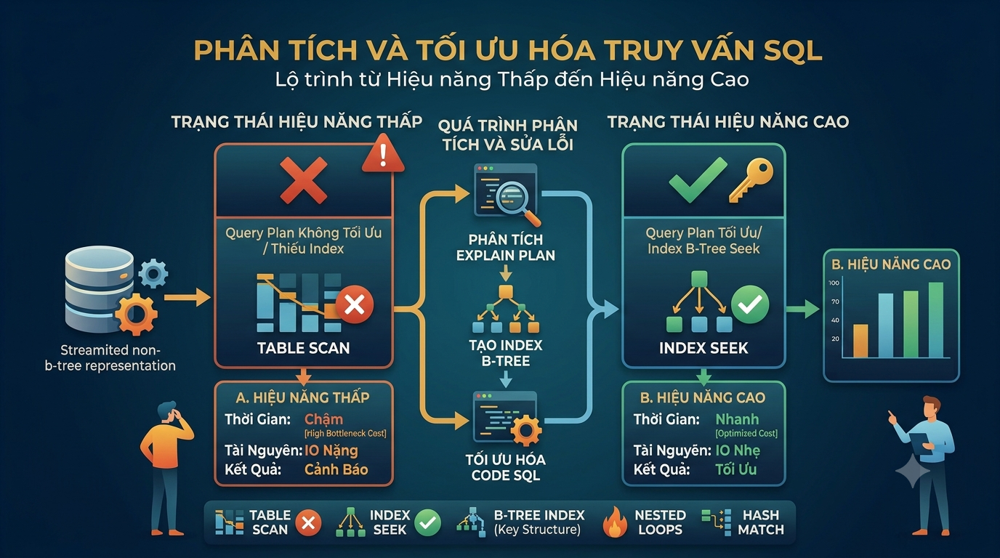

# EXPLAIN & Query Execution Plan: Đọc Hiểu Query Plan Để Tìm Bottleneck



Bài 15 bạn đã biết cách tạo index. Nhưng làm sao biết query có đang **thực sự dùng** index đó không? Làm sao tìm ra đúng chỗ chậm trong một query phức tạp JOIN 5 bảng? Câu trả lời là `EXPLAIN` — công cụ mạnh nhất để debug hiệu năng SQL. Developer senior không đoán mò tại sao query chậm — họ đọc execution plan.

## 1\. EXPLAIN vs EXPLAIN ANALYZE

```sql
-- EXPLAIN: Chỉ hiển thị kế hoạch dự kiến, KHÔNG chạy query thực
EXPLAIN SELECT * FROM orders WHERE user_id = 1;

-- EXPLAIN ANALYZE: Chạy query THỰC SỰ + hiển thị số liệu thực tế
EXPLAIN ANALYZE SELECT * FROM orders WHERE user_id = 1;

-- EXPLAIN ANALYZE với thêm thông tin chi tiết (khuyến nghị)
EXPLAIN (ANALYZE, BUFFERS, FORMAT TEXT)
SELECT * FROM orders WHERE user_id = 1;
```

> **⚠️ Lưu ý:** `EXPLAIN ANALYZE` **chạy query thật** — nếu là UPDATE hoặc DELETE thì dữ liệu sẽ thực sự bị thay đổi. Bọc trong transaction để an toàn:
> 
> ```sql
> BEGIN;
> EXPLAIN ANALYZE UPDATE orders SET order_status = 'CANCELLED' WHERE id = 1;
> ROLLBACK;
> ```

## 2\. Đọc hiểu Output của EXPLAIN

Chạy một query đơn giản:

```sql
EXPLAIN ANALYZE
SELECT * FROM orders WHERE user_id = 1 AND order_status = 'PAID';
```

Output:

```java
Index Scan using idx_orders_user on orders
  (cost=0.43..16.47 rows=2 width=120)
  (actual time=0.031..0.038 rows=2 loops=1)
  Index Cond: (user_id = 1)
  Filter: ((order_status)::text = 'PAID'::text)
  Rows Removed by Filter: 1
Planning Time: 0.215 ms
Execution Time: 0.064 ms
```

**Giải thích từng phần:**

### cost=0.43..16.47

*   **0.43** — chi phí khởi động (startup cost): chi phí trước khi trả về dòng đầu tiên
    
*   **16.47** — tổng chi phí (total cost): chi phí để hoàn thành toàn bộ node
    
*   Đây là **đơn vị ảo** (không phải ms) — chỉ dùng để so sánh tương đối giữa các plan
    

### rows=2

*   Số dòng **ước tính** mà PostgreSQL dự đoán sẽ trả về
    
*   Nếu `rows` ước tính sai nhiều so với `actual rows` → statistics lỗi thời → cần `ANALYZE`
    

### width=120

*   Kích thước trung bình (byte) của mỗi dòng trả về
    

### actual time=0.031..0.038

*   **0.031** — thời gian thực tế đến khi có dòng đầu tiên (ms)
    
*   **0.038** — thời gian thực tế hoàn thành node (ms)
    

### loops=1

*   Node này chạy bao nhiêu lần — trong Nested Loop Join, inner node có thể chạy hàng nghìn lần
    

### Planning Time vs Execution Time

*   **Planning Time** — thời gian PostgreSQL phân tích và chọn plan tối ưu
    
*   **Execution Time** — thời gian thực thi thực sự
    

## 3\. Các Node phổ biến trong Execution Plan

### Seq Scan — Quét tuần tự toàn bộ bảng

```java
Seq Scan on courses
  (cost=0.00..1.05 rows=5 width=200)
```

Đọc từng dòng từ đầu đến cuối bảng. Không xấu nếu:

*   Bảng nhỏ (< vài nghìn dòng)
    
*   Query lấy về phần lớn dữ liệu (> 10-20% bảng)
    

### Index Scan — Dùng index để tìm dòng

```java
Index Scan using idx_orders_user on orders
  (cost=0.43..8.45 rows=3 width=120)
  Index Cond: (user_id = 1)
```

Duyệt B-tree index để tìm vị trí dòng, sau đó fetch dòng thực từ heap (bảng chính). Tốt cho query trả về ít dòng.

### Index Only Scan — Chỉ đọc index, không đọc bảng

```java
Index Only Scan using idx_orders_user_status on orders
  (cost=0.43..4.45 rows=2 width=16)
  Index Cond: ((user_id = 1) AND (order_status = 'PAID'))
  Heap Fetches: 0
```

Tất cả dữ liệu cần đã có trong index — không cần truy cập heap. **Nhanh nhất** trong 3 loại scan. Xảy ra khi tất cả cột trong SELECT và WHERE đều nằm trong index.

### Bitmap Index Scan + Bitmap Heap Scan

```java
Bitmap Heap Scan on orders
  (cost=4.43..28.45 rows=10 width=120)
  Recheck Cond: (user_id = 1)
  ->  Bitmap Index Scan on idx_orders_user
        (cost=0.00..4.43 rows=10 width=0)
```

Dùng khi query trả về nhiều dòng hơn Index Scan nhưng ít hơn Seq Scan. PostgreSQL tạo bitmap các page cần đọc, sau đó đọc heap theo thứ tự vật lý — hiệu quả hơn random I/O của Index Scan khi có nhiều dòng.

## 4\. Các Node JOIN trong Execution Plan

### Nested Loop Join — Vòng lặp lồng nhau

```java
Nested Loop
  ->  Index Scan on users (outer)
  ->  Index Scan on orders (inner)
        Index Cond: (user_id = users.id)
```

Với mỗi dòng của bảng outer, scan bảng inner để tìm dòng khớp. Hiệu quả khi:

*   Bảng outer nhỏ
    
*   Inner có index tốt
    
*   Kết quả trả về ít dòng
    

### Hash Join — Dùng bảng hash

```java
Hash Join
  Hash Cond: (orders.user_id = users.id)
  ->  Seq Scan on orders
  ->  Hash
        ->  Seq Scan on users
```

Build hash table từ bảng nhỏ hơn, probe bảng lớn hơn. Hiệu quả cho:

*   JOIN bảng lớn không có index phù hợp
    
*   Equi-join (chỉ `=`)
    

### Merge Join — Merge 2 luồng đã sắp xếp

```java
Merge Join
  Merge Cond: (orders.user_id = users.id)
  ->  Sort on users.id
  ->  Sort on orders.user_id
```

Hiệu quả khi cả hai bảng đã được sắp xếp theo cột join (có index). Tốt cho large dataset.

## 5\. Đọc Plan Theo Thứ Tự Đúng

Execution plan đọc từ **trong ra ngoài, từ dưới lên trên** — node con chạy trước, kết quả truyền lên node cha:

```sql
EXPLAIN ANALYZE
SELECT
    u.first_name,
    c.title,
    o.final_amount
FROM orders o
JOIN users   u ON u.id = o.user_id
JOIN order_items oi ON oi.order_id = o.id
JOIN courses c  ON c.id = oi.course_id
WHERE o.order_status = 'PAID'
  AND o.created_at >= '2025-01-01';
```

```java
Hash Join  (cost=45.23..89.12 rows=20 width=80)        ← 5. Join kết quả với courses
  Hash Cond: (oi.course_id = c.id)
  ->  Hash Join  (cost=25.12..60.34 rows=20 width=60)  ← 4. Join với order_items
        Hash Cond: (o.id = oi.order_id)
        ->  Hash Join  (cost=10.43..40.21 rows=20)     ← 3. Join orders với users
              Hash Cond: (o.user_id = u.id)
              ->  Index Scan on orders  (...)           ← 1. Quét orders trước (có WHERE)
                    Index Cond: (order_status = 'PAID')
                    Filter: (created_at >= '2025-01-01')
              ->  Hash                                  ← 2. Build hash table từ users
                    ->  Seq Scan on users
        ->  Seq Scan on order_items                    ← song song với bước 3
  ->  Hash                                             ← song song
        ->  Seq Scan on courses
```

**Cách đọc:** Node số 1 chạy đầu tiên, kết quả đẩy lên node cha lần lượt.

## 6\. Những Dấu Hiệu Cần Chú Ý

### Rows ước tính sai nhiều so với thực tế

```java
Seq Scan on orders
  (cost=0.00..245.00 rows=10 width=120)    ← ước tính: 10 dòng
  (actual time=0.012..15.43 rows=8547 loops=1)  ← thực tế: 8547 dòng!
```

**Rows ước tính sai** → optimizer chọn plan sai → query chậm. Nguyên nhân thường là statistics lỗi thời.

```sql
-- Cập nhật statistics cho bảng
ANALYZE orders;

-- Hoặc cho toàn bộ database
ANALYZE;
```

### Seq Scan trên bảng lớn với filter chặt

```java
Seq Scan on video_tracking_logs  (cost=0.00..125000.00 rows=50 ...)
  Filter: (watcher_id = 1 AND video_action = 'COMPLETE_QUIZ')
  Rows Removed by Filter: 9999950
```

Scan 10 triệu dòng để lấy 50 dòng — **cần index**.

### Nested Loop với loops lớn

```java
Nested Loop  (actual time=0.021..8543.21 rows=1000 loops=1)
  ->  Seq Scan on courses  (rows=100 loops=1)
  ->  Index Scan on enrollments  (actual time=0.085..0.085 rows=10 loops=100)
```

Inner node chạy 100 lần (loops=100) × 0.085ms = 8.5ms tổng — nhân lên với dataset lớn hơn sẽ rất chậm.

### Sort tốn bộ nhớ

```java
Sort  (cost=1500.00..1600.00 rows=10000 width=120)
  Sort Key: created_at DESC
  Sort Method: external merge  Disk: 2048kB   ← ⚠️ Phải dùng disk!
```

`external merge Disk` nghĩa là sort phải dùng disk vì không đủ RAM. Cần tăng `work_mem` hoặc thêm index để tránh sort.

## 7\. Workflow Debug Query Chậm

Đây là quy trình FoxDev hay dùng khi gặp query chậm:

```java
Bước 1: Chạy EXPLAIN ANALYZE
         ↓
Bước 2: Tìm node có actual time lớn nhất
         ↓
Bước 3: Kiểm tra
    - Seq Scan trên bảng lớn? → Cần index
    - Rows ước tính sai nhiều? → Chạy ANALYZE
    - Nested Loop với loops lớn? → Cần index cho inner table
    - Sort dùng disk? → Tăng work_mem hoặc thêm index
    - Filter loại bỏ quá nhiều dòng? → Cần index hoặc rewrite query
         ↓
Bước 4: Thêm index / Rewrite query
         ↓
Bước 5: Chạy lại EXPLAIN ANALYZE, so sánh kết quả
```

## 8\. Ví dụ Thực Tế — Debug Query Chậm

**Bài toán:** Query lấy bài viết cho trang chủ đang mất 800ms, cần tối ưu xuống dưới 50ms.

```sql
-- Query ban đầu — chậm
EXPLAIN ANALYZE
SELECT
    p.id,
    p.title,
    p.slug,
    p.view_count,
    p.published_at,
    u.first_name || ' ' || u.last_name AS author_name,
    array_agg(t.name) AS tags
FROM posts p
JOIN users u ON u.id = p.writer_id
JOIN post_tags pt ON pt.post_id = p.id
JOIN tags t ON t.id = pt.tag_id
WHERE p.post_status = 'PUBLISHED'
  AND p.post_type = 'TECHNOLOGY'
ORDER BY p.published_at DESC
LIMIT 10;
```

**Kết quả EXPLAIN ANALYZE:**

```java
Limit  (actual time=798.234..798.241 rows=10)
  ->  Sort  (actual time=798.231..798.234 rows=10)
        Sort Key: p.published_at DESC
        Sort Method: quicksort  Memory: 32kB
        ->  Hash Join  (actual time=0.234..795.123 rows=150)
              ->  Hash Join  (actual time=0.123..790.432 rows=150)
                    ->  Seq Scan on posts p         ← ⚠️ Seq Scan!
                          Filter: (post_status='PUBLISHED' AND post_type='TECHNOLOGY')
                          Rows Removed by Filter: 850
                    ->  Hash
                          ->  Seq Scan on users u
              ->  Hash
                    ->  Seq Scan on post_tags pt    ← ⚠️ Seq Scan!
```

**Phân tích:**

*   `Seq Scan on posts` với filter `post_status + post_type` — cần Partial Index
    
*   `Seq Scan on post_tags` — cần index trên `post_id`
    
*   Sort trước khi LIMIT — nếu có index trên `published_at` thì tránh được sort
    

**Giải pháp:**

```sql
-- Index 1: Partial index cho bài viết PUBLISHED TECHNOLOGY
CREATE INDEX idx_posts_tech_published
    ON posts (published_at DESC)
    WHERE post_status = 'PUBLISHED'
      AND post_type = 'TECHNOLOGY';

-- Index 2: Index cho post_tags.post_id
CREATE INDEX idx_post_tags_post_id ON post_tags (post_id);

-- Index 3: Index cho post_tags.tag_id (nếu chưa có)
CREATE INDEX idx_post_tags_tag_id ON post_tags (tag_id);
```

**Kết quả sau khi thêm index:**

```java
Limit  (actual time=1.234..1.241 rows=10)
  ->  Nested Loop  (actual time=0.234..1.123 rows=10)
        ->  Index Scan using idx_posts_tech_published on posts
              (actual time=0.021..0.234 rows=10)   ← ✅ Dùng index, chỉ lấy 10 dòng
        ->  Index Scan using idx_post_tags_post_id
              (actual time=0.012..0.045 rows=3)
```

Từ **798ms xuống còn 1.2ms** — nhanh hơn 665 lần.

## 9\. Một Số Câu Query Hữu Ích Để Monitor

```sql
-- Tìm các query chậm nhất đang chạy hiện tại
SELECT
    pid,
    now() - query_start AS duration,
    query,
    state
FROM pg_stat_activity
WHERE state = 'active'
  AND query_start < NOW() - INTERVAL '5 seconds'
ORDER BY duration DESC;
```

```sql
-- Tìm các query chậm nhất trong lịch sử (cần bật pg_stat_statements)
SELECT
    calls,
    ROUND(mean_exec_time::numeric, 2)  AS avg_ms,
    ROUND(total_exec_time::numeric, 2) AS total_ms,
    rows,
    query
FROM pg_stat_statements
ORDER BY mean_exec_time DESC
LIMIT 20;
```

```sql
-- Kiểm tra table bloat — bảng nào đang chiếm nhiều không gian nhất
SELECT
    relname                               AS table_name,
    pg_size_pretty(pg_total_relation_size(oid)) AS total_size,
    pg_size_pretty(pg_relation_size(oid))       AS table_size,
    pg_size_pretty(pg_indexes_size(oid))        AS index_size
FROM pg_class
WHERE relkind = 'r'
  AND relnamespace = 'public'::regnamespace
ORDER BY pg_total_relation_size(oid) DESC
LIMIT 20;
```

## 10\. Thực hành — Đọc Execution Plan

Đây là một execution plan thực tế, hãy đọc và xác định vấn đề:

```sql
EXPLAIN ANALYZE
SELECT
    u.email,
    COUNT(o.id)         AS total_orders,
    SUM(o.final_amount) AS total_spent
FROM users u
LEFT JOIN orders o ON o.user_id = u.id
WHERE u.account_status = 'ACTIVE'
GROUP BY u.id, u.email
HAVING SUM(o.final_amount) > 500000
ORDER BY total_spent DESC;
```

```java
Sort  (cost=450.23..451.23 rows=400 width=60)
      (actual time=45.234..45.241 rows=3)
  Sort Key: (sum(o.final_amount)) DESC
  ->  HashAggregate  (cost=428.12..432.12 rows=400 width=60)
                     (actual time=45.123..45.189 rows=3)
        Filter: (sum(o.final_amount) > 500000)
        Rows Removed by Filter: 2
        ->  Hash Left Join  (cost=10.50..390.23 rows=1000 width=40)
                            (actual time=0.234..44.231 rows=1000 loops=1)
              Hash Cond: (o.user_id = u.id)
              ->  Seq Scan on orders o             ← ①
                    (actual time=0.012..15.231 rows=7 loops=1)
              ->  Hash
                    ->  Seq Scan on users u        ← ②
                          Filter: (account_status = 'ACTIVE')
                          Rows Removed by Filter: 1
Planning Time: 1.234 ms
Execution Time: 45.312 ms
```

**Phân tích:**

*   ① Seq Scan on orders — bảng orders hiện nhỏ nên ổn, nhưng khi scale lên cần index trên user\_id
    
*   ② Seq Scan on users với filter account\_status = 'ACTIVE' — nếu phần lớn users đều ACTIVE thì Seq Scan là đúng. Nếu ACTIVE chỉ chiếm 10% thì cần Partial Index
    
*   Cải thiện cho tương lai khi scale:
    

```sql
CREATE INDEX idx_users_active
    ON users (id)
    WHERE account_status = 'ACTIVE';

CREATE INDEX idx_orders_user_amount
    ON orders (user_id, final_amount)
    WHERE final_amount > 0;
```

## Tổng kết


| Keyword trong Plan | Ý nghĩa |
|---|---|
| Seq Scan | Full table scan — xem xét nếu bảng lớn |
| Index Scan | Dùng index + fetch heap |
| Index Only Scan | Chỉ đọc index, nhanh nhất |
| Bitmap Heap Scan | Nhiều dòng, đọc heap theo batch |
| Nested Loop | Join lồng nhau — tốt cho inner nhỏ có index |
| Hash Join | Join dùng hash table — tốt cho large table |
| Merge Join | Join 2 luồng đã sort |
| Sort ... Disk | Sort phải dùng disk — tăng work_mem |
| rows=X / actual rows=Y | X sai nhiều so với Y → chạy ANALYZE |
| loops=N | Node chạy N lần — nhân thời gian với N |


Bài tiếp theo chúng ta sẽ học **Transaction & ACID** — nền tảng để đảm bảo dữ liệu nhất quán khi nhiều thao tác cùng xảy ra một lúc, và cách xử lý các tình huống như deadlock, dirty read trong thực tế.

> **Khác biệt với các RDBMS khác:**
> 
> *   **MySQL:** Dùng `EXPLAIN` tương tự nhưng output format khác, có thêm `EXPLAIN FORMAT=JSON` và `EXPLAIN FORMAT=TREE`. Không có `EXPLAIN (BUFFERS)`
>     
> *   **SQL Server:** Dùng `SET STATISTICS IO ON` + `SET STATISTICS TIME ON` hoặc Execution Plan trong SSMS (giao diện đồ họa)
>     
> *   **Oracle:** Dùng `EXPLAIN PLAN FOR` + `SELECT * FROM TABLE(DBMS_XPLAN.DISPLAY)`, có thêm `AUTOTRACE` trong SQL\*Plus
>     
> *   **Tất cả RDBMS:** Đều có công cụ tương tự, khái niệm Seq Scan, Index Scan, Hash Join, Nested Loop đều tồn tại với tên gọi tương đương
>     

