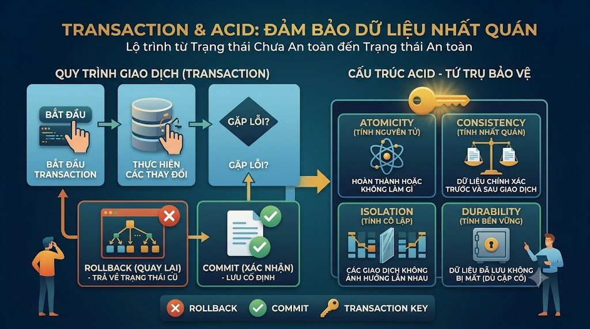

# Transaction & ACID: Đảm Bảo Dữ Liệu Nhất Quán



Hãy tưởng tượng hệ thống [nguyentienkhoi.hashnode.dev](http://nguyentienkhoi.hashnode.dev) đang xử lý thanh toán: trừ tiền từ ví học viên, tạo đơn hàng, kích hoạt enrollment. Nếu bước 2 thành công nhưng bước 3 lỗi — học viên mất tiền nhưng không có khóa học. Đây chính xác là bài toán **Transaction** giải quyết: đảm bảo một nhóm thao tác hoặc **thành công tất cả** hoặc **thất bại tất cả** — không có trạng thái nửa vời.

## 1\. Transaction là gì?

**Transaction** là một đơn vị công việc gồm một hoặc nhiều thao tác SQL được thực thi như một khối thống nhất.

```sql
BEGIN;                          -- bắt đầu transaction

    UPDATE user_wallets         -- bước 1: trừ tiền ví
    SET balance = balance - 799000
    WHERE user_id = 1;

    INSERT INTO orders          -- bước 2: tạo đơn hàng
    (user_id, order_status, final_amount)
    VALUES (1, 'PAID', 799000);

    INSERT INTO enrollments     -- bước 3: kích hoạt enrollment
    (user_id, course_id)
    VALUES (1, 1);

COMMIT;                         -- xác nhận toàn bộ thay đổi
-- hoặc ROLLBACK để hoàn tác toàn bộ nếu có lỗi
```

Nếu bất kỳ bước nào lỗi và gọi `ROLLBACK`, **toàn bộ 3 bước đều bị hoàn tác** — ví học viên không bị trừ tiền, không có đơn hàng nửa vời.

## 2\. ACID — 4 Tính Chất Của Transaction

**ACID** là 4 tính chất mà một transaction trong RDBMS phải đảm bảo:

### A — Atomicity (Tính nguyên tử)

> **"All or nothing"** — Toàn bộ transaction thành công hoặc toàn bộ thất bại. Không có trạng thái trung gian.

```sql
BEGIN;
    UPDATE user_wallets SET balance = balance - 799000 WHERE user_id = 1;
    INSERT INTO orders (user_id, final_amount) VALUES (1, 799000);
    -- Giả sử dòng này lỗi (ví dụ: constraint violation)
    INSERT INTO enrollments (user_id, course_id) VALUES (1, 999);  -- course_id không tồn tại!
COMMIT;
-- PostgreSQL tự động ROLLBACK toàn bộ
-- Ví học viên không bị trừ tiền
```

### C — Consistency (Tính nhất quán)

> Transaction đưa database từ **trạng thái hợp lệ này sang trạng thái hợp lệ khác**, không vi phạm bất kỳ constraint nào.

```sql
-- Constraint đảm bảo Consistency
ALTER TABLE user_wallets
    ADD CONSTRAINT chk_balance_non_negative
    CHECK (balance >= 0);

-- Transaction sau sẽ fail nếu balance âm
BEGIN;
    UPDATE user_wallets
    SET balance = balance - 9999999  -- số tiền lớn hơn số dư
    WHERE user_id = 1;
    -- ERROR: new row violates check constraint "chk_balance_non_negative"
    -- Transaction tự động rollback → balance không bị âm
COMMIT;
```

### I — Isolation (Tính cô lập)

> Các transaction đồng thời **không ảnh hưởng lẫn nhau** — mỗi transaction thấy dữ liệu nhất quán.

Đây là tính chất phức tạp nhất — FoxDev sẽ giải thích chi tiết ở phần Isolation Levels bên dưới.

### D — Durability (Tính bền vững)

> Sau khi `COMMIT`, dữ liệu được **lưu vĩnh viễn** — kể cả khi server bị crash ngay sau đó.

PostgreSQL đảm bảo Durability thông qua **WAL (Write-Ahead Log)** — ghi log trước khi ghi vào bảng thực, giúp phục hồi dữ liệu sau khi crash.

## 3\. Cú Pháp Transaction

```sql
-- Bắt đầu transaction
BEGIN;
-- hoặc
START TRANSACTION;

-- Xác nhận thay đổi
COMMIT;

-- Hoàn tác toàn bộ thay đổi
ROLLBACK;
```

### SAVEPOINT — Điểm lưu giữa chừng

Cho phép rollback về một điểm cụ thể mà không hoàn tác toàn bộ transaction:

```sql
BEGIN;

    INSERT INTO orders (user_id, final_amount, order_status)
    VALUES (1, 799000, 'PAID');

    SAVEPOINT before_enrollment;   -- đặt điểm lưu

    INSERT INTO enrollments (user_id, course_id)
    VALUES (1, 999);               -- lỗi: course 999 không tồn tại

    -- Chỉ rollback đến SAVEPOINT, không rollback cả transaction
    ROLLBACK TO SAVEPOINT before_enrollment;

    -- Thử lại với course_id đúng
    INSERT INTO enrollments (user_id, course_id)
    VALUES (1, 1);

COMMIT;
-- Kết quả: order được tạo + enrollment hợp lệ được thêm
```

### Autocommit

Trong PostgreSQL, **mỗi câu SQL đơn lẻ ngoài BEGIN/COMMIT là một transaction ngầm**:

```sql
-- Không có BEGIN → đây là một transaction ngầm, tự COMMIT sau khi chạy xong
UPDATE users SET account_status = 'ACTIVE' WHERE id = 1;

-- Tương đương với:
BEGIN;
UPDATE users SET account_status = 'ACTIVE' WHERE id = 1;
COMMIT;
```

## 4\. Isolation Levels — Mức Độ Cô Lập

Đây là phần phức tạp và quan trọng nhất của Transaction. Khi nhiều transaction chạy đồng thời, có thể xảy ra các **anomaly** (hiện tượng bất thường):

### Các Anomaly Cần Biết

**Dirty Read** — Đọc dữ liệu chưa COMMIT của transaction khác:

```java
Transaction A: UPDATE orders SET final_amount = 0 WHERE id = 1;  -- chưa COMMIT
Transaction B: SELECT final_amount FROM orders WHERE id = 1;      -- đọc được 0!
Transaction A: ROLLBACK;   -- A rollback, nhưng B đã đọc giá trị sai
```

**Non-repeatable Read** — Đọc cùng dòng 2 lần cho kết quả khác nhau:

```java
Transaction A: SELECT price FROM courses WHERE id = 1;  -- đọc: 799000
Transaction B: UPDATE courses SET price = 599000 WHERE id = 1; COMMIT;
Transaction A: SELECT price FROM courses WHERE id = 1;  -- đọc: 599000 ← khác!
```

**Phantom Read** — Query cùng điều kiện trả về số dòng khác nhau:

```java
Transaction A: SELECT COUNT(*) FROM orders WHERE user_id = 1;  -- kết quả: 3
Transaction B: INSERT INTO orders (user_id, ...) VALUES (1, ...); COMMIT;
Transaction A: SELECT COUNT(*) FROM orders WHERE user_id = 1;  -- kết quả: 4 ← khác!
```

**Lost Update** — 2 transaction cùng update, một cái bị ghi đè:

```java
Transaction A: SELECT balance FROM user_wallets WHERE user_id = 1;  -- đọc: 1000
Transaction B: SELECT balance FROM user_wallets WHERE user_id = 1;  -- đọc: 1000
Transaction A: UPDATE user_wallets SET balance = 1000 - 300 = 700 WHERE user_id = 1;
Transaction B: UPDATE user_wallets SET balance = 1000 - 500 = 500 WHERE user_id = 1;
-- Kết quả cuối: 500, nhưng đúng phải là 1000 - 300 - 500 = 200!
```

### 4 Isolation Levels


| Isolation Level | Dirty Read | Non-repeatable Read | Phantom Read |
|---|---|---|---|
| READ UNCOMMITTED | ✅ Có thể | ✅ Có thể | ✅ Có thể |
| READ COMMITTED | ❌ Không | ✅ Có thể | ✅ Có thể |
| REPEATABLE READ | ❌ Không | ❌ Không | ❌ Không (*) |
| SERIALIZABLE | ❌ Không | ❌ Không | ❌ Không |


> (\*) PostgreSQL REPEATABLE READ thực sự ngăn cả Phantom Read — mạnh hơn SQL standard.

```sql
-- Đặt isolation level cho transaction
BEGIN TRANSACTION ISOLATION LEVEL READ COMMITTED;
BEGIN TRANSACTION ISOLATION LEVEL REPEATABLE READ;
BEGIN TRANSACTION ISOLATION LEVEL SERIALIZABLE;

-- Đặt mặc định cho session
SET default_transaction_isolation = 'repeatable read';
```

### Khi nào dùng Isolation Level nào?

**READ COMMITTED (mặc định của PostgreSQL)** — Dùng cho hầu hết các trường hợp:

```sql
-- Đọc báo cáo, dashboard, hiển thị dữ liệu
BEGIN TRANSACTION ISOLATION LEVEL READ COMMITTED;
    SELECT * FROM orders WHERE created_at >= '2025-01-01';
COMMIT;
```

**REPEATABLE READ** — Khi cần đảm bảo dữ liệu nhất quán trong suốt transaction dài:

```sql
-- Xuất báo cáo tài chính — không muốn dữ liệu thay đổi giữa chừng
BEGIN TRANSACTION ISOLATION LEVEL REPEATABLE READ;
    SELECT SUM(final_amount) FROM orders WHERE order_status = 'PAID';
    -- ... xử lý ...
    SELECT COUNT(*) FROM enrollments WHERE course_id = 1;
    -- Cả 2 query đều thấy snapshot dữ liệu tại thời điểm BEGIN
COMMIT;
```

**SERIALIZABLE** — Khi cần đảm bảo tuyệt đối, dùng cho các thao tác tài chính quan trọng:

```sql
-- Chuyển tiền giữa 2 ví — không cho phép bất kỳ anomaly nào
BEGIN TRANSACTION ISOLATION LEVEL SERIALIZABLE;
    UPDATE user_wallets SET balance = balance - 500000 WHERE user_id = 1;
    UPDATE user_wallets SET balance = balance + 500000 WHERE user_id = 2;
COMMIT;
```

## 5\. Locking — Cơ Chế Khóa

Transaction dùng **lock** để ngăn các transaction khác can thiệp:

### Row-level Lock

```sql
-- SELECT FOR UPDATE — lock dòng để update
-- Các transaction khác phải chờ đến khi transaction này COMMIT/ROLLBACK
BEGIN;
    SELECT balance
    FROM user_wallets
    WHERE user_id = 1
    FOR UPDATE;                 -- lock dòng này lại

    UPDATE user_wallets
    SET balance = balance - 799000
    WHERE user_id = 1;
COMMIT;
```

```sql
-- SELECT FOR UPDATE SKIP LOCKED — bỏ qua dòng đang bị lock
-- Hữu ích cho job queue — nhiều worker lấy task mà không block nhau
BEGIN;
    SELECT id, title
    FROM jobs_queue
    WHERE status = 'PENDING'
    ORDER BY created_at
    LIMIT 1
    FOR UPDATE SKIP LOCKED;    -- lấy task chưa bị worker khác lock
COMMIT;
```

### Advisory Lock — Lock tùy chỉnh

```sql
-- Lock theo một số nguyên tùy chỉnh — dùng để đảm bảo chỉ 1 process chạy một lúc
SELECT pg_try_advisory_lock(12345);  -- trả về TRUE nếu lock thành công
-- ... thực hiện công việc ...
SELECT pg_advisory_unlock(12345);    -- giải phóng lock
```

## 6\. Deadlock — Khi 2 Transaction Chờ Nhau

**Deadlock** xảy ra khi 2 transaction đang chờ lock của nhau — không ai nhường ai:

```java
Transaction A đang giữ lock trên user_wallets(user_id=1)
Transaction B đang giữ lock trên user_wallets(user_id=2)

Transaction A muốn lock user_wallets(user_id=2) → chờ B
Transaction B muốn lock user_wallets(user_id=1) → chờ A
→ DEADLOCK!
```

PostgreSQL tự động phát hiện deadlock và **kill một trong 2 transaction** (kẻ yếu hơn):

```java
ERROR: deadlock detected
DETAIL: Process 1234 waits for ShareLock on transaction 5678;
        blocked by process 5678.
        Process 5678 waits for ShareLock on transaction 1234;
        blocked by process 1234.
HINT: See server log for query details.
```

### Cách Tránh Deadlock

```sql
-- ❌ Dễ deadlock — 2 transaction lock theo thứ tự ngược nhau
-- Transaction A:
UPDATE user_wallets SET balance = balance - 500 WHERE user_id = 1;  -- lock user 1 trước
UPDATE user_wallets SET balance = balance + 500 WHERE user_id = 2;  -- lock user 2 sau

-- Transaction B:
UPDATE user_wallets SET balance = balance - 300 WHERE user_id = 2;  -- lock user 2 trước
UPDATE user_wallets SET balance = balance + 300 WHERE user_id = 1;  -- lock user 1 sau

-- ✅ Tránh deadlock — luôn lock theo thứ tự ID tăng dần
-- Cả A và B đều lock user_id nhỏ hơn trước
-- Transaction A: lock user 1 → lock user 2
-- Transaction B: lock user 1 (chờ A) → sau khi A commit mới lock user 1
BEGIN;
    SELECT * FROM user_wallets
    WHERE user_id IN (1, 2)
    ORDER BY user_id              -- lock theo thứ tự nhất quán
    FOR UPDATE;

    UPDATE user_wallets SET balance = balance - 500 WHERE user_id = 1;
    UPDATE user_wallets SET balance = balance + 500 WHERE user_id = 2;
COMMIT;
```

## 7\. Ví Dụ Thực Tế — Xử Lý Thanh Toán [nguyentienkhoi.hashnode.dev](http://nguyentienkhoi.hashnode.dev)

Đây là luồng xử lý thanh toán đầy đủ với transaction:

```sql
BEGIN;

-- Bước 1: Kiểm tra và lock ví học viên
SELECT balance
FROM user_wallets
WHERE user_id = 1
FOR UPDATE;  -- lock để tránh race condition

-- Giả sử application code kiểm tra balance >= 799000, nếu không đủ thì ROLLBACK

-- Bước 2: Trừ tiền ví
UPDATE user_wallets
SET balance    = balance - 799000,
    updated_at = NOW()
WHERE user_id = 1;

-- Bước 3: Tạo đơn hàng
INSERT INTO orders (
    user_id, order_code, order_status,
    total_amount, final_amount, currency
)
VALUES (
    1, 'ORD-00000001', 'PAID',
    799000, 799000, 'VND'
)
RETURNING id;  -- lấy order_id vừa tạo

-- Bước 4: Tạo order_item (giả sử order_id = 10)
INSERT INTO order_items (order_id, item_id, item_type, price, final_price)
VALUES (10, 1, 'COURSE', 799000, 799000);

-- Bước 5: Tạo enrollment
INSERT INTO enrollments (user_id, course_id)
VALUES (1, 1)
ON CONFLICT (user_id, course_id) DO NOTHING;  -- idempotent — tránh duplicate

-- Bước 6: Ghi lại giao dịch điểm thưởng
INSERT INTO user_point_transactions (user_id, change_amount, type, reference_type)
VALUES (1, 50, 'EARN', 'ORDER');

UPDATE user_points
SET point_balance = point_balance + 50,
    updated_at    = NOW()
WHERE user_id = 1;

COMMIT;
-- Toàn bộ 6 bước thành công → commit
-- Bất kỳ bước nào lỗi → rollback toàn bộ
```

## 8\. Thực Hành Tổng Hợp

**Bài 1:** Mô phỏng chuyển tiền giữa 2 ví — đảm bảo atomicity và tránh race condition.

```sql
-- Hàm chuyển tiền an toàn
BEGIN;

-- Lock cả 2 ví theo thứ tự user_id để tránh deadlock
SELECT user_id, balance
FROM user_wallets
WHERE user_id IN (1, 2)
ORDER BY user_id
FOR UPDATE;

-- Kiểm tra số dư (application sẽ kiểm tra ở đây)
-- Nếu balance < amount thì ROLLBACK

-- Thực hiện chuyển tiền
UPDATE user_wallets
SET balance    = balance - 500000,
    updated_at = NOW()
WHERE user_id  = 1;  -- người gửi

UPDATE user_wallets
SET balance    = balance + 500000,
    updated_at = NOW()
WHERE user_id  = 2;  -- người nhận

-- Ghi log giao dịch
INSERT INTO wallet_transactions (from_user_id, to_user_id, amount, transaction_type)
VALUES (1, 2, 500000, 'TRANSFER');

COMMIT;
```

**Bài 2:** Update trạng thái nhiều đơn hàng hết hạn trong một transaction với SAVEPOINT.

```sql
BEGIN;

SAVEPOINT before_order_updates;

-- Hủy các đơn hàng PENDING quá 24 giờ
UPDATE orders
SET order_status = 'CANCELLED',
    updated_at   = NOW()
WHERE order_status = 'PENDING'
  AND created_at   < NOW() - INTERVAL '24 hours'
RETURNING id, user_id, final_amount;

-- Nếu có lỗi ở đây có thể ROLLBACK TO SAVEPOINT before_order_updates

-- Expire các promotions hết hạn
UPDATE promotions
SET status     = 'EXPIRED',
    updated_at = NOW()
WHERE status   = 'ACTIVE'
  AND end_at   < NOW();

COMMIT;
```

**Bài 3:** Dùng SELECT FOR UPDATE để xử lý flash sale — đảm bảo không oversell.

```sql
BEGIN;

-- Lock slot của flash sale
SELECT sold_slots, total_slots
FROM flash_sales
WHERE id = 1
  AND sale_status = 'ACTIVE'
  AND NOW() BETWEEN start_at AND end_at
FOR UPDATE;

-- Application kiểm tra: sold_slots < total_slots
-- Nếu không còn slot → ROLLBACK

-- Tăng sold_slots
UPDATE flash_sales
SET sold_slots = sold_slots + 1,
    updated_at = NOW()
WHERE id = 1;

-- Tạo đơn hàng với giá flash sale
INSERT INTO orders (user_id, order_status, final_amount)
VALUES (1, 'PAID', 299000);  -- giá flash sale

COMMIT;
```

## Tổng kết


| Khái niệm | Ý nghĩa |
|---|---|
| BEGIN / COMMIT / ROLLBACK | Bắt đầu / xác nhận / hoàn tác transaction |
| SAVEPOINT | Điểm lưu giữa chừng, rollback một phần |
| Atomicity | All or nothing — không trạng thái nửa vời |
| Consistency | Không vi phạm constraint sau transaction |
| Isolation | Transaction không ảnh hưởng lẫn nhau |
| Durability | Sau COMMIT, dữ liệu tồn tại vĩnh viễn |
| READ COMMITTED | Mặc định — không Dirty Read |
| REPEATABLE READ | Không Non-repeatable Read + Phantom Read |
| SERIALIZABLE | Mạnh nhất — transaction chạy tuần tự logic |
| SELECT FOR UPDATE | Lock dòng để tránh race condition |
| Deadlock | 2 transaction chờ nhau — tránh bằng lock theo thứ tự nhất quán |


Bài tiếp theo chúng ta sẽ học **View & Materialized View** — cách đóng gói logic query phức tạp thành một "bảng ảo" để tái sử dụng và tối ưu hiệu năng cho các báo cáo nặng.

> **Khác biệt với các RDBMS khác:**
> 
> *   **MySQL (InnoDB):** Hỗ trợ đầy đủ ACID và 4 isolation levels, cú pháp giống PostgreSQL. MyISAM engine **không hỗ trợ transaction**
>     
> *   **SQL Server:** Dùng `BEGIN TRANSACTION`, `COMMIT TRANSACTION`, `ROLLBACK TRANSACTION` — dài hơn nhưng tương tự
>     
> *   **Oracle:** Không có `BEGIN` — transaction bắt đầu tự động với câu DML đầu tiên, kết thúc bằng `COMMIT` hoặc `ROLLBACK`
>     
> *   **SQLite:** Hỗ trợ transaction nhưng chỉ có **1 writer tại một thời điểm** — không phù hợp cho concurrent write nhiều
>     

