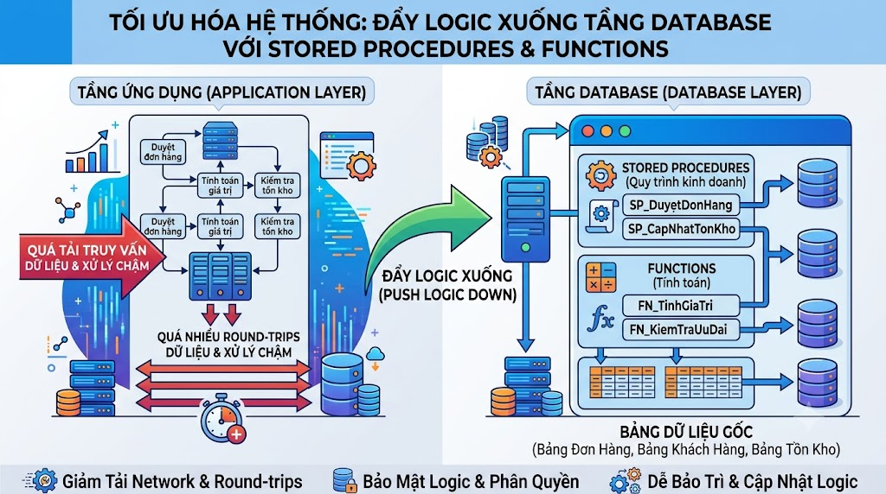

# Stored Procedures & Functions: Đẩy Logic Xuống Tầng Database



Từ trước đến giờ chúng ta viết SQL thuần — mỗi câu query độc lập, không có biến, không có vòng lặp, không có điều kiện phức tạp. **Functions và Stored Procedures** cho phép bạn viết code logic thực sự bằng PL/pgSQL ngay trong database — đóng gói, tái sử dụng, và thực thi phía server thay vì phía application.

## 1\. Function vs Stored Procedure — Khác Nhau Thế Nào?


| Tiêu chí | Function | Stored Procedure |
|---|---|---|
| Trả về giá trị | ✅ Bắt buộc | ❌ Không (hoặc qua OUT param) |
| Dùng trong SELECT | ✅ Được | ❌ Không được |
| Transaction control | ❌ Không (COMMIT/ROLLBACK) | ✅ Được |
| Gọi bằng | SELECT func() | CALL proc() |
| Dùng khi | Tính toán, transform, validate | Workflow phức tạp, batch process |


## 2\. Function Cơ Bản

```sql
CREATE OR REPLACE FUNCTION ten_function(
    tham_so_1 kieu_du_lieu,
    tham_so_2 kieu_du_lieu
)
RETURNS kieu_tra_ve
LANGUAGE plpgsql
AS $$
DECLARE
    bien_cuc_bo kieu_du_lieu;
BEGIN
    -- logic ở đây
    RETURN ket_qua;
END;
$$;
```

### Function Tính Toán Đơn Giản

```sql
-- Tính giá sau khi áp dụng % giảm giá
CREATE OR REPLACE FUNCTION calc_discounted_price(
    original_price NUMERIC,
    discount_pct   NUMERIC
)
RETURNS NUMERIC
LANGUAGE plpgsql
AS $$
BEGIN
    IF discount_pct < 0 OR discount_pct > 100 THEN
        RAISE EXCEPTION 'discount_pct phải từ 0 đến 100, nhận: %', discount_pct;
    END IF;

    RETURN ROUND(original_price * (1 - discount_pct / 100), 0);
END;
$$;

-- Dùng trong SELECT như hàm thông thường
SELECT
    title,
    price                                   AS original_price,
    calc_discounted_price(price, 20)        AS price_after_20pct_off
FROM courses
WHERE course_type = 'PAID';
```

### Function Trả Về TABLE

```sql
-- Lấy danh sách khóa học của một instructor kèm thống kê
CREATE OR REPLACE FUNCTION get_instructor_courses(
    p_instructor_id BIGINT
)
RETURNS TABLE (
    course_id       BIGINT,
    title           VARCHAR,
    enrolled_count  INT,
    avg_rating      NUMERIC,
    total_revenue   NUMERIC
)
LANGUAGE plpgsql
AS $$
BEGIN
    RETURN QUERY
    SELECT
        c.id,
        c.title,
        c.enrolled_count,
        ROUND(AVG(r.rate), 2)          AS avg_rating,
        COALESCE(SUM(oi.price), 0)     AS total_revenue
    FROM courses c
    LEFT JOIN ratings     r  ON r.course_id  = c.id
    LEFT JOIN order_items oi ON oi.course_id = c.id
    LEFT JOIN orders      o  ON o.id = oi.order_id
                             AND o.order_status = 'PAID'
    WHERE c.maker_id = p_instructor_id
    GROUP BY c.id, c.title, c.enrolled_count
    ORDER BY total_revenue DESC;
END;
$$;

-- Gọi function trả về table
SELECT * FROM get_instructor_courses(1);

-- Có thể filter, join thêm
SELECT course_id, title, total_revenue
FROM get_instructor_courses(1)
WHERE total_revenue > 1000000;
```

## 3\. PL/pgSQL — Ngôn Ngữ Lập Trình Trong Database

PL/pgSQL là ngôn ngữ procedural của PostgreSQL — có đầy đủ biến, điều kiện, vòng lặp, exception handling.

### Biến và Assignment

```sql
CREATE OR REPLACE FUNCTION demo_variables()
RETURNS TEXT
LANGUAGE plpgsql
AS $$
DECLARE
    v_name      TEXT    := 'nguyentienkhoi.hashnode.dev';   -- khai báo và gán ngay
    v_count     INT;                         -- khai báo, gán sau
    v_result    TEXT;
BEGIN
    -- Gán giá trị từ query
    SELECT COUNT(*) INTO v_count
    FROM courses
    WHERE course_status = 'PUBLISHED';

    v_result := 'Platform ' || v_name || ' có ' || v_count || ' khóa học';

    RETURN v_result;
END;
$$;
```

### IF / ELSIF / ELSE

```sql
CREATE OR REPLACE FUNCTION get_customer_tier(
    p_user_id BIGINT
)
RETURNS TEXT
LANGUAGE plpgsql
AS $$
DECLARE
    v_total_spent NUMERIC;
    v_tier        TEXT;
BEGIN
    SELECT COALESCE(SUM(final_amount), 0)
    INTO v_total_spent
    FROM orders
    WHERE user_id     = p_user_id
      AND order_status = 'PAID';

    IF v_total_spent >= 5000000 THEN
        v_tier := 'Diamond';
    ELSIF v_total_spent >= 2000000 THEN
        v_tier := 'Gold';
    ELSIF v_total_spent >= 1000000 THEN
        v_tier := 'Silver';
    ELSIF v_total_spent >= 500000 THEN
        v_tier := 'Bronze';
    ELSE
        v_tier := 'New';
    END IF;

    RETURN v_tier;
END;
$$;

-- Dùng trong query
SELECT
    first_name,
    last_name,
    get_customer_tier(id) AS tier
FROM users
WHERE account_status = 'ACTIVE';
```

### LOOP — Vòng Lặp

```sql
-- FOR loop qua kết quả query
CREATE OR REPLACE FUNCTION sync_enrolled_counts()
RETURNS VOID
LANGUAGE plpgsql
AS $$
DECLARE
    v_course RECORD;
    v_count  INT;
BEGIN
    -- Duyệt qua tất cả khóa học đang published
    FOR v_course IN
        SELECT id FROM courses WHERE course_status = 'PUBLISHED'
    LOOP
        -- Đếm số enrollment thực tế
        SELECT COUNT(*)
        INTO v_count
        FROM enrollments
        WHERE course_id = v_course.id;

        -- Cập nhật enrolled_count
        UPDATE courses
        SET enrolled_count = v_count,
            updated_at     = NOW()
        WHERE id = v_course.id;
    END LOOP;

    RAISE NOTICE 'Đã sync enrolled_count cho tất cả khóa học';
END;
$$;

-- Gọi function
SELECT sync_enrolled_counts();
```

> **Lưu ý hiệu năng:** Loop trong PL/pgSQL chậm hơn SQL thuần nhiều. Luôn ưu tiên viết một câu UPDATE tổng hợp thay vì loop:

```sql
-- ✅ Cách tốt hơn — một câu SQL thay vì loop
UPDATE courses c
SET enrolled_count = sub.cnt,
    updated_at     = NOW()
FROM (
    SELECT course_id, COUNT(*) AS cnt
    FROM enrollments
    GROUP BY course_id
) sub
WHERE sub.course_id = c.id
  AND c.course_status = 'PUBLISHED';
```

### Exception Handling

```sql
CREATE OR REPLACE FUNCTION safe_enroll_student(
    p_user_id   BIGINT,
    p_course_id BIGINT
)
RETURNS TEXT
LANGUAGE plpgsql
AS $$
BEGIN
    -- Thử insert enrollment
    INSERT INTO enrollments (user_id, course_id)
    VALUES (p_user_id, p_course_id);

    RETURN 'SUCCESS: Đã đăng ký khóa học thành công';

EXCEPTION
    WHEN unique_violation THEN
        -- Đã enroll rồi — không phải lỗi nghiêm trọng
        RETURN 'ALREADY_ENROLLED: Học viên đã đăng ký khóa học này';

    WHEN foreign_key_violation THEN
        -- user_id hoặc course_id không tồn tại
        RETURN 'NOT_FOUND: User hoặc Course không tồn tại';

    WHEN OTHERS THEN
        -- Lỗi không xác định
        RAISE EXCEPTION 'Lỗi không xác định: %', SQLERRM;
END;
$$;

-- Gọi function
SELECT safe_enroll_student(1, 1);   -- 'SUCCESS: ...'
SELECT safe_enroll_student(1, 1);   -- 'ALREADY_ENROLLED: ...'
SELECT safe_enroll_student(1, 999); -- 'NOT_FOUND: ...'
```

## 4\. Stored Procedure

Stored Procedure phù hợp cho **workflow phức tạp** cần transaction control — không thể làm với Function vì Function không cho phép COMMIT/ROLLBACK bên trong.

```sql
CREATE OR REPLACE PROCEDURE process_order_payment(
    p_order_id  BIGINT,
    p_payment_id BIGINT
)
LANGUAGE plpgsql
AS $$
DECLARE
    v_order     RECORD;
    v_user_id   BIGINT;
    v_course_id BIGINT;
BEGIN
    -- Lấy thông tin đơn hàng
    SELECT * INTO v_order
    FROM orders
    WHERE id = p_order_id
    FOR UPDATE;

    IF NOT FOUND THEN
        RAISE EXCEPTION 'Order % không tồn tại', p_order_id;
    END IF;

    IF v_order.order_status != 'PENDING' THEN
        RAISE EXCEPTION 'Order % đang ở trạng thái %, không thể xử lý',
            p_order_id, v_order.order_status;
    END IF;

    -- Cập nhật trạng thái đơn hàng
    UPDATE orders
    SET order_status = 'PAID',
        updated_at   = NOW()
    WHERE id = p_order_id;

    -- Tạo enrollment cho từng course trong đơn hàng
    FOR v_course_id IN
        SELECT item_id FROM order_items
        WHERE order_id = p_order_id
          AND item_type = 'COURSE'
    LOOP
        INSERT INTO enrollments (user_id, course_id)
        VALUES (v_order.user_id, v_course_id)
        ON CONFLICT (user_id, course_id) DO NOTHING;
    END LOOP;

    -- Cộng điểm thưởng (50 điểm mỗi đơn hàng)
    INSERT INTO user_points (user_id, point_balance)
    VALUES (v_order.user_id, 50)
    ON CONFLICT (user_id)
    DO UPDATE SET
        point_balance = user_points.point_balance + 50,
        updated_at    = NOW();

    INSERT INTO user_point_transactions (user_id, change_amount, type, reference_id, reference_type)
    VALUES (v_order.user_id, 50, 'EARN', p_order_id, 'ORDER');

    COMMIT;  -- Stored Procedure có thể COMMIT

    RAISE NOTICE 'Đã xử lý thanh toán cho order %', p_order_id;

EXCEPTION
    WHEN OTHERS THEN
        ROLLBACK;
        RAISE EXCEPTION 'Lỗi xử lý order %: %', p_order_id, SQLERRM;
END;
$$;

-- Gọi stored procedure
CALL process_order_payment(7, 1);
```

## 5\. Trigger Functions — Tự Động Chạy Khi Có Sự Kiện

**Trigger** là function được tự động gọi khi có INSERT, UPDATE, DELETE trên một bảng. [nguyentienkhoi.hashnode.dev](http://nguyentienkhoi.hashnode.dev) đã dùng trigger:

```sql
-- Trigger tự động tính final_price trong order_items
create trigger trg_calc_order_item_final_price before
    insert or update on order_items
    for each row execute function calc_order_item_final_price();
```

Hãy xem cách tạo trigger function từ đầu:

```sql
-- Bước 1: Tạo trigger function
-- Trigger function không có tham số, trả về TRIGGER
CREATE OR REPLACE FUNCTION update_post_updated_at()
RETURNS TRIGGER
LANGUAGE plpgsql
AS $$
BEGIN
    -- NEW = dòng dữ liệu mới (sau khi INSERT/UPDATE)
    -- OLD = dòng dữ liệu cũ (trước khi UPDATE/DELETE)
    NEW.updated_at := NOW();
    RETURN NEW;  -- bắt buộc trả về NEW với BEFORE trigger
END;
$$;

-- Bước 2: Gắn trigger vào bảng
CREATE TRIGGER trg_posts_updated_at
BEFORE INSERT OR UPDATE ON posts
FOR EACH ROW
EXECUTE FUNCTION update_post_updated_at();
```

```sql
-- Trigger audit log — ghi lại mọi thay đổi trên bảng users
CREATE TABLE user_audit_log (
    id          BIGSERIAL PRIMARY KEY,
    user_id     BIGINT,
    action      VARCHAR(10),  -- INSERT, UPDATE, DELETE
    old_data    JSONB,
    new_data    JSONB,
    changed_at  TIMESTAMPTZ DEFAULT NOW(),
    changed_by  TEXT DEFAULT current_user
);

CREATE OR REPLACE FUNCTION audit_users_changes()
RETURNS TRIGGER
LANGUAGE plpgsql
AS $$
BEGIN
    IF TG_OP = 'INSERT' THEN
        INSERT INTO user_audit_log (user_id, action, new_data)
        VALUES (NEW.id, 'INSERT', row_to_json(NEW)::JSONB);
        RETURN NEW;

    ELSIF TG_OP = 'UPDATE' THEN
        INSERT INTO user_audit_log (user_id, action, old_data, new_data)
        VALUES (NEW.id, 'UPDATE',
                row_to_json(OLD)::JSONB,
                row_to_json(NEW)::JSONB);
        RETURN NEW;

    ELSIF TG_OP = 'DELETE' THEN
        INSERT INTO user_audit_log (user_id, action, old_data)
        VALUES (OLD.id, 'DELETE', row_to_json(OLD)::JSONB);
        RETURN OLD;
    END IF;
END;
$$;

CREATE TRIGGER trg_audit_users
AFTER INSERT OR UPDATE OR DELETE ON users
FOR EACH ROW
EXECUTE FUNCTION audit_users_changes();
```

## 6\. Khi Nào Nên Dùng Functions/Procedures?

### Nên dùng khi:

```java
✅ Logic tính toán phức tạp dùng ở nhiều nơi (customer tier, discount calc)
✅ Đảm bảo business rule nhất quán (không để application tự tính)
✅ Trigger: tự động cập nhật updated_at, audit log, sync cache
✅ Batch processing: sync dữ liệu định kỳ, cleanup job
✅ Stored Procedure: workflow dài cần transaction control
```

### Không nên dùng khi:

```java
❌ Logic nghiệp vụ phức tạp, hay thay đổi → khó version control, deploy
❌ Cần debug chi tiết → khó trace hơn application code
❌ Team không quen PL/pgSQL → maintainability kém
❌ Logic cần unit test đầy đủ → khó test hơn application code
❌ Horizontal scaling → logic trong DB không scale dễ như application tier
```

> **Quan điểm thực tế:** Tao thường đặt các **invariant** (quy tắc không bao giờ thay đổi) vào DB thông qua triggers và constraints, còn **business logic** (hay thay đổi) thì giữ ở application layer.

## 7\. Quản Lý Functions

```sql
-- Xem danh sách tất cả functions
SELECT
    routine_name,
    routine_type,
    data_type AS return_type
FROM information_schema.routines
WHERE routine_schema = 'public'
ORDER BY routine_name;

-- Xem definition của một function
SELECT pg_get_functiondef('get_customer_tier'::regproc);

-- Xóa function
DROP FUNCTION get_customer_tier(BIGINT);

-- Xóa function kèm các đối tượng phụ thuộc
DROP FUNCTION get_customer_tier(BIGINT) CASCADE;

-- Xóa procedure
DROP PROCEDURE process_order_payment(BIGINT, BIGINT);
```

## 8\. Thực Hành Tổng Hợp

**Bài 1:** Viết function tính RFM score (Recency, Frequency, Monetary) cho học viên.

```sql
CREATE OR REPLACE FUNCTION calc_rfm_score(
    p_user_id BIGINT
)
RETURNS TABLE (
    recency_score   INT,
    frequency_score INT,
    monetary_score  INT,
    rfm_segment     TEXT
)
LANGUAGE plpgsql
AS $$
DECLARE
    v_last_order_days INT;
    v_order_count     INT;
    v_total_spent     NUMERIC;
    v_r_score         INT;
    v_f_score         INT;
    v_m_score         INT;
BEGIN
    -- Recency: số ngày từ lần mua cuối
    SELECT EXTRACT(DAY FROM NOW() - MAX(created_at))::INT
    INTO v_last_order_days
    FROM orders
    WHERE user_id     = p_user_id
      AND order_status = 'PAID';

    -- Frequency: số đơn hàng
    SELECT COUNT(*)
    INTO v_order_count
    FROM orders
    WHERE user_id     = p_user_id
      AND order_status = 'PAID';

    -- Monetary: tổng chi tiêu
    SELECT COALESCE(SUM(final_amount), 0)
    INTO v_total_spent
    FROM orders
    WHERE user_id     = p_user_id
      AND order_status = 'PAID';

    -- Tính điểm Recency (1-5, 5 là tốt nhất — mua gần đây)
    v_r_score := CASE
        WHEN v_last_order_days IS NULL  THEN 1
        WHEN v_last_order_days <= 30    THEN 5
        WHEN v_last_order_days <= 60    THEN 4
        WHEN v_last_order_days <= 90    THEN 3
        WHEN v_last_order_days <= 180   THEN 2
        ELSE                                 1
    END;

    -- Tính điểm Frequency (1-5)
    v_f_score := CASE
        WHEN v_order_count >= 5  THEN 5
        WHEN v_order_count >= 4  THEN 4
        WHEN v_order_count >= 3  THEN 3
        WHEN v_order_count >= 2  THEN 2
        ELSE                          1
    END;

    -- Tính điểm Monetary (1-5)
    v_m_score := CASE
        WHEN v_total_spent >= 3000000 THEN 5
        WHEN v_total_spent >= 2000000 THEN 4
        WHEN v_total_spent >= 1000000 THEN 3
        WHEN v_total_spent >= 500000  THEN 2
        ELSE                               1
    END;

    RETURN QUERY
    SELECT
        v_r_score,
        v_f_score,
        v_m_score,
        CASE
            WHEN v_r_score >= 4 AND v_f_score >= 4 AND v_m_score >= 4
                THEN 'Champions'
            WHEN v_r_score >= 3 AND v_f_score >= 3
                THEN 'Loyal Customers'
            WHEN v_r_score >= 4 AND v_f_score <= 2
                THEN 'New Customers'
            WHEN v_r_score <= 2 AND v_f_score >= 3
                THEN 'At Risk'
            WHEN v_r_score <= 2 AND v_f_score <= 2
                THEN 'Lost'
            ELSE 'Potential'
        END;
END;
$$;

-- Dùng function
SELECT
    u.first_name || ' ' || u.last_name AS name,
    rfm.*
FROM users u
CROSS JOIN LATERAL calc_rfm_score(u.id) rfm
WHERE u.account_status = 'ACTIVE';
```

**Bài 2:** Trigger tự động cập nhật `posts.view_count` từ bảng `article_read_histories`.

```sql
CREATE OR REPLACE FUNCTION sync_post_view_count()
RETURNS TRIGGER
LANGUAGE plpgsql
AS $$
BEGIN
    UPDATE posts
    SET view_count = (
        SELECT COALESCE(SUM(read_count), 0)
        FROM article_read_histories
        WHERE post_id = NEW.post_id
    ),
    updated_at = NOW()
    WHERE id = NEW.post_id;

    RETURN NEW;
END;
$$;

CREATE TRIGGER trg_sync_view_count
AFTER INSERT OR UPDATE ON article_read_histories
FOR EACH ROW
EXECUTE FUNCTION sync_post_view_count();
```

## Tổng Kết


| Khái niệm | Dùng khi nào |
|---|---|
| Function | Tính toán, transform, validate — dùng được trong SELECT |
| RETURNS TABLE | Function trả về nhiều dòng |
| Stored Procedure | Workflow dài, cần COMMIT/ROLLBACK bên trong |
| DECLARE / BEGIN / END | Cấu trúc block PL/pgSQL |
| IF / ELSIF / ELSE | Điều kiện trong PL/pgSQL |
| FOR ... IN ... LOOP | Vòng lặp qua kết quả query |
| EXCEPTION WHEN | Bắt và xử lý lỗi |
| TRIGGER | Tự động chạy khi có sự kiện DML |
| NEW / OLD | Dữ liệu mới/cũ trong trigger |
| RAISE NOTICE / EXCEPTION | Log thông báo hoặc ném lỗi |


Bài tiếp theo chúng ta bước sang nhóm **Senior** với **Query Optimization thực chiến** — tổng hợp mọi kiến thức đã học để tối ưu những query phức tạp nhất trong production.

> **Khác biệt với các RDBMS khác:**
> 
> *   **MySQL:** Dùng ngôn ngữ riêng cho stored procedure, cú pháp tương tự nhưng khác chi tiết. Không có `RETURNS TABLE`, dùng result set thay thế
>     
> *   **SQL Server:** Dùng **T-SQL** — có TRY/CATCH thay vì EXCEPTION WHEN, `@@ROWCOUNT` để kiểm tra số dòng ảnh hưởng
>     
> *   **Oracle:** Dùng **PL/SQL** — mạnh nhất trong các RDBMS, có package để nhóm functions/procedures
>     
> *   **Tất cả RDBMS:** Đều có Trigger với BEFORE/AFTER và FOR EACH ROW — cú pháp khác nhau nhưng concept giống nhau
>     

