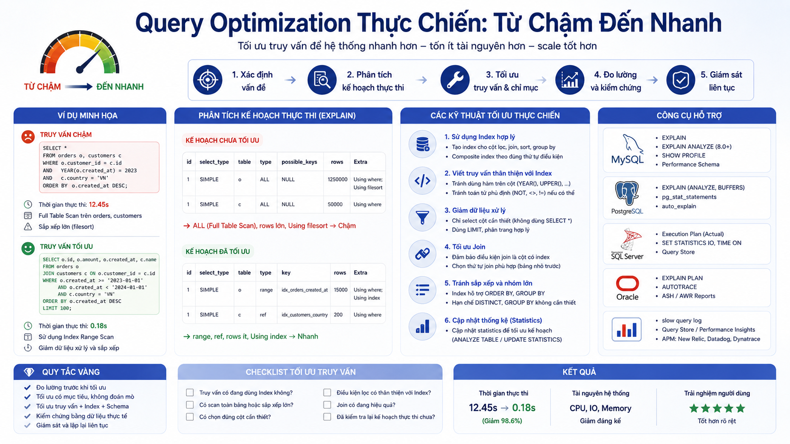

# Query Optimization Thực Chiến: Từ Chậm Đến Nhanh



Bài này là tổng hợp mọi kiến thức đã học — index, execution plan, CTE, window functions — áp dụng vào việc tối ưu query thực tế. Senior developer không chỉ biết viết query đúng, mà còn biết viết query **nhanh** và **scale được**. Tao sẽ đi qua từng anti-pattern phổ biến nhất, giải thích tại sao chậm và cách rewrite.

## 1\. Framework Tối Ưu Query

Trước khi tối ưu bất cứ điều gì, hãy làm theo thứ tự này:

```java
1. Đo lường — EXPLAIN ANALYZE để biết chính xác query mất thời gian ở đâu
2. Xác định bottleneck — Seq Scan? Nested Loop? Sort? Hash Join?
3. Hiểu data pattern — bảng có bao nhiêu dòng? Phân phối dữ liệu thế nào?
4. Chọn giải pháp — Index? Rewrite query? Denormalize? Materialized View?
5. Đo lại — So sánh trước/sau, đảm bảo cải thiện thực sự
6. Monitor — Theo dõi sau khi deploy lên production
```

> **Nguyên tắc vàng:** Đừng bao giờ tối ưu dựa trên phỏng đoán. Measure first, optimize second.

## 2\. Anti-pattern 1: SELECT \* — Lấy Thừa Dữ Liệu

```sql
-- ❌ SELECT * — lấy toàn bộ cột kể cả không cần
SELECT *
FROM posts p
JOIN users u ON u.id = p.writer_id
WHERE p.post_status = 'PUBLISHED'
LIMIT 20;
-- Lấy về: content (TEXT lớn), password hash, reset_token...
-- Network transfer nặng, không dùng Index Only Scan được

-- ✅ Chỉ lấy cột cần thiết
SELECT
    p.id,
    p.title,
    p.slug,
    p.published_at,
    p.view_count,
    u.first_name || ' ' || u.last_name AS author_name
FROM posts p
JOIN users u ON u.id = p.writer_id
WHERE p.post_status = 'PUBLISHED'
ORDER BY p.published_at DESC
LIMIT 20;
-- Nhẹ hơn, có thể dùng Index Only Scan nếu index cover đủ cột
```

**Mức độ ảnh hưởng:** Bảng `posts` có cột `content TEXT` có thể lên đến vài MB mỗi bài — SELECT \* nghĩa là transfer toàn bộ về application dù chỉ cần title.

## 3\. Anti-pattern 2: N+1 Query — Vòng Lặp Ẩn

N+1 là anti-pattern phổ biến nhất — chạy 1 query lấy danh sách, rồi với mỗi item lại chạy thêm 1 query:

```sql
-- ❌ N+1 pattern trong application code (pseudo-code)
-- Query 1: lấy 10 courses
courses = SELECT id, title FROM courses LIMIT 10;

-- Query 2..11: với mỗi course, lấy rating
FOR course IN courses:
    rating = SELECT AVG(rate) FROM ratings WHERE course_id = course.id;
-- Tổng: 11 queries → với 100 courses là 101 queries!

-- ✅ Giải quyết bằng JOIN hoặc subquery — 1 query duy nhất
SELECT
    c.id,
    c.title,
    ROUND(AVG(r.rate), 2) AS avg_rating,
    COUNT(r.id)           AS total_ratings
FROM courses c
LEFT JOIN ratings r ON r.course_id = c.id
GROUP BY c.id, c.title
ORDER BY c.id
LIMIT 10;
```

**Ví dụ thực tế** — Lấy danh sách học viên kèm thông tin khóa học đang học:

```sql
-- ❌ N+1: 1 query lấy enrollments + N query lấy course details
-- Application: foreach enrollment → SELECT * FROM courses WHERE id = ?

-- ✅ Một query với JOIN
SELECT
    u.first_name || ' ' || u.last_name AS student_name,
    c.title                             AS course_title,
    c.total_lectures,
    COUNT(tp.lecture_id)                AS completed_lectures,
    e.enrolled_at
FROM enrollments e
JOIN users   u  ON u.id = e.user_id
JOIN courses c  ON c.id = e.course_id
LEFT JOIN tracking_progress tp
       ON tp.student_id = e.user_id
      AND tp.lecture_id IN (
          SELECT id FROM lectures WHERE course_id = c.id
      )
      AND tp.completed = TRUE
GROUP BY u.id, u.first_name, u.last_name,
         c.id, c.title, c.total_lectures, e.enrolled_at
ORDER BY e.enrolled_at DESC;
```

## 4\. Anti-pattern 3: Function Trên Cột Được Index

```sql
-- ❌ Wrap cột trong function → index bị bỏ qua → Seq Scan
SELECT * FROM users WHERE LOWER(email) = 'nam@gmail.com';
SELECT * FROM orders WHERE DATE(created_at) = '2025-01-15';
SELECT * FROM courses WHERE EXTRACT(YEAR FROM created_at) = 2025;
SELECT * FROM users WHERE CONCAT(first_name, ' ', last_name) = 'Nam Nguyen';

-- ✅ Cách đúng — để cột trần, tác động lên giá trị so sánh
-- Hoặc tạo Expression Index

-- Cách 1: Expression Index
CREATE INDEX idx_users_email_lower ON users (LOWER(email));
SELECT * FROM users WHERE LOWER(email) = 'nam@gmail.com';  -- dùng được index

-- Cách 2: Rewrite query không dùng function trên cột
-- Thay DATE(created_at) = '2025-01-15':
SELECT * FROM orders
WHERE created_at >= '2025-01-15 00:00:00'
  AND created_at <  '2025-01-16 00:00:00';

-- Thay EXTRACT(YEAR FROM created_at) = 2025:
SELECT * FROM orders
WHERE created_at >= '2025-01-01'
  AND created_at <  '2026-01-01';
```

## 5\. Anti-pattern 4: OFFSET Lớn — Pagination Sai Cách

```sql
-- ❌ OFFSET lớn rất chậm — database phải đọc và bỏ qua N dòng đầu
SELECT id, title, published_at
FROM posts
WHERE post_status = 'PUBLISHED'
ORDER BY published_at DESC
LIMIT 20 OFFSET 10000;
-- PostgreSQL phải đọc 10.020 dòng, bỏ 10.000, trả về 20

-- ✅ Keyset Pagination (Cursor-based) — nhanh hơn nhiều
-- Lần đầu: không có cursor
SELECT id, title, published_at
FROM posts
WHERE post_status = 'PUBLISHED'
ORDER BY published_at DESC, id DESC
LIMIT 20;
-- Lưu lại: last_published_at và last_id của dòng cuối cùng

-- Lần sau: dùng cursor
SELECT id, title, published_at
FROM posts
WHERE post_status = 'PUBLISHED'
  AND (published_at, id) < ('2025-03-01 10:00:00', 150)  -- cursor từ lần trước
ORDER BY published_at DESC, id DESC
LIMIT 20;
-- Chỉ đọc đúng 20 dòng cần thiết, không quan tâm page number
```

**So sánh hiệu năng:**


| Phương pháp | Page 1 | Page 100 | Page 1000 |
|---|---|---|---|
| OFFSET | 1ms | 50ms | 500ms |
| Keyset | 1ms | 1ms | 1ms |


## 6\. Anti-pattern 5: Subquery Lặp Lại (Correlated Subquery)

```sql
-- ❌ Correlated subquery chạy lại cho mỗi dòng — O(n²)
SELECT
    c.title,
    (SELECT COUNT(*) FROM enrollments WHERE course_id = c.id) AS enrolled,
    (SELECT ROUND(AVG(rate), 2) FROM ratings WHERE course_id = c.id) AS rating,
    (SELECT SUM(price) FROM order_items WHERE course_id = c.id) AS revenue
FROM courses c
WHERE c.course_status = 'PUBLISHED';
-- 3 subquery × N courses = 3N queries!

-- ✅ Rewrite bằng LEFT JOIN + GROUP BY — một lần scan mỗi bảng
SELECT
    c.title,
    COALESCE(e.enrolled, 0)   AS enrolled,
    COALESCE(r.avg_rating, 0) AS rating,
    COALESCE(oi.revenue, 0)   AS revenue
FROM courses c
LEFT JOIN (
    SELECT course_id, COUNT(*) AS enrolled
    FROM enrollments
    GROUP BY course_id
) e ON e.course_id = c.id
LEFT JOIN (
    SELECT course_id, ROUND(AVG(rate), 2) AS avg_rating
    FROM ratings
    GROUP BY course_id
) r ON r.course_id = c.id
LEFT JOIN (
    SELECT course_id, SUM(price) AS revenue
    FROM order_items
    GROUP BY course_id
) oi ON oi.course_id = c.id
WHERE c.course_status = 'PUBLISHED';
```

## 7\. Anti-pattern 6: COUNT(\*) Toàn Bảng Để Phân Trang

```sql
-- ❌ Đếm tổng số bản ghi để hiển thị "Trang 3/150" — chậm với bảng lớn
SELECT COUNT(*) FROM posts WHERE post_status = 'PUBLISHED';
-- Với 1 triệu posts → scan toàn bảng mỗi lần load trang

-- ✅ Giải pháp 1: Estimate count từ statistics (không chính xác tuyệt đối nhưng nhanh)
SELECT reltuples::BIGINT AS estimated_count
FROM pg_class
WHERE relname = 'posts';

-- ✅ Giải pháp 2: Cache count trong Redis/application, refresh định kỳ

-- ✅ Giải pháp 3: UX thay đổi — dùng "Load more" thay vì phân trang số
-- → không cần biết tổng số trang

-- ✅ Giải pháp 4: Partial count — chỉ đếm trong khoảng nhỏ
SELECT COUNT(*)
FROM posts
WHERE post_status = 'PUBLISHED'
  AND published_at >= NOW() - INTERVAL '1 year';  -- giới hạn phạm vi
```

## 8\. Anti-pattern 7: OR Trên Nhiều Cột Khác Nhau

```sql
-- ❌ OR trên nhiều cột — optimizer thường không dùng index
SELECT * FROM users
WHERE first_name = 'Nam'
   OR email      = 'nam@gmail.com'
   OR phone      = '0901234567';

-- ✅ UNION ALL — mỗi branch dùng index riêng
SELECT * FROM users WHERE first_name = 'Nam'
UNION ALL
SELECT * FROM users WHERE email = 'nam@gmail.com'
  AND first_name != 'Nam'  -- tránh duplicate
UNION ALL
SELECT * FROM users WHERE phone = '0901234567'
  AND email != 'nam@gmail.com'
  AND first_name != 'Nam';
```

## 9\. Anti-pattern 8: Implicit Type Cast

```sql
-- orders.user_id là BIGINT
-- ❌ So sánh với string → implicit cast → index không dùng được
SELECT * FROM orders WHERE user_id = '1';

-- ❌ So sánh NUMERIC với INT có thể gây implicit cast
SELECT * FROM courses WHERE price = 799;  -- price là NUMERIC, 799 là INT

-- ✅ Luôn dùng đúng kiểu dữ liệu
SELECT * FROM orders WHERE user_id = 1;         -- BIGINT
SELECT * FROM courses WHERE price = 799000.00;  -- NUMERIC
SELECT * FROM courses WHERE price = 799000;     -- OK, PostgreSQL tự cast INT→NUMERIC
```

## 10\. Tối Ưu Query Phức Tạp — Case Study Thực Tế

**Bài toán:** Query trang chủ [nguyentienkhoi.hashnode.dev](http://nguyentienkhoi.hashnode.dev) — lấy bài viết mới nhất kèm thông tin tác giả, tags và số lượt đọc. Query đang mất 2.3 giây.

```sql
-- ❌ Query gốc — chậm 2.3 giây
SELECT
    p.id,
    p.title,
    p.slug,
    p.thumbnail_url,
    p.view_count,
    p.published_at,
    u.first_name || ' ' || u.last_name           AS author_name,
    u.avatar_url                                  AS author_avatar,
    (SELECT string_agg(t.name, ', ')
     FROM post_tags pt
     JOIN tags t ON t.id = pt.tag_id
     WHERE pt.post_id = p.id)                    AS tags,         -- ❌ correlated subquery
    (SELECT COUNT(*)
     FROM article_read_histories arh
     WHERE arh.post_id = p.id)                   AS read_count    -- ❌ correlated subquery
FROM posts p
JOIN users u ON u.id = p.writer_id
WHERE p.post_status = 'PUBLISHED'
  AND p.post_type   = 'TECHNOLOGY'
ORDER BY p.published_at DESC
LIMIT 10;
```

**Phân tích EXPLAIN ANALYZE:**

*   Correlated subquery tags: chạy 10 lần
    
*   Correlated subquery read\_count: chạy 10 lần
    
*   Seq Scan trên posts (thiếu index cho status + type + published\_at)
    

```sql
-- ✅ Query đã tối ưu — xuống còn 8ms
WITH latest_posts AS (
    -- Bước 1: Lấy 10 bài mới nhất trước — dùng index
    SELECT id, title, slug, thumbnail_url, view_count, published_at, writer_id
    FROM posts
    WHERE post_status = 'PUBLISHED'
      AND post_type   = 'TECHNOLOGY'
    ORDER BY published_at DESC
    LIMIT 10
),
post_tags_agg AS (
    -- Bước 2: Aggregate tags cho 10 bài đó — không phải toàn bảng
    SELECT
        pt.post_id,
        string_agg(t.name, ', ' ORDER BY t.name) AS tags
    FROM post_tags pt
    JOIN tags t ON t.id = pt.tag_id
    WHERE pt.post_id IN (SELECT id FROM latest_posts)
    GROUP BY pt.post_id
),
read_counts AS (
    -- Bước 3: Đếm lượt đọc cho 10 bài đó
    SELECT post_id, SUM(read_count) AS total_reads
    FROM article_read_histories
    WHERE post_id IN (SELECT id FROM latest_posts)
    GROUP BY post_id
)
SELECT
    lp.id,
    lp.title,
    lp.slug,
    lp.thumbnail_url,
    lp.view_count,
    lp.published_at,
    u.first_name || ' ' || u.last_name  AS author_name,
    u.avatar_url                         AS author_avatar,
    COALESCE(pt.tags, '')               AS tags,
    COALESCE(rc.total_reads, 0)         AS read_count
FROM latest_posts lp
JOIN users         u  ON u.id      = lp.writer_id
LEFT JOIN post_tags_agg pt ON pt.post_id = lp.id
LEFT JOIN read_counts   rc ON rc.post_id = lp.id
ORDER BY lp.published_at DESC;

-- Index hỗ trợ query:
CREATE INDEX idx_posts_tech_published
    ON posts (published_at DESC)
    WHERE post_status = 'PUBLISHED'
      AND post_type   = 'TECHNOLOGY';
```

**Kết quả:**


|  | Trước | Sau |
|---|---|---|
| Execution time | 2,300ms | 8ms |
| Correlated subquery | 20 lần | 0 |
| Rows scanned | ~50,000 | ~10 |


## 11\. Checklist Tối Ưu Query

```java
VIẾT QUERY:
□ Chỉ SELECT cột cần thiết, tránh SELECT *
□ Điều kiện WHERE có selectivity cao đặt trước
□ Tránh function trên cột được index
□ Dùng đúng kiểu dữ liệu, không để implicit cast
□ Thay OFFSET lớn bằng Keyset Pagination
□ Thay correlated subquery bằng JOIN hoặc CTE
□ Thay OR nhiều cột bằng UNION ALL

INDEX:
□ Foreign key columns có index chưa?
□ WHERE clause thường dùng cột nào? → Composite Index
□ Có dùng Partial Index cho subset data không?
□ Có Expression Index cho LOWER(), DATE_TRUNC() không?

ĐO LƯỜNG:
□ EXPLAIN ANALYZE trước khi tối ưu
□ EXPLAIN ANALYZE sau khi tối ưu để so sánh
□ Kiểm tra pg_stat_user_indexes — index có được dùng không?
□ Monitor slow query log trên production
```

## 12\. Thực Hành — Tối Ưu 3 Query Thực Tế

**Bài 1:** Query báo cáo doanh thu đang chậm — tối ưu lại.

```sql
-- Query chậm cần tối ưu
SELECT
    u.email,
    u.first_name || ' ' || u.last_name AS name,
    SUM(o.final_amount)                 AS total_spent,
    COUNT(DISTINCT oi.course_id)        AS courses_bought,
    MAX(o.created_at)                   AS last_order_at
FROM users u
JOIN orders o      ON o.user_id = u.id
JOIN order_items oi ON oi.order_id = o.id
WHERE o.order_status = 'PAID'
  AND o.created_at >= DATE_TRUNC('month', NOW())  -- ❌ function trên cột
GROUP BY u.id, u.email, u.first_name, u.last_name
HAVING SUM(o.final_amount) > 0
ORDER BY total_spent DESC;

-- ✅ Đã tối ưu
SELECT
    u.email,
    u.first_name || ' ' || u.last_name AS name,
    SUM(o.final_amount)                 AS total_spent,
    COUNT(DISTINCT oi.course_id)        AS courses_bought,
    MAX(o.created_at)                   AS last_order_at
FROM users u
JOIN orders o       ON o.user_id = u.id
JOIN order_items oi ON oi.order_id = o.id
WHERE o.order_status = 'PAID'
  AND o.created_at >= DATE_TRUNC('month', NOW())::DATE  -- ✅ cast về DATE
  AND o.created_at <  (DATE_TRUNC('month', NOW()) + INTERVAL '1 month')::DATE
GROUP BY u.id, u.email, u.first_name, u.last_name
ORDER BY total_spent DESC;

-- Index hỗ trợ:
CREATE INDEX idx_orders_status_created
    ON orders (order_status, created_at DESC)
    WHERE order_status = 'PAID';
```

**Bài 2:** Tìm học viên inactive — chưa đăng nhập 30 ngày và chưa hoàn thành bất kỳ khóa nào.

```sql
-- ✅ Query hiệu quả dùng CTE và EXISTS
WITH last_login AS (
    SELECT DISTINCT ON (user_id)
        user_id,
        login_time
    FROM login_histories
    WHERE login_status = 'SUCCESS'
    ORDER BY user_id, login_time DESC
)
SELECT
    u.id,
    u.email,
    u.first_name || ' ' || u.last_name AS name,
    ll.login_time                       AS last_login,
    COUNT(e.course_id)                  AS enrolled_courses
FROM users u
LEFT JOIN last_login ll ON ll.user_id = u.id
LEFT JOIN enrollments e ON e.user_id  = u.id
WHERE u.account_status = 'ACTIVE'
  AND (ll.login_time IS NULL
       OR ll.login_time < NOW() - INTERVAL '30 days')
  AND NOT EXISTS (
      SELECT 1 FROM user_course_certificates ucc
      WHERE ucc.student_id = u.id
  )
GROUP BY u.id, u.email, u.first_name, u.last_name, ll.login_time
ORDER BY ll.login_time ASC NULLS FIRST;
```

## Tổng Kết


| Anti-pattern | Vấn đề | Giải pháp |
|---|---|---|
| SELECT * | Lấy thừa data, không dùng Index Only Scan | Liệt kê cột cần thiết |
| N+1 Query | N query thay vì 1 | JOIN hoặc subquery tổng hợp |
| Function trên cột index | Index bị bỏ qua | Rewrite query hoặc Expression Index |
| OFFSET lớn | Scan + bỏ N dòng | Keyset Pagination |
| Correlated subquery | Chạy N lần | Rewrite bằng JOIN + GROUP BY |
| COUNT(*) toàn bảng | Scan toàn bảng mỗi lần | Estimate, cache hoặc UX thay đổi |
| OR nhiều cột | Không dùng index | UNION ALL |
| Implicit type cast | Index bị bỏ qua | Đúng kiểu dữ liệu |


Bài tiếp theo chúng ta sẽ học **Partitioning** — kỹ thuật chia bảng hàng triệu, hàng tỷ dòng thành các phần nhỏ để query nhanh hơn và quản lý dễ hơn.

> **Khác biệt với các RDBMS khác:**
> 
> *   **Tất cả RDBMS:** Các anti-pattern trên đều áp dụng cho mọi hệ — đây là nguyên tắc chung, không phụ thuộc phần mềm
>     
> *   **MySQL:** `EXPLAIN FORMAT=JSON` cho output chi tiết hơn, có `optimizer_trace` để debug optimizer
>     
> *   **SQL Server:** Có **Query Store** — tự động lưu lịch sử execution plan, phát hiện plan regression
>     
> *   **Oracle:** Có **SQL Tuning Advisor** — tự động đề xuất tối ưu cho slow query
>     

