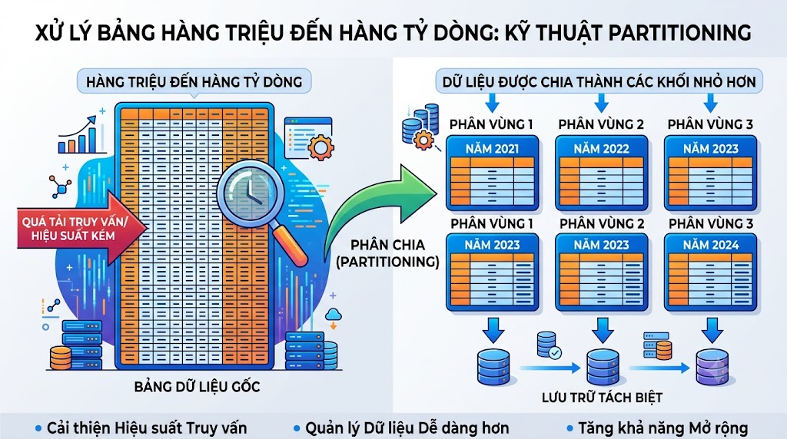

# Partitioning: Xử Lý Bảng Hàng Triệu Đến Hàng Tỷ Dòng



Khi bảng `video_tracking_logs` của [nguyentienkhoi.hashnode.dev](http://nguyentienkhoi.hashnode.dev) đạt 500 triệu dòng sau vài năm, mọi query dù có index cũng bắt đầu chậm lại. Xóa dữ liệu cũ mất hàng giờ. Backup nặng nề. Đây là lúc cần **Partitioning** — kỹ thuật chia một bảng lớn thành nhiều bảng con (partition) nhỏ hơn, trong suốt với application nhưng cải thiện hiệu năng đáng kể.

## 1\. Partitioning là gì và tại sao cần?

**Partitioning** chia bảng thành nhiều **partition** (phân vùng) dựa trên giá trị của một cột. Với application, mọi thứ vẫn nhìn thấy như một bảng duy nhất — nhưng bên dưới PostgreSQL chỉ đọc partition liên quan.

**Tại sao cần Partitioning:**

```java
❌ Không có Partitioning:
   WHERE created_at >= '2025-01-01'
   → Scan toàn bộ 500M dòng → 30 giây

✅ Có Partitioning theo tháng:
   WHERE created_at >= '2025-01-01'
   → PostgreSQL biết chỉ cần đọc partition tháng 1/2025
   → Scan 5M dòng → 0.3 giây
```

**Các lợi ích:**

*   **Partition Pruning** — query chỉ scan partition liên quan
    
*   **Parallel Query** — query trên nhiều partition chạy song song
    
*   **Maintenance dễ hơn** — xóa dữ liệu cũ bằng `DROP PARTITION` thay vì `DELETE`
    
*   **Index nhỏ hơn** — index trên từng partition nhỏ hơn index toàn bảng
    

## 2\. Các Loại Partitioning

### Range Partitioning — Phân vùng theo khoảng

Phổ biến nhất — chia theo khoảng thời gian hoặc số:

```sql
-- Tạo bảng cha với PARTITION BY RANGE
CREATE TABLE video_tracking_logs (
    id             BIGSERIAL,
    watcher_id     BIGINT        NOT NULL,
    lecture_id     BIGINT        NOT NULL,
    session_id     VARCHAR(36)   NOT NULL,
    ip_address     VARCHAR(39)   NOT NULL,
    device_hash    VARCHAR(64)   NOT NULL,
    video_action   VARCHAR(20)   NOT NULL,
    watch_duration INT,
    watched_at     TIMESTAMPTZ,
    created_at     TIMESTAMPTZ   NOT NULL DEFAULT CURRENT_TIMESTAMP
) PARTITION BY RANGE (created_at);

-- Tạo các partition theo tháng
CREATE TABLE video_tracking_logs_2025_01
    PARTITION OF video_tracking_logs
    FOR VALUES FROM ('2025-01-01') TO ('2025-02-01');

CREATE TABLE video_tracking_logs_2025_02
    PARTITION OF video_tracking_logs
    FOR VALUES FROM ('2025-02-01') TO ('2025-03-01');

CREATE TABLE video_tracking_logs_2025_03
    PARTITION OF video_tracking_logs
    FOR VALUES FROM ('2025-03-01') TO ('2025-04-01');

-- Partition mặc định — nhận dữ liệu không khớp partition nào
CREATE TABLE video_tracking_logs_default
    PARTITION OF video_tracking_logs DEFAULT;
```

> **Lưu ý:** `TO` là exclusive (không bao gồm). `FOR VALUES FROM ('2025-01-01') TO ('2025-02-01')` bao gồm tất cả dòng có `created_at >= '2025-01-01'` và `created_at < '2025-02-01'`.

**Tự động tạo partition hàng tháng** bằng function:

```sql
CREATE OR REPLACE PROCEDURE create_monthly_partition(
    p_table_name TEXT,
    p_year       INT,
    p_month      INT
)
LANGUAGE plpgsql
AS $$
DECLARE
    v_partition_name TEXT;
    v_start_date     DATE;
    v_end_date       DATE;
BEGIN
    v_partition_name := p_table_name || '_' ||
                        p_year || '_' ||
                        LPAD(p_month::TEXT, 2, '0');

    v_start_date := DATE(p_year || '-' || p_month || '-01');
    v_end_date   := v_start_date + INTERVAL '1 month';

    EXECUTE format(
        'CREATE TABLE IF NOT EXISTS %I
         PARTITION OF %I
         FOR VALUES FROM (%L) TO (%L)',
        v_partition_name,
        p_table_name,
        v_start_date,
        v_end_date
    );

    RAISE NOTICE 'Đã tạo partition: %', v_partition_name;
END;
$$;

-- Tạo partition cho 12 tháng năm 2025
DO $$
BEGIN
    FOR i IN 1..12 LOOP
        CALL create_monthly_partition('video_tracking_logs', 2025, i);
    END LOOP;
END;
$$;
```

### List Partitioning — Phân vùng theo danh sách giá trị

Chia theo giá trị cụ thể của một cột:

```sql
-- Chia orders theo currency để tối ưu cho từng thị trường
CREATE TABLE orders_partitioned (
    id           BIGSERIAL,
    user_id      BIGINT        NOT NULL,
    order_status VARCHAR(20)   NOT NULL,
    final_amount NUMERIC(18,2) NOT NULL,
    currency     VARCHAR(20)   NOT NULL DEFAULT 'VND',
    created_at   TIMESTAMPTZ   NOT NULL DEFAULT CURRENT_TIMESTAMP
) PARTITION BY LIST (currency);

CREATE TABLE orders_vnd
    PARTITION OF orders_partitioned
    FOR VALUES IN ('VND');

CREATE TABLE orders_usd
    PARTITION OF orders_partitioned
    FOR VALUES IN ('USD');

CREATE TABLE orders_eur
    PARTITION OF orders_partitioned
    FOR VALUES IN ('EUR');

CREATE TABLE orders_other
    PARTITION OF orders_partitioned DEFAULT;
```

### Hash Partitioning — Phân vùng theo hash

Phân phối đều dữ liệu vào N partition — dùng khi không có cột time-based rõ ràng:

```sql
-- Chia login_histories thành 4 partition đều nhau theo user_id
CREATE TABLE login_histories_partitioned (
    id           BIGSERIAL,
    user_id      BIGINT,
    username     VARCHAR(255)  NOT NULL,
    ip_address   VARCHAR(39)   NOT NULL,
    login_status VARCHAR(20)   NOT NULL,
    login_time   TIMESTAMPTZ   DEFAULT CURRENT_TIMESTAMP
) PARTITION BY HASH (user_id);

CREATE TABLE login_histories_p0
    PARTITION OF login_histories_partitioned
    FOR VALUES WITH (MODULUS 4, REMAINDER 0);

CREATE TABLE login_histories_p1
    PARTITION OF login_histories_partitioned
    FOR VALUES WITH (MODULUS 4, REMAINDER 1);

CREATE TABLE login_histories_p2
    PARTITION OF login_histories_partitioned
    FOR VALUES WITH (MODULUS 4, REMAINDER 2);

CREATE TABLE login_histories_p3
    PARTITION OF login_histories_partitioned
    FOR VALUES WITH (MODULUS 4, REMAINDER 3);
```

## 3\. Index Trên Partitioned Table

Index tạo trên bảng cha tự động tạo trên tất cả partition:

```sql
-- Index trên bảng cha → tự động tạo trên tất cả partitions
CREATE INDEX idx_vtl_watcher_action
    ON video_tracking_logs (watcher_id, video_action, watched_at);

-- Kiểm tra index đã được tạo trên các partitions
SELECT
    tablename,
    indexname
FROM pg_indexes
WHERE tablename LIKE 'video_tracking_logs%'
ORDER BY tablename, indexname;
```

## 4\. Partition Pruning — Tự Động Bỏ Qua Partition Không Liên Quan

Đây là tính năng quan trọng nhất của partitioning. PostgreSQL tự động bỏ qua partition không thỏa điều kiện WHERE:

```sql
-- Query này chỉ scan partition tháng 1/2025
EXPLAIN SELECT * FROM video_tracking_logs
WHERE created_at >= '2025-01-01'
  AND created_at <  '2025-02-01';
```

```java
Append
  ->  Seq Scan on video_tracking_logs_2025_01  ← chỉ scan 1 partition!
        Filter: (created_at >= '2025-01-01' AND created_at < '2025-02-01')
```

**Partition Pruning chỉ hoạt động khi:**

```sql
-- ✅ WHERE trực tiếp trên partition key
WHERE created_at >= '2025-01-01'

-- ✅ Tham số rõ ràng
WHERE created_at >= $1  -- với $1 = '2025-01-01'

-- ❌ Function trên partition key → pruning không hoạt động
WHERE DATE_TRUNC('month', created_at) = '2025-01-01'
WHERE EXTRACT(YEAR FROM created_at) = 2025
```

## 5\. Xóa Dữ Liệu Cũ Nhanh Chóng

Đây là lợi thế lớn nhất của partitioning — xóa partition cũ nhanh hơn DELETE hàng triệu dòng rất nhiều:

```sql
-- ❌ DELETE chậm — phải scan, xóa từng dòng, cập nhật index
DELETE FROM video_tracking_logs
WHERE created_at < '2024-01-01';
-- Có thể mất hàng giờ với 100M dòng!

-- ✅ DROP PARTITION — gần như tức thì
DROP TABLE video_tracking_logs_2023_01;
DROP TABLE video_tracking_logs_2023_02;
-- Xong trong vài giây, không ảnh hưởng các partition khác

-- ✅ DETACH PARTITION — tách ra nhưng không xóa (dùng để archive)
ALTER TABLE video_tracking_logs
    DETACH PARTITION video_tracking_logs_2023_01;
-- Bảng video_tracking_logs_2023_01 giờ là bảng độc lập
-- Có thể di chuyển sang tablespace rẻ hơn, nén lại, hoặc backup riêng
```

## 6\. Attach Partition Mới

```sql
-- Tạo bảng mới với cấu trúc giống bảng cha
CREATE TABLE video_tracking_logs_2025_04 (
    LIKE video_tracking_logs INCLUDING ALL
);

-- Thêm dữ liệu vào bảng mới (offline, không ảnh hưởng production)
-- ...

-- Attach vào partitioned table
ALTER TABLE video_tracking_logs
    ATTACH PARTITION video_tracking_logs_2025_04
    FOR VALUES FROM ('2025-04-01') TO ('2025-05-01');
```

## 7\. Sub-partitioning — Partition Trong Partition

Với bảng cực lớn, có thể partition 2 cấp:

```sql
-- Partition theo năm, trong mỗi năm lại partition theo hash user_id
CREATE TABLE video_tracking_logs_2025 (
    LIKE video_tracking_logs
) PARTITION BY HASH (watcher_id);

CREATE TABLE video_tracking_logs_2025_p0
    PARTITION OF video_tracking_logs_2025
    FOR VALUES WITH (MODULUS 4, REMAINDER 0);

CREATE TABLE video_tracking_logs_2025_p1
    PARTITION OF video_tracking_logs_2025
    FOR VALUES WITH (MODULUS 4, REMAINDER 1);
-- ...

-- Attach sub-partitioned table vào parent
ALTER TABLE video_tracking_logs
    ATTACH PARTITION video_tracking_logs_2025
    FOR VALUES FROM ('2025-01-01') TO ('2026-01-01');
```

## 8\. Đo Lường Hiệu Quả Partitioning

```sql
-- Kích thước từng partition
SELECT
    child.relname          AS partition_name,
    pg_size_pretty(pg_relation_size(child.oid)) AS size,
    pg_size_pretty(pg_total_relation_size(child.oid)) AS total_size
FROM pg_inherits
JOIN pg_class parent ON pg_inherits.inhparent = parent.oid
JOIN pg_class child  ON pg_inherits.inhrelid  = child.oid
WHERE parent.relname = 'video_tracking_logs'
ORDER BY child.relname;

-- Số dòng ước tính từng partition
SELECT
    child.relname   AS partition_name,
    child.reltuples AS estimated_rows
FROM pg_inherits
JOIN pg_class parent ON pg_inherits.inhparent = parent.oid
JOIN pg_class child  ON pg_inherits.inhrelid  = child.oid
WHERE parent.relname = 'video_tracking_logs'
ORDER BY child.relname;
```

## 9\. Khi Nào Nên Và Không Nên Dùng Partitioning

### Nên dùng khi:

```java
✅ Bảng > 50-100 triệu dòng và tiếp tục tăng
✅ Query thường lọc theo cột có thể partition (time, status, region)
✅ Cần xóa dữ liệu cũ định kỳ (log, event, audit trail)
✅ Bảng lớn làm chậm VACUUM và maintenance
✅ Cần archive dữ liệu cũ sang storage rẻ hơn
```

### Không nên dùng khi:

```java
❌ Bảng nhỏ (< 10M dòng) — overhead không đáng
❌ Query không filter theo partition key — không được pruning
❌ Nhiều cross-partition query (JOIN giữa các partition) — phức tạp hơn
❌ Partition key hay thay đổi — UPDATE partition key cực kỳ tốn kém
```

## 10\. Partitioning Thực Tế Cho [nguyentienkhoi.hashnode.dev](http://nguyentienkhoi.hashnode.dev)

Các bảng của [nguyentienkhoi.hashnode.dev](http://nguyentienkhoi.hashnode.dev) phù hợp để partition khi scale:

```sql
-- 1. video_tracking_logs — partition theo tháng
-- Lý do: ghi liên tục, query theo khoảng thời gian, cần xóa log cũ
PARTITION BY RANGE (created_at) -- tháng

-- 2. login_histories — partition theo tháng
-- Lý do: tương tự video_tracking_logs
PARTITION BY RANGE (login_time) -- tháng

-- 3. user_point_transactions — partition theo năm
-- Lý do: tăng chậm hơn, query theo năm
PARTITION BY RANGE (created_at) -- năm

-- 4. orders — partition theo năm + hash user_id (sub-partition)
-- Lý do: bảng quan trọng, query theo thời gian và user
PARTITION BY RANGE (created_at) -- năm
  → sub-partition BY HASH (user_id)
```

## 11\. Thực Hành Tổng Hợp

**Bài 1:** Tạo partitioned table cho `login_histories` theo quý, thêm index và đo hiệu năng.

```sql
-- Tạo bảng partitioned
CREATE TABLE login_histories_partitioned (
    id           BIGSERIAL,
    user_id      BIGINT,
    username     VARCHAR(255)  NOT NULL,
    session_id   VARCHAR(36),
    ip_address   VARCHAR(39)   NOT NULL,
    device_hash  VARCHAR(64)   NOT NULL,
    login_status VARCHAR(20)   NOT NULL,
    login_time   TIMESTAMPTZ   DEFAULT CURRENT_TIMESTAMP,
    logout_time  TIMESTAMPTZ
) PARTITION BY RANGE (login_time);

-- Tạo partition theo quý năm 2025
CREATE TABLE login_histories_2025_q1
    PARTITION OF login_histories_partitioned
    FOR VALUES FROM ('2025-01-01') TO ('2025-04-01');

CREATE TABLE login_histories_2025_q2
    PARTITION OF login_histories_partitioned
    FOR VALUES FROM ('2025-04-01') TO ('2025-07-01');

CREATE TABLE login_histories_2025_q3
    PARTITION OF login_histories_partitioned
    FOR VALUES FROM ('2025-07-01') TO ('2025-10-01');

CREATE TABLE login_histories_2025_q4
    PARTITION OF login_histories_partitioned
    FOR VALUES FROM ('2025-10-01') TO ('2026-01-01');

CREATE TABLE login_histories_default
    PARTITION OF login_histories_partitioned DEFAULT;

-- Index tự động áp dụng cho tất cả partitions
CREATE INDEX idx_lh_user_time
    ON login_histories_partitioned (user_id, login_time DESC);

CREATE INDEX idx_lh_status_time
    ON login_histories_partitioned (login_status, login_time DESC);

-- Verify partition pruning
EXPLAIN SELECT * FROM login_histories_partitioned
WHERE login_time >= '2025-01-01'
  AND login_time <  '2025-04-01';
-- Chỉ scan login_histories_2025_q1
```

**Bài 2:** Script tự động tạo và xóa partition hàng tháng.

```sql
-- Function tạo partition tháng tiếp theo
CREATE OR REPLACE PROCEDURE maintain_video_tracking_partitions()
LANGUAGE plpgsql
AS $$
DECLARE
    v_next_month_start  DATE;
    v_next_month_end    DATE;
    v_partition_name    TEXT;
    v_old_partition     TEXT;
    v_old_month_start   DATE;
BEGIN
    -- Tạo partition cho tháng sau
    v_next_month_start := DATE_TRUNC('month', NOW() + INTERVAL '1 month')::DATE;
    v_next_month_end   := (v_next_month_start + INTERVAL '1 month')::DATE;
    v_partition_name   := 'video_tracking_logs_' ||
                          TO_CHAR(v_next_month_start, 'YYYY_MM');

    -- Tạo nếu chưa có
    IF NOT EXISTS (
        SELECT 1 FROM pg_class WHERE relname = v_partition_name
    ) THEN
        EXECUTE format(
            'CREATE TABLE %I PARTITION OF video_tracking_logs
             FOR VALUES FROM (%L) TO (%L)',
            v_partition_name,
            v_next_month_start,
            v_next_month_end
        );
        RAISE NOTICE 'Đã tạo partition: %', v_partition_name;
    END IF;

    -- Xóa partition cũ hơn 12 tháng
    v_old_month_start  := DATE_TRUNC('month', NOW() - INTERVAL '12 months')::DATE;
    v_old_partition    := 'video_tracking_logs_' ||
                          TO_CHAR(v_old_month_start, 'YYYY_MM');

    IF EXISTS (
        SELECT 1 FROM pg_class WHERE relname = v_old_partition
    ) THEN
        EXECUTE format('DROP TABLE %I', v_old_partition);
        RAISE NOTICE 'Đã xóa partition cũ: %', v_old_partition;
    END IF;
END;
$$;

-- Chạy thủ công hoặc schedule bằng pg_cron
CALL maintain_video_tracking_partitions();
```

## Tổng Kết


| Loại Partition | Dùng khi nào |
|---|---|
| Range | Dữ liệu time-series, log, event — phổ biến nhất |
| List | Cột có tập giá trị cố định (currency, country, status) |
| Hash | Phân phối đều không theo tiêu chí cụ thể |
| Sub-partition | Bảng cực lớn cần 2 chiều phân vùng |


| Thao tác | Cú pháp |
|---|---|
| Tạo partition | CREATE TABLE ... PARTITION OF ... FOR VALUES FROM ... TO ... |
| Xóa partition | DROP TABLE partition_name |
| Detach partition | ALTER TABLE parent DETACH PARTITION child |
| Attach partition | ALTER TABLE parent ATTACH PARTITION child FOR VALUES ... |


Bài tiếp theo chúng ta sẽ học **Replication & Read Replica** — cách nhân bản database để tăng khả năng đọc, đảm bảo High Availability và giảm tải cho database chính.

> **Khác biệt với các RDBMS khác:**
> 
> *   **MySQL:** Hỗ trợ Range, List, Hash, Key partitioning — cú pháp khác nhưng concept tương tự. Không có DETACH/ATTACH linh hoạt như PostgreSQL
>     
> *   **SQL Server:** Dùng **Partition Function + Partition Scheme** — phức tạp hơn PostgreSQL nhưng tích hợp tốt với SQL Server ecosystem
>     
> *   **Oracle:** Hỗ trợ nhiều loại nhất — Range, List, Hash, Composite, Interval (tự động tạo partition), Reference partitioning
>     

