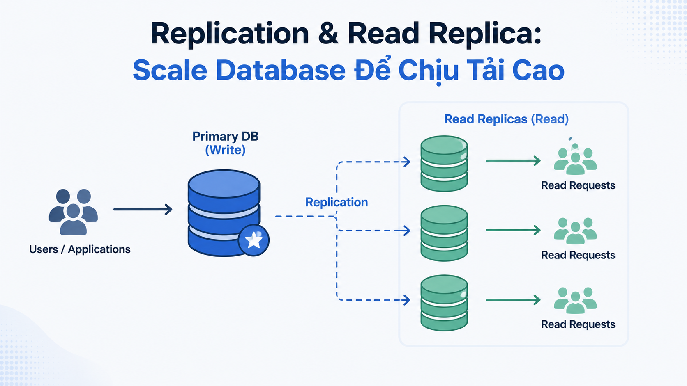

# Replication & Read Replica: Scale Database Để Chịu Tải Cao



Khi [nguyentienkhoi.hashnode.dev](http://nguyentienkhoi.hashnode.dev) phát triển, một database server đơn lẻ bắt đầu gặp giới hạn — quá nhiều query đọc từ dashboard, API, báo cáo đang cạnh tranh tài nguyên với các thao tác ghi. **Replication** là kỹ thuật nhân bản database sang nhiều server, giúp phân tải đọc, đảm bảo High Availability và bảo vệ dữ liệu khi server chính gặp sự cố.

## 1\. Replication là gì?

**Replication** là quá trình tự động sao chép dữ liệu từ một server (**Primary/Master**) sang một hoặc nhiều server khác (**Replica/Standby**) theo thời gian thực hoặc gần thực.

```java
                    ┌─────────────┐
                    │   PRIMARY   │  ← Toàn bộ WRITE đến đây
                    │  (Master)   │
                    └──────┬──────┘
                           │ WAL Stream (liên tục)
              ┌────────────┼────────────┐
              ▼            ▼            ▼
       ┌──────────┐ ┌──────────┐ ┌──────────┐
       │ REPLICA  │ │ REPLICA  │ │ REPLICA  │  ← READ queries phân tán
       │   (R1)   │ │   (R2)   │ │   (R3)   │
       └──────────┘ └──────────┘ └──────────┘
```

**Lợi ích:**

*   **Scale reads** — phân tải query đọc sang nhiều replica
    
*   **High Availability** — khi Primary down, promote replica lên làm Primary
    
*   **Disaster Recovery** — replica ở datacenter khác bảo vệ khi datacenter chính gặp thảm họa
    
*   **Analytics** — chạy báo cáo nặng trên replica, không ảnh hưởng Primary
    

## 2\. Cơ Chế Replication Trong PostgreSQL

PostgreSQL dùng **WAL (Write-Ahead Log)** để replication — mọi thay đổi đều được ghi vào WAL trước khi apply vào bảng thực. Replica nhận WAL stream và apply theo:

```java
PRIMARY:
  1. Transaction được ghi vào WAL
  2. WAL được apply vào data files
  3. WAL được stream sang Replica

REPLICA:
  1. Nhận WAL từ Primary
  2. Apply WAL vào data files của mình
  3. Dữ liệu replica sync với primary (có độ trễ nhỏ)
```

### Streaming Replication vs Logical Replication


|  | Streaming Replication | Logical Replication |
|---|---|---|
| Cấp độ | Physical (block-level) | Logical (row-level) |
| Replica phải cùng | OS, arch, version | Chỉ cần cùng major version |
| Chọn bảng cụ thể | ❌ Không — toàn bộ DB | ✅ Được |
| Dùng khi | Read Replica, HA | Migrate data, selective sync |
| Hiệu năng | Nhanh hơn | Chậm hơn một chút |


## 3\. Synchronous vs Asynchronous Replication

### Asynchronous Replication (Mặc định)

```java
PRIMARY:
  1. COMMIT transaction → trả về SUCCESS cho client ngay
  2. WAL stream sang replica (background)
  3. Replica apply WAL (có độ trễ vài ms đến vài giây)
```

**Ưu điểm:** Primary không bị chậm khi replica lag **Nhược điểm:** Nếu Primary crash trước khi replica nhận WAL → mất một số dữ liệu (RPO > 0)

```sql
-- Cấu hình async replication (mặc định, không cần đặt gì)
-- postgresql.conf trên Primary:
synchronous_commit = off  -- hoặc 'local'
```

### Synchronous Replication

```java
PRIMARY:
  1. COMMIT transaction
  2. Chờ replica xác nhận đã nhận WAL
  3. Sau đó mới trả về SUCCESS cho client
```

**Ưu điểm:** Zero data loss (RPO = 0) **Nhược điểm:** Mỗi write phải chờ replica xác nhận → latency cao hơn

```sql
-- postgresql.conf trên Primary:
synchronous_commit = on
synchronous_standby_names = 'replica1'  -- hoặc 'ANY 1 (replica1, replica2)'
```

## 4\. Cấu Hình Read Replica (Tổng Quan)

Đây là các bước cấu hình Streaming Replication — FoxDev tóm tắt để hiểu flow, không đi sâu vào từng dòng config vì thường được setup bởi DBA hoặc managed service:

### Trên Primary Server:

```sql
-- 1. Tạo replication user
CREATE USER replicator WITH REPLICATION ENCRYPTED PASSWORD 'strong_password';

-- 2. Cấp quyền
GRANT pg_read_all_data TO replicator;
```

```bash
# postgresql.conf
wal_level = replica          # bật WAL streaming
max_wal_senders = 5          # số replica tối đa
wal_keep_size = 1GB          # giữ WAL để replica chậm vẫn catch up

# pg_hba.conf — cho phép replica kết nối
host replication replicator replica_ip/32 md5
```

### Trên Replica Server:

```bash
# Tạo base backup từ Primary
pg_basebackup -h primary_host -U replicator -D /var/lib/postgresql/data -P -Xs -R

# -R tự động tạo standby.signal và postgresql.auto.conf
# Replica sẽ tự start ở chế độ standby và nhận WAL từ Primary
```

### Kiểm Tra Trạng Thái Replication:

```sql
-- Trên Primary — xem các replica đang kết nối
SELECT
    client_addr,
    state,
    sent_lsn,
    write_lsn,
    flush_lsn,
    replay_lsn,
    write_lag,
    flush_lag,
    replay_lag,
    sync_state
FROM pg_stat_replication;
```


| client_addr | state | replay_lag | sync_state |
|---|---|---|---|
| 10.0.0.2 | streaming | 00:00:00.012 | async |
| 10.0.0.3 | streaming | 00:00:00.008 | async |


```sql
-- Trên Replica — kiểm tra độ trễ
SELECT
    now() - pg_last_xact_replay_timestamp() AS replication_lag;
```

## 5\. Replication Lag — Vấn Đề Cần Xử Lý

**Replication Lag** là độ trễ giữa Primary và Replica — dữ liệu vừa ghi vào Primary chưa kịp xuất hiện ở Replica.

```java
User: Đăng ký khóa học → ghi vào Primary
User: Load trang "Khóa học của tôi" → đọc từ Replica
→ Lag 200ms → Khóa học chưa xuất hiện! → User bối rối
```

### Các Chiến Lược Xử Lý Replication Lag:

**Chiến lược 1: Read-your-writes consistency**

```java
Application routing:
- Sau khi WRITE → đọc từ Primary trong N giây
- Sau N giây → đọc từ Replica bình thường
```

**Chiến lược 2: Sticky session**

```java
Một user session luôn đọc từ cùng một server (Primary hoặc Replica cố định)
```

**Chiến lược 3: Synchronous cho thao tác quan trọng**

```sql
-- Với các thao tác quan trọng, force đọc từ Primary
-- Application code: route query này đến Primary connection pool
SELECT * FROM enrollments WHERE user_id = 1;  -- đọc từ Primary
```

**Chiến lược 4: Chờ replica catch up**

```sql
-- PostgreSQL 10+: chờ replica đã apply đến WAL position này
SELECT pg_wal_replay_wait(pg_current_wal_lsn(), timeout := 5000);
-- Chờ tối đa 5 giây để replica catch up
```

## 6\. Connection Pooling — PgBouncer

Với nhiều replica, cần connection pooler để quản lý kết nối hiệu quả:

```java
Application Servers
       │
       ▼
  ┌─────────┐
  │PgBouncer│  ← Pool connections, route đến đúng server
  └────┬────┘
       │
  ┌────┴──────────────────┐
  │                       │
  ▼                       ▼
Primary DB            Replica Pool
(Write queries)      (Read queries)
```

```ini
# pgbouncer.ini — cấu hình cơ bản
[databases]
foxdev_write = host=primary-db port=5432 dbname=foxdev
foxdev_read  = host=replica-db port=5432 dbname=foxdev

[pgbouncer]
pool_mode = transaction        # transaction-level pooling
max_client_conn = 1000         # tối đa 1000 kết nối từ application
default_pool_size = 20         # 20 kết nối thực đến DB mỗi pool
```

## 7\. Phân Loại Query — Đọc Gì Từ Đâu

Đây là phần quan trọng nhất từ góc độ SQL developer — biết query nào nên routing đến Primary, query nào routing đến Replica:

### Đọc Từ REPLICA — An Toàn:

```sql
-- ✅ Báo cáo, dashboard — không cần real-time tuyệt đối
SELECT DATE_TRUNC('month', created_at), SUM(final_amount)
FROM orders
WHERE order_status = 'PAID'
GROUP BY 1
ORDER BY 1 DESC;

-- ✅ Tìm kiếm, browse courses — độ trễ vài giây không ảnh hưởng UX
SELECT * FROM v_published_courses
WHERE category_slug = 'sql'
ORDER BY rating DESC;

-- ✅ Feed bài viết trang chủ
SELECT * FROM v_post_public
ORDER BY published_at DESC
LIMIT 20;

-- ✅ Analytics, aggregation nặng
SELECT * FROM mv_course_revenue_stats
ORDER BY gross_revenue DESC;
```

### Đọc Từ PRIMARY — Bắt Buộc:

```sql
-- ✅ Ngay sau khi ghi — cần consistency
-- Sau INSERT order → SELECT order để hiển thị confirmation
SELECT * FROM orders WHERE id = $newly_created_id;

-- ✅ Kiểm tra trước khi ghi — cần data mới nhất
SELECT balance FROM user_wallets WHERE user_id = 1 FOR UPDATE;

-- ✅ Authentication — không thể dùng stale data
SELECT * FROM users WHERE email = 'nam@gmail.com' AND password = '...';

-- ✅ Payment processing — tuyệt đối không dùng replica
SELECT * FROM orders WHERE id = $order_id FOR UPDATE;
UPDATE orders SET order_status = 'PAID' WHERE id = $order_id;
```

### Nguyên Tắc Routing:

```java
Write (INSERT/UPDATE/DELETE) → luôn PRIMARY
Read sau Write ngay lập tức  → PRIMARY (read-your-writes)
Auth, payment, critical read → PRIMARY
Dashboard, analytics, search → REPLICA
```

## 8\. Failover — Khi Primary Gặp Sự Cố

**Failover** là quá trình thăng cấp replica thành primary khi primary down:

```java
Trước failover:            Sau failover:
PRIMARY (down!) ──────→   (không còn)
    │                      
    └── REPLICA ──────→   NEW PRIMARY ← Writes bắt đầu vào đây
            │                   │
            └──────────────→   REPLICA (replica khác bắt đầu sync từ new primary)
```

### Manual Failover:

```bash
# Trên Replica — promote lên thành Primary
pg_ctl promote -D /var/lib/postgresql/data
# hoặc
SELECT pg_promote();  -- PostgreSQL 12+
```

### Automatic Failover với Patroni:

Trong thực tế, **Patroni** (hoặc các managed service như AWS RDS, Google Cloud SQL) tự động xử lý failover:

```java
Patroni Monitor:
  - Liên tục health check Primary
  - Nếu Primary không phản hồi trong 30 giây
  → Tự động elect Replica có WAL mới nhất làm Primary
  → Cập nhật DNS/load balancer
  → Application tự động kết nối đến Primary mới
  → Toàn bộ trong vài giây, không cần can thiệp thủ công
```

## 9\. Managed Database Services

Trong thực tế, hầu hết team không tự setup replication mà dùng managed service:


| Service | Replication | Failover | Read Replica |
|---|---|---|---|
| AWS RDS | Tự động | Multi-AZ tự động | Dễ tạo, nhiều region |
| Google Cloud SQL | Tự động | HA tự động | Cross-region replica |
| Supabase | Tự động | Tự động | Có |
| Neon | Tự động | Tự động | Branching thay replica |


```java
Lợi ích managed service:
✅ Setup trong vài click
✅ Automatic failover
✅ Monitoring tích hợp
✅ Backup tự động
✅ Patch, upgrade tự động
✅ Compliance (SOC2, HIPAA...)

Chi phí:
❌ Đắt hơn self-hosted 2-3 lần
❌ Ít kiểm soát hơn
```

## 10\. Query Hữu Ích Để Monitor Replication

```sql
-- Primary: xem tất cả replica và trạng thái
SELECT
    application_name,
    client_addr,
    state,
    sent_lsn,
    replay_lsn,
    (sent_lsn - replay_lsn)  AS replication_lag_bytes,
    write_lag,
    flush_lag,
    replay_lag,
    sync_state
FROM pg_stat_replication
ORDER BY replay_lag DESC;

-- Replica: kiểm tra có đang là replica không và lag bao nhiêu
SELECT
    pg_is_in_recovery()                             AS is_replica,
    now() - pg_last_xact_replay_timestamp()         AS replication_lag,
    pg_last_xact_replay_timestamp()                 AS last_replayed_at,
    pg_is_wal_replay_paused()                       AS is_paused;

-- Replica: kiểm tra WAL receiver
SELECT
    status,
    receive_start_lsn,
    received_lsn,
    last_msg_send_time,
    last_msg_receipt_time,
    latest_end_lsn,
    sender_host,
    sender_port
FROM pg_stat_wal_receiver;
```

## 11\. Thực Hành — Thiết Kế Connection Routing Cho [nguyentienkhoi.hashnode.dev](http://nguyentienkhoi.hashnode.dev)

**Bài toán:** [nguyentienkhoi.hashnode.dev](http://nguyentienkhoi.hashnode.dev) có 1 Primary + 2 Replica. Thiết kế routing hợp lý cho các use case sau:

```java
Infrastructure:
- primary-db.nguyentienkhoi.hashnode.dev   → ghi + đọc critical
- replica1-db.nguyentienkhoi.hashnode.dev  → đọc (cùng datacenter, lag < 10ms)
- replica2-db.nguyentienkhoi.hashnode.dev  → đọc báo cáo (có thể lag vài giây)
```

```sql
-- Connection pools trong application (Spring Boot / Node.js / etc.)
-- Pool 1: primaryPool → primary-db (cho write và critical read)
-- Pool 2: replicaPool → replica1-db (cho read thông thường)
-- Pool 3: analyticsPool → replica2-db (cho báo cáo nặng)

-- Route theo use case:

-- 1. Đăng ký / Login → primaryPool
SELECT * FROM users WHERE email = ? AND password = ?;

-- 2. Checkout / Payment → primaryPool (trong transaction)
BEGIN;
SELECT balance FROM user_wallets WHERE user_id = ? FOR UPDATE;
UPDATE user_wallets SET balance = balance - ? WHERE user_id = ?;
INSERT INTO orders ...;
COMMIT;

-- 3. Trang danh sách khóa học → replicaPool
SELECT * FROM v_published_courses WHERE category_slug = ?;

-- 4. Tìm kiếm bài viết → replicaPool
SELECT * FROM v_post_public WHERE title ILIKE ? ORDER BY published_at DESC;

-- 5. Dashboard admin → analyticsPool
SELECT * FROM mv_course_revenue_stats ORDER BY gross_revenue DESC;
SELECT * FROM mv_monthly_revenue ORDER BY month DESC LIMIT 12;

-- 6. Confirm page sau khi mua hàng → primaryPool (read-your-writes)
SELECT o.*, oi.* FROM orders o
JOIN order_items oi ON oi.order_id = o.id
WHERE o.id = ? AND o.user_id = ?;
```

## Tổng Kết


| Khái niệm | Ý nghĩa |
|---|---|
| Primary | Server nhận toàn bộ write operations |
| Replica | Bản sao đồng bộ từ Primary, chỉ đọc |
| WAL Stream | Cơ chế PostgreSQL dùng để sync dữ liệu |
| Async Replication | Primary không chờ replica — nhanh, có thể mất data |
| Sync Replication | Primary chờ replica xác nhận — an toàn, chậm hơn |
| Replication Lag | Độ trễ giữa Primary và Replica |
| Failover | Thăng cấp Replica thành Primary khi Primary down |
| PgBouncer | Connection pooler — quản lý kết nối hiệu quả |
| Read-your-writes | Sau khi write, đọc từ Primary để tránh stale data |


Bài tiếp theo chúng ta sẽ học **SQL trong Data Engineering** — OLTP vs OLAP, ETL pipelines, Slowly Changing Dimensions và cách SQL được dùng trong thế giới data warehouse.

> **Khác biệt với các RDBMS khác:**
> 
> *   **MySQL:** Dùng **Binary Log (binlog)** thay WAL, có thêm **Group Replication** cho multi-master. Cú pháp setup khác nhưng concept tương tự
>     
> *   **SQL Server:** Có **Always On Availability Groups** — tính năng HA/replication enterprise, tích hợp sâu với Windows Server
>     
> *   **Oracle:** Có **Data Guard** — giải pháp HA/DR enterprise mạnh nhất, hỗ trợ cả physical và logical standby
>     
> *   **Managed Services (RDS, Cloud SQL):** Tất cả đều abstract replication details — developer chỉ cần biết endpoint đọc/ghi
>     

