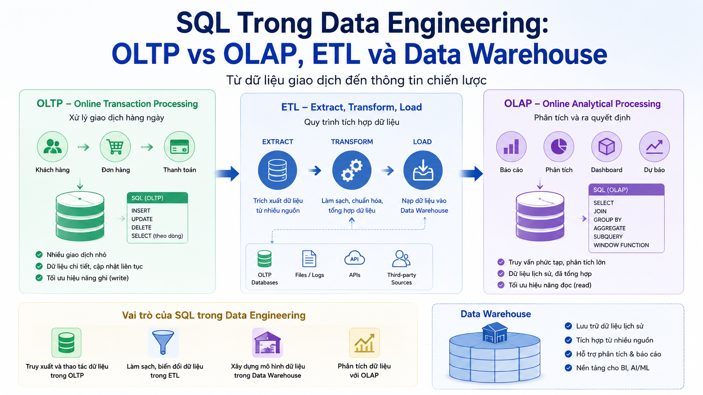

# SQL Trong Data Engineering: OLTP vs OLAP, ETL và Data Warehouse



Cho đến bài 22, chúng ta đã học SQL trong context **OLTP** (Online Transaction Processing) — hệ thống vận hành hàng ngày như [nguyentienkhoi.hashnode.dev](http://nguyentienkhoi.hashnode.dev). Nhưng SQL còn đóng vai trò cốt lõi trong một thế giới hoàn toàn khác: **Data Engineering** — nơi bạn xử lý hàng tỷ dòng, chạy báo cáo phức tạp và xây dựng data pipeline. Bài này sẽ mở ra góc nhìn đó.

## 1\. OLTP vs OLAP — Hai Thế Giới Khác Nhau

### OLTP — Online Transaction Processing

Hệ thống **vận hành** hàng ngày — [nguyentienkhoi.hashnode.dev](http://nguyentienkhoi.hashnode.dev) là một ví dụ điển hình:

```sql
-- OLTP query điển hình: nhanh, ít dòng, thao tác cụ thể
SELECT * FROM orders WHERE id = 12345;                    -- 1ms
UPDATE users SET account_status = 'ACTIVE' WHERE id = 1;  -- 1ms
INSERT INTO enrollments (user_id, course_id) VALUES (1, 5); -- 1ms
```

**Đặc điểm OLTP:**

*   Transaction ngắn, thao tác trên ít dòng
    
*   Nhiều read/write đồng thời (concurrent)
    
*   Schema chuẩn hóa (3NF) để tránh dư thừa
    
*   Ưu tiên: consistency, latency thấp
    

### OLAP — Online Analytical Processing

Hệ thống **phân tích** — câu hỏi kinh doanh, báo cáo, insight:

```sql
-- OLAP query điển hình: chậm, hàng triệu dòng, aggregation phức tạp
SELECT
    DATE_TRUNC('month', o.created_at)         AS month,
    c.course_type,
    COUNT(DISTINCT o.user_id)                  AS unique_buyers,
    SUM(oi.price)                              AS revenue,
    AVG(oi.price)                              AS avg_price,
    COUNT(oi.id)                               AS total_sales
FROM orders o
JOIN order_items oi ON oi.order_id = o.id
JOIN courses     c  ON c.id = oi.course_id
WHERE o.created_at >= '2023-01-01'
GROUP BY 1, 2
ORDER BY 1 DESC, revenue DESC;
-- Scan hàng triệu dòng → vài giây đến vài phút
```

**Đặc điểm OLAP:**

*   Query ít nhưng phức tạp, scan nhiều dòng
    
*   Ít write, chủ yếu read
    
*   Schema denormalized (Star/Snowflake schema) để query nhanh
    
*   Ưu tiên: throughput, khả năng aggregation
    

### So Sánh


| Tiêu chí | OLTP | OLAP |
|---|---|---|
| Mục đích | Vận hành nghiệp vụ | Phân tích, báo cáo |
| Dữ liệu | Hiện tại, real-time | Lịch sử, batch |
| Query | Đơn giản, nhanh | Phức tạp, chậm |
| Dòng/query | Hàng chục | Hàng triệu đến hàng tỷ |
| Schema | Normalized (3NF) | Denormalized (Star/Snowflake) |
| Ví dụ | nguyentienkhoi.hashnode.dev DB | Data Warehouse, BigQuery |


## 2\. Data Warehouse và Star Schema

Khi dữ liệu OLTP quá lớn và phức tạp cho báo cáo, ta tách ra một **Data Warehouse** riêng với schema tối ưu cho analytics.

### Star Schema — Cấu Trúc Hình Sao

```java
                    ┌─────────────────┐
                    │  FACT TABLE     │
                    │  fact_orders    │
                    │  ─────────────  │
                    │  order_key (PK) │
                    │  date_key  (FK) │──────→ dim_date
                    │  user_key  (FK) │──────→ dim_user
                    │  course_key(FK) │──────→ dim_course
                    │  amount         │
                    │  quantity       │
                    └─────────────────┘
```

**Fact Table** chứa số liệu đo được (amount, quantity, duration) **Dimension Tables** chứa thông tin mô tả (ngày, user, sản phẩm)

Ví dụ với [nguyentienkhoi.hashnode.dev](http://nguyentienkhoi.hashnode.dev):

```sql
-- Dimension: Thời gian
CREATE TABLE dim_date (
    date_key        INT PRIMARY KEY,  -- YYYYMMDD, ví dụ: 20250115
    full_date       DATE NOT NULL,
    year            INT,
    quarter         INT,
    month           INT,
    month_name      VARCHAR(20),
    week            INT,
    day_of_week     INT,
    day_name        VARCHAR(20),
    is_weekend      BOOL,
    is_holiday      BOOL
);

-- Dimension: User
CREATE TABLE dim_user (
    user_key        BIGSERIAL PRIMARY KEY,
    user_id         BIGINT NOT NULL,     -- FK sang OLTP
    email           VARCHAR(255),
    full_name       VARCHAR(100),
    account_type    VARCHAR(20),
    country_code    VARCHAR(5),
    -- SCD fields (xem phần tiếp)
    valid_from      DATE NOT NULL,
    valid_to        DATE,
    is_current      BOOL DEFAULT TRUE
);

-- Dimension: Course
CREATE TABLE dim_course (
    course_key      BIGSERIAL PRIMARY KEY,
    course_id       BIGINT NOT NULL,
    title           VARCHAR(255),
    course_type     VARCHAR(20),
    category_name   VARCHAR(255),
    instructor_name VARCHAR(100),
    valid_from      DATE NOT NULL,
    valid_to        DATE,
    is_current      BOOL DEFAULT TRUE
);

-- Fact Table: Orders
CREATE TABLE fact_orders (
    order_key       BIGSERIAL PRIMARY KEY,
    order_id        BIGINT NOT NULL,      -- FK sang OLTP (degenerate dimension)
    date_key        INT REFERENCES dim_date(date_key),
    user_key        BIGINT REFERENCES dim_user(user_key),
    course_key      BIGINT REFERENCES dim_course(course_key),
    -- Measures
    gross_amount    NUMERIC(18, 2),
    discount_amount NUMERIC(18, 2),
    net_amount      NUMERIC(18, 2),
    quantity        INT DEFAULT 1
);
```

**Query trên Star Schema** đơn giản và nhanh hơn nhiều:

```sql
-- Doanh thu theo quý và loại khóa học
SELECT
    d.year,
    d.quarter,
    c.course_type,
    COUNT(DISTINCT f.user_key)  AS unique_buyers,
    SUM(f.net_amount)           AS total_revenue
FROM fact_orders f
JOIN dim_date   d ON d.date_key   = f.date_key
JOIN dim_course c ON c.course_key = f.course_key
WHERE d.year = 2025
  AND c.is_current = TRUE
GROUP BY 1, 2, 3
ORDER BY 1, 2, revenue DESC;
```

## 3\. ETL — Extract, Transform, Load

**ETL** là quy trình di chuyển dữ liệu từ OLTP sang Data Warehouse:

```java
OLTP Database         ETL Pipeline              Data Warehouse
(nguyentienkhoi.hashnode.dev)    →   Extract → Transform →      (BigQuery/
                      Load                        Snowflake/
                                                  Redshift)
```

### Extract — Trích Xuất Dữ Liệu

```sql
-- Trích xuất dữ liệu mới từ OLTP kể từ lần ETL trước
-- Dùng updated_at để lấy incremental data (chỉ dữ liệu mới/thay đổi)
SELECT
    o.id,
    o.user_id,
    o.order_status,
    o.final_amount,
    o.currency,
    o.created_at,
    o.updated_at,
    oi.course_id,
    oi.price
FROM orders o
JOIN order_items oi ON oi.order_id = o.id
WHERE o.updated_at >= :last_etl_timestamp  -- chỉ lấy bản ghi đã thay đổi
  AND o.order_status = 'PAID'
ORDER BY o.updated_at;
```

### Transform — Biến Đổi Dữ Liệu

```sql
-- Chuẩn hóa, làm sạch, enrich dữ liệu trước khi load vào warehouse
WITH raw_orders AS (
    -- Dữ liệu thô từ Extract
    SELECT * FROM staging.raw_orders
    WHERE etl_batch_id = :current_batch_id
),
cleaned_orders AS (
    SELECT
        order_id,
        user_id,
        -- Chuẩn hóa currency về VND
        CASE
            WHEN currency = 'USD' THEN ROUND(net_amount * 24000, 0)
            WHEN currency = 'EUR' THEN ROUND(net_amount * 26000, 0)
            ELSE net_amount
        END                         AS amount_vnd,
        -- Làm sạch ngày: convert sang date key
        TO_CHAR(created_at, 'YYYYMMDD')::INT  AS date_key,
        course_id,
        net_amount,
        created_at
    FROM raw_orders
    WHERE net_amount > 0              -- loại bỏ bản ghi lỗi
      AND user_id IS NOT NULL
      AND course_id IS NOT NULL
),
enriched_orders AS (
    SELECT
        co.*,
        u.user_key,
        c.course_key
    FROM cleaned_orders co
    -- Join để lấy surrogate key từ dimension tables
    JOIN dim_user   u ON u.user_id   = co.user_id
                     AND u.is_current = TRUE
    JOIN dim_course c ON c.course_id = co.course_id
                     AND c.is_current = TRUE
)
-- Load vào fact table
INSERT INTO fact_orders (
    order_id, date_key, user_key, course_key,
    gross_amount, net_amount, quantity
)
SELECT
    order_id, date_key, user_key, course_key,
    amount_vnd, amount_vnd, 1
FROM enriched_orders
ON CONFLICT (order_id) DO UPDATE SET
    net_amount  = EXCLUDED.net_amount,
    updated_at  = NOW();
```

## 4\. Slowly Changing Dimensions (SCD)

**SCD** giải quyết bài toán: thông tin trong dimension thay đổi theo thời gian — user đổi email, khóa học đổi giá. Trong Data Warehouse cần giữ lại **lịch sử thay đổi** để báo cáo chính xác.

### SCD Type 1 — Overwrite (Ghi Đè)

Đơn giản nhất — ghi đè giá trị cũ, không giữ lịch sử:

```sql
-- User đổi email → cập nhật luôn, mất thông tin cũ
UPDATE dim_user
SET email      = 'nam.new@gmail.com',
    updated_at = NOW()
WHERE user_id  = 1;
```

**Dùng khi:** Lỗi dữ liệu cần sửa, không cần audit trail lịch sử.

### SCD Type 2 — Add New Row (Thêm Dòng Mới)

Phổ biến nhất — giữ toàn bộ lịch sử bằng cách thêm dòng mới:

```sql
-- User đổi tên → đóng dòng cũ, thêm dòng mới
-- Bước 1: Đóng dòng cũ
UPDATE dim_user
SET valid_to   = CURRENT_DATE - 1,
    is_current = FALSE
WHERE user_id  = 1
  AND is_current = TRUE;

-- Bước 2: Thêm dòng mới với thông tin cập nhật
INSERT INTO dim_user (
    user_id, email, full_name, account_type,
    valid_from, valid_to, is_current
)
VALUES (
    1, 'nam@gmail.com', 'Nguyen Van Nam', 'INDIVIDUAL',
    CURRENT_DATE, NULL, TRUE
);
```

**Query lịch sử với SCD Type 2:**

```sql
-- Doanh thu theo tên user TẠI THỜI ĐIỂM mua hàng (không phải tên hiện tại)
SELECT
    u.full_name,                    -- tên user tại thời điểm giao dịch
    SUM(f.net_amount) AS revenue
FROM fact_orders f
JOIN dim_user u
  ON u.user_key = f.user_key        -- join qua surrogate key
GROUP BY u.full_name
ORDER BY revenue DESC;

-- Khác với query dùng tên hiện tại:
SELECT
    u.full_name,
    SUM(f.net_amount) AS revenue
FROM fact_orders f
JOIN dim_user u
  ON u.user_id = f.user_id          -- join qua natural key
 AND u.is_current = TRUE            -- chỉ lấy tên hiện tại
GROUP BY u.full_name;
```

### SCD Type 3 — Add Column (Thêm Cột)

Lưu giá trị hiện tại và một giá trị trước đó:

```sql
ALTER TABLE dim_course
    ADD COLUMN prev_price    NUMERIC,
    ADD COLUMN current_price NUMERIC,
    ADD COLUMN price_changed_at TIMESTAMPTZ;

-- Khi giá thay đổi
UPDATE dim_course
SET prev_price       = current_price,
    current_price    = 699000,
    price_changed_at = NOW()
WHERE course_id = 1;
```

**Dùng khi:** Chỉ cần so sánh giá trị hiện tại với trước đó, không cần toàn bộ lịch sử.

## 5\. Data Pipeline Thực Tế

### Incremental Load vs Full Load

```sql
-- Full Load: xóa sạch và load lại toàn bộ
-- Dùng cho dimension nhỏ, ít thay đổi
TRUNCATE TABLE dim_date;
INSERT INTO dim_date ...;  -- load lại toàn bộ

-- Incremental Load: chỉ load dữ liệu mới/thay đổi
-- Dùng cho fact table lớn
INSERT INTO fact_orders (...)
SELECT ...
FROM staging.orders
WHERE etl_batch_id = :current_batch_id
ON CONFLICT (order_id) DO UPDATE SET ...;
```

### Idempotent ETL — Chạy Lại An Toàn

```sql
-- ETL phải idempotent — chạy lại nhiều lần cho cùng kết quả
-- Dùng UPSERT thay vì INSERT thuần
INSERT INTO fact_orders (
    order_id,
    date_key,
    user_key,
    course_key,
    net_amount
)
SELECT
    o.id,
    TO_CHAR(o.created_at, 'YYYYMMDD')::INT,
    u.user_key,
    c.course_key,
    o.final_amount
FROM staging.orders o
JOIN dim_user   u ON u.user_id   = o.user_id   AND u.is_current = TRUE
JOIN dim_course c ON c.course_id = o.course_id AND c.is_current = TRUE
ON CONFLICT (order_id)
DO UPDATE SET
    net_amount = EXCLUDED.net_amount,
    updated_at = NOW();
-- Chạy lần 1 hay lần 10 cũng cho cùng kết quả
```

### Watermark — Tracking Tiến Độ ETL

```sql
-- Bảng lưu trạng thái ETL
CREATE TABLE etl_watermarks (
    table_name      VARCHAR(100) PRIMARY KEY,
    last_loaded_at  TIMESTAMPTZ  NOT NULL,
    last_batch_id   BIGINT,
    rows_processed  BIGINT DEFAULT 0,
    status          VARCHAR(20)  DEFAULT 'SUCCESS',
    updated_at      TIMESTAMPTZ  DEFAULT NOW()
);

-- Đọc watermark trước khi ETL
SELECT last_loaded_at
FROM etl_watermarks
WHERE table_name = 'orders';

-- Cập nhật watermark sau khi ETL thành công
UPDATE etl_watermarks
SET last_loaded_at = NOW(),
    rows_processed = :rows_count,
    status         = 'SUCCESS',
    updated_at     = NOW()
WHERE table_name = 'orders';
```

## 6\. Data Warehouse Hiện Đại — BigQuery, Snowflake, Redshift

Trong thực tế production với data lớn, thường dùng **cloud data warehouse** thay vì PostgreSQL:


|  | BigQuery | Snowflake | Redshift |
|---|---|---|---|
| Vendor | Google Cloud | Snowflake Inc | AWS |
| Storage | Columnar | Columnar | Columnar |
| Pricing | Pay per query | Compute + storage | Instance-based |
| Scale | Petabyte | Petabyte | Terabyte-Petabyte |
| SQL dialect | Standard SQL | Snowflake SQL | PostgreSQL-like |
| Đặc điểm | Serverless, nhanh | Multi-cloud, clone | Tích hợp AWS |


**Các tính năng SQL nâng cao trong BigQuery:**

```sql
-- Approximate COUNT DISTINCT — nhanh hơn COUNT(DISTINCT) nhiều
SELECT APPROX_COUNT_DISTINCT(user_id) AS approx_unique_users
FROM `foxdev.orders`
WHERE DATE(created_at) = CURRENT_DATE();

-- Array aggregation — phổ biến trong analytics
SELECT
    course_id,
    ARRAY_AGG(DISTINCT tag_name ORDER BY tag_name) AS tags
FROM course_tags
GROUP BY course_id;

-- Unnest array — expand array thành nhiều dòng
SELECT course_id, tag
FROM courses,
UNNEST(tags) AS tag;

-- Partition expiry — tự động xóa partition cũ
CREATE TABLE video_logs
PARTITION BY DATE(created_at)
OPTIONS (partition_expiration_days = 365);
```

## 7\. SQL Cho Analytics — Các Pattern Quan Trọng

### Cohort Analysis — Phân Tích Cohort

```sql
-- Cohort: nhóm user theo tháng đăng ký, theo dõi retention
WITH cohorts AS (
    SELECT
        user_id,
        DATE_TRUNC('month', created_at) AS cohort_month
    FROM users
    WHERE account_status != 'DELETED'
),
user_activity AS (
    SELECT
        o.user_id,
        DATE_TRUNC('month', o.created_at) AS activity_month
    FROM orders o
    WHERE o.order_status = 'PAID'
    GROUP BY 1, 2
)
SELECT
    c.cohort_month,
    COUNT(DISTINCT c.user_id)              AS cohort_size,
    COUNT(DISTINCT CASE
        WHEN a.activity_month = c.cohort_month
        THEN c.user_id END)                AS month_0,
    COUNT(DISTINCT CASE
        WHEN a.activity_month = c.cohort_month + INTERVAL '1 month'
        THEN c.user_id END)                AS month_1,
    COUNT(DISTINCT CASE
        WHEN a.activity_month = c.cohort_month + INTERVAL '2 months'
        THEN c.user_id END)                AS month_2,
    COUNT(DISTINCT CASE
        WHEN a.activity_month = c.cohort_month + INTERVAL '3 months'
        THEN c.user_id END)                AS month_3
FROM cohorts c
LEFT JOIN user_activity a ON a.user_id = c.user_id
GROUP BY c.cohort_month
ORDER BY c.cohort_month DESC;
```

### Funnel Analysis — Phân Tích Phễu

```sql
-- Funnel: từ xem khóa học → thêm vào giỏ → thanh toán
WITH funnel_steps AS (
    SELECT
        DATE_TRUNC('week', created_at) AS week,

        -- Step 1: Users xem khóa học (view_count tăng)
        COUNT(DISTINCT watcher_id)      AS step1_view,

        -- Step 2: Users click vào trang khóa học
        COUNT(DISTINCT CASE
            WHEN video_action = 'PLAY' THEN watcher_id END) AS step2_play,

        -- Step 3: Users hoàn thành ít nhất 1 lecture
        COUNT(DISTINCT CASE
            WHEN video_action = 'END'  THEN watcher_id END) AS step3_complete
    FROM video_tracking_logs
    WHERE watched_at >= NOW() - INTERVAL '30 days'
    GROUP BY 1
)
SELECT
    week,
    step1_view,
    step2_play,
    step3_complete,
    ROUND(step2_play * 100.0 / NULLIF(step1_view, 0), 1) AS view_to_play_pct,
    ROUND(step3_complete * 100.0 / NULLIF(step2_play, 0), 1) AS play_to_complete_pct
FROM funnel_steps
ORDER BY week DESC;
```

### Session Analysis — Phân Tích Phiên Học

```sql
-- Tính session dựa trên khoảng cách giữa các hoạt động
-- Session mới = không có hoạt động trong 30 phút trước
WITH user_activity AS (
    SELECT
        watcher_id,
        watched_at,
        LAG(watched_at) OVER (
            PARTITION BY watcher_id
            ORDER BY watched_at
        ) AS prev_activity
    FROM video_tracking_logs
    WHERE watched_at >= NOW() - INTERVAL '7 days'
),
sessions AS (
    SELECT
        watcher_id,
        watched_at,
        SUM(CASE
            WHEN prev_activity IS NULL
              OR watched_at - prev_activity > INTERVAL '30 minutes'
            THEN 1 ELSE 0
        END) OVER (
            PARTITION BY watcher_id
            ORDER BY watched_at
        ) AS session_id
    FROM user_activity
)
SELECT
    watcher_id,
    session_id,
    MIN(watched_at)                              AS session_start,
    MAX(watched_at)                              AS session_end,
    MAX(watched_at) - MIN(watched_at)            AS session_duration,
    COUNT(*)                                     AS events_in_session
FROM sessions
GROUP BY watcher_id, session_id
ORDER BY watcher_id, session_start;
```

## 8\. Thực Hành Tổng Hợp

**Bài 1:** Xây dựng dim\_date cho năm 2025.

```sql
INSERT INTO dim_date (
    date_key, full_date, year, quarter, month,
    month_name, week, day_of_week, day_name, is_weekend
)
SELECT
    TO_CHAR(d, 'YYYYMMDD')::INT         AS date_key,
    d::DATE                              AS full_date,
    EXTRACT(YEAR    FROM d)::INT         AS year,
    EXTRACT(QUARTER FROM d)::INT         AS quarter,
    EXTRACT(MONTH   FROM d)::INT         AS month,
    TO_CHAR(d, 'Month')                  AS month_name,
    EXTRACT(WEEK    FROM d)::INT         AS week,
    EXTRACT(DOW     FROM d)::INT         AS day_of_week,
    TO_CHAR(d, 'Day')                    AS day_name,
    EXTRACT(DOW     FROM d) IN (0, 6)    AS is_weekend
FROM generate_series(
    '2025-01-01'::DATE,
    '2025-12-31'::DATE,
    '1 day'::INTERVAL
) AS d;
```

**Bài 2:** SCD Type 2 — xử lý khi học viên thay đổi thông tin.

```sql
CREATE OR REPLACE PROCEDURE upsert_dim_user_scd2(
    p_user_id    BIGINT,
    p_email      VARCHAR,
    p_full_name  VARCHAR,
    p_country    VARCHAR
)
LANGUAGE plpgsql
AS $$
DECLARE
    v_changed BOOLEAN := FALSE;
BEGIN
    -- Kiểm tra có thay đổi không
    SELECT EXISTS (
        SELECT 1 FROM dim_user
        WHERE user_id    = p_user_id
          AND is_current = TRUE
          AND (email    != p_email
            OR full_name != p_full_name
            OR country_code != p_country)
    ) INTO v_changed;

    IF v_changed THEN
        -- Đóng dòng cũ
        UPDATE dim_user
        SET valid_to   = CURRENT_DATE - 1,
            is_current = FALSE
        WHERE user_id    = p_user_id
          AND is_current = TRUE;

        -- Thêm dòng mới
        INSERT INTO dim_user (
            user_id, email, full_name, country_code,
            valid_from, valid_to, is_current
        )
        VALUES (
            p_user_id, p_email, p_full_name, p_country,
            CURRENT_DATE, NULL, TRUE
        );
    ELSE
        -- Chưa có → insert lần đầu
        INSERT INTO dim_user (
            user_id, email, full_name, country_code,
            valid_from, valid_to, is_current
        )
        VALUES (
            p_user_id, p_email, p_full_name, p_country,
            CURRENT_DATE, NULL, TRUE
        )
        ON CONFLICT (user_id) WHERE is_current = TRUE
        DO NOTHING;
    END IF;
END;
$$;
```

## Tổng Kết


| Khái niệm | Ý nghĩa |
|---|---|
| OLTP | Hệ thống vận hành — transaction nhanh, ít dòng |
| OLAP | Hệ thống phân tích — query phức tạp, nhiều dòng |
| Data Warehouse | Database tối ưu cho analytics — Star/Snowflake schema |
| Fact Table | Lưu số liệu đo được (revenue, quantity) |
| Dimension Table | Lưu thông tin mô tả (user, date, product) |
| ETL | Extract → Transform → Load |
| SCD Type 1 | Ghi đè — không giữ lịch sử |
| SCD Type 2 | Thêm dòng mới — giữ toàn bộ lịch sử |
| SCD Type 3 | Thêm cột — giữ giá trị trước và hiện tại |
| Incremental Load | Chỉ load dữ liệu mới/thay đổi |
| Idempotent ETL | Chạy lại nhiều lần cho cùng kết quả |
| Watermark | Tracking tiến độ ETL |


Bài tiếp theo — bài cuối cùng của series — chúng ta sẽ tổng kết **Common Mistakes & Anti-patterns**: những lỗi phổ biến nhất mà ngay cả senior developer vẫn mắc phải, kèm checklist để review SQL trước khi đưa lên production.

> **Khác biệt với các RDBMS khác:**
> 
> *   **BigQuery (Google):** Columnar storage, serverless, dùng Standard SQL — tối ưu cho analytics petabyte
>     
> *   **Snowflake:** Multi-cloud, virtual warehouse scaling, Time Travel cho query dữ liệu tại thời điểm quá khứ
>     
> *   **Redshift (AWS):** Tích hợp sâu với S3, COPY command để bulk load từ S3
>     
> *   **DuckDB:** OLAP database nhúng chạy local — mới nổi, cực nhanh cho analytics trên file CSV/Parquet
>     

