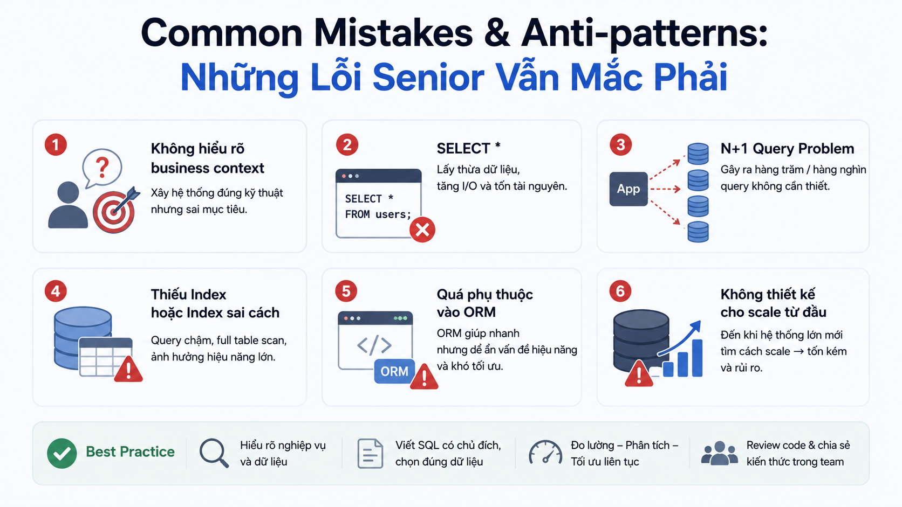

# Common Mistakes & Anti-patterns: Những Lỗi Senior Vẫn Mắc Phải



Đây là bài cuối cùng của series SQL từ Beginner đến Senior. Tao sẽ tổng hợp những lỗi phổ biến nhất — không phải lỗi của người mới học, mà là những lỗi **ngay cả developer giàu kinh nghiệm vẫn mắc phải** trong thực tế. Mỗi lỗi đều đến từ kinh nghiệm thực chiến, kèm cách phòng tránh và checklist để review trước khi lên production.

## NHÓM 1: LỖI VỀ DỮ LIỆU

### Lỗi 1: Không Hiểu NULL — Bẫy Phổ Biến Nhất

```sql
-- ❌ Lỗi: dùng = để so sánh NULL
SELECT * FROM users WHERE phone = NULL;      -- luôn trả về 0 dòng
SELECT * FROM users WHERE phone != NULL;     -- luôn trả về 0 dòng

-- ❌ Lỗi: NULL trong aggregate bị bỏ qua mà không hay
SELECT AVG(rating) FROM courses;
-- Nếu 3/5 khóa có rating, AVG chỉ tính trên 3 khóa, không phải 5!

-- ❌ Lỗi: NULL trong phép tính
SELECT price * discount_pct / 100 FROM courses;
-- Nếu discount_pct = NULL → kết quả = NULL, không phải 0!

-- ✅ Đúng
SELECT * FROM users WHERE phone IS NULL;
SELECT * FROM users WHERE phone IS NOT NULL;
SELECT AVG(COALESCE(rating, 0)) FROM courses;  -- tính cả những khóa chưa có rating
SELECT price * COALESCE(discount_pct, 0) / 100 FROM courses;
```

### Lỗi 2: FLOAT Cho Tiền Tệ

```sql
-- ❌ Sai — FLOAT lưu xấp xỉ, không chính xác
CREATE TABLE payments_bad (
    amount FLOAT  -- có thể lưu 799000.0000001 thay vì 799000
);

-- Hậu quả thực tế:
SELECT 0.1 + 0.2;  -- PostgreSQL: 0.30000000000000004 với FLOAT

-- ✅ Đúng — NUMERIC chính xác tuyệt đối
CREATE TABLE payments_good (
    amount NUMERIC(18, 2)  -- tối đa 18 chữ số, 2 số thập phân
);
```

### Lỗi 3: Timezone Không Nhất Quán

```sql
-- ❌ Dùng TIMESTAMP (không có timezone)
created_at TIMESTAMP DEFAULT NOW()
-- Server ở UTC, user ở GMT+7 → hiển thị sai 7 tiếng!

-- ✅ Dùng TIMESTAMPTZ (có timezone)
created_at TIMESTAMPTZ DEFAULT CURRENT_TIMESTAMP
-- Lưu ở UTC, display theo timezone của client

-- ❌ Lỗi: so sánh timezone không đúng
SELECT * FROM orders
WHERE created_at >= '2025-01-15';
-- '2025-01-15' được interpret là UTC midnight
-- User ở GMT+7 muốn lấy dữ liệu từ 00:00 giờ Việt Nam
-- nhưng lại lấy từ 07:00 giờ Việt Nam!

-- ✅ Đúng: explicit timezone
SELECT * FROM orders
WHERE created_at >= '2025-01-15 00:00:00+07';
-- hoặc
WHERE created_at >= '2025-01-15'::DATE AT TIME ZONE 'Asia/Ho_Chi_Minh';
```

### Lỗi 4: Cắt Ngắn Chuỗi Mà Không Biết

```sql
-- ❌ Định nghĩa VARCHAR quá ngắn
email VARCHAR(50)  -- email dài hơn 50 ký tự sẽ bị lỗi hoặc cắt ngắn

-- Thực tế: RFC 5321 cho phép email dài đến 320 ký tự
-- ✅ Đúng
email VARCHAR(255)  -- đủ cho mọi email hợp lệ

-- ❌ Lưu URL vào VARCHAR(255) — URL hiện đại rất dài
url VARCHAR(255)

-- ✅ Đúng
url VARCHAR(2048)  -- hoặc TEXT
```

## NHÓM 2: LỖI VỀ THIẾT KẾ SCHEMA

### Lỗi 5: Dùng String Thay Vì Enum/Constraint

```sql
-- ❌ Không có constraint — có thể lưu bất kỳ giá trị nào
CREATE TABLE orders_bad (
    order_status VARCHAR(20)  -- có thể lưu 'paid', 'PAID', 'Paid', 'paidd'...
);

-- ✅ Có CHECK constraint — đảm bảo chỉ lưu giá trị hợp lệ
CREATE TABLE orders_good (
    order_status VARCHAR(20) NOT NULL
    CHECK (order_status IN ('CREATED','PENDING','PAID','FAILED','CANCELLED'))
);

-- Hoặc dùng ENUM type
CREATE TYPE order_status_type AS ENUM
    ('CREATED', 'PENDING', 'PAID', 'FAILED', 'CANCELLED');

CREATE TABLE orders_best (
    order_status order_status_type NOT NULL DEFAULT 'PENDING'
);
```

### Lỗi 6: Thiếu Index Trên Foreign Key

```sql
-- ❌ Tạo foreign key nhưng không index → JOIN chậm
ALTER TABLE orders
    ADD CONSTRAINT orders_user_id_fkey
    FOREIGN KEY (user_id) REFERENCES users(id);
-- Không có index trên orders.user_id!

-- Khi JOIN: SELECT * FROM orders JOIN users ON users.id = orders.user_id
-- → Seq Scan toàn bộ orders để tìm user_id

-- ✅ Luôn tạo index cho foreign key columns
CREATE INDEX idx_orders_user_id ON orders (user_id);
```

**Kiểm tra foreign key không có index:**

```sql
-- Query tìm tất cả FK không có index tương ứng
SELECT
    tc.table_name,
    kcu.column_name,
    ccu.table_name AS referenced_table
FROM information_schema.table_constraints tc
JOIN information_schema.key_column_usage kcu
    ON tc.constraint_name = kcu.constraint_name
JOIN information_schema.constraint_column_usage ccu
    ON ccu.constraint_name = tc.constraint_name
WHERE tc.constraint_type = 'FOREIGN KEY'
  AND NOT EXISTS (
    SELECT 1
    FROM pg_indexes
    WHERE tablename  = tc.table_name
      AND indexdef LIKE '%' || kcu.column_name || '%'
  )
ORDER BY tc.table_name;
```

### Lỗi 7: EAV Pattern — Entity-Attribute-Value

```sql
-- ❌ EAV pattern — linh hoạt nhưng nightmare về hiệu năng và type safety
CREATE TABLE user_attributes (
    user_id    BIGINT,
    attr_name  VARCHAR(100),
    attr_value TEXT           -- tất cả đều là TEXT, mất type safety
);

INSERT INTO user_attributes VALUES (1, 'age', '25');
INSERT INTO user_attributes VALUES (1, 'premium', 'true');
INSERT INTO user_attributes VALUES (1, 'score', '4.8');

-- Query cực kỳ xấu và chậm:
SELECT *
FROM users u
JOIN user_attributes age     ON age.user_id = u.id AND age.attr_name = 'age'
JOIN user_attributes premium ON premium.user_id = u.id AND premium.attr_name = 'premium'
WHERE age.attr_value::INT > 20
  AND premium.attr_value = 'true';

-- ✅ Dùng JSONB cho dữ liệu linh hoạt — có type, có index
ALTER TABLE users ADD COLUMN extra_data JSONB;
UPDATE users SET extra_data = '{"age": 25, "premium": true, "score": 4.8}' WHERE id = 1;

SELECT * FROM users
WHERE (extra_data->>'age')::INT > 20
  AND (extra_data->>'premium')::BOOL = true;

-- Index JSONB
CREATE INDEX idx_users_extra_data ON users USING gin (extra_data);
```

### Lỗi 8: God Table — Một Bảng Làm Mọi Thứ

```sql
-- ❌ God Table — một bảng với hàng trăm cột, nhiều cột thường NULL
CREATE TABLE entities (
    id              BIGINT PRIMARY KEY,
    type            VARCHAR(50),  -- 'USER', 'COURSE', 'ORDER', 'POST'...
    name            VARCHAR(255),
    email           VARCHAR(255), -- chỉ dùng khi type = 'USER'
    price           NUMERIC,      -- chỉ dùng khi type = 'COURSE'
    status          VARCHAR(20),
    user_id         BIGINT,
    course_id       BIGINT,
    -- ... 200 cột khác, mỗi loại entity dùng vài chục cột
);

-- ✅ Bảng riêng cho từng entity, có cấu trúc rõ ràng
-- users, courses, orders, posts — như nguyentienkhoi.hashnode.dev đang làm
```

## NHÓM 3: LỖI VỀ QUERY

### Lỗi 9: UPDATE/DELETE Không Có WHERE

```sql
-- ❌ Lỗi nghiêm trọng nhất — xảy ra khi mất tập trung
UPDATE users SET account_status = 'BANNED';       -- ban toàn bộ user!
DELETE FROM orders;                                -- xóa toàn bộ đơn hàng!
TRUNCATE TABLE payments;                           -- xóa toàn bộ thanh toán!

-- Hậu quả: không thể undo nếu không có backup
-- Một câu lệnh thiếu WHERE có thể phá hủy toàn bộ business

-- ✅ Luôn SELECT trước khi UPDATE/DELETE
SELECT COUNT(*) FROM users WHERE account_status != 'BANNED';
-- Xác nhận số lượng dòng sẽ bị ảnh hưởng trước khi thực thi

-- ✅ Dùng transaction để có thể rollback
BEGIN;
UPDATE users SET account_status = 'BANNED' WHERE id = 1;
SELECT id, account_status FROM users WHERE id = 1;  -- verify
COMMIT;  -- hoặc ROLLBACK nếu sai
```

### Lỗi 10: Dùng DISTINCT Thay Vì Fix Root Cause

```sql
-- ❌ Dùng DISTINCT để ẩn đi vấn đề duplicate — không giải quyết gốc rễ
SELECT DISTINCT u.email, c.title
FROM users u
JOIN orders o ON o.user_id = u.id
JOIN order_items oi ON oi.order_id = o.id
JOIN courses c ON c.id = oi.course_id;
-- Tại sao có duplicate? Vì JOIN tạo ra Cartesian product!
-- DISTINCT chỉ ẩn đi triệu chứng, không sửa query sai

-- Phân tích: user có 3 orders, mỗi order có 2 items
-- → 3 × 2 = 6 dòng cho cùng 1 user, chỉ cần 1

-- ✅ Fix root cause — dùng đúng JOIN
SELECT DISTINCT ON (u.id, c.id)
    u.email,
    c.title
FROM users u
JOIN orders o ON o.user_id = u.id
JOIN order_items oi ON oi.order_id = o.id
JOIN courses c ON c.id = oi.course_id;
-- hoặc dùng subquery/CTE để tổng hợp trước khi JOIN
```

### Lỗi 11: ORDER BY Trong Subquery Không Có LIMIT

```sql
-- ❌ ORDER BY trong subquery không có LIMIT — vô nghĩa và chậm
SELECT * FROM (
    SELECT * FROM orders ORDER BY created_at DESC  -- ORDER BY này bị ignore!
) sub
WHERE order_status = 'PAID';

-- PostgreSQL có thể (và thường sẽ) bỏ qua ORDER BY trong subquery
-- nếu không có LIMIT — tốn thời gian sort vô ích

-- ✅ ORDER BY chỉ nằm ở câu query ngoài cùng, hoặc có LIMIT nếu trong subquery
SELECT * FROM orders
WHERE order_status = 'PAID'
ORDER BY created_at DESC;
```

### Lỗi 12: HAVING Thay Vì WHERE

```sql
-- ❌ Dùng HAVING để filter điều kiện không cần aggregate — chậm hơn
SELECT order_status, COUNT(*), SUM(final_amount)
FROM orders
GROUP BY order_status
HAVING order_status = 'PAID';  -- filter này nên là WHERE!

-- Với HAVING: database phải group TOÀN BỘ orders rồi mới filter
-- Với WHERE: database filter trước, group ít dòng hơn

-- ✅ Đúng: WHERE để filter trước khi group
SELECT order_status, COUNT(*), SUM(final_amount)
FROM orders
WHERE order_status = 'PAID'  -- filter sớm, chỉ group dữ liệu cần thiết
GROUP BY order_status;
```

## NHÓM 4: LỖI VỀ HIỆU NĂNG

### Lỗi 13: Tạo Index Trên Cột Low Cardinality

```sql
-- ❌ Index trên cột boolean hoặc ít giá trị — hầu như vô dụng
CREATE INDEX idx_users_email_verified ON users (email_verified);
-- email_verified chỉ có TRUE/FALSE
-- Database vẫn phải đọc 50% bảng → Full Scan nhanh hơn Index Scan

-- ❌ Index trên gender (MALE/FEMALE/OTHER) — low cardinality
CREATE INDEX idx_users_gender ON users (gender);

-- ✅ Partial Index khi cần filter theo giá trị cụ thể
CREATE INDEX idx_users_unverified
    ON users (id, created_at)
    WHERE email_verified = FALSE;  -- chỉ index subset nhỏ
-- Hữu ích cho: "Gửi email nhắc nhở user chưa xác thực"
```

### Lỗi 14: N+1 Query Trong Application

```sql
-- ❌ Application code chạy N+1 queries (đã đề cập ở Bài 20 nhưng quan trọng nhất)
-- courses = query(SELECT * FROM courses LIMIT 10)
-- FOR EACH course:
--     ratings = query(SELECT AVG(rate) FROM ratings WHERE course_id = course.id)
-- Tổng: 11 queries thay vì 1

-- Dấu hiệu nhận biết N+1:
-- - Slow API endpoint dù query đơn lẻ nhanh
-- - Log database hiển thị hàng trăm query giống nhau liên tiếp
-- - Execution time tăng tuyến tính theo số records

-- ✅ Giải quyết: JOIN hoặc batch loading
SELECT c.*, ROUND(AVG(r.rate), 2) AS avg_rating
FROM courses c
LEFT JOIN ratings r ON r.course_id = c.id
GROUP BY c.id
LIMIT 10;
```

### Lỗi 15: Không Dùng Connection Pooling

```sql
-- ❌ Mỗi request tạo kết nối mới đến DB → connection overhead lớn
-- Application: new Connection() → query → close Connection()
-- PostgreSQL tạo process mới cho mỗi kết nối → tốn ~5MB RAM mỗi connection

-- Hậu quả: 1000 concurrent requests → 1000 connections → ~5GB RAM chỉ cho connections!

-- ✅ Dùng connection pool
-- Spring Boot: HikariCP (mặc định)
-- Node.js: pg-pool
-- Python: psycopg2 pool hoặc SQLAlchemy pool

-- Cấu hình hợp lý cho nguyentienkhoi.hashnode.dev:
-- pool_size = 20          (số kết nối thường trực)
-- max_overflow = 10       (kết nối thêm khi peak)
-- pool_timeout = 30       (giây chờ nếu pool đầy)
-- pool_recycle = 3600     (tái tạo connection sau 1 giờ)
```

## NHÓM 5: LỖI VỀ BẢO MẬT

### Lỗi 16: SQL Injection

```sql
-- ❌ Nối chuỗi trực tiếp từ user input — SQL Injection!
-- Python: query = "SELECT * FROM users WHERE email = '" + user_input + "'"
-- Nếu user_input = "' OR '1'='1" → query trả về toàn bộ users!
-- Nếu user_input = "'; DROP TABLE users; --" → xóa bảng!

-- ✅ Luôn dùng parameterized queries / prepared statements
-- Python psycopg2:
-- cursor.execute("SELECT * FROM users WHERE email = %s", (user_input,))

-- Java PreparedStatement:
-- stmt = conn.prepareStatement("SELECT * FROM users WHERE email = ?");
-- stmt.setString(1, userInput);

-- Node.js pg:
-- await pool.query("SELECT * FROM users WHERE email = $1", [userInput]);
```

### Lỗi 17: Expose Dữ Liệu Nhạy Cảm

```sql
-- ❌ API endpoint trả về toàn bộ dòng user kể cả password hash
SELECT * FROM users WHERE id = 1;
-- Trả về: id, email, password (hash!), reset_token, two_factor_secret...

-- ❌ Log query với dữ liệu nhạy cảm
-- slow_query.log: UPDATE users SET password = '...' WHERE email = 'nam@gmail.com'

-- ✅ Chỉ SELECT cột cần thiết, không bao giờ select password/token
SELECT id, email, first_name, last_name, account_status, avatar_url
FROM users
WHERE id = 1;

-- ✅ Dùng View để ẩn cột nhạy cảm (đã đề cập Bài 18)
CREATE VIEW v_users_safe AS
SELECT id, public_id, email, first_name, last_name, account_status, avatar_url
FROM users;
-- Application chỉ query từ v_users_safe
```

## NHÓM 6: LỖI VỀ MIGRATION

### Lỗi 18: ALTER TABLE Trên Bảng Lớn Không Cẩn Thận

```sql
-- ❌ Các thao tác này lock bảng trong PostgreSQL cũ:
ALTER TABLE orders ADD COLUMN notes TEXT NOT NULL DEFAULT '';
-- PostgreSQL < 11: phải rewrite toàn bộ bảng → lock hàng giờ!
-- PostgreSQL 11+: OK cho DEFAULT không tính toán

-- ❌ ADD COLUMN NOT NULL mà không có DEFAULT trên bảng lớn
ALTER TABLE orders ADD COLUMN priority INT NOT NULL;
-- Phải scan và rewrite toàn bộ bảng → lock dài!

-- ✅ Migration an toàn cho bảng lớn:
-- Bước 1: ADD COLUMN NULL trước (nhanh, không lock)
ALTER TABLE orders ADD COLUMN priority INT;

-- Bước 2: Backfill dữ liệu theo batch (tránh lock dài)
UPDATE orders SET priority = 1
WHERE priority IS NULL
  AND id BETWEEN 1 AND 100000;
-- Lặp lại cho batch tiếp theo...

-- Bước 3: Thêm NOT NULL constraint sau khi đã backfill xong
ALTER TABLE orders ALTER COLUMN priority SET NOT NULL;
ALTER TABLE orders ALTER COLUMN priority SET DEFAULT 1;
```

### Lỗi 19: Rollback Migration Không Được Chuẩn Bị

```sql
-- ❌ Migration chỉ có UP, không có DOWN
-- Nếu deploy lỗi, không thể rollback DB về trạng thái cũ

-- ✅ Mỗi migration có cả UP và DOWN
-- migration_001_add_priority_to_orders.sql

-- UP:
ALTER TABLE orders ADD COLUMN priority INT DEFAULT 1;
CREATE INDEX idx_orders_priority ON orders (priority);

-- DOWN:
DROP INDEX IF EXISTS idx_orders_priority;
ALTER TABLE orders DROP COLUMN IF EXISTS priority;

-- ✅ Dùng migration tool có versioning
-- Flyway (Java) — nguyentienkhoi.hashnode.dev đang dùng: flyway_schema_history
-- Liquibase (Java)
-- Alembic (Python)
-- golang-migrate (Go)
```

## Checklist Review SQL Trước Khi Lên Production

### ✅ Checklist Data Safety

```java
□ UPDATE và DELETE đều có WHERE clause rõ ràng
□ Đã SELECT trước để verify số dòng bị ảnh hưởng
□ Đã wrap trong transaction cho thao tác quan trọng
□ Đã backup hoặc tạo bảng backup cho thao tác lớn
□ Không có parameterized query nào dùng string concatenation
□ Không SELECT cột nhạy cảm (password, token, secret)
```

### ✅ Checklist Schema Design

```java
□ Primary key phù hợp (BIGSERIAL cho bảng lớn)
□ Kiểu dữ liệu đúng (NUMERIC cho tiền, TIMESTAMPTZ cho thời gian)
□ NOT NULL cho mọi cột bắt buộc
□ CHECK constraint cho cột có giá trị giới hạn
□ Foreign key có index tương ứng
□ Không có cột VARCHAR quá ngắn
□ Không lưu nhiều giá trị trong một cột (1NF)
```

### ✅ Checklist Query Performance

```java
□ Không có SELECT * trong production code
□ Không có correlated subquery có thể rewrite thành JOIN
□ WHERE clause không có function trên cột được index
□ OFFSET pagination không vượt quá vài nghìn — dùng keyset nếu cần
□ JOIN điều kiện có index hỗ trợ
□ EXPLAIN ANALYZE đã chạy và không có Seq Scan bất thường
□ Không có N+1 pattern
```

### ✅ Checklist Sau Deploy

```java
□ Monitor slow query log trong 24-48 giờ đầu
□ Kiểm tra pg_stat_user_indexes — index mới có được dùng không
□ CPU/Memory/Disk I/O database không tăng bất thường
□ Connection pool không bị exhausted
□ Error rate API không tăng
```

## Tổng Kết Series

Chúc mừng bạn đã hoàn thành toàn bộ **24 bài SQL từ Beginner đến Senior**!

Đây là hành trình bạn đã đi qua:

**🟢 Beginner** — Nền tảng vững chắc Từ câu SELECT đầu tiên, qua JOIN, GROUP BY đến hiểu rõ NULL và kiểu dữ liệu.

**🟡 Intermediate** — Viết query như senior Subquery, CTE, Window Functions, String/Date Functions, CASE WHEN và DML — bộ công cụ đủ để xử lý 95% bài toán thực tế.

**🟠 Advanced** — Thiết kế và tối ưu Database Design, Index, Execution Plan, Transaction ACID, View, Stored Procedures — tư duy của người xây dựng hệ thống.

**🔴 Senior** — Scale và kiến trúc Query Optimization, Partitioning, Replication, Data Engineering — tư duy của người vận hành hệ thống lớn.

**Bước tiếp theo:**

*   Thực hành với database thực — tự xây dựng project với [nguyentienkhoi.hashnode.dev](http://nguyentienkhoi.hashnode.dev) schema
    
*   Đọc PostgreSQL documentation cho tính năng bạn dùng thường xuyên
    
*   Học thêm về database-specific features: Full-Text Search, PostGIS, TimescaleDB
    
*   Tìm hiểu về monitoring: pgBadger, pg\_stat\_statements, Datadog APM
    

> **Khác biệt với các RDBMS khác:**
> 
> *   **Các lỗi về NULL, FLOAT, thiếu WHERE** — hoàn toàn giống nhau trên mọi RDBMS
>     
> *   **SQL Injection** — nguy hiểm như nhau trên mọi database, luôn dùng parameterized query
>     
> *   **ALTER TABLE lock** — MySQL dùng Online DDL, SQL Server có Online index rebuild — mỗi DB có cách xử lý khác nhau
>     
> *   **Connection pooling** — cần thiết cho mọi RDBMS production, chỉ khác về tool: HikariCP, PgBouncer, ProxySQL...
>     

