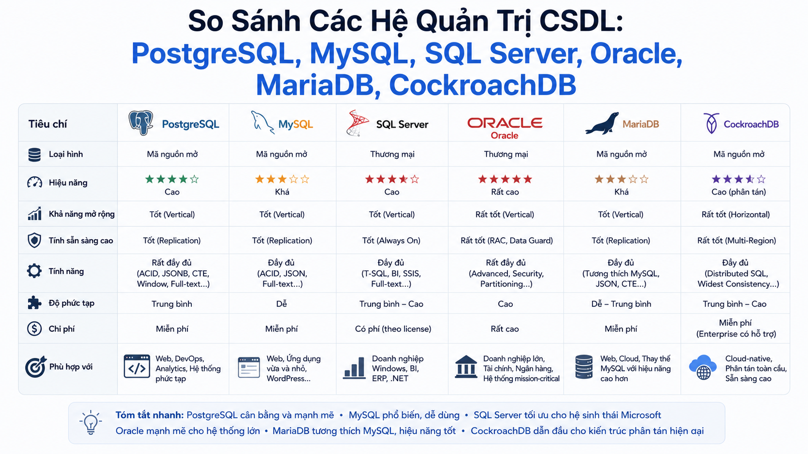

# So Sánh Các Hệ Quản Trị CSDL: PostgreSQL, MySQL, SQL Server, Oracle, MariaDB, CockroachDB



Sau 24 bài học SQL với PostgreSQL, câu hỏi thực tế nhất lúc này là: **"Kiến thức này dùng được cho MySQL/SQL Server không? Và khi nào chọn DB nào?"** Bài bonus này sẽ trả lời đầy đủ — từ lịch sử, syntax khác biệt, tính năng đặc thù đến quyết định chọn DB cho dự án thực tế.

## 1\. Bức Tranh Tổng Quan

```java
                    SQL Standard (ANSI SQL)
                           │
          ┌────────────────┼─────────────────┐
          │                │                  │
     Open Source      Commercial          NewSQL
          │                │                  │
   ┌──────┴──────┐   ┌─────┴──────┐    ┌──────┴──────┐
   │ PostgreSQL  │   │ SQL Server │    │CockroachDB  │
   │ MySQL       │   │ Oracle     │    │TiDB         │
   │ MariaDB     │   │            │    │YugabyteDB   │
   │ SQLite      │   │            │    │             │
   └─────────────┘   └────────────┘    └─────────────┘
```

Tất cả đều nói **SQL** — nhưng mỗi hệ có dialect riêng, tính năng riêng và trade-off riêng. Core SQL (SELECT, JOIN, GROUP BY, CTE, Window Functions) **giống nhau ~80%** — phần còn lại là những khác biệt FoxDev sẽ đi sâu vào bài này.

## 2\. Lịch Sử Tóm Tắt


| Database | Ra đời | Tạo bởi | Hiện tại |
|---|---|---|---|
| Oracle | 1979 | Larry Ellison | Oracle Corp |
| SQL Server | 1989 | Microsoft + Sybase | Microsoft |
| MySQL | 1995 | Michael Widenius | Oracle (mua 2010) |
| PostgreSQL | 1996 | UC Berkeley | PostgreSQL Global Dev Group |
| SQLite | 2000 | D. Richard Hipp | Hipp, Wyrick & Company |
| MariaDB | 2009 | Michael Widenius (fork MySQL) | MariaDB Foundation |
| CockroachDB | 2014 | Ex-Google engineers | Cockroach Labs |


> **Câu chuyện thú vị:** MySQL và MariaDB cùng một cha đẻ — Michael Widenius. Ông tạo MySQL (đặt tên theo con gái My), bán cho Sun Microsystems năm 2008, Sun bị Oracle mua năm 2010. Lo ngại Oracle sẽ "giết" MySQL, Widenius fork ra MariaDB (đặt tên theo con gái Maria).

## 3\. So Sánh Tổng Quan


| Tiêu chí | PostgreSQL | MySQL | SQL Server | Oracle | MariaDB | CockroachDB |
|---|---|---|---|---|---|---|
| License | Open Source (MIT-like) | GPL / Commercial | Commercial | Commercial | GPL | BSL / Commercial |
| Chi phí | Miễn phí | Miễn phí / Có phí | Đắt (~$1000-$7000/core) | Rất đắt | Miễn phí | Miễn phí tier có giới hạn |
| ACID | ✅ Đầy đủ | ✅ InnoDB | ✅ Đầy đủ | ✅ Đầy đủ | ✅ InnoDB | ✅ Đầy đủ |
| JSON | ✅ JSONB mạnh nhất | ✅ JSON (yếu hơn) | ✅ JSON | ✅ JSON | ✅ JSON | ✅ JSONB |
| Full-text Search | ✅ Tốt | ✅ Cơ bản | ✅ Tốt | ✅ Tốt | ✅ Cơ bản | ✅ Cơ bản |
| Window Functions | ✅ Đầy đủ | ✅ MySQL 8.0+ | ✅ Đầy đủ | ✅ Đầy đủ | ✅ 10.2+ | ✅ Đầy đủ |
| CTE | ✅ Đầy đủ | ✅ MySQL 8.0+ | ✅ Đầy đủ | ✅ Đầy đủ | ✅ 10.2+ | ✅ Đầy đủ |
| Partitioning | ✅ Mạnh | ✅ Có | ✅ Có | ✅ Mạnh nhất | ✅ Có | ✅ Có |
| Materialized View | ✅ | ❌ Không có | ✅ Indexed View | ✅ | ❌ Không có | ✅ |
| Stored Procedure | ✅ PL/pgSQL | ✅ | ✅ T-SQL | ✅ PL/SQL | ✅ | ✅ |
| Distributed | ❌ Single node | ❌ Single node | ❌ Single node | ❌ Single node | ❌ Single node | ✅ Native |
| Phổ biến (2025) | #1 | #2 | #3 | #4 | #6 | ~#20 |


## 4\. Khác Biệt Syntax Quan Trọng

### 4.1. LIMIT / OFFSET Pagination

```sql
-- PostgreSQL / MySQL / MariaDB / CockroachDB
SELECT * FROM courses ORDER BY id LIMIT 10 OFFSET 20;

-- SQL Server
SELECT * FROM courses ORDER BY id
OFFSET 20 ROWS FETCH NEXT 10 ROWS ONLY;

-- Oracle (cũ, trước 12c)
SELECT * FROM (
    SELECT rownum AS rn, t.*
    FROM courses t
    WHERE rownum <= 30
) WHERE rn > 20;

-- Oracle 12c+
SELECT * FROM courses ORDER BY id
OFFSET 20 ROWS FETCH NEXT 10 ROWS ONLY;  -- giống SQL Server

-- MySQL cú pháp ngắn (start, count)
SELECT * FROM courses ORDER BY id LIMIT 20, 10;  -- bỏ qua 20, lấy 10
```

### 4.2. Auto Increment / Identity

```sql
-- PostgreSQL
id BIGSERIAL PRIMARY KEY
-- hoặc
id BIGINT GENERATED ALWAYS AS IDENTITY PRIMARY KEY

-- MySQL / MariaDB
id BIGINT AUTO_INCREMENT PRIMARY KEY

-- SQL Server
id BIGINT IDENTITY(1,1) PRIMARY KEY

-- Oracle (12c+)
id NUMBER GENERATED ALWAYS AS IDENTITY PRIMARY KEY

-- CockroachDB
id UUID DEFAULT gen_random_uuid() PRIMARY KEY
-- hoặc
id INT8 DEFAULT unique_rowid() PRIMARY KEY
```

### 4.3. Lấy Thời Gian Hiện Tại

```sql
-- PostgreSQL / CockroachDB
SELECT NOW();
SELECT CURRENT_TIMESTAMP;

-- MySQL / MariaDB
SELECT NOW();
SELECT SYSDATE();   -- khác NOW(): SYSDATE() luôn là giờ thực, NOW() là giờ đầu transaction

-- SQL Server
SELECT GETDATE();
SELECT SYSDATETIME();  -- precision cao hơn

-- Oracle
SELECT SYSDATE FROM DUAL;       -- date (không có ms)
SELECT SYSTIMESTAMP FROM DUAL;  -- timestamp với timezone
```

### 4.4. String Concatenation

```sql
-- PostgreSQL / Oracle / CockroachDB
SELECT first_name || ' ' || last_name FROM users;

-- MySQL / MariaDB / SQL Server
SELECT CONCAT(first_name, ' ', last_name) FROM users;

-- SQL Server cũng hỗ trợ +
SELECT first_name + ' ' + last_name FROM users;
-- Lưu ý: + với NULL → NULL (khác CONCAT bỏ qua NULL)
```

### 4.5. Conditional Expression

```sql
-- Tất cả: CASE WHEN (chuẩn SQL)
SELECT CASE WHEN price > 500000 THEN 'Cao' ELSE 'Thấp' END FROM courses;

-- MySQL / MariaDB thêm IF()
SELECT IF(price > 500000, 'Cao', 'Thấp') FROM courses;

-- Oracle thêm DECODE()
SELECT DECODE(course_type, 'FREE', 'Miễn phí', 'PAID', 'Có phí', 'Khác') FROM courses;

-- SQL Server thêm IIF()
SELECT IIF(price > 500000, 'Cao', 'Thấp') FROM courses;
```

### 4.6. Xử Lý NULL

```sql
-- PostgreSQL / CockroachDB
SELECT COALESCE(phone, 'Chưa có') FROM users;
SELECT NULLIF(enrolled_count, 0) FROM courses;

-- MySQL / MariaDB
SELECT COALESCE(phone, 'Chưa có') FROM users;   -- như PostgreSQL
SELECT IFNULL(phone, 'Chưa có') FROM users;     -- MySQL-specific
SELECT NVL(phone, 'Chưa có') FROM users;        -- MariaDB có NVL (học từ Oracle)

-- SQL Server
SELECT COALESCE(phone, 'Chưa có') FROM users;   -- như PostgreSQL
SELECT ISNULL(phone, 'Chưa có') FROM users;     -- SQL Server-specific

-- Oracle
SELECT COALESCE(phone, 'Chưa có') FROM users;   -- như PostgreSQL
SELECT NVL(phone, 'Chưa có') FROM users;        -- Oracle-specific
SELECT NVL2(phone, 'Có SĐT', 'Chưa có') FROM users;  -- Oracle-specific
```

### 4.7. Date Formatting

```sql
-- PostgreSQL / CockroachDB
SELECT TO_CHAR(created_at, 'DD/MM/YYYY HH24:MI') FROM orders;

-- MySQL / MariaDB
SELECT DATE_FORMAT(created_at, '%d/%m/%Y %H:%i') FROM orders;

-- SQL Server
SELECT FORMAT(created_at, 'dd/MM/yyyy HH:mm') FROM orders;
-- hoặc
SELECT CONVERT(VARCHAR, created_at, 103) FROM orders;  -- 103 = DD/MM/YYYY

-- Oracle
SELECT TO_CHAR(created_at, 'DD/MM/YYYY HH24:MI') FROM orders;  -- giống PostgreSQL!
```

### 4.8. Date Arithmetic

```sql
-- PostgreSQL / CockroachDB
SELECT NOW() + INTERVAL '7 days';
SELECT NOW() - INTERVAL '1 month';

-- MySQL / MariaDB
SELECT DATE_ADD(NOW(), INTERVAL 7 DAY);
SELECT DATE_SUB(NOW(), INTERVAL 1 MONTH);

-- SQL Server
SELECT DATEADD(day, 7, GETDATE());
SELECT DATEADD(month, -1, GETDATE());

-- Oracle
SELECT SYSDATE + 7 FROM DUAL;            -- cộng trực tiếp với số nguyên
SELECT ADD_MONTHS(SYSDATE, -1) FROM DUAL;
```

### 4.9. UPSERT

```sql
-- PostgreSQL / CockroachDB
INSERT INTO enrollments (user_id, course_id)
VALUES (1, 1)
ON CONFLICT (user_id, course_id) DO NOTHING;

INSERT INTO user_points (user_id, point_balance)
VALUES (1, 100)
ON CONFLICT (user_id)
DO UPDATE SET point_balance = user_points.point_balance + EXCLUDED.point_balance;

-- MySQL / MariaDB
INSERT INTO enrollments (user_id, course_id)
VALUES (1, 1)
ON DUPLICATE KEY UPDATE user_id = user_id;  -- no-op để bỏ qua

INSERT INTO user_points (user_id, point_balance)
VALUES (1, 100)
ON DUPLICATE KEY UPDATE point_balance = point_balance + VALUES(point_balance);

-- SQL Server
MERGE INTO user_points AS target
USING (SELECT 1 AS user_id, 100 AS pts) AS source
ON target.user_id = source.user_id
WHEN MATCHED THEN
    UPDATE SET point_balance = target.point_balance + source.pts
WHEN NOT MATCHED THEN
    INSERT (user_id, point_balance) VALUES (source.user_id, source.pts);

-- Oracle
MERGE INTO user_points target
USING (SELECT 1 user_id, 100 pts FROM DUAL) source
ON (target.user_id = source.user_id)
WHEN MATCHED THEN UPDATE SET point_balance = target.point_balance + source.pts
WHEN NOT MATCHED THEN INSERT (user_id, point_balance) VALUES (source.user_id, source.pts);
```

### 4.10. Truncate Date

```sql
-- PostgreSQL / CockroachDB
SELECT DATE_TRUNC('month', created_at) FROM orders;

-- MySQL / MariaDB
SELECT DATE_FORMAT(created_at, '%Y-%m-01') FROM orders;
-- hoặc
SELECT STR_TO_DATE(DATE_FORMAT(created_at, '%Y-%m-01'), '%Y-%m-%d') FROM orders;

-- SQL Server
SELECT DATETRUNC(month, created_at) FROM orders;  -- SQL Server 2022+
-- Trước đó:
SELECT DATEFROMPARTS(YEAR(created_at), MONTH(created_at), 1) FROM orders;

-- Oracle
SELECT TRUNC(created_at, 'MM') FROM orders;
```

### 4.11. Returning After Insert

```sql
-- PostgreSQL / CockroachDB
INSERT INTO orders (user_id, final_amount) VALUES (1, 799000)
RETURNING id, created_at;

-- MySQL / MariaDB
INSERT INTO orders (user_id, final_amount) VALUES (1, 799000);
SELECT LAST_INSERT_ID();  -- chỉ lấy được id, không lấy được cột khác ngay

-- SQL Server
INSERT INTO orders (user_id, final_amount)
OUTPUT INSERTED.id, INSERTED.created_at
VALUES (1, 799000);

-- Oracle
INSERT INTO orders (user_id, final_amount) VALUES (1, 799000)
RETURNING id, created_at INTO :v_id, :v_created_at;
```

## 5\. Tính Năng Đặc Thù Từng DB

### PostgreSQL — "The World's Most Advanced Open Source Database"

```sql
-- JSONB với toán tử riêng
SELECT rule_data->>'min_amount' FROM promotion_rule;
SELECT * FROM promotion_rule WHERE rule_data @> '{"type": "ORDER_AMOUNT"}';

-- Array type
CREATE TABLE course_tags (
    course_id BIGINT,
    tags      TEXT[]
);
SELECT * FROM course_tags WHERE 'sql' = ANY(tags);

-- Full-text Search
SELECT title FROM posts
WHERE to_tsvector('english', title || ' ' || content)
   @@ to_tsquery('sql & beginner');

-- Partial Index
CREATE INDEX idx_pending_orders ON orders (created_at)
WHERE order_status = 'PENDING';

-- GENERATED ALWAYS (computed column)
discount_pct NUMERIC GENERATED ALWAYS AS
    (ROUND((original_price - sale_price) * 100 / original_price, 2)) STORED;

-- Lateral Join
SELECT u.email, stats.*
FROM users u,
LATERAL (
    SELECT COUNT(*) AS order_count, SUM(final_amount) AS total
    FROM orders WHERE user_id = u.id
) stats;
```

### MySQL — "The World's Most Popular Open Source Database"

```sql
-- FULLTEXT index
CREATE FULLTEXT INDEX idx_posts_fulltext ON posts(title, content);
SELECT * FROM posts
WHERE MATCH(title, content) AGAINST('sql beginner' IN NATURAL LANGUAGE MODE);

-- GROUP_CONCAT (tương đương string_agg của PostgreSQL)
SELECT course_id, GROUP_CONCAT(tag_name ORDER BY tag_name SEPARATOR ', ') AS tags
FROM course_tags
GROUP BY course_id;

-- JSON_TABLE (MySQL 8.0) — expand JSON thành bảng
SELECT jt.*
FROM orders,
JSON_TABLE(extra_data, '$.items[*]'
    COLUMNS (
        item_id   INT PATH '$.id',
        item_name TEXT PATH '$.name'
    )
) AS jt;

-- Generated column
ALTER TABLE courses
ADD COLUMN price_tier VARCHAR(20)
GENERATED ALWAYS AS (
    CASE WHEN price = 0 THEN 'FREE'
         WHEN price < 500000 THEN 'LOW'
         ELSE 'HIGH' END
) STORED;
```

### SQL Server — "Enterprise Grade, Microsoft Ecosystem"

```sql
-- T-SQL: TRY/CATCH
BEGIN TRY
    BEGIN TRANSACTION;
    UPDATE user_wallets SET balance = balance - 500000 WHERE user_id = 1;
    UPDATE user_wallets SET balance = balance + 500000 WHERE user_id = 2;
    COMMIT TRANSACTION;
END TRY
BEGIN CATCH
    ROLLBACK TRANSACTION;
    SELECT ERROR_MESSAGE() AS ErrorMessage;
END CATCH;

-- TOP với PERCENT
SELECT TOP 10 PERCENT * FROM courses ORDER BY rating DESC;

-- CROSS APPLY / OUTER APPLY (tương đương LATERAL của PostgreSQL)
SELECT u.email, o.total_orders
FROM users u
CROSS APPLY (
    SELECT COUNT(*) AS total_orders
    FROM orders WHERE user_id = u.id
) o;

-- STRING_AGG (SQL Server 2017+, tương đương string_agg của PostgreSQL)
SELECT course_id, STRING_AGG(tag_name, ', ') WITHIN GROUP (ORDER BY tag_name) AS tags
FROM course_tags
GROUP BY course_id;

-- Query Store — tự động lưu execution plan history
ALTER DATABASE foxdev SET QUERY_STORE = ON;
```

### Oracle — "Enterprise Powerhouse"

```sql
-- PL/SQL package (nhóm functions/procedures)
CREATE OR REPLACE PACKAGE course_pkg AS
    FUNCTION get_revenue(p_course_id NUMBER) RETURN NUMBER;
    PROCEDURE update_enrollment_count(p_course_id NUMBER);
END course_pkg;

-- CONNECT BY — hierarchical query (recursive, trước khi có CTE)
SELECT id, name, LEVEL, CONNECT_BY_ROOT name AS root_name
FROM categories
START WITH parent_id IS NULL
CONNECT BY PRIOR id = parent_id;

-- PIVOT (tương đương CASE WHEN pivot)
SELECT * FROM (
    SELECT course_type, final_amount FROM orders o JOIN courses c ON c.id = o.course_id
)
PIVOT (
    SUM(final_amount)
    FOR course_type IN ('FREE' AS free, 'PAID' AS paid)
);

-- Flashback Query — query dữ liệu tại thời điểm quá khứ
SELECT * FROM orders AS OF TIMESTAMP (SYSTIMESTAMP - INTERVAL '1' HOUR);

-- Autonomous Transaction
CREATE OR REPLACE PROCEDURE log_error(p_msg VARCHAR2) AS
    PRAGMA AUTONOMOUS_TRANSACTION;
BEGIN
    INSERT INTO error_log VALUES (p_msg, SYSTIMESTAMP);
    COMMIT;  -- commit độc lập, không ảnh hưởng transaction cha
END;
```

### MariaDB — "MySQL Compatible, More Open"

```sql
-- Invisible column (ẩn khỏi SELECT * nhưng vẫn query được)
ALTER TABLE users ADD COLUMN internal_score INT INVISIBLE;
SELECT * FROM users;           -- không hiện internal_score
SELECT *, internal_score FROM users;  -- hiện khi explicit

-- Sequence (tương đương PostgreSQL sequence)
CREATE SEQUENCE order_seq START WITH 1000 INCREMENT BY 1;
SELECT NEXT VALUE FOR order_seq;

-- System Versioned Tables (lịch sử tự động)
CREATE TABLE courses (
    id      BIGINT PRIMARY KEY,
    title   VARCHAR(255),
    price   NUMERIC
) WITH SYSTEM VERSIONING;

-- Query lịch sử
SELECT * FROM courses FOR SYSTEM_TIME AS OF '2025-01-01 00:00:00';
SELECT * FROM courses FOR SYSTEM_TIME BETWEEN '2025-01-01' AND '2025-03-01';

-- JSON_DETAILED (MariaDB-specific formatting)
SELECT JSON_DETAILED(extra_data) FROM users;
```

### CockroachDB — "Distributed SQL, Built for Scale"

```sql
-- PostgreSQL compatible — hầu hết query chạy được ngay
SELECT * FROM orders WHERE user_id = 1;  -- giống PostgreSQL

-- Multi-region table
ALTER TABLE orders SET LOCALITY REGIONAL BY ROW;
-- Mỗi dòng tự động route đến region gần nhất

-- Follower Reads — đọc từ replica gần nhất (có độ trễ nhỏ)
SELECT * FROM orders AS OF SYSTEM TIME '-10s';
-- Đọc snapshot 10 giây trước từ replica gần nhất — nhanh hơn primary

-- SHOW JOBS — xem tiến trình background jobs
SHOW JOBS;

-- EXPLAIN (DISTSQL) — xem distributed execution plan
EXPLAIN (DISTSQL) SELECT COUNT(*) FROM orders;
```

## 6\. Khi Nào Chọn DB Nào?

### Chọn PostgreSQL Khi:

```java
✅ Startup hoặc dự án mới — default choice tốt nhất 2025
✅ Cần JSON/JSONB mạnh (flexible schema)
✅ Cần Full-text Search không muốn dùng Elasticsearch
✅ Cần tính năng SQL nâng cao (Window Functions, CTE, Partial Index...)
✅ Cần Geospatial với PostGIS
✅ Open source, không muốn phụ thuộc vendor
✅ Team dùng cloud (RDS, Cloud SQL, Supabase, Neon đều hỗ trợ)
✅ Data analytics kết hợp OLTP (DuckDB, TimescaleDB extension)
```

### Chọn MySQL Khi:

```java
✅ Có sẵn MySQL stack (LAMP, LEMP)
✅ Đội ngũ đã quen MySQL, migration cost cao
✅ WordPress, Drupal, nhiều CMS dùng MySQL
✅ Cần read replica dễ setup, tài liệu phổ biến
✅ Hosting giá rẻ thường chỉ có MySQL
⚠️ Cần MySQL 8.0+ để có Window Functions, CTE, JSON tốt
```

### Chọn SQL Server Khi:

```java
✅ Hệ sinh thái Microsoft (Azure, .NET, Active Directory)
✅ Enterprise yêu cầu SQL Server (compliance, support contract)
✅ Integration với Excel, Power BI, SSRS
✅ Cần SQL Server Analysis Services (SSAS) cho BI
✅ Team đã có SQL Server DBA license
❌ Đắt — không phù hợp startup hoặc dự án nhỏ
```

### Chọn Oracle Khi:

```java
✅ Tập đoàn lớn, banking, insurance yêu cầu Oracle
✅ Đã có Oracle license (đắt nên không muốn bỏ)
✅ Cần Oracle RAC cho extreme high availability
✅ Legacy system đã built trên Oracle
✅ Cần Oracle Advanced Security, Audit Vault
❌ Rất đắt — không phù hợp với hầu hết dự án hiện đại
```

### Chọn MariaDB Khi:

```java
✅ Muốn MySQL-compatible nhưng fully open source
✅ Cần System-Versioned Tables (temporal data built-in)
✅ Một số hosting provider mặc định MariaDB thay MySQL
✅ Quan ngại Oracle ownership của MySQL
✅ Cần tính năng MariaDB-specific như Invisible Columns
```

### Chọn CockroachDB Khi:

```java
✅ Cần distributed SQL — scale out horizontally
✅ Multi-region deployment, data residency requirements (GDPR)
✅ Cần surviveability: bất kỳ node nào down vẫn hoạt động
✅ Team đã quen PostgreSQL — migration dễ
✅ Fintech, global app cần strong consistency + scale
❌ Chậm hơn PostgreSQL single-node cho most workloads
❌ Một số PostgreSQL features chưa support đầy đủ
```

## 7\. Ma Trận Quyết Định Nhanh

```java
Dự án mới, không ràng buộc gì?
→ PostgreSQL ✅

Đang dùng WordPress/PHP stack?
→ MySQL ✅

Công ty Microsoft stack (.NET, Azure)?
→ SQL Server ✅

Tập đoàn, banking yêu cầu Oracle?
→ Oracle ✅

Muốn MySQL-compatible + fully open source?
→ MariaDB ✅

Cần scale ngang, multi-region, global app?
→ CockroachDB ✅

Mobile app, embedded, local-first?
→ SQLite ✅
```

## 8\. Khả Năng Chuyển Đổi Giữa Các DB

Tin vui: **80% SQL bạn đã học với PostgreSQL chạy được trên mọi DB** với ít hoặc không cần sửa đổi.

```sql
-- Những câu này chạy giống nhau trên tất cả DB:
SELECT, FROM, WHERE, AND, OR, NOT
JOIN (INNER, LEFT, RIGHT, FULL OUTER)
GROUP BY, HAVING
ORDER BY, LIMIT/TOP/FETCH
CASE WHEN
COUNT, SUM, AVG, MIN, MAX
CTE (WITH clause)                -- MySQL 8.0+, MariaDB 10.2+
Window Functions                 -- MySQL 8.0+, MariaDB 10.2+
IS NULL, IS NOT NULL, COALESCE
CAST, CONVERT
Subquery, EXISTS, NOT EXISTS
```

**Những phần cần chú ý khi chuyển đổi:**

```sql
-- Thay thế khi migrate từ PostgreSQL:

-- 1. SERIAL → AUTO_INCREMENT (MySQL) hoặc IDENTITY (SQL Server)
-- 2. TIMESTAMPTZ → DATETIME (MySQL) — xử lý timezone ở application
-- 3. BOOLEAN → TINYINT(1) (MySQL)
-- 4. TEXT || TEXT → CONCAT() (MySQL/SQL Server)
-- 5. INTERVAL '7 days' → DATE_ADD(, INTERVAL 7 DAY) (MySQL)
-- 6. TO_CHAR() → DATE_FORMAT() (MySQL) / FORMAT() (SQL Server)
-- 7. RETURNING → OUTPUT (SQL Server) / LAST_INSERT_ID() (MySQL)
-- 8. ON CONFLICT → ON DUPLICATE KEY UPDATE (MySQL) / MERGE (SQL Server/Oracle)
-- 9. Partial Index → không có (MySQL) / Filtered Index (SQL Server)
-- 10. Materialized View → không có (MySQL/MariaDB) / Indexed View (SQL Server)
```

## 9\. Benchmark — Hiệu Năng Thực Tế

> **Disclaimer:** Benchmark phụ thuộc rất nhiều vào workload, hardware, config và version. Những con số dưới đây là tương đối và mang tính tham khảo.


| Workload | PostgreSQL | MySQL | SQL Server | Oracle | CockroachDB |
|---|---|---|---|---|---|
| Simple READ | ⭐⭐⭐⭐ | ⭐⭐⭐⭐⭐ | ⭐⭐⭐⭐ | ⭐⭐⭐⭐ | ⭐⭐⭐ |
| Complex Analytics | ⭐⭐⭐⭐⭐ | ⭐⭐⭐ | ⭐⭐⭐⭐ | ⭐⭐⭐⭐⭐ | ⭐⭐⭐ |
| High Concurrent Write | ⭐⭐⭐⭐ | ⭐⭐⭐⭐ | ⭐⭐⭐⭐ | ⭐⭐⭐⭐⭐ | ⭐⭐⭐⭐⭐ |
| JSON Operations | ⭐⭐⭐⭐⭐ | ⭐⭐⭐ | ⭐⭐⭐ | ⭐⭐⭐ | ⭐⭐⭐⭐ |
| Distributed Scale | ⭐⭐ | ⭐⭐ | ⭐⭐ | ⭐⭐⭐ | ⭐⭐⭐⭐⭐ |


**MySQL đọc đơn giản nhanh nhất** vì kiến trúc nhẹ hơn, ít feature overhead hơn. **PostgreSQL mạnh nhất cho analytics** và complex queries. **Oracle tốt nhất cho high concurrent write** ở enterprise scale. **CockroachDB vô địch cho distributed workload**.

## 10\. Xu Hướng 2025

```java
📈 Đang lên:
- PostgreSQL — ngày càng phổ biến, "default database" của nhiều stack mới
- CockroachDB / TiDB / YugabyteDB — NewSQL cho distributed systems
- DuckDB — OLAP embedded, analytics nhanh trên laptop
- Neon / Supabase — serverless PostgreSQL

📉 Đang xuống:
- Oracle — quá đắt, cloud-native alternatives tốt hơn
- SQL Server — vẫn mạnh trong Microsoft ecosystem nhưng share đang giảm
- MySQL — vẫn phổ biến nhưng PostgreSQL đang bắt kịp và vượt qua

🔄 Ổn định:
- MySQL / MariaDB — vẫn là nền tảng của web truyền thống
- SQLite — không thay thế được cho embedded/mobile
```

## Tổng Kết


|  | PostgreSQL | MySQL | SQL Server | Oracle | MariaDB | CockroachDB |
|---|---|---|---|---|---|---|
| Beginner friendly | ⭐⭐⭐⭐ | ⭐⭐⭐⭐⭐ | ⭐⭐⭐ | ⭐⭐ | ⭐⭐⭐⭐ | ⭐⭐⭐ |
| Tính năng SQL | ⭐⭐⭐⭐⭐ | ⭐⭐⭐ | ⭐⭐⭐⭐ | ⭐⭐⭐⭐⭐ | ⭐⭐⭐ | ⭐⭐⭐⭐ |
| Giá cả | ⭐⭐⭐⭐⭐ | ⭐⭐⭐⭐⭐ | ⭐⭐ | ⭐ | ⭐⭐⭐⭐⭐ | ⭐⭐⭐ |
| Scale out | ⭐⭐ | ⭐⭐ | ⭐⭐ | ⭐⭐⭐ | ⭐⭐ | ⭐⭐⭐⭐⭐ |
| Ecosystem | ⭐⭐⭐⭐⭐ | ⭐⭐⭐⭐⭐ | ⭐⭐⭐⭐ | ⭐⭐⭐ | ⭐⭐⭐⭐ | ⭐⭐⭐ |
| Recommended 2025 | ✅ Default | ✅ Legacy | ✅ Microsoft | ✅ Enterprise | ✅ MySQL alt | ✅ Distributed |


**Kết luận cho người học series này:** Bạn đã học đúng database — PostgreSQL là lựa chọn tốt nhất cho developer hiện đại. Kiến thức SQL core bạn đã có **chuyển được 80%** sang bất kỳ RDBMS nào. Phần còn lại chỉ là syntax khác biệt nhỏ — đọc documentation 1-2 ngày là nắm được.

