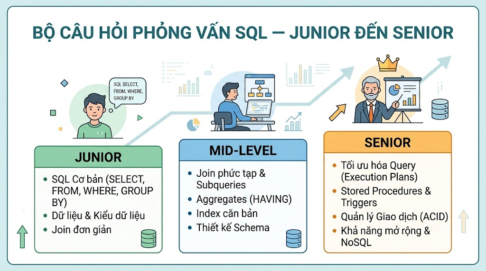

# Bộ Câu Hỏi Phỏng Vấn SQL — Junior đến Senior

* * *



## 🟢 JUNIOR (0–2 năm)

Mục tiêu: Kiểm tra nền tảng SQL, CRUD, JOIN cơ bản, GROUP BY và hiểu biết về NULL.

* * *

### Khái Niệm Cơ Bản

**Q1. SQL là gì? Phân biệt DDL, DML, DCL, TCL.**

Đáp án mong đợi:

*   SQL = Structured Query Language — ngôn ngữ giao tiếp với Relational Database
    
*   **DDL** (Data Definition Language): định nghĩa cấu trúc
    
    *   `CREATE`, `ALTER`, `DROP`, `TRUNCATE`
        
*   **DML** (Data Manipulation Language): thao tác dữ liệu
    
    *   `SELECT`, `INSERT`, `UPDATE`, `DELETE`
        
*   **DCL** (Data Control Language): phân quyền
    
    *   `GRANT`, `REVOKE`
        
*   **TCL** (Transaction Control Language): quản lý transaction
    
    *   `BEGIN`, `COMMIT`, `ROLLBACK`, `SAVEPOINT`
        

🚩 Red flag: Nhầm lẫn TRUNCATE là DML (TRUNCATE là DDL)

**Q2. Sự khác biệt giữa WHERE và HAVING. Khi nào dùng cái nào?**

Đáp án mong đợi:

```sql
-- WHERE: filter TRƯỚC khi GROUP BY — trên từng dòng
SELECT department, COUNT(*) AS emp_count
FROM employees
WHERE salary > 10000000        -- filter trước khi group
GROUP BY department
HAVING COUNT(*) >= 5;          -- filter SAU khi group — trên kết quả aggregate

-- Nguyên tắc: WHERE không dùng được aggregate function
-- ❌ WHERE COUNT(*) > 5       -- sai
-- ✅ HAVING COUNT(*) > 5      -- đúng
```

Performance: WHERE giảm số dòng trước khi group → nhanh hơn HAVING cho cùng điều kiện không có aggregate

**Q3. Giải thích các loại JOIN: INNER, LEFT, RIGHT, FULL OUTER. Cho ví dụ khi nào dùng LEFT JOIN.**

Đáp án mong đợi:

```sql
-- INNER JOIN: chỉ dòng khớp cả hai bảng
SELECT u.name, o.id
FROM users u
INNER JOIN orders o ON o.user_id = u.id

-- LEFT JOIN: tất cả từ bảng trái, NULL nếu không khớp bên phải
-- Use case: lấy tất cả users KỂ CẢ người chưa mua hàng
SELECT u.name, COUNT(o.id) AS order_count
FROM users u
LEFT JOIN orders o ON o.user_id = u.id
GROUP BY u.id, u.name

-- Tìm users chưa có orders (anti-join pattern)
SELECT u.name
FROM users u
LEFT JOIN orders o ON o.user_id = u.id
WHERE o.id IS NULL

-- FULL OUTER JOIN: tất cả từ cả hai bảng
-- RIGHT JOIN: ít dùng — đổi thứ tự bảng dùng LEFT JOIN thay thế
```

🚩 Red flag: Không giải thích được NULL trong LEFT JOIN

**Q4. NULL trong SQL hoạt động thế nào? Tại sao** `WHERE phone = NULL` **không trả về kết quả?**

Đáp án mong đợi:

*   NULL = "không có giá trị" / "chưa biết" — KHÔNG phải 0, không phải chuỗi rỗng
    
*   NULL không bằng bất kỳ thứ gì, kể cả chính nó: `NULL = NULL` → NULL (không phải TRUE)
    
*   Mọi phép so sánh với NULL đều trả về NULL:
    
    ```sql
    NULL = NULL   → NULL (not TRUE)NULL != NULL  → NULL (not TRUE)NULL > 5      → NULL
    ```
    
*   Cách đúng:
    
    ```sql
    WHERE phone IS NULLWHERE phone IS NOT NULLSELECT COALESCE(phone, 'N/A')  -- thay thế NULL bằng giá trị defaultSELECT NULLIF(discount, 0)     -- trả về NULL nếu bằng 0
    ```
    

✅ Điểm cộng: Giải thích `COUNT(*)` vs `COUNT(column)` — COUNT bỏ qua NULL

**Q5. Viết query tìm top 3 sản phẩm bán chạy nhất (theo số lượng đã bán).**

Schema: `orders(id, user_id, status)`, `order_items(id, order_id, course_id, price)`, `courses(id, title)`

Đáp án mong đợi:

```sql
SELECT
    c.id,
    c.title,
    COUNT(oi.id)    AS total_sold,
    SUM(oi.price)   AS total_revenue
FROM order_items oi
JOIN courses c ON c.id = oi.course_id
JOIN orders  o ON o.id = oi.order_id
WHERE o.status = 'PAID'
GROUP BY c.id, c.title
ORDER BY total_sold DESC
LIMIT 3;
```

Điểm đánh giá: Filter status PAID, JOIN đúng, GROUP BY đúng cột

**Q6. Sự khác biệt giữa DELETE, TRUNCATE và DROP.**

Đáp án mong đợi:


|  | DELETE | TRUNCATE | DROP |
|---|---|---|---|
| Xóa gì | Dòng dữ liệu (có thể WHERE) | Toàn bộ dữ liệu | Cả bảng (cấu trúc + data) |
| ROLLBACK | ✅ Được | ✅ Được (PostgreSQL) | ❌ Không |
| Trigger | ✅ Kích hoạt | ❌ Không | ❌ Không |
| Tốc độ | Chậm (ghi log từng dòng) | Nhanh | Nhanh |
| Reset sequence | ❌ Không | ✅ RESTART IDENTITY | ✅ |
| WHERE clause | ✅ Có | ❌ Không | ❌ Không |


**Q7. Primary Key vs Unique Key khác nhau thế nào?**

Đáp án mong đợi:

*   **Primary Key:**
    
    *   Chỉ có 1 per table
        
    *   Không được NULL
        
    *   Tự động tạo clustered index (MySQL) hoặc unique index (PostgreSQL)
        
    *   Định danh duy nhất cho mỗi row
        
*   **Unique Key:**
    
    *   Có nhiều per table
        
    *   Cho phép NULL (thường cho phép nhiều NULLs trong PostgreSQL)
        
    *   Tạo non-clustered index
        
    *   Đảm bảo không trùng lặp nhưng không phải định danh chính
        

```sql
CREATE TABLE users (
    id      BIGSERIAL PRIMARY KEY,      -- PK: not null, unique
    email   VARCHAR(255) UNIQUE,        -- UK: can be null, unique
    phone   VARCHAR(20)  UNIQUE         -- UK: can be null
);
```

**Q8. Giải thích thứ tự thực thi của một câu SQL SELECT.**

Đáp án mong đợi:

```sql
SELECT   columns        -- 6. Chọn cột trả về
FROM     table          -- 1. Xác định bảng
WHERE    condition      -- 2. Lọc dòng
GROUP BY columns        -- 3. Nhóm dữ liệu
HAVING   condition      -- 4. Lọc nhóm
ORDER BY columns        -- 5. Sắp xếp
LIMIT    n              -- 7. Giới hạn kết quả
```

Tại sao quan trọng:

*   Không dùng alias trong WHERE vì SELECT chạy sau WHERE
    
*   Có thể dùng alias trong ORDER BY vì ORDER BY chạy sau SELECT
    

```sql
-- ❌ Sai — alias chưa tồn tại khi WHERE chạy
SELECT price * 0.9 AS discounted_price
FROM courses
WHERE discounted_price < 500000

-- ✅ Đúng
SELECT price * 0.9 AS discounted_price
FROM courses
WHERE price * 0.9 < 500000
```

### Coding Question Junior

**Q9. Cho bảng** `employees(id, name, department, salary, manager_id)`**. Viết query lấy department có average salary cao nhất, chỉ tính departments có ít nhất 3 nhân viên.**

Đáp án mong đợi:

```sql
SELECT
    department,
    COUNT(*)              AS emp_count,
    ROUND(AVG(salary), 0) AS avg_salary
FROM employees
GROUP BY department
HAVING COUNT(*) >= 3
ORDER BY avg_salary DESC
LIMIT 1;
```

✅ Điểm cộng: Dùng HAVING thay vì subquery

* * *

## 🟡 INTERMEDIATE (2–4 năm)

Mục tiêu: Subquery, CTE, Window Functions, Index strategy, Transaction isolation.

* * *

### Query Nâng Cao

**Q10. Giải thích Subquery vs CTE vs JOIN. Khi nào dùng cái nào?**

Đáp án mong đợi:

**Subquery:**

```sql
-- Trong WHERE — tìm user chi tiêu trên average
SELECT name FROM users
WHERE id IN (
    SELECT user_id FROM orders
    WHERE final_amount > (SELECT AVG(final_amount) FROM orders)
);
```

**CTE (Common Table Expression):**

```sql
-- Rõ ràng hơn, tái sử dụng được trong cùng query
WITH order_stats AS (
    SELECT user_id, SUM(final_amount) AS total_spent
    FROM orders WHERE status = 'PAID'
    GROUP BY user_id
),
avg_spent AS (
    SELECT AVG(total_spent) AS avg_value FROM order_stats
)
SELECT u.name, os.total_spent
FROM users u
JOIN order_stats os ON os.user_id = u.id
JOIN avg_spent a ON os.total_spent > a.avg_value;
```

**Khi nào dùng gì:**

*   JOIN: cần cột từ nhiều bảng, thường nhanh nhất
    
*   Subquery: logic đơn giản, dùng 1 lần, trong WHERE/SELECT
    
*   CTE: logic phức tạp nhiều bước, cần tái sử dụng, dễ đọc hơn nested subquery
    

**Q11. Window Functions là gì? Khác GROUP BY thế nào? Giải thích PARTITION BY, ORDER BY trong OVER().**

Đáp án mong đợi:

```sql
-- GROUP BY: gộp N dòng → 1 dòng, mất chi tiết từng dòng
SELECT department, AVG(salary) FROM employees GROUP BY department;

-- Window Function: tính trên "cửa sổ" dữ liệu, KHÔNG mất dòng
SELECT
    name,
    department,
    salary,
    AVG(salary) OVER (PARTITION BY department) AS dept_avg,  -- avg theo department
    RANK()      OVER (PARTITION BY department ORDER BY salary DESC) AS rank_in_dept,
    SUM(salary) OVER (ORDER BY id ROWS BETWEEN UNBOUNDED PRECEDING AND CURRENT ROW) AS running_total
FROM employees;
```

**Các Window Functions quan trọng:**

*   `ROW_NUMBER()` — số thứ tự duy nhất
    
*   `RANK()` — xếp hạng, có khoảng trống khi bằng nhau
    
*   `DENSE_RANK()` — xếp hạng, không có khoảng trống
    
*   `LAG(col, n)` / `LEAD(col, n)` — giá trị dòng trước/sau
    
*   `SUM() OVER()` / `AVG() OVER()` — running total, moving average
    

**Q12. Giải thích Recursive CTE. Cho ví dụ với category tree.**

Đáp án mong đợi:

```sql
-- categories(id, name, parent_id)
WITH RECURSIVE category_tree AS (
    -- Base case: root categories (không có parent)
    SELECT id, name, parent_id, 0 AS level, name::TEXT AS path
    FROM categories
    WHERE parent_id IS NULL

    UNION ALL

    -- Recursive case: các category con
    SELECT c.id, c.name, c.parent_id,
           ct.level + 1,
           ct.path || ' > ' || c.name
    FROM categories c
    JOIN category_tree ct ON ct.id = c.parent_id
)
SELECT REPEAT('  ', level) || name AS display_name, level, path
FROM category_tree
ORDER BY path;
```

Use cases: category tree, org chart, comment threads, bill of materials

⚠️ Lưu ý: Cần `max_recursion_depth` để tránh infinite loop nếu có circular reference

**Q13. EXISTS vs IN vs JOIN — hiệu năng và khi nào dùng cái nào?**

Đáp án mong đợi:

```sql
-- IN: tốt khi subquery trả về ít rows
SELECT * FROM users
WHERE id IN (SELECT user_id FROM orders WHERE status = 'PAID');

-- EXISTS: tốt hơn IN khi subquery trả về nhiều rows
-- Dừng lại khi tìm được 1 kết quả khớp
SELECT * FROM users u
WHERE EXISTS (
    SELECT 1 FROM orders o
    WHERE o.user_id = u.id AND o.status = 'PAID'
);

-- NOT EXISTS an toàn hơn NOT IN khi có NULL
-- NOT IN với NULL trong subquery → trả về 0 dòng!
SELECT * FROM users u
WHERE NOT EXISTS (
    SELECT 1 FROM orders o WHERE o.user_id = u.id
);
-- vs
SELECT * FROM users
WHERE id NOT IN (SELECT user_id FROM orders);
-- ❌ Nguy hiểm nếu user_id có NULL → trả về 0 dòng!

-- JOIN: khi cần cột từ bảng được join
```

**Q14. Giải thích ACID trong database. Cho ví dụ thực tế từng tính chất.**

Đáp án mong đợi:

**Atomicity — All or nothing:**

```sql
BEGIN;
UPDATE user_wallets SET balance = balance - 799000 WHERE user_id = 1;
INSERT INTO orders (user_id, amount) VALUES (1, 799000);
-- Nếu INSERT lỗi → cả UPDATE cũng rollback
COMMIT;
```

**Consistency — Không vi phạm constraints:**

```sql
-- CHECK constraint đảm bảo balance không âm
ALTER TABLE user_wallets ADD CONSTRAINT chk_balance CHECK (balance >= 0);
-- Transaction fail nếu cố trừ quá số dư
```

**Isolation — Transactions không can thiệp nhau:**

*   READ COMMITTED: không đọc uncommitted data của transaction khác
    
*   REPEATABLE READ: đọc cùng row nhiều lần cho cùng kết quả trong transaction
    
*   SERIALIZABLE: mạnh nhất — transactions chạy như tuần tự
    

**Durability — Sau COMMIT, dữ liệu tồn tại vĩnh viễn:**

*   PostgreSQL dùng WAL (Write-Ahead Log) — ghi log trước khi ghi disk
    
*   Recover được sau crash
    

**Q15. Isolation Levels và các anomalies: Dirty Read, Non-repeatable Read, Phantom Read.**

Đáp án mong đợi:

**Dirty Read:** Đọc uncommitted data của transaction khác

```java
Tx A: UPDATE balance = 0  (chưa commit)
Tx B: SELECT balance → 0  (đọc dirty data)
Tx A: ROLLBACK             (A rollback, nhưng B đã dùng 0)
```

**Non-repeatable Read:** Đọc cùng row 2 lần cho kết quả khác

```java
Tx A: SELECT price = 799000
Tx B: UPDATE price = 599000; COMMIT
Tx A: SELECT price = 599000  ← khác lần trước!
```

**Phantom Read:** Query cùng điều kiện trả về số rows khác

```java
Tx A: SELECT COUNT(*) WHERE rating > 4.5 → 10
Tx B: INSERT course (rating=4.8); COMMIT
Tx A: SELECT COUNT(*) WHERE rating > 4.5 → 11  ← phantom!
```

**Isolation Levels:**


| Level | Dirty Read | Non-repeatable | Phantom |
|---|---|---|---|
| READ UNCOMMITTED | ✅ Có | ✅ Có | ✅ Có |
| READ COMMITTED (default PG) | ❌ Không | ✅ Có | ✅ Có |
| REPEATABLE READ | ❌ | ❌ | ❌ (PostgreSQL) |
| SERIALIZABLE | ❌ | ❌ | ❌ |


**Q16. Index là gì? Giải thích B-tree index. Khi nào KHÔNG nên tạo index?**

Đáp án mong đợi:

*   Index = cấu trúc dữ liệu phụ (B-tree) giúp tìm kiếm nhanh hơn
    
*   B-tree: balanced tree, O(log n) để tìm kiếm thay vì O(n) sequential scan
    
*   Index có chi phí: mỗi INSERT/UPDATE/DELETE phải update index → write chậm hơn
    

**Không nên tạo index khi:**

```sql
-- Cột low cardinality (ít giá trị phân biệt) — boolean, gender
CREATE INDEX idx_is_active ON users(is_active);  -- chỉ TRUE/FALSE → kém hiệu quả

-- Bảng nhỏ (< 1000 rows) — seq scan còn nhanh hơn
-- Cột ít dùng trong WHERE/JOIN/ORDER BY
-- Bảng write-heavy (nhiều INSERT/UPDATE) — index overhead lớn
```

**Nên tạo index khi:**

```sql
-- Foreign key columns (JOIN)
CREATE INDEX idx_orders_user_id ON orders(user_id);

-- Cột thường dùng trong WHERE với high selectivity
CREATE INDEX idx_orders_status_created ON orders(status, created_at DESC);

-- Partial index — chỉ index subset
CREATE INDEX idx_orders_pending ON orders(created_at)
WHERE status = 'PENDING';
```

### Coding Question Intermediate

**Q17. Dùng Window Functions: cho mỗi user, lấy đơn hàng gần nhất và tổng chi tiêu. Chỉ lấy user có tổng chi tiêu trên 1 triệu.**

Đáp án mong đợi:

```sql
WITH user_order_stats AS (
    SELECT
        u.id,
        u.name,
        u.email,
        o.id                                              AS order_id,
        o.final_amount,
        o.created_at,
        SUM(o.final_amount) OVER (PARTITION BY u.id)     AS total_spent,
        ROW_NUMBER()        OVER (
            PARTITION BY u.id
            ORDER BY o.created_at DESC
        )                                                 AS rn
    FROM users u
    JOIN orders o ON o.user_id = u.id
    WHERE o.status = 'PAID'
)
SELECT
    id,
    name,
    email,
    order_id       AS latest_order_id,
    final_amount   AS latest_order_amount,
    created_at     AS latest_order_date,
    total_spent
FROM user_order_stats
WHERE rn = 1
  AND total_spent > 1000000
ORDER BY total_spent DESC;
```

* * *

## 🟠 ADVANCED (4–7 năm)

Mục tiêu: Query optimization, Execution plan, Index deep dive, Partitioning, Performance tuning.

* * *

### Query Optimization

**Q18. EXPLAIN ANALYZE output — giải thích các nodes và cách đọc execution plan.**

Đáp án mong đợi:

```sql
EXPLAIN (ANALYZE, BUFFERS) SELECT * FROM orders WHERE user_id = 1;
```

Output quan trọng:

```java
Index Scan using idx_orders_user on orders
  (cost=0.43..8.45 rows=3 width=120)       ← estimated
  (actual time=0.021..0.025 rows=3 loops=1) ← actual
  Index Cond: (user_id = 1)
  Buffers: shared hit=4                     ← từ cache, không phải disk
Planning Time: 0.215 ms
Execution Time: 0.064 ms
```

**Các nodes quan trọng:**

*   `Seq Scan` — quét toàn bộ bảng → cần xem lại nếu bảng lớn
    
*   `Index Scan` — dùng index, fetch heap
    
*   `Index Only Scan` — chỉ đọc index, không fetch heap → nhanh nhất
    
*   `Bitmap Heap Scan` — nhiều rows, đọc heap theo batch
    
*   `Hash Join` → `Nested Loop` → `Merge Join` — các loại JOIN khác nhau
    
*   `Sort ... Disk` — sort phải dùng disk → tăng `work_mem`
    

**Dấu hiệu cần tối ưu:**

*   `rows=10 / actual rows=10000` — rows estimate sai lớn → chạy ANALYZE
    
*   `Seq Scan` trên bảng lớn với filter chặt → cần index
    
*   `loops=1000` trong Nested Loop → cần index cho inner table
    

**Q19. Giải thích Query Optimization: tại sao các query sau chậm và cách fix.**

```sql
-- Query 1
SELECT * FROM orders WHERE DATE(created_at) = '2025-01-15';

-- Query 2
SELECT * FROM users WHERE LOWER(email) = 'nam@gmail.com';

-- Query 3
SELECT * FROM orders WHERE CAST(user_id AS TEXT) = '123';
```

Đáp án mong đợi:

```sql
-- Query 1: Function trên cột có index → index bị bỏ qua
-- ❌ DATE(created_at) → không dùng được index trên created_at
-- ✅ Fix: range query
SELECT * FROM orders
WHERE created_at >= '2025-01-15'
  AND created_at <  '2025-01-16';

-- Query 2: LOWER() trên cột có index
-- ❌ LOWER(email) → index trên email bị bỏ qua
-- ✅ Fix 1: Expression index
CREATE INDEX idx_users_email_lower ON users(LOWER(email));
-- ✅ Fix 2: dùng ILIKE (PostgreSQL)
SELECT * FROM users WHERE email ILIKE 'nam@gmail.com';

-- Query 3: Implicit cast → index bị bỏ qua
-- ❌ CAST(user_id AS TEXT) → không dùng index trên user_id (BIGINT)
-- ✅ Fix: đúng kiểu dữ liệu
SELECT * FROM orders WHERE user_id = 123;  -- BIGINT, không phải string
```

**Q20. Composite Index và ESR Rule (Equality-Sort-Range). Cho ví dụ cụ thể.**

Đáp án mong đợi:

```sql
-- Query cần tối ưu:
SELECT * FROM orders
WHERE status = 'PAID'          -- Equality
  AND created_at >= '2025-01-01' -- Range
ORDER BY created_at DESC;       -- Sort

-- ESR Rule: Equality columns FIRST, Sort columns NEXT, Range columns LAST
-- ✅ Index tối ưu:
CREATE INDEX idx_orders_status_created
    ON orders (status, created_at DESC);
-- status = 'PAID' (Equality) → created_at (Sort + Range cùng một cột)

-- Query phức tạp hơn:
SELECT * FROM orders
WHERE user_id = 1           -- Equality
  AND status = 'PAID'       -- Equality
  AND created_at > '2025-01-01' -- Range
ORDER BY created_at DESC;   -- Sort

-- Index: (user_id, status, created_at DESC)
-- E: user_id, status → S/R: created_at
CREATE INDEX idx_orders_user_status_created
    ON orders (user_id, status, created_at DESC);
```

**Tại sao thứ tự quan trọng:**

*   Index `(status, user_id)` không giúp query `WHERE user_id = 1 AND status = 'PAID'` tốt như `(user_id, status)`
    
*   Cột đầu tiên PHẢI có trong WHERE clause (hoặc leading prefix) để index được dùng
    

**Q21. Partitioning trong PostgreSQL — Range, List, Hash. Partition Pruning là gì?**

Đáp án mong đợi:

```sql
-- Range Partitioning — theo thời gian (phổ biến nhất)
CREATE TABLE orders (
    id          BIGSERIAL,
    user_id     BIGINT,
    status      VARCHAR(20),
    final_amount NUMERIC,
    created_at  TIMESTAMPTZ NOT NULL
) PARTITION BY RANGE (created_at);

CREATE TABLE orders_2025_01 PARTITION OF orders
    FOR VALUES FROM ('2025-01-01') TO ('2025-02-01');
CREATE TABLE orders_2025_02 PARTITION OF orders
    FOR VALUES FROM ('2025-02-01') TO ('2025-03-01');

-- List Partitioning — theo giá trị cố định
CREATE TABLE orders PARTITION BY LIST (currency);
CREATE TABLE orders_vnd PARTITION OF orders FOR VALUES IN ('VND');
CREATE TABLE orders_usd PARTITION OF orders FOR VALUES IN ('USD');

-- Hash Partitioning — phân phối đều
CREATE TABLE orders PARTITION BY HASH (user_id);
CREATE TABLE orders_p0 PARTITION OF orders FOR VALUES WITH (MODULUS 4, REMAINDER 0);
```

**Partition Pruning:**

```sql
-- Query này chỉ scan partition tháng 1 thay vì toàn bộ
EXPLAIN SELECT * FROM orders
WHERE created_at >= '2025-01-01' AND created_at < '2025-02-01';
-- → Append: Seq Scan on orders_2025_01 (chỉ 1 partition!)

-- Pruning KHÔNG hoạt động khi dùng function trên partition key
WHERE DATE_TRUNC('month', created_at) = '2025-01-01'  -- ❌ không pruning
WHERE created_at >= '2025-01-01'                       -- ✅ có pruning
```

**Q22. Deadlock là gì? Giải thích với ví dụ và cách tránh.**

Đáp án mong đợi:

```java
Transaction A:
  1. Lock orders WHERE user_id = 1
  2. Chờ lock orders WHERE user_id = 2 (đang bị B giữ)

Transaction B:
  1. Lock orders WHERE user_id = 2
  2. Chờ lock orders WHERE user_id = 1 (đang bị A giữ)

→ DEADLOCK! Cả hai chờ nhau mãi mãi
PostgreSQL tự phát hiện và kill một transaction
```

**Cách tránh:**

```sql
-- ✅ Luôn lock theo thứ tự nhất quán (theo ID tăng dần)
BEGIN;
SELECT * FROM user_wallets
WHERE user_id IN (1, 2)
ORDER BY user_id  -- lock theo thứ tự nhất quán
FOR UPDATE;

-- ✅ SELECT FOR UPDATE SKIP LOCKED — bỏ qua rows đang bị lock
-- Dùng cho job queue
SELECT * FROM jobs
WHERE status = 'PENDING'
ORDER BY created_at
LIMIT 1
FOR UPDATE SKIP LOCKED;

-- ✅ Giảm thời gian giữ lock — commit sớm nhất có thể
-- ✅ Tránh user interaction trong transaction
```

### System Design

**Q23. \[System Design\] Thiết kế database schema cho hệ thống e-learning** [**nguyentienkhoi.hashnode.dev**](http://nguyentienkhoi.hashnode.dev)**. Cân nhắc: Users, Courses, Orders, Enrollments, Progress tracking. Giải thích các quyết định thiết kế.**

Đáp án mong đợi — focus vào decisions:

```sql
-- Core tables
users (id BIGSERIAL PK, email UNIQUE NOT NULL, account_type, created_at TIMESTAMPTZ)
courses (id BIGSERIAL PK, maker_id FK users, category_id FK, title, course_type, course_status)
orders (id BIGSERIAL PK, user_id FK, status, final_amount NUMERIC, created_at TIMESTAMPTZ)
order_items (id BIGSERIAL PK, order_id FK, course_id FK, price NUMERIC)
enrollments (user_id FK, course_id FK, enrolled_at, PRIMARY KEY(user_id, course_id))
tracking_progress (student_id FK, lecture_id FK, completed BOOL, PRIMARY KEY(student_id, lecture_id))
```

**Decisions quan trọng cần giải thích:**

1.  `NUMERIC` cho price/amount (không dùng FLOAT — tránh floating point errors)
    
2.  `TIMESTAMPTZ` (không dùng TIMESTAMP — có timezone)
    
3.  `enrollments` composite PK `(user_id, course_id)` — tự enforce uniqueness
    
4.  `order_items.price` snapshot — lưu giá tại thời điểm mua (không JOIN sang courses)
    
5.  Tách `orders` và `order_items` — 1 order có nhiều items (normalization)
    
6.  Soft delete với `deleted_at` thay vì hard delete cho critical tables
    

**Q24. Bạn có query sau chạy 10 giây trên production. Quy trình debug và optimize như thế nào?**

```sql
SELECT
    u.email,
    COUNT(DISTINCT o.id)   AS total_orders,
    SUM(o.final_amount)    AS total_spent,
    AVG(r.rate)            AS avg_rating_given
FROM users u
LEFT JOIN orders   o ON o.user_id = u.id AND o.status = 'PAID'
LEFT JOIN ratings  r ON r.reviewer_id = u.id
WHERE u.account_status = 'ACTIVE'
  AND u.created_at >= '2024-01-01'
GROUP BY u.id, u.email
HAVING SUM(o.final_amount) > 500000
ORDER BY total_spent DESC;
```

Đáp án mong đợi — quy trình đầy đủ:

**Bước 1: EXPLAIN ANALYZE**

```sql
EXPLAIN (ANALYZE, BUFFERS, FORMAT TEXT)
SELECT ...
```

Tìm: Seq Scan trên bảng lớn, rows estimate sai, Sort dùng disk

**Bước 2: Phân tích vấn đề tiềm ẩn**

*   `users.account_status = 'ACTIVE'` + `users.created_at >= '2024-01-01'` → cần index
    
*   `orders.user_id` có index chưa? (Foreign key thường thiếu index)
    
*   `ratings.reviewer_id` có index chưa?
    
*   JOIN với ratings có thể tạo nhiều rows → COUNT DISTINCT tốn kém
    

**Bước 3: Fix**

```sql
-- Thêm indexes
CREATE INDEX idx_users_status_created ON users(account_status, created_at)
    WHERE account_status = 'ACTIVE';  -- partial index
CREATE INDEX idx_orders_user_id ON orders(user_id);
CREATE INDEX idx_ratings_reviewer ON ratings(reviewer_id);

-- Rewrite dùng CTE để tách aggregations
WITH active_users AS (
    SELECT id, email FROM users
    WHERE account_status = 'ACTIVE'
      AND created_at >= '2024-01-01'
),
user_orders AS (
    SELECT user_id,
           COUNT(DISTINCT id) AS total_orders,
           SUM(final_amount)  AS total_spent
    FROM orders
    WHERE status = 'PAID'
      AND user_id IN (SELECT id FROM active_users)
    GROUP BY user_id
    HAVING SUM(final_amount) > 500000
),
user_ratings AS (
    SELECT reviewer_id, AVG(rate) AS avg_rating
    FROM ratings
    WHERE reviewer_id IN (SELECT id FROM active_users)
    GROUP BY reviewer_id
)
SELECT
    au.email,
    uo.total_orders,
    uo.total_spent,
    ur.avg_rating
FROM active_users au
JOIN user_orders  uo ON uo.user_id      = au.id
LEFT JOIN user_ratings ur ON ur.reviewer_id = au.id
ORDER BY uo.total_spent DESC;
```

**Bước 4: Verify + Monitor**

*   Chạy lại EXPLAIN ANALYZE, so sánh execution time
    
*   Kiểm tra `pg_stat_user_indexes` — index mới có được dùng không
    

* * *

## 🔴 SENIOR / PRINCIPAL (7+ năm)

* * *

**Q25. Giải thích MVCC (Multi-Version Concurrency Control) trong PostgreSQL. Ảnh hưởng thế nào đến VACUUM và table bloat?**

Đáp án mong đợi:

**MVCC:**

*   Mỗi transaction thấy **snapshot** của database tại thời điểm nó bắt đầu
    
*   UPDATE không ghi đè row cũ mà tạo **version mới**, đánh dấu row cũ là "dead"
    
*   DELETE đánh dấu row là dead, không xóa ngay
    
*   Transaction isolation được implement qua visibility rules trên row versions
    

```sql
-- Mỗi row có hidden columns:
-- xmin: transaction ID đã INSERT/UPDATE row này
-- xmax: transaction ID đã DELETE/UPDATE row này (0 = still live)
SELECT xmin, xmax, * FROM orders WHERE id = 1;
```

**Table Bloat:**

*   Dead rows tích lũy → bảng phình to → query chậm hơn
    
*   VACUUM xóa dead rows, giải phóng không gian
    

```sql
-- Kiểm tra bloat
SELECT relname, n_dead_tup, n_live_tup,
       ROUND(n_dead_tup::float / NULLIF(n_live_tup, 0) * 100, 1) AS dead_pct
FROM pg_stat_user_tables
ORDER BY n_dead_tup DESC;

-- VACUUM ANALYZE — xóa dead rows + cập nhật statistics
VACUUM ANALYZE orders;

-- VACUUM FULL — compact bảng (lock toàn bộ, dùng cẩn thận)
VACUUM FULL orders;
```

**autovacuum tuning cho bảng write-heavy:**

```sql
ALTER TABLE orders SET (
    autovacuum_vacuum_scale_factor = 0.01,  -- vacuum khi 1% rows dead (default 20%)
    autovacuum_analyze_scale_factor = 0.005
);
```

✅ Senior indicator: Đề cập đến autovacuum, wraparound risk (transaction ID), VACUUM FREEZE

**Q26. \[System Design\] Thiết kế Reporting System cho** [**nguyentienkhoi.hashnode.dev**](http://nguyentienkhoi.hashnode.dev)**: báo cáo doanh thu real-time và historical (1 năm). 10M orders, 100k queries/ngày. Không được làm chậm production OLTP.**

Đáp án mong đợi:

**Vấn đề:**

*   Query analytics nặng trên production OLTP → ảnh hưởng user experience
    
*   10M orders × complex aggregation → hàng phút mỗi query
    

**Giải pháp kiến trúc:**

**Option 1: Read Replica + Materialized Views**

```sql
-- Trên Read Replica (không ảnh hưởng Primary)
-- Materialized View refresh hourly
CREATE MATERIALIZED VIEW mv_revenue_hourly AS
SELECT
    DATE_TRUNC('hour', created_at) AS hour,
    SUM(final_amount)              AS revenue,
    COUNT(*)                       AS orders
FROM orders WHERE status = 'PAID'
GROUP BY 1;

CREATE UNIQUE INDEX ON mv_revenue_hourly(hour);

-- Refresh không lock (cần unique index)
REFRESH MATERIALIZED VIEW CONCURRENTLY mv_revenue_hourly;
```

**Option 2: OLAP Database (cho scale lớn)**

*   ETL hàng đêm: PostgreSQL → Data Warehouse (BigQuery/Redshift)
    
*   Pre-aggregate daily/monthly
    
*   Dashboard query DW, không đụng OLTP
    

**Option 3: Hybrid**

*   Real-time (hôm nay): Read Replica + Materialized View (refresh 5 phút)
    
*   Historical (tháng cũ): pre-aggregated table, refresh hàng ngày
    
*   Rất cũ (> 3 tháng): Archive table hoặc DW
    

**Indexing cho reporting queries:**

```sql
-- Partition orders theo tháng
-- Reporting query chỉ đọc partition cần thiết
CREATE INDEX idx_orders_status_created
    ON orders(status, created_at DESC)
    WHERE status = 'PAID';
```

✅ Senior indicator: Đề cập đến ETL strategy, cache layer (Redis), cân nhắc consistency vs performance trade-off

**Q27. \[Trade-off\] Team đề xuất dùng JSONB cho tất cả "flexible" data trong PostgreSQL thay vì tạo nhiều tables. Bạn review thế nào?**

Câu hỏi open-ended — đánh giá tư duy:

**JSONB phù hợp khi:**

*   Schema thực sự flexible, thay đổi thường xuyên
    
*   Data sparse — nhiều optional fields, mỗi row dùng khác nhau
    
*   Prototype nhanh, chưa biết schema cuối cùng
    
*   Config, metadata, extra\_data không có query phức tạp
    

```sql
-- Hợp lý
users.extra_data JSONB  -- {"linkedin": "...", "github": "...", "bio": "..."}
promotions.rule_data JSONB  -- rule config khác nhau cho mỗi loại promotion
```

**JSONB KHÔNG phù hợp khi:**

*   Field đó JOIN thường xuyên → cần foreign key constraint
    
*   Field đó filter thường xuyên → JSONB index kém hơn regular index
    
*   Field quan trọng về type safety (price, amount → NUMERIC, không TEXT trong JSON)
    
*   Cần aggregate: `SUM(data->>'price')` chậm hơn `SUM(price)`
    

```sql
-- ❌ Không nên
orders.data JSONB  -- {"user_id": 1, "amount": 799000, "status": "PAID"}
-- → Mất type safety, không có FK constraint, index kém, query xấu
```

**Kết luận:**

*   JSONB là công cụ, không phải solution cho tất cả
    
*   "Flexible" không có nghĩa là "dùng JSON cho mọi thứ"
    
*   Rule of thumb: nếu field đó query/filter thường xuyên → column. Nếu chỉ store/retrieve → JSONB ok
    

## Bảng Điểm Đánh Giá


| Level | Câu hỏi | Pass khi |
|---|---|---|
| Junior | Q1–Q9 | Pass 7/9, bắt buộc Q4 (NULL) + Q5 (GROUP BY + JOIN) + Q9 (coding) |
| Intermediate | Q10–Q17 | Pass 5/8, bắt buộc Q11 (Window Functions) + Q16 (Index) + Q17 (coding) |
| Advanced | Q18–Q24 | Pass 5/7, bắt buộc Q18 (EXPLAIN) + Q19 (optimization) + Q24 (debug live) |
| Senior | Q25–Q27 | Pass 2/3, đặc biệt Q26 (system design) |


## Câu Hỏi Bẫy Hay Dùng

**Bẫy 1:** "SELECT _luôn chậm hơn SELECT cột cụ thể?" → Không hoàn toàn đúng. Chậm hơn vì network transfer nhiều hơn và không thể dùng Index Only Scan. Nhưng nếu cần tất cả cột, SELECT_ cũng không sai.

**Bẫy 2:** "Index luôn làm query nhanh hơn?" → Sai. Index có thể bị bỏ qua nếu query trả về > 10-20% bảng (Seq Scan nhanh hơn). Query optimizer tự quyết định.

**Bẫy 3:** "TRUNCATE có thể ROLLBACK không?" → Trong PostgreSQL: có. Trong MySQL: không (auto-commit implicit). Nhiều người nhầm.

**Bẫy 4:** "NULL = NULL trong SQL?" → Sai. `NULL = NULL` → NULL (không phải TRUE). Phải dùng `IS NULL`.

**Bẫy 5:** "GROUP BY phải liệt kê tất cả non-aggregate columns trong SELECT?" → Đúng trong PostgreSQL (ONLY\_FULL\_GROUP\_BY). Nhưng nhiều người quen MySQL cũ cho phép partial GROUP BY — gây bug ngầm.

**Bẫy 6:** "Subquery luôn chậm hơn JOIN?" → Sai. Modern query optimizer thường convert subquery thành JOIN tự động. Phải EXPLAIN để biết chắc.

**Bẫy 7:** "OFFSET 10000 và OFFSET 10 có cùng performance?" → Sai. OFFSET lớn phải đọc và bỏ qua N dòng đầu → chậm dần theo OFFSET. Dùng Keyset Pagination thay thế.

